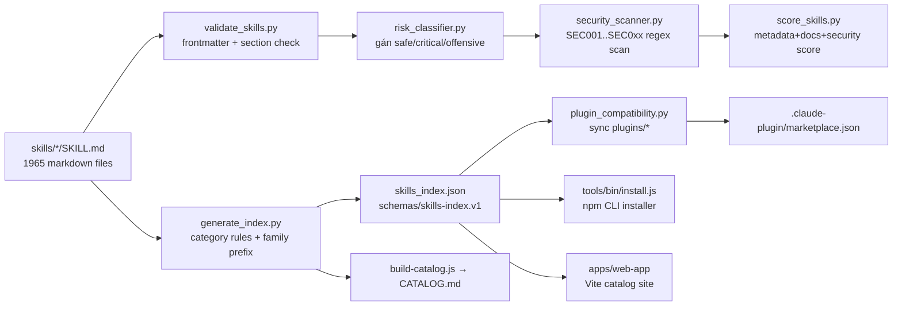
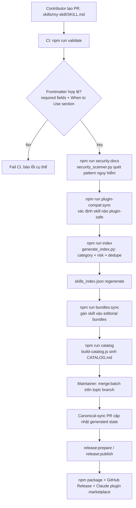

# Báo Cáo Phân Tích — Antigravity Awesome Skills

## Tổng Quan
Thư viện/registry mã nguồn mở gồm **1.965+ "agentic skills"** (`SKILL.md` playbooks) cho Claude Code, Cursor, Codex CLI, Gemini CLI, Antigravity, Kiro, OpenCode, Copilot. Stack: Node.js CLI installer (`tools/bin/install.js`) + pipeline validate/score/index bằng Python (`tools/scripts/*.py`) + web catalog app (Vite, `apps/web-app/`). Không phải agent runtime — đây là một **content registry + tooling pipeline** để curate, validate, phân loại, và phân phối skill markdown files qua npm package và Claude Code plugin marketplace. Maturity cao: version 14.6.0, CI đầy đủ (`.github/`), test suite riêng (`tools/scripts/tests/`).

## Tính Năng Nổi Bật (Best Features)
1. **Auto-Categorization bằng Keyword + Family-Prefix Rules**: `tools/scripts/generate_index.py` định nghĩa `CATEGORY_RULES` (danh sách category với keyword list, có `strong_keywords` ưu tiên) và `FAMILY_CATEGORY_RULES` (map tiền tố tên skill như `azure-`, `react-`, `agent-` → category) cộng với `CURATED_CATEGORY_OVERRIDES` (dict tay cho các trường hợp ngoại lệ). Cơ chế phân loại 3 tầng (curated override > family prefix > keyword scoring) giải quyết bài toán phân loại 1900+ tài liệu tự do không cần ML, kết quả xác định (deterministic) và dễ audit qua diff. (`tools/scripts/generate_index.py:22-260`)
2. **Risk Classifier dựa trên Regex Heuristics**: `tools/scripts/risk_classifier.py` phân loại mỗi skill thành `none/safe/critical/offensive/unknown` bằng 3 nhóm pattern — `OFFENSIVE_HINTS` (pentest, exploit, jailbreak…), `CRITICAL_HINTS` (curl|bash, rm -rf, git push, SQL mutation, secret handling…), `SAFE_HINTS` (read-only commands, fenced code, diagnostic verbs). Kết quả ghi vào frontmatter `risk:` field và được validate lại bởi `security_scanner.py`. Đây là một content moderation pipeline nhẹ, không cần LLM call, chạy trong CI mỗi PR. (`tools/scripts/risk_classifier.py:1-90`)
3. **Security Scanner với Pattern Registry có Rationale**: `tools/scripts/security_scanner.py` định nghĩa `SecurityPattern` dataclass (`code`, `regex`, `severity`, `description`, `rationale`) cho từng rule (SEC001 = `rm -rf /`, SEC002 = curl|bash RCE...). Mỗi rule có mã lỗi tra cứu được và lý do rõ ràng — giống một mini SAST engine cho markdown/pseudo-code thay vì cho real source code. (`tools/scripts/security_scanner.py:26-50`)
4. **Skill Quality Scorer 3 chiều có trọng số**: `tools/scripts/score_skills.py` tính điểm mỗi skill trên 3 trục — metadata completeness (30%), documentation structure (40%, dò các heading chuẩn như `## Overview`, `## When to Use`, `## Limitations`), security posture (30%, tái sử dụng `security_scanner.scan_content`). Điểm số chỉ mang tính thông tin (`never blocking in CI`), publish ra `data/scores.json` theo schema `schemas/skill-score.v1.schema.json`. Tách bạch rõ ràng giữa "gate cứng" (validate) và "tín hiệu chất lượng mềm" (score). (`tools/scripts/score_skills.py:1-60`)
5. **Pipeline Sync đa giai đoạn qua npm scripts chained**: `package.json` định nghĩa chuỗi lệnh `chain` → `validate && plugin-compat:sync && index && bundles:sync && sync:metadata`, và `sync:release-state`/`sync:repo-state` mở rộng thêm `catalog`, `sync:web-assets`, `audit:consistency`, `check:warning-budget`. Toàn bộ registry (`skills_index.json`, `CATALOG.md`, README stats, plugin marketplace JSON) là **generated artifacts** tái tạo từ nguồn `skills/*/SKILL.md`, không sửa tay — one source of truth pattern rất rõ ràng (ghi trong `AGENTS.md`: "Registry outputs... are generated artifacts"). (`package.json:6-45`, `AGENTS.md:5`)

## Áp Dụng Cho Auto Code OS (Applied Takeaways — ranked)
1. **Registry sinh tự động (generated-artifact pattern) cho Tool/Skill Catalog** — What: `skills_index.json`, `CATALOG.md` được build lại 100% từ `skills/*/SKILL.md` bằng `tools/scripts/generate_index.py`, không edit tay; enforce bởi CI ("source-only contract"). Apply: `server/internal/tool/` hiện đăng ký tool thủ công theo Go code; có thể thêm bước build sinh `tool_catalog.json` (metadata, category, risk) từ struct tags/doc-comment của mỗi tool implementation, để `server/internal/prompts/` render system prompt động từ catalog thay vì hard-code danh sách tool. Impact: M · Effort: M · Risk: L · Est: 3-4 days.
2. **Risk Classifier heuristic cho Tool Execution Approval** — What: `risk_classifier.py` gắn nhãn `safe/critical/offensive` cho mỗi skill dựa trên regex pattern (destructive command, secret handling, mutating verbs). Apply: `server/internal/tool/` và `server/internal/sandbox/` có thể áp dụng cùng kiểu heuristic để phân loại risk level cho mỗi lệnh agent định chạy trong sandbox Docker (ví dụ trước khi exec `rm -rf`, `git push --force`), dùng làm input cho policy gate (auto-approve vs. yêu cầu human confirm) trong DAG orchestrator. Impact: H · Effort: M · Risk: L · Est: 3 days.
3. **Quality Score 3 chiều có trọng số, non-blocking** — What: `score_skills.py` tính điểm metadata/docs/security riêng biệt, publish thành file riêng, không chặn CI. Apply: Auto Code OS có thể áp dụng mô hình tương tự cho self-review của agent-generated PR: `server/internal/orchestrator/` sinh điểm code-quality/test-coverage/security theo 3 trục sau mỗi task, lưu vào Postgres (bảng `task_quality_scores`) để hiển thị trên `web/src/app/` dashboard mà không block merge — tách bạch giữa gate cứng (lint/test pass) và tín hiệu mềm. Impact: M · Effort: M · Risk: L · Est: 2-3 days.
4. **Frontmatter Schema + JSON Schema validation cho artefact có cấu trúc** — What: `schemas/skills-index.v1.schema.json` định nghĩa contract JSON cho registry output, `validate_skills.py` parse YAML frontmatter bằng PyYAML rồi validate field bắt buộc (`name`, `description`, `risk`, `source`, `date_added`...). Apply: `server/internal/prompts/` dùng Go templates cho prompt — nên thêm JSON Schema tương ứng cho các file cấu hình template/metadata (ví dụ skill/tool definition YAML) và chạy validate trong `server/migration/` CI step, tránh lỗi silent khi field bị thiếu. Impact: L · Effort: L · Risk: L · Est: 1-2 days.
5. **Chained npm scripts làm build pipeline tường minh** — What: `chain`, `sync:release-state` gộp nhiều bước độc lập (validate → sync → index → catalog → audit) thành 1 lệnh, mỗi bước là 1 script riêng dễ test độc lập. Apply: `server/Makefile` (nếu có) hoặc `docker/Dockerfile.sandbox` build step nên tách rõ các target `make validate`, `make index`, `make audit` rồi gộp thành `make release` — thay vì 1 script build monolithic, giúp CI cache & debug từng bước riêng. Impact: L · Effort: L · Risk: L · Est: 0.5 day.

## Kiến Trúc (Architecture)
Kiến trúc là **content pipeline**, không phải service runtime: nguồn dữ liệu (skill markdown) → transform (Python scripts) → generated artifacts (JSON/MD) → distribution channels (npm CLI installer, Claude Code plugin marketplace, web catalog). Dependency direction một chiều: `skills/*/SKILL.md` (nguồn) → `tools/scripts/*.py` (transform, đọc `_project_paths.py` để tìm repo root) → `skills_index.json`/`CATALOG.md`/`plugins/*` (output). `tools/bin/install.js` là entry point độc lập, đọc trực tiếp từ `skills/` qua `tools/lib/skill-utils.js`, không phụ thuộc vào artifact đã build. Confidence: High (đọc trực tiếp `package.json` scripts và luồng import Python).

### ADR Suy Luận (Inferred ADRs)
| Quyết Định | Bằng Chứng | Lợi Ích | Đánh Đổi | Confidence |
|---|---|---|---|---|
| Markdown + YAML frontmatter làm định dạng skill duy nhất | `skills/tdd/SKILL.md` frontmatter (`name`, `description`, `risk`, `tools`...) | Human-readable, git-diffable, dễ contribute qua PR | Không có type-safety mạnh như JSON Schema thực thi runtime; phải validate bằng script riêng | High |
| Generated artifacts tách khỏi source-of-truth | `AGENTS.md`: "Registry outputs... are generated artifacts"; CI "source-only contract" | Tránh drift giữa các file phái sinh; PR review dễ vì diff chỉ ở `skills/` | Cần pipeline build phức tạp (`npm run chain`) chạy đúng thứ tự | High |
| Regex heuristic thay vì LLM để classify risk/category | `risk_classifier.py`, `generate_index.py` dùng `re.compile` list, không gọi API nào | Nhanh, free, deterministic, chạy offline trong CI | Kém chính xác hơn LLM với ngữ cảnh mơ hồ; cần maintain danh sách keyword thủ công | High |
| Node.js cho CLI/installer, Python cho audit/validate | `package.json` scripts gọi cả `node tools/scripts/run-python.js ...py` và `.js`/`.cjs` trực tiếp | Tận dụng thế mạnh: Node cho npm distribution, Python cho xử lý text/regex phức tạp | Hai runtime song song tăng chi phí bảo trì (`tools/scripts/run-python.js` là wrapper cầu nối) | Medium |

## Luồng Chính (Main Flow)

## Design Patterns & Chất Lượng Code
- **Registry/Index Pattern**: `generate_index.py` đọc toàn bộ `skills/` folder, build một mảng object phẳng theo schema cố định (`schemas/skills-index.v1.schema.json`) — pattern registry điển hình cho hệ thống có nhiều plugin/extension rời rạc.
- **Rule Table thay vì if/else lồng nhau**: `CATEGORY_RULES`, `FAMILY_CATEGORY_RULES`, `SECURITY_PATTERNS`, `CRITICAL_HINTS` đều là list/dict khai báo dữ liệu ở đầu file, tách biệt hoàn toàn khỏi logic xử lý (`_collect_reasons`, `suggest_risk`) — dễ mở rộng chỉ bằng cách thêm entry, không sửa logic.
- **Wrapper Script Pattern**: `tools/scripts/run-python.js` là cầu nối cho phép `package.json` gọi Python script từ ngữ cảnh npm thống nhất, tránh phải cài `python-shell` hay tương tự.
- **Naming/Style**: snake_case cho Python scripts, kebab-case cho thư mục skill, camelCase cho JS. Nhất quán trong từng ngôn ngữ nhưng có 2 convention song song trong repo — chấp nhận được vì phân vùng rõ theo runtime.
- **Test đặt cạnh tooling**: `tools/scripts/tests/run-test-suite.js` chạy cả Node assertions và Python unittest — nhưng skill content (phần lớn nhất của repo, 1900+ file) không có test tự động, chỉ có validate cấu trúc tĩnh.

## Kỹ Thuật Thú Vị & Thực Hành Kỹ Thuật
- **Path Safety chống Zip-Slip / Symlink Attack**: `tools/lib/symlink-safety.js` (dùng trong `install.js`) có `getRealPath`, `isPathInside`, `resolveSafeRealPath` để đảm bảo khi cài skill vào máy người dùng (`~/.claude/skills` chẳng hạn), không có symlink trỏ ra ngoài thư mục đích — chống path traversal khi cài skill từ nguồn không tin cậy.
- **Sanitize Filename khi Resolve Path từ User Input**: `install.js:resolveDir()` dùng `sanitize-filename` package cho từng path segment, throw `Unsafe path segment` nếu khác biệt sau khi sanitize — kỹ thuật phòng thủ input validation rất cẩn trọng cho CLI nhận `--path` argument tùy ý.
- **UTF-8 Force trên Windows**: Cả `generate_index.py` và `validate_skills.py` đều có block `configure_utf8_output()`/kiểm tra `sys.platform == 'win32'` để ép UTF-8 stdout — chi tiết nhỏ nhưng thể hiện repo thực sự cross-platform (nhiều skill tiếng Tây Ban Nha, tiếng Trung trong `docs_zh-CN/`).
- **Warning Budget như một Ratchet**: `check_validation_warning_budget.py` + `tools/config/audit-skills-strict-budget.json` — thay vì fail cứng khi có warning, hệ thống theo dõi "budget" (số lượng warning cho phép tối đa), cho phép siết dần theo thời gian mà không block toàn bộ CI ngay khi phát hiện nợ kỹ thuật cũ.
- **Drift Detection có Baseline**: `npm run drift:check` / `drift:update` (`detect_drift.py`) so sánh state hiện tại với baseline đã lưu — dùng để phát hiện generated artifacts bị sửa tay ngoài luồng pipeline.

## Engineering Gems
1. `tools/scripts/risk_classifier.py:9-58` — Vấn đề: cần phân loại risk cho hàng nghìn tài liệu tự do (skill instructions) mà không có backend LLM để gọi mỗi lần CI chạy. Cách làm phổ biến (yếu hơn): gọi LLM classification API cho từng file — chậm, tốn phí, không deterministic, khó test unit. Vì sao elegant: dùng 3 nhóm regex pattern (`OFFENSIVE_HINTS`, `CRITICAL_HINTS`, `SAFE_HINTS`) mỗi pattern gắn kèm `reason` string, output là `RiskSuggestion(risk, reasons)` — vừa nhanh vừa giải thích được ("explainable"), unit-test friendly vì input/output thuần function. Đánh đổi: bỏ sót ngữ cảnh tinh vi (sarcasm, code trong docstring không thực thi) mà LLM mới hiểu được. Bài học rút ra: heuristic có traceability (kèm lý do) tốt hơn heuristic mù, và luôn nên là baseline trước khi mang LLM vào một pipeline chạy hàng nghìn lần trong CI.
2. `tools/bin/install.js:16-32` (`resolveDir`) — Vấn đề: CLI installer nhận path đích tùy ý từ user (`--path ~/custom/skills`), path này ghi trực tiếp ra filesystem của user. Cách làm phổ biến (yếu hơn): dùng thẳng `path.resolve(userInput)` rồi `fs.mkdirSync` — mở cửa cho path traversal (`../../etc`) hoặc ký tự đặc biệt phá cấu trúc thư mục. Vì sao elegant: tách path thành từng segment, sanitize riêng lẻ bằng `sanitize-filename`, so sánh với bản gốc và `throw` ngay nếu lệch — fail-closed thay vì fail-open. Đánh đổi: user hợp lệ dùng ký tự lạ trong tên thư mục (dấu cách unicode chẳng hạn) có thể bị chặn oan. Bài học rút ra: validate path theo từng segment luôn an toàn hơn validate toàn chuỗi.
3. `AGENTS.md` (Mandatory Maintainer Workflow section) — Vấn đề: một repo có nhiều maintainer/agent tự động cùng thao tác trên `main`, rủi ro merge trực tiếp phá vỡ trạng thái generated artifacts. Cách làm phổ biến (yếu hơn): chỉ ghi "protect main branch" trong CONTRIBUTING.md dưới dạng khuyến nghị. Vì sao elegant: AGENTS.md ghi rõ ràng đây là **hard gate** ("even when the user asks for direct merges"), chỉ định chính xác skill nào phải chạy trước, và branch nào chỉ nhận PR — biến quy trình vận hành thành một contract mà agent AI đọc được và buộc tuân theo, không chỉ là tài liệu cho con người. Đánh đổi: nếu skill đó thiếu/lỗi, toàn bộ maintainer flow bị block (chính văn bản cũng nói "stop... report that blocker explicitly" — chấp nhận đánh đổi an toàn hơn tốc độ). Bài học rút ra: AGENTS.md có thể đóng vai trò như một policy file có tính ép buộc cho agent, không chỉ hướng dẫn.

## Top 10 Điều Đáng Học
| # | Khái Niệm | File | Vì Sao Hữu Ích | Độ Khó | Thứ Tự |
|---|---|---|---|---|---|
| 1 | Registry sinh tự động từ nguồn markdown | `tools/scripts/generate_index.py` | Mẫu one-source-of-truth cho catalog lớn | ⭐⭐⭐ | 1 |
| 2 | Risk classifier bằng regex có lý do | `tools/scripts/risk_classifier.py` | Baseline an toàn, giải thích được, không cần LLM | ⭐⭐ | 2 |
| 3 | Security scanner với mã lỗi + rationale | `tools/scripts/security_scanner.py` | Mẫu SAST nhẹ cho nội dung tự do | ⭐⭐⭐ | 3 |
| 4 | Quality score 3 trục có trọng số, non-blocking | `tools/scripts/score_skills.py` | Tách gate cứng khỏi tín hiệu mềm | ⭐⭐⭐ | 4 |
| 5 | Path sanitize theo từng segment | `tools/bin/install.js` | Chống path traversal khi CLI ghi ra máy user | ⭐⭐⭐ | 5 |
| 6 | JSON Schema cho generated artifact | `schemas/skills-index.v1.schema.json` | Hợp đồng rõ ràng cho consumer (web app, installer) | ⭐⭐ | 6 |
| 7 | Chained npm scripts làm build pipeline | `package.json` (`chain`, `sync:release-state`) | Build pipeline tường minh, dễ test từng bước | ⭐⭐ | 7 |
| 8 | Warning budget ratchet | `tools/scripts/check_validation_warning_budget.py` | Siết CI dần mà không block ngay | ⭐⭐⭐ | 8 |
| 9 | Drift detection với baseline | `tools/scripts/detect_drift.py` | Phát hiện artifact bị sửa tay ngoài pipeline | ⭐⭐⭐⭐ | 9 |
| 10 | AGENTS.md như policy gate cho agent | `AGENTS.md` | Biến quy trình vận hành thành contract agent phải theo | ⭐⭐ | 10 |

## Hướng Dẫn Đọc (Reading Guide)
**L0 Build & Run:** `package.json` scripts, `npm run validate && npm run test`. **L1 Entry Points:** `tools/bin/install.js` (CLI), `tools/scripts/generate_index.py` (build pipeline). **L2 Core Abstractions:** `skills/<id>/SKILL.md` format, `schemas/skills-index.v1.schema.json`. **L3 Architecture Glue:** `tools/scripts/validate_skills.py` → `risk_classifier.py` → `security_scanner.py` → `score_skills.py` chain, `tools/lib/skill-utils.js`. **L4 Engineering Gems:** `tools/lib/symlink-safety.js`, `tools/scripts/check_validation_warning_budget.py`, `tools/scripts/detect_drift.py`. **L5 Reimplement:** viết lại category/risk classifier bằng Go cho `server/internal/tool/` catalog của Auto Code OS.

## Anti-Patterns & Không Nên Copy
1. **Không có test tự động cho nội dung skill (phần lớn repo)**: 1900+ file markdown chỉ được validate cấu trúc (frontmatter, heading) chứ không test hành vi thực tế khi agent chạy theo skill đó — rủi ro "documentation drift" (skill nói một đằng, hành vi thực tế khác). Với Auto Code OS, các prompt template trong `server/internal/prompts/` nên có test snapshot/golden-file thay vì chỉ validate cú pháp.
2. **Category rules dùng keyword matching có thể misclassify**: một skill nhắc "docker" trong ví dụ code không liên quan đến DevOps vẫn có thể bị gắn category `devops` (`generate_index.py` dùng substring keyword search đơn giản, không phân biệt ngữ cảnh). Auto Code OS nên tránh áp dụng keyword-only classification cho các quyết định có tác động cao (ví dụ auto-approve tool execution) — chỉ nên dùng cho gợi ý/UI label như ở đây.
3. **Hai runtime song song (Node + Python) tăng bề mặt bảo trì**: cần `tools/scripts/run-python.js` làm cầu nối, CI phải cài cả `tools/requirements.txt` lẫn `package.json` — với team nhỏ, việc duy trì 2 hệ sinh thái dependency riêng cho cùng một pipeline là chi phí không nhỏ. Auto Code OS (đã là Go + TypeScript) nên tránh thêm runtime thứ 3 trừ khi thực sự cần.

## Câu Hỏi Đáng Suy Ngẫm
- Khi risk classifier là regex-based và có thể bị "chơi" (một skill độc hại có thể né các pattern hardcode), liệu registry có nên coi `risk` field là gợi ý UI hay là security boundary thực sự — ranh giới này có được truyền đạt rõ cho người dùng cài skill không?
- Với 1965 skill được duy trì bởi cộng đồng, ai chịu trách nhiệm khi một skill category sai dẫn agent thực thi lệnh nguy hiểm mà user tin tưởng nhãn `risk: safe`? Auto Code OS nếu áp dụng mô hình catalog tương tự cho tool, có cần một cơ chế "human sign-off" bắt buộc trước khi risk label chuyển safe→critical được hạ cấp?
- Generated-artifact pattern (registry tái tạo hoàn toàn từ source) yêu cầu build pipeline chạy đúng thứ tự nghiêm ngặt (`chain`) — khi pipeline dài ra theo thời gian (hiện đã >10 bước trong `sync:repo-state:full`), điểm gãy nào sẽ xuất hiện trước: tốc độ CI hay khả năng hiểu toàn bộ luồng của một maintainer mới?

## Đánh Giá Tổng Thể
| Architecture | Maintainability | Scalability | Clean Code | Learning Value |
|---|---|---|---|---|
| 7/10 | 8/10 | 8/10 | 7/10 | 7/10 |

## Lộ Trình Học Tập
- **Tuần 1**: Đọc `AGENTS.md`, `package.json` scripts, chạy `npm run validate` local để hiểu toàn bộ chain build. Đọc 5-10 `SKILL.md` mẫu ở các category khác nhau (`skills/tdd/`, `skills/security/`) để nắm format convention.
- **Tuần 2**: Đọc kỹ `tools/scripts/generate_index.py` (category/family rules), `risk_classifier.py`, `security_scanner.py` — đây là phần logic dày đặc nhất, đáng để trace end-to-end một skill từ raw markdown đến JSON entry trong `skills_index.json`.
- **Tuần 3**: Đọc `tools/bin/install.js` + `tools/lib/symlink-safety.js` để hiểu kỹ thuật path-safety khi CLI ghi file ra máy người dùng — áp dụng ngay cho bất kỳ CLI/installer nào Auto Code OS tự viết.
- **Tuần 4**: Reimplement một bản mini bằng Go cho `server/internal/tool/`: viết `tool_catalog.go` sinh JSON catalog từ struct tag, risk classifier heuristic đơn giản dựa trên regex cho lệnh sandbox, và một script `make catalog` tương tự `npm run catalog` — áp dụng trực tiếp bài học "generated artifact, one source of truth" vào codebase thật.
