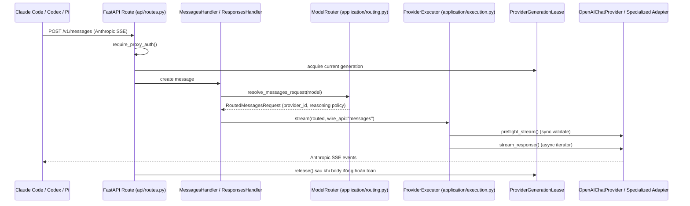
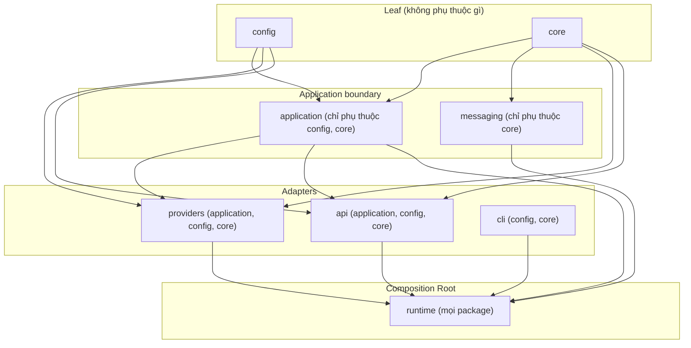

# Báo Cáo Phân Tích — Free Claude Code (FCC)

## Tổng Quan (TL;DR)
FCC là một chương trình chạy trên máy cá nhân, đứng giữa các công cụ AI coding (Claude Code, Codex, Pi) và các nhà cung cấp AI để bạn có thể dùng 25 nhà cung cấp khác nhau (kể cả AI chạy ngay trên máy mình, miễn phí) thay vì phải trả tiền trực tiếp cho Anthropic. Nó tự động chuyển đổi định dạng dữ liệu giữa các bên, đổi nhà cung cấp mà không cần khởi động lại, và cố gắng "vá" lại phản hồi bị đứt giữa chừng để cuộc trò chuyện không bị gián đoạn.

## Thông Tin Kỹ Thuật (Technical Overview)
- **Stack:** Python 3.14, FastAPI (ASGI), Pydantic, `uv` cho package/venv, Loguru, Ruff + `ty` type checker.
- **Quy mô/Độ trưởng thành:** ~200 module production trong `src/free_claude_code/`, ~150 file test (`tests/` unit/contract, `smoke/` live). Maturity rất cao: có `ARCHITECTURE.md` 1366 dòng làm nguồn sự thật kiến trúc, chính sách dependency giữa package được **enforce bằng AST test** (`tests/contracts/test_import_boundaries.py`), và CLAUDE.md/AGENTS.md ép buộc versioning + CI 5 bước cho mọi PR.

## Luồng Chính (Main Flow)

## Tính Năng Nổi Bật (Best Features)
1. **Provider Abstraction hai tầng (Profile-first, Adapter-exception)**
   - *Là gì:* Để hỗ trợ 25 nhà cung cấp AI khác nhau mà không phải viết 25 bộ code riêng biệt, hầu hết nhà cung cấp chỉ cần khai báo vài thông tin cấu hình đơn giản; chỉ những nhà cung cấp có hành vi đặc biệt mới cần code riêng.
   - *Cách triển khai:* 25 provider được khai báo, nhưng chỉ 8 provider có adapter Python riêng (`nvidia_nim`, `open_router`, `mistral`, `deepseek`, `lmstudio`, `cloudflare`, `gemini`, `github_models`); 17 provider còn lại (Groq, Cerebras, Fireworks, Z.ai, Kimi, MiniMax, Wafer, Cohere, Vercel AI Gateway, HuggingFace, SambaNova, Ollama, Ollama Cloud, llama.cpp, OpenCode Zen/Go...) chỉ là **data-only profile** (`OPENAI_CHAT_PROFILES`) tái dùng một `OpenAIChatProvider` chung. Bất biến này được test tự kiểm bằng assertion tại import-time: `_profiled_ids | _special_ids == set(PROVIDER_CATALOG)` (`src/free_claude_code/providers/runtime/factory.py:121-130`). Kết quả đo được: thêm 1 provider OpenAI-compatible mới chỉ cần vài dòng profile, không cần class mới.
2. **Reasoning Policy trung lập theo provider**
   - *Là gì:* Nhiều model AI hiện đại có khả năng "suy nghĩ kỹ hơn" trước khi trả lời, và mức độ suy nghĩ đó cần được cấu hình rõ ràng thay vì đoán mò dựa trên tên model — cách đoán mò rất dễ sai khi có model mới ra mắt.
   - *Cách triển khai:* (`src/free_claude_code/core/reasoning.py`, mô tả tại `ARCHITECTURE.md:607-663`): tách rõ 3 khái niệm bất biến — `control` (off/on/default), `effort` (named), `budget_tokens` (exact) — và cấm tuyệt đối việc "đọc tên model để suy đoán khả năng reasoning" (rule 1 trong 4 hard rules). Route theo tier (Fable/Opus/Sonnet/Haiku) độc lập với override.
3. **Response chain với "transitive close-ownership"**
   - *Là gì:* Khi trả lời theo kiểu "gõ dần từng chữ" (streaming), hệ thống phải quyết định rất sớm xem có báo lỗi hay không — chờ quá lâu thì mất trải nghiệm mượt, báo quá sớm thì có nguy cơ báo sai. FCC giải quyết vấn đề này bằng cách xác định rõ một "điểm mốc" duy nhất để chuyển từ chế độ báo lỗi sang chế độ vẫn tiếp tục trả lời.
   - *Cách triển khai:* (`ARCHITECTURE.md:392-417`, `src/free_claude_code/api/response_streams.py`): stream Anthropic SSE chỉ commit (trả 2xx) sau khi nhận được chunk đầu tiên từ upstream — do đó lỗi trước điểm commit vẫn là JSON lỗi có `status_code` đúng, còn lỗi sau điểm commit chuyển thành `event: error` SSE. Mỗi lớp (response → replay iterator → protocol adapter → executor body → provider iterator → upstream stream) sở hữu việc đóng input trực tiếp của nó, đảm bảo cleanup idempotent kể cả khi client ngắt kết nối giữa chừng.
4. **Provider Generation Lease cho Hot-Reload cấu hình**
   - *Là gì:* Khi người dùng đổi API key hoặc model trong giao diện quản trị, hệ thống không cần khởi động lại — những yêu cầu đang xử lý dở vẫn dùng cấu hình cũ cho tới khi xong, còn yêu cầu mới thì dùng cấu hình mới ngay lập tức.
   - *Cách triển khai:* (`src/free_claude_code/runtime/provider_manager.py`): `ProviderRuntimeManager` publish "generation" mới thay vì restart server; generation cũ được "retired" và tiếp tục phục vụ các request đang bay (`active_leases`) cho tới khi drain xong rồi mới cleanup — không có race giữa request cũ và cấu hình mới, không mất quota rate-limit đang tồn tại.
5. **Import-boundary như hợp đồng kiến trúc thực thi bằng test**
   - *Là gì:* Thay vì chỉ viết trong tài liệu rằng "module A không được phép dùng module B", hệ thống có một bài kiểm tra tự động chặn đứng ngay lập tức nếu ai đó vi phạm quy tắc kiến trúc này khi code.
   - *Cách triển khai:* (`tests/contracts/test_import_boundaries.py`): dùng `ast` để parse mọi file, so khớp với bảng `ALLOWED_PACKAGE_DEPENDENCIES` (`config→∅`, `core→∅`, `application→{config,core}`, `providers→{application,config,core}`, `api→{application,config,core}`, `runtime→{api,application,cli,config,core,messaging,providers}`...). Chỉ có đúng 1 exception whitelist rõ ràng. Bất kỳ import vi phạm boundary nào sẽ fail CI ngay, biến kiến trúc từ "quy ước trong doc" thành "assertion máy chạy được".

## Áp Dụng Cho Auto Code OS (Applied Takeaways — ranked)
1. **Profile-first Provider Model cho `server/pkg/llm/`** — What: FCC tách `ProviderDescriptor` (catalog trung lập, không biết implementation) khỏi factory (`providers/runtime/factory.py`) và request-policy profile (`OpenAIChatProfile`) — hầu hết provider OpenAI-compatible chỉ cần data, không cần struct Go mới. Apply: Auto Code OS hiện có `NewProvider()` switch cứng trong `server/pkg/llm/provider.go:133-148` (chỉ 4 case: openai/anthropic/gemini/9router) và `FallbackChain` build thủ công trong `fallback.go` + `router.go:89-118`. Thêm 1 struct `ChatProfile` (base URL, header, field mapping) cho các provider tương thích OpenAI Chat Completions (Groq, Fireworks, Together, Mistral...) và 1 factory duy nhất `newOpenAICompatProvider(profile, cfg)`, tránh phải viết N file `xxx.go` riêng như hiện tại đang có nguy cơ khi mở rộng provider. Impact: H · Effort: M · Risk: L · Est: 3-4 days.
2. **Compile-time/CI-time Import Boundary Test** — What: `tests/contracts/test_import_boundaries.py` parse AST và so với bảng dependency cho phép, fail cứng nếu vi phạm. Apply: Auto Code OS là Go nên `go/packages` + `go vet` hoặc một script nhỏ dùng `go list -deps` có thể check tương tự cho `server/internal/orchestrator`, `server/pkg/llm`, `server/internal/tool`, `server/internal/sandbox` — ví dụ enforce `pkg/llm` không được import `internal/orchestrator` (invert dependency), hoặc `internal/tool` không import `internal/orchestrator`. Thêm test Go `TestImportBoundaries` chạy trong CI. Impact: M · Effort: S · Risk: L · Est: 1 day.
3. **ExecutionFailure taxonomy trung lập protocol** — What: `FailureKind` enum (`invalid_request`, `authentication`, `permission`, `rate_limit`, `overloaded`, `timeout`, `upstream`, `unavailable`) + `ExecutionFailure` frozen dataclass, `find_execution_failure()` duyệt cả `ExceptionGroup` lồng nhau (`src/free_claude_code/core/failures.py`). Apply: `server/pkg/llm/transient_error.go` hiện chỉ phân loại transient vs không; bổ sung enum `FailureKind` tương tự dùng chung giữa `pkg/llm` và `internal/orchestrator/recovery.go` để orchestrator quyết định retry/backoff/pause DAG dựa trên taxonomy thống nhất thay vì string matching lỗi. Impact: M · Effort: S · Risk: L · Est: 1-2 days.
4. **Provider Generation Lease cho hot-reload cấu hình LLM** — What: đổi API key/provider không cần restart process; request đang chạy dùng generation cũ, request mới dùng generation mới, cleanup khi lease drain hết. Apply: Auto Code OS build `Gateway` một lần lúc khởi động (`NewGatewayFromConfigWithRecorder`, `server/pkg/llm/fallback.go`) — nếu muốn cho phép đổi API key/model qua Admin UI (roadmap hợp lý), cần cấu trúc lease tương tự bọc quanh `Gateway` trong `server/internal/orchestrator/setup.go` để tránh downtime khi rotate credentials. Impact: M · Effort: M · Risk: M · Est: 3-4 days (chỉ làm khi có yêu cầu hot-reload thực sự).
5. **Reasoning Policy 3 trường tách biệt (control/effort/budget)** — What: không bao giờ suy đoán khả năng reasoning từ tên model; áp policy 1 lần ở application layer, provider chỉ dịch. Apply: Auto Code OS's `RouteOptions.Complexity` (`server/pkg/llm/fallback.go:81-93`) hiện dùng string tự do; định nghĩa lại như `ReasoningPolicy` struct (Control/Effort/BudgetTokens) áp dụng nhất quán cho routing `LevelFast/Balanced/Powerful` và trong `llm_step.go` của orchestrator, tránh nhánh `if strings.Contains(model, "o1")`. Impact: L · Effort: S · Risk: L · Est: 1 day.

## Kiến Trúc (Architecture)
FCC theo kiến trúc phân lớp nghiêm ngặt kiểu Clean Architecture/Hexagonal, với `application/` là dependency-leaf (chỉ phụ thuộc `config` + `core`), và `runtime/` là composition root duy nhất được phép phụ thuộc mọi package khác. `core/` không chứa logic SDK-specific (không phân loại lỗi SDK/HTTP) — trách nhiệm đó thuộc về `providers/`. Hướng phụ thuộc: `config, core` (không phụ thuộc gì) → `application, messaging` → `providers, api, cli` → `runtime` (composition root). Confidence: **High** — được xác nhận trực tiếp bằng bảng `ALLOWED_PACKAGE_DEPENDENCIES` trong cả `ARCHITECTURE.md:84-93` và test AST `tests/contracts/test_import_boundaries.py:13-30`.

### ADR Suy Luận (Inferred ADRs)
| Quyết Định | Bằng Chứng | Lợi Ích | Đánh Đổi | Confidence |
|---|---|---|---|---|
| Tách `core/anthropic` khỏi mọi provider cụ thể — Anthropic protocol là "hub", mọi provider convert về/từ đó | `core/anthropic/conversion.py`, `ARCHITECTURE.md:686-706`; mọi provider nhận cùng `MessagesRequest` | Client (Claude Code, Pi) luôn thấy đúng 1 wire protocol dù backend là 25 provider khác nhau | Overhead convert 2 chiều cho OpenAI Responses (Codex) qua `core/openai_responses/adapter.py` | High |
| Profile-data thay vì subclass cho hầu hết provider OpenAI-compatible | `providers/openai_chat/profiles.py`, `providers/runtime/factory.py:110-130` với assertion tự kiểm | Giảm boilerplate cực mạnh khi thêm provider #26, #27... | Provider có quirk thật sự (Gemini thought signature, NIM tool alias) vẫn cần adapter riêng — ranh giới "khi nào cần adapter" phải do người review giữ kỷ luật | High |
| `ExecutionFailure` là exception nhưng immutable (`FrozenInstanceError` tự custom qua `__setattr__`) | `core/failures.py:20-37` | Failure semantics không bị provider/route mutate giữa chừng, an toàn truyền qua nhiều layer | Phải tự viết `__setattr__` thủ công vì `frozen=True` dataclass xung đột với `Exception.__init__` set `args` | Medium |
| Hot-reload cấu hình bằng "provider generation" thay vì restart | `runtime/provider_manager.py` (`_ProviderGeneration`, `ProviderGenerationLease`, `active_leases`, `drained` event) | Đổi API key qua Admin UI không rớt request đang chạy | Thêm độ phức tạp đáng kể (asyncio.Lock kép, retired dict, refresh task) so với 1 global singleton | High |

## Design Patterns & Chất Lượng Code
- **Structural typing qua Protocol/port thay vì base-class bắt buộc**: `application/ports.py` định nghĩa `ProviderPort` chỉ với `preflight_stream()`/`stream_response()`; API và execution phụ thuộc port này chứ không phải `BaseProvider` cụ thể (`ARCHITECTURE.md:543-547`).
- **Declarative catalog + runtime-checked invariant**: mọi danh sách "phải khớp nhau" (providers có profile vs có adapter, tại `factory.py:121-130`) được assert ngay ở module import-time, không đợi đến runtime request mới phát hiện thiếu provider.
- **Frozen dataclasses với `slots=True`** dùng nhất quán cho mọi value object (`ProviderConfig`, `ResolvedModel`, `RoutedMessagesRequest`, `ExecutionFailure`) — giảm bug do mutation ẩn, tiết kiệm bộ nhớ.
- **Naming rất nhất quán và tự giải thích**: `preflight_stream` (validate trước khi mở SSE), `resolve_reasoning_policy`, `traced_async_stream` — code đọc gần như tài liệu.
- **Nhược điểm**: một số module orchestration lớn được chính team tự liệt kê là "refactor target" (`api/handlers/`, `providers/openai_chat/`, `messaging/workflow.py`, `config/admin/` — `ARCHITECTURE.md:184-206`), cho thấy độ phức tạp tích lũy dù kỷ luật cao.

## Kỹ Thuật Thú Vị & Thực Hành Kỹ Thuật
- **Stream repair / tool-call JSON recovery**: khi upstream stream bị ngắt giữa chừng một tool call, `core/anthropic/streaming/recovery.py` cố "vá" JSON dang dở bằng `accept_tool_json_repair()`, validate lại với `jsonschema` trước khi chấp nhận suffix, và bơm 1 user message đặc biệt (`_RECOVERY_USER_PREFIX`, dòng 13-19) yêu cầu model tiếp tục đúng chỗ dừng thay vì lặp lại toàn bộ.
- **Request-ID correlation ở tầng ASGI thuần** (`ARCHITECTURE.md:369-378`): tạo 1 request ID duy nhất trước khi routing, gắn vào cả log context lẫn response header `request-id`/`x-request-id`, kể cả trong catch-all 500 handler của Starlette (nơi middleware thường bị bypass).
- **Optional heavy dependency lazy-loaded dưới function boundary**: `torch`/`transformers`/`librosa` (Whisper local) và `riva.client` (NVIDIA NIM voice) chỉ được import bên trong hàm, không ở top-level, để `import free_claude_code` không kéo theo GPU stack nặng nếu user không bật voice — với sổ ghi rõ chủ sở hữu (`OPTIONAL_IMPORT_OWNERS` trong test import boundary).
- **CI 5-check bắt buộc**: suppression-grep (cấm `# type: ignore`), `ruff format --check`, `ruff check`, `ty check` (type checker mới của Astral), `pytest` — chạy song song, đều required status check trên `main` (mô tả trong `CLAUDE.md`).
- **Semver bump bắt buộc trong cùng commit** khi đổi file production — enforce bằng quy ước trong `CLAUDE.md`/`AGENTS.md` (không phải bằng code, nhưng rất kỷ luật cho một dự án solo/nhỏ team).

## Engineering Gems
1. `src/free_claude_code/providers/runtime/factory.py:121-130` — Vấn đề: khi có 25 provider, rất dễ quên đăng ký provider mới vào đúng chỗ (catalog nhưng không có factory, hoặc ngược lại). Cách làm phổ biến (yếu hơn): review thủ công hoặc chỉ phát hiện khi user report lỗi "unknown provider" lúc runtime. Vì sao elegant: `if _profiled_ids & _special_ids or _profiled_ids | _special_ids != set(PROVIDER_CATALOG): raise AssertionError(...)` chạy ngay khi module được import — nghĩa là app **không khởi động được** nếu bất biến vi phạm, biến một class bug tiềm ẩn thành crash sớm nhất có thể. Đánh đổi: assertion chạy ở import-time hơi khác thường (thường đặt trong test), nhưng vì đây là bất biến cấu trúc bất biến theo thời gian nên hợp lý. Bài học rút ra: với danh sách phải khớp nhau giữa 2 nguồn định nghĩa, hãy assert sự khớp đó ngay tại nơi cả 2 được import chung, đừng đợi test riêng.
2. `src/free_claude_code/core/failures.py:20-37` — Vấn đề: cần 1 Exception vừa mang dữ liệu có cấu trúc (`kind`, `status_code`, `retryable`) vừa immutable để không bị code hạ nguồn (logging, retry logic) vô tình sửa field sau khi raise. Cách làm phổ biến (yếu hơn): dùng exception thường với `self.kind = kind` trong `__init__`, ai cũng có thể `exc.kind = "other"` sau đó. Vì sao elegant: override `__setattr__` để chỉ chặn ghi đè field đã tồn tại trong `__slots__`, nhưng vẫn cho phép machinery của `Exception` (`__traceback__`, `__cause__`, `__context__`) hoạt động bình thường — dung hòa giữa `frozen=True` dataclass và hành vi bắt buộc của Python exception. Đánh đổi: code khó đọc hơn 1 dataclass frozen thường, cần comment giải thích rõ (đã có). Bài học rút ra: khi frozen dataclass + Exception xung đột, custom `__setattr__` có chọn lọc là giải pháp sạch hơn việc bỏ `frozen=True`.
3. `src/free_claude_code/api/response_streams.py` + `ARCHITECTURE.md:392-417` — Vấn đề: streaming HTTP response rất dễ rò rỉ resource (upstream connection, provider lease) khi client ngắt kết nối giữa chừng, hoặc rất dễ trả sai status code (200 rồi mới lỗi) khi cố gắng stream sớm. Cách làm phổ biến (yếu hơn): trả `StreamingResponse` ngay khi có generator, chấp nhận rủi ro race giữa "đã gửi header 200" và "provider báo lỗi sau đó". Vì sao elegant: chờ đúng 1 chunk đầu tiên trước khi commit response — sau điểm đó, lỗi luôn đi qua kênh SSE `event: error`; trước điểm đó, lỗi luôn là JSON HTTP status đúng. "Transitive close-ownership" đảm bảo mọi lớp tự đóng input trực tiếp của mình, nên cleanup không phụ thuộc thứ tự global. Đánh đổi: độ trễ nhỏ (chờ 1 chunk) trước khi trả response, và code chain khá dài (response → replay → adapter → executor → provider). Bài học rút ra: với streaming proxy, xác định rõ "điểm commit không thể quay lại" và thiết kế toàn bộ error handling xoay quanh điểm đó.

## Top 10 Điều Đáng Học
| # | Khái Niệm | File | Vì Sao Hữu Ích | Độ Khó | Thứ Tự |
|---|---|---|---|---|---|
| 1 | Import-boundary AST test | `tests/contracts/test_import_boundaries.py` | Biến kiến trúc từ tài liệu thành assertion CI | ⭐⭐⭐ | 1 |
| 2 | Profile-first Provider Factory + self-check invariant | `src/free_claude_code/providers/runtime/factory.py` | Mẫu mở rộng N provider mà không tăng độ phức tạp tuyến tính | ⭐⭐⭐ | 2 |
| 3 | ExecutionFailure taxonomy trung lập protocol | `src/free_claude_code/core/failures.py` | Tách "phân loại lỗi" khỏi "serialize lỗi theo wire protocol" | ⭐⭐ | 3 |
| 4 | ReasoningPolicy 3 trường (control/effort/budget) | `src/free_claude_code/core/reasoning.py`, `ARCHITECTURE.md:607-663` | Chuẩn hóa 1 khái niệm mơ hồ (reasoning effort) thành model rõ ràng | ⭐⭐⭐ | 4 |
| 5 | Provider Generation Lease (hot-reload không downtime) | `src/free_claude_code/runtime/provider_manager.py` | Pattern cho mọi service cần đổi cấu hình runtime an toàn | ⭐⭐⭐⭐ | 5 |
| 6 | Transitive close-ownership response chain | `src/free_claude_code/api/response_streams.py` | Chuẩn xử lý streaming HTTP proxy không rò rỉ | ⭐⭐⭐⭐ | 6 |
| 7 | Stream tool-call JSON repair | `src/free_claude_code/core/anthropic/streaming/recovery.py` | Kỹ thuật phục hồi stream bị ngắt giữa tool call | ⭐⭐⭐ | 7 |
| 8 | ModelRouter tier-override (fable/opus/sonnet/haiku) | `src/free_claude_code/application/routing.py` | Mẫu routing theo "tier" độc lập với provider cụ thể | ⭐⭐ | 8 |
| 9 | ASGI-level request-ID correlation kể cả 500 catch-all | `ARCHITECTURE.md:369-378` | Đảm bảo trace liên tục kể cả khi middleware bị bypass | ⭐⭐ | 9 |
| 10 | Optional heavy-dependency lazy import với chủ sở hữu tường minh | `tests/contracts/test_import_boundaries.py` (`OPTIONAL_IMPORT_OWNERS`) | Giữ import nhẹ mà vẫn track rõ ai được phép import gì | ⭐⭐ | 10 |

## Hướng Dẫn Đọc (Reading Guide)
**L0 Build & Run:** `pyproject.toml`, `README.md` (Quick Start), `fcc-server` entrypoint tại `src/free_claude_code/cli/entrypoints.py`.
**L1 Entry Points:** `src/free_claude_code/api/routes.py`, `src/free_claude_code/api/app.py`, `src/free_claude_code/runtime/bootstrap.py`.
**L2 Core Abstractions:** `src/free_claude_code/application/routing.py`, `application/execution.py`, `providers/base.py`, `core/anthropic/models.py`, `core/reasoning.py`, `core/failures.py`.
**L3 Architecture Glue:** `src/free_claude_code/runtime/provider_manager.py`, `providers/runtime/factory.py`, `config/provider_catalog.py`.
**L4 Engineering Gems:** `api/response_streams.py`, `core/anthropic/streaming/recovery.py`, `tests/contracts/test_import_boundaries.py`.
**L5 Reimplement:** thử viết lại provider-generation lease pattern và import-boundary test cho `server/pkg/llm/` bằng Go, xác nhận hiểu đúng cơ chế trước khi áp dụng vào Auto Code OS.

## Anti-Patterns & Không Nên Copy
1. **Config-driven "special case" list vẫn cần con người giữ kỷ luật ranh giới**: quyết định "provider nào cần adapter riêng vs chỉ cần profile" (`_SPECIAL_PROVIDER_FACTORIES`) không có rule tự động, chỉ có review + `ARCHITECTURE.md` mô tả bằng văn xuôi ("Adding A Provider", `ARCHITECTURE.md:665-685`). Với team lớn hơn hoặc ít kỷ luật hơn, ranh giới này dễ bị xói mòn dần (thêm quirk vào profile thay vì tạo adapter mới). Với Auto Code OS, nên định nghĩa rule cụ thể hơn (ví dụ: nếu cần retry logic riêng > X dòng thì bắt buộc factory riêng) thay vì chỉ dựa vào quy ước tài liệu.
2. **Chính team tự thừa nhận "Design Pressure And Refactor Targets"** (`ARCHITECTURE.md:184-206`) — 4 module lớn (`api/handlers/`, `providers/openai_chat/`, `messaging/workflow.py`, `config/admin/`) đang tích lũy trách nhiệm dù kiến trúc tổng thể sạch. Bài học: layered architecture nghiêm ngặt ở boundary cấp package không tự động ngăn god-module hình thành *bên trong* 1 package — vẫn cần theo dõi kích thước/trách nhiệm module định kỳ.
3. **Semver bump thủ công theo quy ước văn bản** (CLAUDE.md) thay vì enforce bằng tool — dễ bị quên trong review nhanh; Auto Code OS nếu áp dụng ý tưởng "mọi thay đổi production phải kèm version bump" nên cân nhắc pre-commit hook/CI check tự động thay vì chỉ ghi trong CLAUDE.md.

## Câu Hỏi Đáng Suy Ngẫm
- Với 25 provider và tốc độ thêm provider mới rất nhanh, catalog-driven approach có scale nổi tới 50-100 provider không, hay tới lúc đó cần một registry ngoài (config file/DB) thay vì Python module tĩnh?
- `ProviderGenerationLease` xử lý rất tốt hot-reload trong 1 process — nhưng nếu Auto Code OS chạy nhiều instance API (horizontal scale), pattern lease per-process này có cần nâng cấp thành cơ chế phân tán (ví dụ version tag trong DB + polling) không?
- Import-boundary test hiện chỉ enforce **static** import; các dynamic import (`from x import y` bên trong hàm) được cố tình "unscanned" — liệu đây có phải lỗ hổng cho phép vi phạm boundary một cách "hợp pháp" nếu ai đó cố tình lách luật?

## Đánh Giá Tổng Thể
| Architecture | Maintainability | Scalability | Clean Code | Learning Value |
|---|---|---|---|---|
| 9/10 | 8/10 | 7/10 | 9/10 | 9/10 |

## Lộ Trình Học Tập
- **Tuần 1 — Đọc & chạy thử**: Đọc `README.md`, `ARCHITECTURE.md` mục "System Overview" + "Package Boundaries"; cài `fcc-server` thật, cấu hình 1 provider free (OpenRouter) qua Admin UI, chạy `fcc-claude` để thấy toàn bộ luồng end-to-end.
- **Tuần 2 — Core abstractions**: Đọc kỹ `application/routing.py`, `application/execution.py`, `providers/base.py`, `core/reasoning.py`, `core/failures.py`. Viết lại (trên giấy hoặc pseudo-Go) `ProviderPort`/`ExecutionFailure` tương đương cho `server/pkg/llm/`.
- **Tuần 3 — Kiến trúc glue & gems**: Đọc `providers/runtime/factory.py`, `runtime/provider_manager.py`, `api/response_streams.py`, `core/anthropic/streaming/recovery.py`. Thử viết prototype "provider generation lease" bằng Go cho `server/internal/orchestrator/setup.go`.
- **Tuần 4 — Áp dụng vào Auto Code OS**: Implement Takeaway #1 (profile-first provider trong `server/pkg/llm/`) và #2 (import-boundary test bằng Go) như 2 PR nhỏ, độc lập, có test đi kèm.
