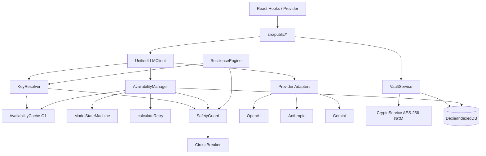
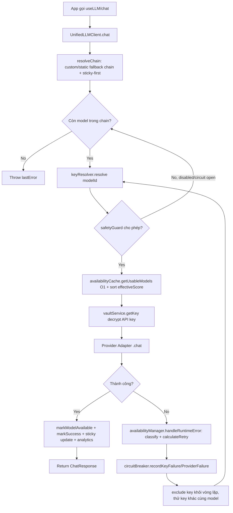

# Báo Cáo Phân Tích — LLM Key Manager (Hybrid AI Gateway)

## Tổng Quan
Thư viện TypeScript/React chạy hoàn toàn trong browser (zero backend), đóng vai trò "Hybrid AI Gateway" cho các API OpenAI/Anthropic/Gemini: quản lý nhiều API key, mã hoá bằng Web Crypto API (AES-256-GCM) + IndexedDB (Dexie), tự động chọn key/model tốt nhất qua công thức "Effective Score", failover và circuit breaker khi lỗi. Stack: TypeScript, React 18 (peer dep), Dexie 4 (IndexedDB wrapper), Vite build lib, Vitest (24 file test), pnpm. Quy mô: ~10.2K dòng `src/` (không tính tests/components UI), kiến trúc theo domain-service khá rõ ràng, maturity ở mức "hardened side-project/small-lib" — có state machine, test coverage tốt cho phần lõi, nhưng vẫn còn code có ghi chú "Phase 1/Phase 6 Refactoring" cho thấy đang tái cấu trúc dần.

## Tính Năng Nổi Bật (Best Features)
1. **Effective Score Routing Engine**: Công thức đơn giản nhưng hiệu quả `Score = PowerScore + PriorityBonus + HealthBonus − LatencyPenalty` tính real-time cho từng cặp (key, model), pre-sort thành index O(1) để chọn key tốt nhất tức thời. (`src/services/availability/availability.cache.ts:140-236`)
2. **State Machine cho vòng đời Model Availability**: Bảng transition tường minh (`NEW → CHECKING → AVAILABLE/TEMP_FAILED/PERM_FAILED → COOLDOWN → CHECKING`), có docstring vẽ ASCII diagram, và class `ModelStateMachine` là single source of truth mọi state transition. (`src/services/availability/state-machine.ts:1-260`)
3. **Error-Aware Retry Strategy**: Phân loại lỗi thành 7 category (AUTH_INVALID, RATE_LIMITED, SERVER_ERROR, NETWORK_ERROR...) mỗi loại có config backoff/jitter/max-retry riêng, cộng thêm priority multiplier (model ưu tiên cao được retry nhanh hơn 50%). (`src/services/availability/retry-strategy.ts:106-262`)
4. **Two-Layer Circuit Breaker (Key + Provider)**: Circuit breaker độc lập cho từng key VÀ từng provider, config threshold khác nhau theo provider (Gemini chịu 10 lỗi mới OPEN vì "rất ổn định", OpenAI chỉ 5). Có đầy đủ CLOSED → OPEN → HALF_OPEN → CLOSED với sliding failure window + persist qua localStorage. (`src/services/safety/circuit-breaker.ts:26-48, 249-356`)
5. **Client-side Vault mã hoá AES-256-GCM**: Key API không rời trình duyệt, mã hoá bằng `window.crypto.subtle`, có fingerprint SHA-256 để chống trùng key, decrypted-key cache trong memory để tránh decrypt lại mỗi request. (`src/services/vault/crypto.service.ts:1-95`, `src/services/vault/vault.service.ts:64-101, 145-157`)

## Áp Dụng Cho Auto Code OS (Applied Takeaways — ranked)
1. **Effective Score cho LLM Gateway multi-key** — What: Cache in-memory pre-sorted theo `effectiveScore = power + priorityBonus + healthBonus - latencyPenalty` để chọn key O(1) (`src/services/availability/availability.cache.ts:140-237`). Apply: `server/pkg/llm/` hiện là Go — port ý tưởng thành 1 struct `KeyScoreCache` giữ map `provider → []scoredKey` sắp xếp sẵn, refresh khi key/model đổi trạng thái, thay vì tính điểm mỗi request. Impact: H · Effort: M · Risk: L · Est: 3-4 days.
2. **State Machine tường minh cho vòng đời API key/model** — What: Transition table rõ ràng NEW/CHECKING/AVAILABLE/TEMP_FAILED/COOLDOWN/PERM_FAILED thay vì cờ boolean rải rác (`src/services/availability/state-machine.ts:67-94`). Apply: Thêm bảng `llm_key_state` trong Postgres (`server/migration/`) với enum tương tự, và 1 package Go `server/pkg/llm/state` implement transition table y hệt để tránh trạng thái không hợp lệ khi nhiều goroutine cùng update key health. Impact: H · Effort: M · Risk: L · Est: 2-3 days.
3. **Error-Aware Retry Strategy phân loại theo category** — What: Mỗi loại lỗi (401/403 permanent, 429 backoff dài theo giờ, 5xx backoff nhanh theo phút, network jitter riêng) có config retry riêng thay vì 1 retry chung (`src/services/availability/retry-strategy.ts:106-155`). Apply: Áp dụng cho `server/pkg/llm/` khi gọi provider — thay retry generic hiện tại bằng bảng phân loại tương tự, giảm lãng phí quota khi gặp lỗi auth vĩnh viễn. Impact: M · Effort: S-M · Risk: L · Est: 1-2 days.
4. **Circuit Breaker 2 lớp (key + provider) với config riêng theo provider** — What: `PROVIDER_CIRCUIT_CONFIGS` cho phép mỗi provider có `failureThreshold`/`cooldownMs` riêng (`src/services/safety/circuit-breaker.ts:33-48`). Apply: Thêm circuit breaker tương tự cho `server/pkg/llm/` (per-provider + per-key), expose qua endpoint health cho `web/src/app/` dashboard hiển thị trạng thái CLOSED/OPEN/HALF_OPEN của từng provider. Impact: M · Effort: M · Risk: L · Est: 2-3 days.
5. **Sticky Routing theo capability key** — What: `UnifiedLLMClient.stickyModels` map giữ (modelId, providerId, keyId) đã thành công gần nhất cho 1 "capability key" (model alias), ưu tiên dùng lại để giữ context/behaviour ổn định (`src/core/unified-llm.client.ts:38-41, 70-121, 193-200`). Apply: DAG orchestrator (`server/internal/orchestrator/`) có thể áp dụng sticky key theo `task_id` hoặc `step_type` để cùng 1 task luôn dùng 1 model/key trong suốt phiên, tránh đổi model giữa chừng gây context drift. Impact: M · Effort: S · Risk: L · Est: 1 day.

## Kiến Trúc (Architecture)
Kiến trúc theo kiểu layered service, mọi thứ chạy client-side (không server):

- **Provider Layer** (`src/providers/{openai,anthropic,gemini}/`): mỗi provider có `plugin.ts` implement `IProviderAdapter` (đăng ký qua `provider.registry.ts`), tách `adapter/` (chat/multimodal call thực tế), `discovery/` (list model + health check), `quota/` (rate limit info riêng từng provider).
- **Availability Layer** (`src/services/availability/`): `availability.manager.ts` (business logic + DB), `availability.cache.ts` (in-memory index O(1)), `key-resolver.ts` (chọn key cho 1 request), `state-machine.ts` (transition), `retry-strategy.ts` (tính backoff).
- **Safety Layer** (`src/services/safety/`): `circuit-breaker.ts` (core logic) được `safety-guard.ts` (facade + localStorage persistence + event emitter) bọc lại.
- **Core Orchestration** (`src/core/unified-llm.client.ts`): entrypoint public `chat()`, tự resolve fallback chain, gọi `keyResolver` + `availabilityManager`, xử lý retry vòng lặp key/model.
- **Resilience Engine song song** (`src/services/engines/resilience.engine.ts`): một orchestrator khác dùng cho các capability không phải chat (embeddings, image, TTS...), cũng gọi `keyResolver`/`safetyGuard`/`retryService` nhưng độc lập với `UnifiedLLMClient` (xem Anti-Pattern bên dưới).
- **Storage**: Dexie/IndexedDB (`src/db/schema.ts`) — 5 bảng (`keys`, `quotas`, `usageLogs`, `errorLogs`, `modelCache`), version 8 (đã qua nhiều lần migrate schema).
- **UI Layer** (`src/components/`, `src/hooks/`): Provider React (`LLMKeyManagerProvider.tsx`) + hooks (`useLLM`, `useAvailability`, `useVault`...) expose qua `src/public/*.ts` làm public API bề mặt.

Dependency direction: `providers` → không phụ thuộc gì trong domain khác (leaf); `availability` phụ thuộc `db`, `safety`, `vault` (qua dynamic import để tránh circular); `core/unified-llm.client` phụ thuộc `availability`, `providers`, `services/engines`; UI phụ thuộc `public/*` → `services/*`. Có dùng `await import(...)` (dynamic import) nhiều chỗ (`availability.manager.ts:146-147, 378, 433`; `unified-llm.client.ts:215-217`) rõ ràng để phá vỡ circular dependency giữa `availability` ↔ `vault` ↔ `validation`.

**Confidence: High** — dựa trên đọc trực tiếp toàn bộ 10 file lõi + provider registry + db schema.

### ADR Suy Luận (Inferred ADRs)
| Quyết Định | Bằng Chứng | Lợi Ích | Đánh Đổi | Confidence |
|---|---|---|---|---|
| Zero-backend, client-only gateway (dùng IndexedDB + Web Crypto thay vì server) | README "Client-Only: True"; `crypto.service.ts` dùng `window.crypto.subtle`; `db/schema.ts` dùng Dexie | Không cần hạ tầng backend, key không rời máy user, dễ tích hợp vào SPA | Không tận dụng được server-side secret manager, phụ thuộc trình duyệt hỗ trợ WebCrypto, không share state giữa nhiều thiết bị/tab dễ dàng | High |
| Tách `availability.cache.ts` (in-memory) khỏi `availability.manager.ts` (nguồn sự thật ở IndexedDB) | Docstring "Eliminates expensive IndexedDB queries on the hot path"; `requestSync()`/`syncFromDB()` debounce 100ms | Hot path chọn key đạt O(1), tránh IndexedDB latency mỗi request | Rủi ro cache lệch với DB tạm thời (đã có `isStale()` + TTL 5 phút để bù) | High |
| State machine tường minh thay vì cờ boolean rải rác | Comment "IMPORTANT: All state changes MUST go through ModelStateMachine.transition()" (`availability.manager.ts:8`) dù thực tế `handleRuntimeError`/`markModelAvailable` set state trực tiếp không luôn gọi `transition()` | Tránh trạng thái không hợp lệ, dễ audit/debug qua console log transition | Có khoảng cách giữa lý tưởng kiến trúc và implementation thực tế (code không luôn tuân thủ rule tự đặt) | Medium |
| Circuit breaker cấu hình riêng theo provider | `PROVIDER_CIRCUIT_CONFIGS` (openai/anthropic/gemini có threshold khác nhau) | Phản ánh đặc tính ổn định thực tế của từng provider, giảm false-positive OPEN cho Gemini | Cần bảo trì config thủ công khi thêm provider mới, giá trị "5 vs 8 vs 10" mang tính kinh nghiệm/heuristic không có công thức rõ | Medium |

## Luồng Chính (Main Flow)

## Design Patterns & Chất Lượng Code
- **Adapter Pattern**: `IProviderAdapter` interface thống nhất OpenAI/Anthropic/Gemini, đăng ký qua registry (`src/providers/provider.registry.ts:7-16`) — dễ thêm provider mới mà không sửa core.
- **Singleton Services**: hầu hết service export instance đơn (`export const availabilityManager = new KeyModelAvailabilityManager()`) — đơn giản cho lib client-side, nhưng khó test song song/nhiều instance (đã né bằng cách các test file dùng `fake-indexeddb` reset).
- **State Machine Pattern**: `ModelStateMachine` tách transition logic thành pure static class, dễ unit test độc lập (`tests/resilience/state-machine.test.ts`).
- **Facade Pattern**: `safety-guard.ts` là facade bọc `circuit-breaker.ts` + thêm persistence/event — tách rõ "cơ chế" (breaker) khỏi "chính sách/state toàn cục" (guard).
- **Circular Dependency Avoidance via Dynamic Import**: dùng `await import(...)` để phá circular giữa `availability` ↔ `vault` ↔ `validation` — pattern hợp lệ nhưng hơi "ngầm", dễ bị miss khi refactor (không có lint rule enforce).
- **Naming/style**: nhất quán snake-free camelCase, JSDoc đầu file mô tả rõ mục đích module, console.log có prefix `[ModuleName]` giúp debug log dễ trace nguồn.
- **Nhược điểm**: một số file (`availability.manager.ts` 631 dòng, `availability.cache.ts` 515 dòng) đã khá lớn, gộp nhiều trách nhiệm (CRUD + business rule + cache sync); comment "Phase 1 hardcode", "Phase 6 Refactoring" cho thấy nợ kỹ thuật đang dần dọn nhưng chưa xong.

## Kỹ Thuật Thú Vị & Thực Hành Kỹ Thuật
- **Testing**: 24 file test chia theo domain (`tests/safety/`, `tests/resilience/`, `tests/vault/`, `tests/services/`...), dùng `fake-indexeddb` + `happy-dom` để test Dexie/WebCrypto trong Node, `@peculiar/webcrypto` polyfill cho `window.crypto.subtle` khi chạy Vitest.
- **Config**: không dùng file config tập trung dạng YAML/JSON lớn mà rải các hằng số domain-specific gần logic dùng nó (`MODEL_PRIORITY_PATTERNS` trong `availability.manager.ts`, `RETRY_STRATEGIES` trong `retry-strategy.ts`, `PROVIDER_CIRCUIT_CONFIGS` trong `circuit-breaker.ts`) — dễ đọc tại chỗ nhưng khó có 1 nơi duy nhất để override toàn bộ policy.
- **Error handling**: `LLMError.from(error, providerId)` (`src/core/errors.ts`) chuẩn hoá lỗi provider thành 1 dạng thống nhất có `code`, `retryable`; `extractErrorCode()` dùng cho lớp resilience engine để parse code từ message string (hơi fragile vì dựa vào message text thay vì structured error object).
- **Security**: AES-256-GCM với IV ngẫu nhiên 12 bytes mỗi lần encrypt (`crypto.service.ts:31`), fingerprint SHA-256 để chống nhập trùng key mà không cần decrypt để so sánh (`vault.service.ts:67-73`), decrypted key chỉ giữ trong memory cache (`decryptedKeyCache`), không log ra console.
- **Background jobs / lifecycle awareness**: `LifecycleScheduler` (`src/lifecycle/scheduler.ts`) tự thêm 10% jitter tránh thundering herd, và pause khi tab ẩn (`document.hidden`) — thực hành tốt cho polling job phía client.
- **Retry với jitter đúng chuẩn**: `calculateRetry()` áp jitter ngẫu nhiên ±(jitterPercent/2)% quanh giá trị delay đã backoff — chuẩn "full jitter/decorrelated jitter" adjacent pattern, tránh đồng loạt các key retry cùng lúc.

## Engineering Gems
1. `src/services/availability/availability.cache.ts:140-236` (`rebuildFromModels`/`rebuildSortedIndex`) — Vấn đề: Chọn key/model tốt nhất cho mỗi request chat phải nhanh (hot path), nhưng nguồn dữ liệu (IndexedDB) chậm và không sắp xếp sẵn. Cách làm phổ biến (yếu hơn): Query IndexedDB + filter + sort mỗi lần gọi `chat()`, tốn ~vài ms tới hàng chục ms mỗi request và scale kém khi có nhiều key. Vì sao elegant: Duy trì đồng thời `Map` chính, `Set` theo provider, và **mảng đã pre-sort** theo `modelId` lẫn theo `providerId` (để tính `promotedKeyByProvider`) — chỉ rebuild index khi có thay đổi (mark usable/unusable) chứ không phải mỗi lần đọc, biến truy vấn từ O(n log n) thành O(1)/O(k). Đánh đổi: Tăng độ phức tạp đồng bộ (4 cấu trúc dữ liệu phải nhất quán với nhau), rebuild toàn bộ `sortedByModel` mỗi lần 1 key đổi trạng thái (không incremental) — chấp nhận được vì số lượng key trong 1 vault nhỏ (chục, không phải triệu). Bài học rút ra: Khi hot path đọc nhiều-ghi ít, chuyển chi phí sang thời điểm ghi (pre-compute index) là đánh đổi hợp lý; quan trọng là đóng gói việc rebuild trong 1 hàm duy nhất để tránh drift.
2. `src/services/availability/retry-strategy.ts:106-262` (`calculateRetry`) — Vấn đề: Một retry policy chung cho mọi loại lỗi API sẽ hoặc lãng phí quota (retry auth error vô ích) hoặc quá chậm phục hồi (dùng backoff dài cho lỗi server tạm thời). Cách làm phổ biến (yếu hơn): 1 hàm `retry(fn, maxAttempts=3, delay=1000*2^n)` áp dụng đồng loạt bất kể error type. Vì sao elegant: Bảng `RETRY_STRATEGIES` map error category → config riêng (permanent = null = không retry; rate limit = backoff giờ; server error = backoff phút) kết hợp `PRIORITY_MULTIPLIERS` theo độ ưu tiên model, cho ra 1 hàm pure function dễ test độc lập với input/output rõ ràng (`RetryDecision`). Đánh đổi: Nhiều magic number tinh chỉnh thủ công (base delay, max retry, jitter %) — cần domain knowledge để hiệu chỉnh đúng, không tự học/adaptive. Bài học rút ra: Phân loại lỗi thành taxonomy trước khi thiết kế retry, đừng coi mọi lỗi như nhau.
3. `src/services/vault/vault.service.ts:64-73` (fingerprint chống trùng key) — Vấn đề: Cần phát hiện user nhập lại API key đã tồn tại mà không thể so sánh trực tiếp (vì key đã mã hoá, và không muốn decrypt toàn bộ vault để so sánh). Cách làm phổ biến (yếu hơn): Decrypt tất cả key hiện có rồi so sánh chuỗi plaintext — chậm và tăng bề mặt lộ key trong memory. Vì sao elegant: Lưu thêm 1 trường `fingerprint = SHA-256(apiKey)` (không thể đảo ngược), index trong Dexie (`db.keys.where('fingerprint')`), so sánh fingerprint mới với fingerprint đã lưu — vẫn phát hiện trùng mà không cần decrypt. Đánh đổi: Fingerprint bản chất là hash không muối (unsalted) của chính API key — nếu DB bị rò rỉ, kẻ tấn công có thể brute-force offline để xác nhận đoán đúng key (dù không đảo ngược được), nhưng do dữ liệu chỉ ở client và API key thường entropy cao nên rủi ro thực tế thấp. Bài học rút ra: Dùng hash 1 chiều cho bài toán "phát hiện trùng lặp mà không cần biết giá trị gốc" là kỹ thuật rẻ và hiệu quả.

## Top 10 Điều Đáng Học
| # | Khái Niệm | File | Vì Sao Hữu Ích | Độ Khó | Thứ Tự |
|---|---|---|---|---|---|
| 1 | Effective Score routing formula | `src/services/availability/availability.cache.ts` | Chọn key/model tối ưu real-time không cần ML, dễ giải thích/debug | ⭐⭐ | 1 |
| 2 | Model Availability State Machine | `src/services/availability/state-machine.ts` | Tránh trạng thái bất hợp lệ khi nhiều nguồn cùng update health | ⭐⭐ | 2 |
| 3 | Error-classified Retry Strategy | `src/services/availability/retry-strategy.ts` | Retry đúng cách theo bản chất lỗi, tiết kiệm quota | ⭐⭐⭐ | 3 |
| 4 | 2-layer Circuit Breaker (key+provider) | `src/services/safety/circuit-breaker.ts` | Cô lập lỗi ở đúng cấp độ, tránh cascading failure | ⭐⭐⭐ | 4 |
| 5 | Pre-sorted in-memory index cho hot path | `src/services/availability/availability.cache.ts` | Kỹ thuật đổi write cost lấy read speed, áp dụng được ở nhiều nơi | ⭐⭐⭐⭐ | 5 |
| 6 | AES-256-GCM client-side vault | `src/services/vault/crypto.service.ts` | Chuẩn mã hoá đối xứng đúng cách (IV ngẫu nhiên mỗi lần) | ⭐⭐ | 6 |
| 7 | Fingerprint chống trùng không cần decrypt | `src/services/vault/vault.service.ts` | Kỹ thuật hash 1 chiều cho duplicate-detection | ⭐ | 7 |
| 8 | Sticky routing theo capability key | `src/core/unified-llm.client.ts` | Giữ nhất quán model/key trong 1 phiên hội thoại | ⭐⭐ | 8 |
| 9 | Lifecycle-aware background scheduler (jitter + pause on hidden) | `src/lifecycle/scheduler.ts` | Polling job "lịch sự" với tài nguyên trình duyệt | ⭐⭐ | 9 |
| 10 | Provider Adapter Registry pattern | `src/providers/provider.registry.ts` | Mở rộng multi-provider mà không sửa core orchestration | ⭐⭐ | 10 |

## Hướng Dẫn Đọc (Reading Guide)
**L0 Build & Run:** `package.json` (scripts `test`, `build:lib`), `Makefile`, `vitest.config.ts` — chạy `pnpm test` để thấy toàn bộ test suite pass/fail theo domain.
**L1 Entry Points:** `src/index.ts`, `src/public/{llm,vault,hooks,types}.ts` — đây là bề mặt API công khai của lib.
**L2 Core Abstractions:** `src/core/unified-llm.client.ts`, `src/services/availability/{availability.manager,availability.cache,key-resolver,state-machine,retry-strategy}.ts`, `src/services/safety/{circuit-breaker,safety-guard}.ts`.
**L3 Architecture Glue:** `src/providers/provider.registry.ts` (đăng ký adapter), `src/services/engines/resilience.engine.ts` (đường đi song song cho non-chat request), `src/db/schema.ts` (Dexie schema v8).
**L4 Engineering Gems:** `availability.cache.ts` (pre-sorted index), `retry-strategy.ts` (error taxonomy), `vault.service.ts` + `crypto.service.ts` (mã hoá + fingerprint).
**L5 Reimplement:** Thử viết lại 1 bản Go tối giản của `AvailabilityCache` + `ModelStateMachine` + `calculateRetry` cho `server/pkg/llm/` — 3 file này độc lập tương đối, không phụ thuộc React/IndexedDB, dễ port logic thuần.

## Anti-Patterns & Không Nên Copy
1. **Hai orchestrator resilience song song, trùng lặp trách nhiệm**: `UnifiedLLMClient.chat()` (`src/core/unified-llm.client.ts:52-166`) và `ResilientRequestHandler.executeRequest()` (`src/services/engines/resilience.engine.ts:60-198`) đều tự implement vòng lặp "resolve key → gọi → xử lý lỗi → loại key → thử lại", nhưng độc lập nhau (client dùng cho `chat()`, resilience engine dùng cho embeddings/image/audio). Dẫn đến logic lệch nhau (ví dụ retry-inner-loop của `resilientHandler` dùng `retryService.execute` còn `chat()` thì không) và phải sửa 2 nơi khi đổi policy. Với Auto Code OS, nên có **1 orchestrator chung** cho mọi loại LLM call (chat/embedding/vision) trong `server/pkg/llm/`, tham số hoá theo loại request thay vì viết lại vòng lặp resilience 2 lần.
2. **State machine "chỉ mang tính khuyến nghị"**: Comment ở đầu `availability.manager.ts` ghi "All state changes MUST go through ModelStateMachine.transition()" nhưng phần lớn code (`handleRuntimeError`, `markModelAvailable`) set field `state` trực tiếp qua `db.modelCache.update(...)` mà **không gọi** `ModelStateMachine.transition()` để validate. State machine tồn tại như tài liệu/tests riêng biệt chứ chưa thực sự enforce runtime. Với Auto Code OS, nếu áp dụng state machine cho `llm_key_state`, hãy để duy nhất 1 hàm ghi DB nhận `event` làm tham số bắt buộc (không cho set `state` trực tiếp) để rule thực sự được enforce bằng type system/compiler, không chỉ bằng comment.
3. **Error classification dựa trên parse message string**: `extractErrorCode()` trong `resilience.engine.ts` và phần lớn logic phân loại lỗi dựa vào `error.message.includes("rate limit")`... (xem `retry-strategy.ts:49-80`) — fragile vì phụ thuộc câu chữ chính xác từ provider, dễ vỡ khi provider đổi format message. Với Auto Code OS (Go), nên ưu tiên dùng structured error/HTTP status code làm nguồn chính, chỉ fallback về message-parsing khi thực sự cần.
4. **Client-only vault không có concept "master password" thực sự**: `vaultService.unlock(_password?)` nhận tham số `password` nhưng không dùng nó để derive encryption key (tham số có prefix `_` nghĩa là unused) — key mã hoá được sinh ngẫu nhiên và lưu ở `localStorage` dạng JWK, tức là ai truy cập được `localStorage` của trình duyệt cũng lấy được master key. Đây là trade-off hợp lý cho lib client-only nhưng **không nên** áp dụng nguyên xi khi Auto Code OS có backend Postgres — nên dùng KMS/secret manager phía server thay vì mô phỏng "vault" giả trên client.

## Câu Hỏi Đáng Suy Ngẫm
- Nếu 2 tab trình duyệt cùng mở app và cùng ghi vào `AvailabilityCache`/circuit breaker (chỉ lưu trong memory + localStorage, không có lock), điều gì đảm bảo tính nhất quán giữa các tab? Có race condition khi cả 2 tab cùng lúc `rebuildSortedIndex()` không?
- `MODEL_POWER_SCORES` và `MODEL_PRIORITY_PATTERNS` là các bảng hardcode theo model ID cụ thể (`gpt-4o`, `claude-3-5-sonnet`...) — khi provider ra model mới, hệ thống mặc định fallback về priority=1/score=50. Có nên tách các bảng này ra config/JSON external để cập nhật không cần rebuild code?
- `resolveChain()` trong `UnifiedLLMClient` ưu tiên sticky model lên đầu chain bất kể sticky model đó hiện có available hay không (chỉ lọc lại ở bước `keyResolver.resolve`) — nếu sticky model liên tục fail, có lãng phí 1 lượt thử mỗi request không, và có nên tự động "un-sticky" sau N lần fail liên tiếp?
- Circuit breaker threshold theo provider (`5` cho OpenAI, `8` cho Anthropic, `10` cho Gemini) là con số tĩnh chọn theo kinh nghiệm — làm sao đánh giá "đúng" hay chỉ là phỏng đoán ban đầu chưa qua kiểm chứng dữ liệu thực tế dài hạn?

## Đánh Giá Tổng Thể
| Architecture | Maintainability | Scalability | Clean Code | Learning Value |
|---|---|---|---|---|
| 8/10 | 7/10 | 6/10 | 7/10 | 9/10 |

## Lộ Trình Học Tập
- **Tuần 1 — Đọc & chạy thử**: Clone repo, `pnpm install && pnpm test`, đọc `README.md` + `docs/architecture/system-architecture.md`, chạy `make ui-demo` để xem dashboard trực quan; đọc `src/public/*.ts` để hiểu bề mặt API.
- **Tuần 2 — Đào sâu Availability & Safety**: Đọc kỹ `state-machine.ts` → `retry-strategy.ts` → `availability.cache.ts` → `availability.manager.ts` theo đúng thứ tự (từ pure logic đến tích hợp), chạy song song các test tương ứng trong `tests/resilience/` và `tests/services/` để thấy input/output cụ thể.
- **Tuần 3 — Vault & Circuit Breaker**: Đọc `crypto.service.ts` → `vault.service.ts` → `circuit-breaker.ts` → `safety-guard.ts`; thử viết lại 1 phiên bản Go tối giản của `CircuitBreaker` (state CLOSED/OPEN/HALF_OPEN + sliding window) làm bài tập, so sánh với `server/pkg/llm/` hiện tại của Auto Code OS xem có circuit breaker chưa.
- **Tuần 4 — Áp dụng vào Auto Code OS**: Bắt đầu implement Takeaway #1 (Effective Score cache) và #2 (State Machine) vào `server/pkg/llm/`, viết test tương tự `tests/resilience/state-machine.test.ts` để đảm bảo transition table đúng trước khi tích hợp vào orchestrator (`server/internal/orchestrator/`).
