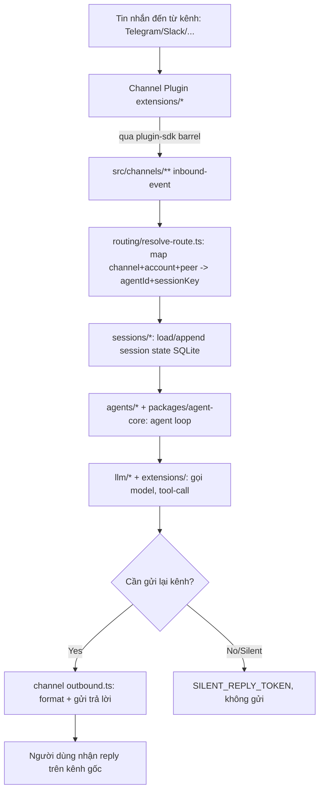
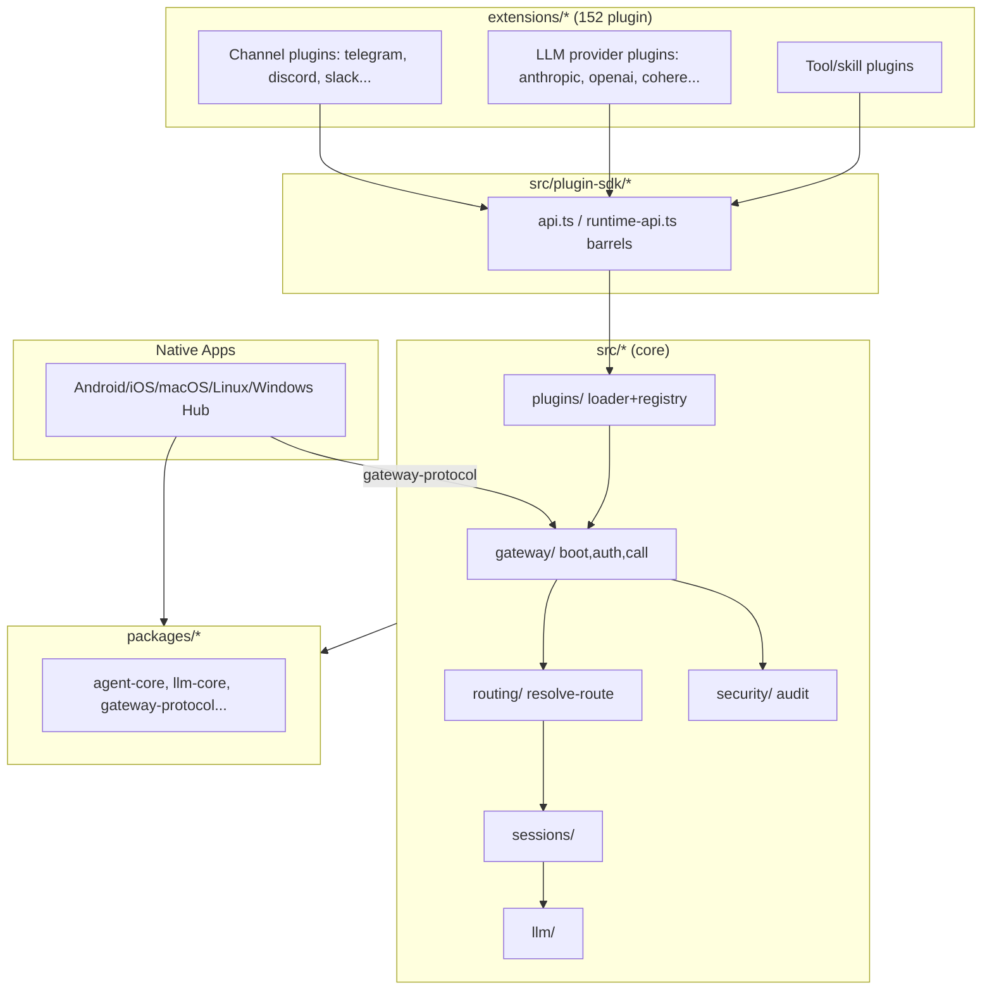

# Báo Cáo Phân Tích — OpenClaw

## Tổng Quan (TL;DR)
OpenClaw là một "trợ lý AI cá nhân" chạy ngay trên thiết bị của người dùng, có thể nhắn tin qua lại với bạn trên hơn 20 ứng dụng chat khác nhau (WhatsApp, Telegram, Slack, Discord, Signal, iMessage...) thông qua một chương trình trung tâm luôn chạy nền. Nó được thiết kế như một nền tảng mở rộng khổng lồ — gần như mọi tính năng (kết nối kênh chat, kết nối nhà cung cấp AI, công cụ mà trợ lý có thể dùng) đều là các "phần mở rộng" cắm vào, giúp dễ dàng thêm bớt mà không đụng vào phần lõi.

## Thông Tin Kỹ Thuật (Technical Overview)
- **Stack:** TypeScript ESM strict monorepo (pnpm workspaces), Node 22-25, kiến trúc plugin cực lớn — `src/` (core, ~10.9k file TS), `extensions/` (152 plugin: channel + LLM provider + tool), `packages/` (23 thư viện dùng chung: `agent-core`, `gateway-protocol`, `llm-core`...), `apps/` (Android/iOS/macOS/Linux/Windows-hub native clients).
- **Quy mô/Độ trưởng thành:** ~20.5k file `.ts` trong repo (2.7GB), `package.json` gốc 118KB với 63 deps + 37 devDeps. Maturity rất cao: có `AGENTS.md` gốc dài (~54KB) đóng vai trò "hiến pháp kiến trúc", CI/CD phức tạp (Crabbox/Testbox remote proof), quy trình release theo train `YYYY.M.PATCH`. File tham chiếu: `references/openclaw/package.json`, `README.md`, `AGENTS.md`.

## Luồng Chính (Main Flow)

## Tính Năng Nổi Bật (Best Features)
1. **Plugin Boundary tách Control-Plane / Runtime-Plane**
   - *Là gì:* Với 152 phần mở rộng, hệ thống cần biết "phần mở rộng nào tồn tại, cấu hình có hợp lệ không" mà không phải khởi động toàn bộ chúng — nhờ vậy các lệnh đơn giản (như xem phiên bản) chạy nhanh, không bị kéo theo tải nặng không cần thiết.
   - *Cách triển khai:* `src/plugins/` sở hữu discovery, manifest validation, activation planning (control-plane); việc *chạy* plugin thuộc runtime resolution riêng. Nguyên tắc "manifest-first": discovery/config validation/setup phải hoạt động được từ metadata *trước khi* plugin runtime được import — tránh việc mọi lệnh CLI đơn giản (vd `openclaw --version`) phải load hết 152 extension. (`src/plugins/AGENTS.md:22-49`)
2. **Session-Key Routing Engine**
   - *Là gì:* Vì trợ lý nói chuyện với người dùng qua hơn 20 kênh chat khác nhau, hệ thống cần một cách thống nhất để biết "tin nhắn này thuộc về cuộc trò chuyện nào" bất kể nó đến từ kênh nào, nhóm nào, hay người nào.
   - *Cách triển khai:* `resolveAgentRoute`-style resolver map `(channel, accountId, peer, guildId, teamId, memberRoleIds)` → `{agentId, sessionKey, dmScope, lastRoutePolicy, matchedBy}` với thứ tự ưu tiên binding rõ ràng (`binding.peer` > `binding.peer.parent` > `binding.guild+roles` > ... > `default`). Đây là lớp trừu tượng biến 20 kênh chat khác nhau thành một mô hình session thống nhất. (`src/routing/resolve-route.ts:34-70`, 822 dòng)
3. **SecretRef Fail-Closed Credential Model**
   - *Là gì:* Nếu một tài khoản/khóa bí mật (như API key) bị lỗi hoặc thiếu, hệ thống chỉ tắt đúng tính năng liên quan tới nó thay vì làm sập toàn bộ trợ lý — người dùng vẫn dùng được các tính năng khác bình thường.
   - *Cách triển khai:* thất bại khi resolve secret bị cô lập vào "smallest known owning surface" — nếu owner chưa rõ thì fail-closed toàn bộ, nếu owner đã biết inactive thì skip; Gateway chỉ từ chối khởi động khi ingress protection hoặc config gốc không hợp lệ, còn lại thì start nhưng đánh dấu capability/route đó "configured-unavailable" + phát diagnostic đã redact. (`AGENTS.md` mục Security/Release)
4. **BOOT.md — Workspace Boot Hook chạy qua Agent Session**
   - *Là gì:* Mỗi không gian làm việc có thể có một file "hướng dẫn khởi động" riêng cho trợ lý AI đọc lúc bắt đầu, nhưng nội dung đó được giấu kín khỏi người dùng cuối để tránh model vô tình lộ ra thông tin nội bộ.
   - *Cách triển khai:* mỗi workspace có thể có file `BOOT.md`; Gateway đọc, bọc nó trong delimiter `INTERNAL_RUNTIME_CONTEXT_BEGIN/END` để model không lặp lại nội dung nội bộ ra người dùng, rồi chạy như một agent turn ẩn danh (`sessionKey = agent:<id>:boot`), có cơ chế `preserveTemporarySessionMapping` để không làm bẩn session chính. (`src/gateway/boot.ts:44-159`)
5. **Storage Discipline — "SQLite-only, no sidecar files"**
   - *Là gì:* Toàn bộ dữ liệu trạng thái của hệ thống bắt buộc phải lưu vào một nơi duy nhất có tính toàn vẹn (giao dịch) cao, cấm tuyệt đối rải rác ra các file tạm rời rạc dễ gây mất đồng bộ.
   - *Cách triển khai:* chính sách kiến trúc cấm tuyệt đối JSON/JSONL/TXT cho state nội bộ; mọi state ghi vào `state/openclaw.sqlite` (global) hoặc `agents/<id>/agent/openclaw-agent.sqlite` (per-agent) qua Kysely helpers, transaction ghi phải đồng bộ (không `await` trong callback transaction). Migration cũ → mới chỉ chạy 1 lần qua `openclaw doctor --fix`, runtime không giữ fallback đọc format cũ. (`AGENTS.md` mục Architecture)

## Áp Dụng Cho Auto Code OS (Applied Takeaways — ranked)
1. **Boundary Rules dạng `AGENTS.md` theo từng subtree** — What: Mỗi thư mục lõi (`src/plugins/`, `src/channels/`, `src/gateway/`, `src/plugin-sdk/`) có file `AGENTS.md` riêng nêu rõ "ai được import ai", "hot path nào không được kéo runtime nặng vào", kèm lệnh verify cụ thể (`pnpm build`, profiler script). Apply: Auto Code OS đã có `AGENTS.md`/`CLAUDE.md` gốc; bổ sung file boundary tương tự cho `server/internal/orchestrator/AGENTS.md`, `server/internal/tool/AGENTS.md`, `server/internal/sandbox/AGENTS.md` — quy định handler nào không được import trực tiếp `internal/orchestrator/engine`, tool nào phải qua interface generic thay vì reach vào internals. Impact: M · Effort: L · Risk: L · Est: 2 ngày viết + review liên tục.
2. **Manifest-First Plugin/Tool Discovery** — What: `src/plugins/public-surface-loader.ts` cho phép hệ thống biết plugin tồn tại, config hợp lệ, mà chưa cần `import` runtime nặng của nó — tách "biết plugin có gì" khỏi "chạy plugin". Apply: `server/internal/tool/` hiện định nghĩa tool framework; thêm bước "tool manifest" (JSON/Go struct nhẹ mô tả tên, input schema, permission) được load trước khi cần thực thi thật, giúp `/api/tools` list nhanh mà không cần khởi tạo mọi tool (đặc biệt các tool cần Docker/network). Impact: M · Effort: M · Risk: L · Est: 3 ngày.
3. **SecretRef Fail-Closed cho LLM Gateway** — What: Lỗi resolve credential bị cô lập theo "owning surface nhỏ nhất", không kéo sập toàn hệ thống; UI/status hiển thị capability nào đang "configured-unavailable". Apply: `server/pkg/llm/` (multi-provider gateway) — khi 1 provider API key sai/hết hạn, chỉ đánh dấu provider đó unavailable (propagate qua `server/internal/handler/` status endpoint), không để lỗi 1 provider làm crash toàn bộ request routing đa-provider. Impact: H · Effort: M · Risk: L · Est: 2-3 ngày.
4. **Session-Key Resolution Pattern cho đa kênh output** — What: `buildAgentSessionKey()`/`resolveAgentRoute()` tách rõ khái niệm "route" (kênh + account + peer) khỏi "session" (lưu trữ hội thoại), cho phép nhiều kênh trỏ vào cùng 1 agent session theo policy (`main` / `per-peer` / `per-channel-peer`). Apply: nếu Auto Code OS mở rộng notification đa kênh (Slack, Discord bot báo trạng thái task), dùng pattern này trong `server/internal/orchestrator/` để map `(channel, workspace, task)` → session key thống nhất, tránh N cách lưu trạng thái hội thoại rời rạc. Impact: M · Effort: M · Risk: L · Est: 3-4 ngày (khi có nhu cầu multi-channel thật).
5. **"No sidecar files" Storage Discipline cho Postgres** — What: OpenClaw cấm tuyệt đối file JSON/JSONL cho state, ép mọi thứ vào SQLite có transaction rõ ràng; migration cũ → mới chỉ một lần qua `doctor --fix`, không giữ fallback đọc dual-format. Apply: rà `server/internal/` tìm các chỗ ghi cache/state ra file (`*.json`, `*.log` tạm) thay vì bảng Postgres qua `server/internal/database/` + `server/migration/`; viết rule tương tự vào CLAUDE.md dự án: "mọi state runtime phải nằm trong Postgres, không sidecar file, trừ artifact/log named rõ ràng". Impact: M · Effort: M · Risk: M (cần audit toàn bộ trước khi cấm) · Est: 3 ngày audit + dọn dần.
6. **Docker Build Pinned-Digest + Build-Arg Component Selection** — What: `Dockerfile` pin base image theo SHA256 digest (không tag mutable), và cho phép chọn subset extension cần build qua `ARG OPENCLAW_EXTENSIONS` để giảm layer/kích thước image. Apply: `docker/Dockerfile.sandbox` — pin digest base image sandbox, và cân nhắc build-arg chọn tool-set cần cài trong sandbox theo loại task (giảm attack surface + kích thước image cho sandbox ngắn hạn). Impact: M · Effort: L · Risk: L · Est: 1 ngày.

## Kiến Trúc (Architecture)
- **Core (`src/`) là "plugin-agnostic"**: core không được chứa id/default/policy của bất kỳ plugin cụ thể nào khi manifest/registry/capability contract đã đủ dùng — nguyên tắc lõi lặp lại nhiều lần trong `AGENTS.md`.
- **3 lớp import**: `extensions/*` (152 plugin — channel, LLM provider, tool) → chỉ được cross vào core qua `src/plugin-sdk/*` (barrel `api.ts`/`runtime-api.ts`) → core `src/**` xử lý logic chung (gateway, routing, sessions, security) → `packages/*` (23 lib dùng chung, không phụ thuộc ngược vào `src/` hay `extensions/`) được cả core lẫn app (Android/iOS/macOS) tái sử dụng.
- **Gateway là control plane, không phải sản phẩm**: README nói thẳng "Gateway is just the control plane — the product is the assistant" — daemon chạy nền (`src/daemon/`, launchd/systemd), expose gateway protocol có versioning riêng (`packages/gateway-protocol/`).
- **Native apps dùng chung packages, không dùng chung `src/`**: Android/iOS/macOS đọc `packages/agent-core`, `packages/llm-core`, `packages/gateway-client` — tách biệt hoàn toàn platform code khỏi Node-only `src/`.
- Confidence: **High** — dựa trực tiếp trên nhiều `AGENTS.md`/`CLAUDE.md` mô tả kiến trúc tường minh, không phải suy luận từ code một mình.

### ADR Suy Luận (Inferred ADRs)
| Quyết Định | Bằng Chứng | Lợi Ích | Đánh Đổi | Confidence |
|---|---|---|---|---|
| Plugin boundary qua `plugin-sdk` bắt buộc, không import thẳng `src/channels/**` | `src/channels/AGENTS.md:3-4,19-22`, `src/plugin-sdk/CLAUDE.md` | Core độc lập plugin, dễ deprecate/thay SDK version | Overhead thiết kế SDK facade cho mọi tính năng mới | High |
| SQLite là storage runtime duy nhất, cấm JSON/JSONL sidecar | `AGENTS.md` mục Architecture ("Storage default: SQLite only") | Transaction rõ ràng, tránh stale/partial write | Phải viết migration doctor cho mọi thay đổi schema | High |
| SecretRef + fail-closed theo owning surface nhỏ nhất | `AGENTS.md` mục Security/Release | Không sập toàn hệ thống khi 1 credential lỗi; audit rõ ràng | Logic resolve phức tạp hơn nhiều so với "throw nếu thiếu key" | Medium (suy luận từ policy doc, chưa đọc hết code triển khai) |
| Base Docker image pin theo SHA256 digest, không dùng tag | `Dockerfile:16-19` | Build reproducible, tránh supply-chain drift | Cần quy trình cập nhật digest thủ công định kỳ | High |
| Bundled plugin chọn qua build-arg `OPENCLAW_EXTENSIONS` khi build Docker | `Dockerfile:1-3,11-13` | Image nhỏ hơn, chỉ ship extension cần dùng | Build matrix phức tạp hơn cho các preset khác nhau | High |

## Design Patterns & Chất Lượng Code
- **Facade/Barrel Pattern có kiểm soát**: `api.ts`/`runtime-api.ts` là "cửa" duy nhất giữa plugin và core; barrel "nặng" (async-only: send/monitor/probe/login) tách khỏi barrel "nhẹ" import lúc khởi động — tránh cold-start phải load hết mọi async runtime. (`src/channels/AGENTS.md:25-31`)
- **Discriminated Union thay cho sentinel value**: quy tắc rõ ràng "Runtime branching: discriminated unions/closed codes over freeform strings. Avoid semantic sentinels (`?? 0`, empty object/string)" — style guide bắt buộc toàn repo, không phải khuyến nghị.
- **Result Type chuẩn hóa**: mọi kết quả fallible mới dùng `Result` từ `@openclaw/normalization-core/result` thay vì throw tùy tiện — nhất quán với xu hướng Rust-style error handling trong TS hiện đại.
- **Kỷ luật kích thước file**: quy tắc cứng "split files around ~700 LOC", cấm thêm suppression `max-lines` mới — cưỡng chế module nhỏ, dễ review; các suppression cũ được coi là nợ kỹ thuật ("grandfathered TODOs") phải dọn dần.
- **Naming discipline**: `Agent` core class trong `src/plugin-sdk/agent-core.ts:17-21` chỉ là subclass mỏng của `CoreAgent` (từ `packages/agent-core`) tiêm sẵn runtime deps (`completeSimple`, `streamSimple`) — pattern "constructor injection qua default option" gọn, không cần factory riêng.
- Điểm yếu: độ phức tạp boundary rules cực cao (nhiều file `AGENTS.md` dài, nhiều exception case) — chi phí onboarding contributor mới rất lớn, cần đọc rất nhiều tài liệu trước khi sửa 1 dòng code.

## Kỹ Thuật Thú Vị & Thực Hành Kỹ Thuật
- **Internal Runtime Context Delimiter**: `boot.ts` bọc nội dung `BOOT.md` giữa `INTERNAL_RUNTIME_CONTEXT_BEGIN/END` và escape delimiter trong nội dung người dùng để tránh injection giả mạo ranh giới nội bộ — kỹ thuật chống prompt-injection đơn giản nhưng hiệu quả khi cần "tiêm" instruction hệ thống mà không để model lộ ra ngoài. (`src/gateway/boot.ts:44-67`)
- **Test Trust Classification**: `AGENTS.md` phân biệt rõ "trusted source" vs "untrusted source" (fork/PR chưa review) khi quyết định chạy test local hay remote sandbox (Crabbox/Testbox) — kỷ luật CI/CD hiếm gặp cho agent tự động thao tác trên chính repo của nó.
- **Doctor/Migration làm cửa duy nhất cho compat**: không có runtime shim/fallback đọc format cũ; mọi thay đổi schema/config đi qua `openclaw doctor --fix` một lần — giảm hẳn số nhánh "if legacy then..." rải khắp runtime.
- **Profiling script cho cold-start**: `scripts/profile-extension-memory.mjs --extension <id> --skip-combined --concurrency 1` đo chi phí import của từng plugin riêng lẻ — bất kỳ thay đổi nào ảnh hưởng fan-out import đều bắt buộc phải chạy lại profiler này trước khi merge.
- **Logging có subsystem tag**: `createSubsystemLogger("gateway/boot")` (`src/gateway/boot.ts:35`) — mọi log gắn subsystem rõ ràng, hỗ trợ lọc log theo module khi debug hệ thống nhiều tiến trình.

## Engineering Gems
1. `src/gateway/boot.ts:44-67` — Vấn đề: cần "tiêm" nội dung file cấu hình nội bộ (`BOOT.md`) vào prompt của agent mà không để agent vô tình echo lại nguyên văn nội dung nhạy cảm/nội bộ cho người dùng cuối. Cách làm phổ biến (yếu hơn): chèn thẳng nội dung vào system prompt và tin tưởng model "biết" đừng lặp lại. Vì sao elegant: dùng delimiter tường minh (`INTERNAL_RUNTIME_CONTEXT_BEGIN/END`) + escape chống injection + một guard riêng (`stripInternalRuntimeContext`) xử lý ở tầng output — tách rõ "nội dung nào là nội bộ" khỏi việc dựa vào model tự giác. Đánh đổi: thêm một tầng xử lý string, phải nhớ escape mọi nơi ghép nội dung động vào prompt. Bài học rút ra: khi cần giấu nội dung khỏi output cuối, nên xử lý ở tầng framework (escape + strip) thay vì chỉ dặn dò trong prompt.
2. `src/routing/resolve-route.ts:60-70` — Vấn đề: một tin nhắn đến có thể khớp nhiều "binding" cấu hình khác nhau (theo peer, theo guild+role, theo account, theo channel) và cần một thứ tự ưu tiên xác định, dễ debug khi routing sai. Cách làm phổ biến (yếu hơn): if/else lồng nhau trả về agentId, không lưu vết matched-by nào thắng. Vì sao elegant: `matchedBy` là discriminated union liệt kê đúng 8 khả năng theo thứ tự ưu tiên, trả kèm trong kết quả — debug routing chỉ cần log field này thay vì trace lại toàn bộ logic. Đánh đổi: thêm field vào return type, caller phải biết xử lý đủ union. Bài học rút ra: khi có nhiều rule cạnh tranh nhau, expose "rule nào thắng" như dữ liệu tường minh, không chỉ trả kết quả cuối.
3. `AGENTS.md` (root, mục Architecture) — Vấn đề: trong monorepo lớn với nhiều agent/contributor cùng sửa, quyết định kiến trúc ("SQLite only", "no runtime shim", "doctor-only migration") dễ bị vi phạm âm thầm qua hàng trăm PR nhỏ. Cách làm phổ biến (yếu hơn): ghi trong wiki/Notion tách rời code, không ai đọc lại khi code review. Vì sao elegant: chính sách sống ngay trong repo dưới dạng file mà cả agent AI lẫn con người đều đọc trước khi sửa (`CLAUDE.md` là symlink trỏ `AGENTS.md`), kèm rule "New `AGENTS.md`: add sibling `CLAUDE.md` symlink" để tự nhân bản quy tắc này ra các subtree mới. Đánh đổi: file cực dài (54KB), chi phí đọc/duy trì cao, dễ lỗi thời nếu không review định kỳ. Bài học rút ra: với hệ thống có AI agent thao tác trực tiếp lên codebase, tài liệu kiến trúc nên nằm trong repo, có cấu trúc rule ngắn gọn "telegraph style" thay vì văn xuôi dài.

## Top 10 Điều Đáng Học
| # | Khái Niệm | File | Vì Sao Hữu Ích | Độ Khó | Thứ Tự |
|---|---|---|---|---|---|
| 1 | Control-plane / Runtime-plane tách biệt cho plugin loader | `src/plugins/AGENTS.md` | Startup nhanh, discovery không cần load runtime nặng | ⭐⭐⭐⭐ | 1 |
| 2 | Session-key routing với `matchedBy` tường minh | `src/routing/resolve-route.ts` | Debug routing đa kênh dễ dàng, mở rộng rule mới an toàn | ⭐⭐⭐⭐ | 2 |
| 3 | Internal Runtime Context Delimiter chống prompt leak | `src/gateway/boot.ts:44-67` | Kỹ thuật đơn giản chống injection/leak nội dung nội bộ | ⭐⭐ | 3 |
| 4 | SecretRef fail-closed theo owning surface | `AGENTS.md` mục Security | Hệ thống đa-provider không sập toàn bộ vì 1 credential lỗi | ⭐⭐⭐ | 4 |
| 5 | SQLite-only, cấm sidecar file cho state | `AGENTS.md` mục Architecture | Nhất quán state, tránh bug đồng bộ đa file | ⭐⭐⭐ | 5 |
| 6 | Doctor/migration một cửa, không runtime shim | `AGENTS.md` mục Architecture | Giảm nhánh "if legacy" rải rác trong runtime | ⭐⭐⭐ | 6 |
| 7 | Docker pinned-digest + build-arg extension selection | `Dockerfile:1-19` | Build reproducible, image nhỏ theo nhu cầu | ⭐⭐ | 7 |
| 8 | `matchedBy` union thay vì boolean rời rạc | `src/routing/resolve-route.ts:60-70` | Ví dụ cụ thể cho "impossible states unrepresentable" | ⭐⭐ | 8 |
| 9 | Boundary `AGENTS.md` theo subtree + verify command | `src/gateway/CLAUDE.md`, `src/channels/CLAUDE.md` | Mẫu áp dụng governance-as-code cho từng module | ⭐⭐⭐ | 9 |
| 10 | Native apps dùng `packages/*` chung, không dùng `src/` | `apps/`, `packages/agent-core` | Tách domain logic khỏi Node-only code để tái dùng cross-platform | ⭐⭐⭐⭐ | 10 |

## Hướng Dẫn Đọc (Reading Guide)
**L0 Build & Run:** `README.md` (Install/Quick start), `package.json` scripts, `openclaw.mjs`.
**L1 Entry Points:** `src/entry.ts`, `src/cli/`, `src/daemon/gateway-entrypoint.ts`.
**L2 Core Abstractions:** `src/routing/resolve-route.ts`, `src/sessions/`, `src/plugin-sdk/agent-core.ts`, `packages/agent-core/src/agent.ts`.
**L3 Architecture Glue:** `src/plugins/` (loader/registry), `src/channels/` (adapter layer), `packages/gateway-protocol/`.
**L4 Engineering Gems:** `src/gateway/boot.ts`, `AGENTS.md` (root) mục Architecture/Security.
**L5 Reimplement:** thử viết lại mini "session-key resolver" cho 2-3 kênh giả lập theo đúng pattern `matchedBy` union, và một plugin loader tối giản tách "manifest discovery" khỏi "runtime load".

## Anti-Patterns & Không Nên Copy
1. **Độ phức tạp governance vượt quá độ phức tạp sản phẩm với team nhỏ**: file `AGENTS.md` gốc 54KB với hàng trăm rule micro-managed (từng lệnh git, từng flag CI) hợp lý cho monorepo có nhiều agent AI tự động thao tác 24/7, nhưng với Auto Code OS (team nhỏ hơn), nên bắt đầu từ boundary rule *ngắn, theo module thực sự cần* thay vì copy nguyên khối chính sách — tránh tài liệu chết không ai cập nhật.
2. **152 extension trong một repo monorepo duy nhất**: giúp dễ release đồng bộ nhưng khiến build/test toàn repo cực nặng (2.7GB, 20k file TS) và bắt buộc phải có hạ tầng CI riêng (Crabbox/Testbox) mới chạy nổi. Với Auto Code OS, nên giữ ranh giới package/tool ở mức vừa đủ (Go module theo domain), không nhân bản mô hình "1 plugin = 1 thư mục top-level" tới hàng trăm cái nếu chưa có nhu cầu marketplace plugin thật sự.
3. **Storage rule "SQLite only" tuyệt đối** phù hợp với ứng dụng chạy trên máy cá nhân (single-writer, single-node); Auto Code OS dùng Postgres multi-service nên không nên copy y nguyên rule "không transaction async" — cần điều chỉnh cho ngữ cảnh multi-instance/microservice.

## Câu Hỏi Đáng Suy Ngẫm
1. Với 152 plugin và một `AGENTS.md` khổng lồ, ai là "owner" thực sự chịu trách nhiệm khi hai boundary rule (ví dụ giữa `src/plugins/AGENTS.md` và `src/channels/AGENTS.md`) xung đột nhau trong một PR cụ thể?
2. Mô hình "control-plane rẻ, runtime-plane đắt" có áp dụng được cho DAG orchestrator của Auto Code OS không — liệu có thể tách "biết task cần chạy gì" (đọc từ DB, rẻ) khỏi "thực thi tool/sandbox" (đắt) rõ ràng hơn nữa?
3. SecretRef fail-closed theo "owning surface nhỏ nhất" đòi hỏi hệ thống phải biết trước ranh giới sở hữu của từng capability — Auto Code OS có đủ granularity trong `server/pkg/llm/` để làm điều tương tự cho từng provider, hay hiện đang fail toàn cục khi 1 key sai?

## Đánh Giá Tổng Thể
| Architecture | Maintainability | Scalability | Clean Code | Learning Value |
|---|---|---|---|---|
| 9/10 | 6/10 | 8/10 | 8/10 | 8/10 |

## Lộ Trình Học Tập
- **Tuần 1**: Đọc `README.md`, `AGENTS.md` (root) toàn bộ mục Architecture/Code, chạy thử `openclaw onboard` locally để hiểu trải nghiệm end-to-end; đọc `src/entry.ts` → `src/daemon/gateway-entrypoint.ts` để nắm luồng khởi động.
- **Tuần 2**: Đọc kỹ `src/routing/resolve-route.ts` toàn bộ 822 dòng + test đi kèm (`resolve-route.test.ts`), vẽ lại decision tree của `matchedBy`; đọc `src/sessions/` để hiểu vòng đời session.
- **Tuần 3**: Đọc `src/plugins/` (loader, registry, activation-planner) + `docs/plugins/architecture.md`, thử viết một plugin channel tối giản theo `docs/plugins/building-plugins.md` để cảm nhận boundary thật.
- **Tuần 4**: Rút gọn 2-3 pattern (session-key resolver, manifest-first loader, SecretRef fail-closed) thành thiết kế cụ thể cho Auto Code OS — viết ADR ngắn cho từng cái, ước lượng effort thực tế trước khi triển khai vào `server/internal/orchestrator/` và `server/pkg/llm/`.
