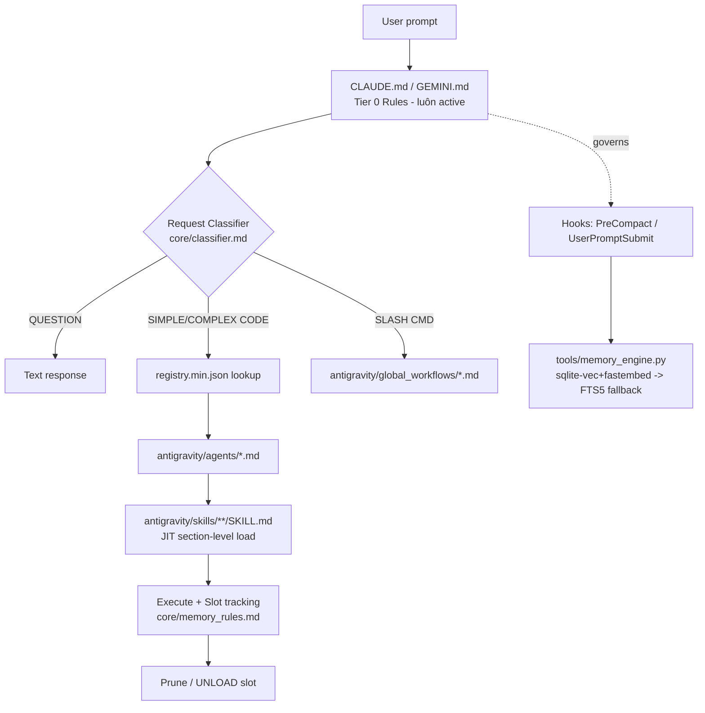
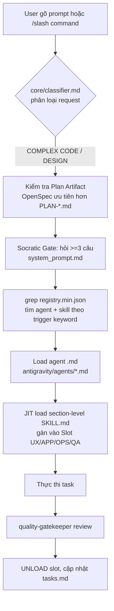

# Báo Cáo Phân Tích — Prompt Base

## Tổng Quan
Framework AI orchestration dạng **global-only** (cài vào `~/.gemini` và/hoặc `~/.claude`, không sống trong repo dự án), biến trợ lý AI thành một "đội chuyên gia" gồm 14 agent, 54 skill, 14 slash-command workflow, được nạp theo cơ chế Progressive Disclosure ("Librarian Protocol"). Stack: thuần Markdown + YAML frontmatter cho phần "prompt", Python (zero/low-dependency) cho tooling (lint, registry gen, memory engine, install). Quy mô nhỏ (341 file, 4.6MB, 34 commit) nhưng độ trưởng thành cao: có test suite riêng (`tools/tests/`), golden-eval LLM-as-judge, 5-tier skill quality gate. **Lưu ý quan trọng**: đây chính là framework đang chạy `~/.claude/CLAUDE.md` của user trong phiên làm việc này — `references/prompt_base/CLAUDE.md` giống hệt cấu hình global hiện tại, và `docs/openspecs/reference-analysis/design.md` của Auto Code OS lấy đúng template 12-perspective từ `antigravity/skills/custom/explore-codebase/SKILL.md` của repo này.

## Tính Năng Nổi Bật (Best Features)
1. **Librarian Protocol (Progressive Disclosure) 3 tầng — Rules/Workflows/Skills**: Rules (`CLAUDE.md`/`GEMINI.md`) luôn active, Workflows (`antigravity/global_workflows/*.md`) kích hoạt qua slash-command, Skills (`antigravity/skills/{core,tech,process,custom}/SKILL.md`) tự trigger theo từ khóa tra trong `registry.min.json`. Tách biệt rõ "luôn nạp" vs "nạp khi cần" giúp giữ context window nhỏ. (`CLAUDE.md:31-51`, `ARCHITECTURE.md`)
2. **Dual-target install từ một nguồn Markdown duy nhất**: `GEMINI.md` và `CLAUDE.md` là **byte-identical** ngoại trừ chuỗi `~/.gemini` ↔ `~/.claude` (verify bằng `diff` — chỉ khác 2 dòng path). `scripts/install_manifest.py` + `install.manifest.json` copy có filter (exclude `docs/`, `scripts/`, `.git*`...) vào cả hai target, và `Makefile:81-100` backup/restore `settings.json` của user trước khi merge hook bằng `install_settings.py` để không đè config có sẵn.
3. **5-Tier Skill Quality Gate**: Tier 1 Lint (`scripts/skill_lint.py` — kiểm YAML frontmatter, độ dài mô tả, cảnh báo body >150 dòng/lỗi >300 dòng, đồng bộ với registry), Tier 2 Trigger Precision/Recall (`scripts/trigger_test.py` — tính precision/recall theo `tests/skills/trigger_cases.json`, ngưỡng 0.9, cảnh báo trùng từ khóa trigger giữa các skill), Tier 0 Contract (`scripts/skill_contract.py`), Tier 3 Golden Eval LLM-as-judge (`scripts/golden_eval.py`, dùng Gemini function-calling với 3 tool ảo `read_file/list_files/grep`), Tier 4 Journal (`docs/reports/skill-feedback.md`). (`docs/quality-gates-summary.md`, `Makefile:23-48`)
4. **Context Memory Engine hook-enforced, không chỉ advisory**: `tools/memory_engine.py` là thư viện dùng chung cho hook `PreCompact` (`tools/memory_compact.py`) và `UserPromptSubmit` (`tools/memory_recall.py`), đăng ký qua `settings.json`. Lưu trữ ở `~/.claude/prompt_base_memory/{project}-{sha256_hash}` (global, không rác vào repo, override bằng `PB_LOCAL_MEMORY=1`), dùng sqlite-vec + fastembed (`bge-small-en-v1.5`, 384-dim) khi có, **degrade an toàn về FTS5 keyword search** khi thiếu dependency — không bao giờ raise. Có secret-scrubbing regex trước khi lưu (`memory_engine.py:48-54`, bắt OpenAI/Anthropic key, AWS key, GitHub token, PEM private key).
5. **JIT Knowledge / Section-Level Skill Loading**: `skill-loading/SKILL.md` quy định "Always-Load Floor" (chỉ đọc frontmatter + "Core Principles"), "Heading-Match Protocol" (grep heading thay vì đọc cả file), "Escalation Rule" khi section không đủ thông tin, và giới hạn cứng "never load more than 3-4 skills at once". Kết hợp với `memory_rules.md` "Slot System" (5 slot cố định `SLOT_UX/APP/OPS/QA/MAP`, phải khai báo `UNLOAD` trước khi nạp skill khác cùng slot) tạo ra kỷ luật quản lý context window minh bạch, có thể audit qua log hội thoại.

## Áp Dụng Cho Auto Code OS (Applied Takeaways — ranked)
1. **Trigger Registry + Precision/Recall Gate cho routing prompt/skill** — What: `registry.min.json` là index tập trung (agents + skills theo category) đối chiếu với `tests/skills/trigger_cases.json`; `trigger_test.py` tính precision/recall và cảnh báo trùng từ khóa. Apply: Auto Code OS đã có `server/internal/prompts/` (Go templates) và cơ chế phân loại task cho orchestrator — thêm một registry JSON tương tự liệt kê "trigger keyword → prompt template/tool" trong `server/internal/prompts/`, và một test Go (`prompts_trigger_test.go`) tính precision/recall trên tập câu lệnh mẫu trước khi merge prompt mới. Impact: M · Effort: M · Risk: L · Est: 2-3 ngày.
2. **Secret-scrubbing trước khi persist context/memory** — What: `memory_engine.py:48-54` có `SECRET_PATTERNS` (OpenAI/Anthropic key, AWS key, GitHub token, PEM key, generic `key=value`) chạy qua `contains_secret()` trước khi ghi vào DB. Apply: Auto Code OS lưu context repo và log task trong Postgres (`server/internal/context/`, `server/internal/database/`) — thêm một middleware/filter tương tự chạy trên nội dung trước khi insert vào bảng context/log, đặc biệt vì sandbox Docker (`server/internal/sandbox/`) có thể đọc `.env` của repo user. Impact: H · Effort: L · Risk: L · Est: 1 ngày.
3. **Graceful degrade cho dependency nặng (vector search → FTS5 fallback)** — What: `get_memory_dir`/embedding logic tri-state cache `_VEC_AVAILABLE` — nếu `sqlite-vec`/`fastembed` không cài được, tự chuyển sang FTS5 keyword search, không bao giờ crash hook. Apply: LLM Gateway (`server/pkg/llm/`) và context module hiện dùng Postgres/pgvector cho search — áp dụng pattern tương tự: nếu pgvector extension chưa bật hoặc embedding provider lỗi, tự động fallback sang `to_tsvector`/full-text search của Postgres thay vì fail cả request. Impact: M · Effort: M · Risk: L · Est: 2 ngày.
4. **Manifest-driven install với backup/restore settings của user** — What: `Makefile:81-100` + `install_manifest.py` + `install_settings.py` đảm bảo cài đặt framework không bao giờ đè `settings.json` hiện có của user — backup trước, merge sau. Apply: liên quan tới việc Auto Code OS cung cấp Dockerfile.sandbox và có thể có cấu hình global cho CLI/agent user — dùng cùng pattern backup/merge khi cài hoặc cập nhật cấu hình sandbox mặc định (`docker/Dockerfile.sandbox`) để không phá override của user. Impact: L · Effort: L · Risk: L · Est: 0.5 ngày.
5. **Socratic Gate + Plan Artifact Precedence (OpenSpec ưu tiên hơn PLAN-*.md rời)** — What: `core/classifier.md` quy định rõ: nếu `docs/openspecs/<task>/` tồn tại, đó LÀ plan, cấm tạo song song `docs/plans/PLAN-*.md`. Apply: Auto Code OS đã dùng OpenSpec (`docs/openspecs/reference-analysis/`) — chính thức hoá rule "một nguồn sự thật cho plan" thành check trong `server/internal/orchestrator/` (ví dụ orchestrator từ chối tạo DAG task mới nếu phát hiện cả hai artifact tồn tại cho cùng task ID), tránh trôi dạt giữa spec và plan như đã cảnh báo trong `CLAUDE.md` của chính user. Impact: M · Effort: L · Risk: L · Est: 1 ngày.

## Kiến Trúc (Architecture)
Kiến trúc là "config-as-code cho prompt", không phải service runtime: mọi thứ là file tĩnh (`.md` + YAML frontmatter) được một AI host (Claude Code / Gemini CLI) đọc trực tiếp, cộng với lớp tooling Python xung quanh để lint/generate/test/cài đặt các file đó. Không có server, không có framework web. Hướng phụ thuộc: `registry.min.json` là "database" trung tâm mà cả agent runtime lẫn script build đều đọc — `CLAUDE.md`/`GEMINI.md` → trỏ tới `core/*.md` → trỏ tới `registry.min.json` → trỏ tới `antigravity/agents/*.md` và `antigravity/skills/**/SKILL.md`. `ARCHITECTURE.md` khai báo bảng "Critical File Dependencies" tường minh (dòng 266-274) — đúng là kỹ thuật "File Dependency Awareness" mà chính `CLAUDE.md` yêu cầu agent tuân theo khi sửa code. Lựa chọn "global-only, cài vào home directory" (không sống trong git repo dự án) là quyết định kiến trúc cốt lõi: cho phép 1 bộ agent/skill dùng chung mọi project, đổi lại phải có cơ chế cài đặt/gỡ cẩn trọng (không đè config), và registry phải tách biệt hoàn toàn theo project qua memory engine (`{project}-{sha256_hash}`).

Confidence: High cho cấu trúc 3 tầng và registry (đọc trực tiếp code); Medium cho phần "tại sao chọn global-only thay vì per-repo" (suy luận từ README + Makefile, không có ADR file tường minh).

### ADR Suy Luận (Inferred ADRs)
| Quyết Định | Bằng Chứng | Lợi Ích | Đánh Đổi | Confidence |
|---|---|---|---|---|
| Global-only install (`~/.gemini`, `~/.claude`), không sống trong repo | `README.md` hướng dẫn `git clone ... ~/.gemini`; `Makefile` có `install-gemini`/`install-claude` | Một bộ agent/skill dùng chung mọi project, tránh trùng lặp | Phải xử lý xung đột cài đặt (settings.json), memory phải tách theo project bằng hash | High |
| Memory lưu global (`~/.claude/prompt_base_memory/`) thay vì trong repo | `memory_engine.py:29-46`, biến `PB_LOCAL_MEMORY` | Không làm bẩn git history của user, dễ gỡ | Khó chia sẻ memory giữa các máy/CI; cần resolve `.git` root chính xác | High |
| Degrade an toàn khi thiếu sqlite-vec/fastembed thay vì bắt buộc cài | `memory_engine.py` comment "Never raises on missing optional dependencies" | Hook không phá vỡ session của user khi thiếu dep nặng | Recall kém chính xác hơn (FTS5 vs vector) khi degraded | High |
| Tách GEMINI.md/CLAUDE.md làm 2 file thay vì 1 file + symlink | `diff GEMINI.md CLAUDE.md` chỉ khác placeholder path | Dễ đọc, không cần symlink phức tạp trên mọi OS | Rủi ro 2 file trôi dạt nếu sửa tay 1 bên (không có test đồng bộ tự động thấy được) | Medium |
| 5-Tier quality gate cho skill thay vì review thủ công | `docs/quality-gates-summary.md`, `Makefile:23-48`, `scripts/skill_lint.py`, `scripts/trigger_test.py` | Bắt lỗi trigger keyword collision, mô tả thiếu, registry lệch, trước khi merge | Chi phí bảo trì cao hơn (phải cập nhật cả SKILL.md lẫn registry lẫn test case) | High |

## Luồng Chính (Main Flow)

## Design Patterns & Chất Lượng Code
- **Registry Pattern**: `registry.min.json` là single source of truth cho discovery, cả agent runtime lẫn `skill_lint.py`/`trigger_test.py` đều đọc từ đây — tránh mô tả trôi dạt giữa SKILL.md và registry (lint kiểm tra `description` khớp nhau, `scripts/skill_lint.py:66-69`).
- **Strategy/Plugin qua Markdown**: mỗi agent (`antigravity/agents/*.md`) và skill (`SKILL.md`) là một "plugin" độc lập với YAML frontmatter chuẩn hoá (`name`, `description`, `tools`, `skills`, `references`) — dễ thêm mới, dễ lint tự động.
- **Zero/low-dependency Python tooling**: `install_manifest.py` chỉ dùng `os/sys/json/shutil/fnmatch` từ stdlib — không cần pip install để cài framework cốt lõi, chỉ cần cho tính năng memory engine tuỳ chọn (`requirements.txt` riêng, `make memory-setup` tạo venv cô lập).
- **Naming/style nhất quán**: mọi skill đều theo khuôn `## Core Principles`, `Triggers on:` trong description — được enforce bằng linter chứ không chỉ convention bằng lời.
- **Điểm yếu**: không có type-checking cho Python (không thấy `mypy`/type hints nhất quán), một số script (`golden_eval.py`) gọi thẳng Gemini API qua `urllib` thủ công thay vì SDK — tăng chi phí bảo trì khi API đổi format.

## Kỹ Thuật Thú Vị & Thực Hành Kỹ Thuật
- **Testing**: `tools/tests/` có unit test cho hook resilience (`test_hook_resilience.py`), memory lifecycle, install settings — nghĩa là phần "hạ tầng ẩn" (hooks, memory) được test như code thực sự, không chỉ prompt được review bằng mắt.
- **Golden Eval (LLM-as-judge)**: `scripts/golden_eval.py` định nghĩa `FUNCTION_DECLARATIONS` cho 3 tool giả lập (`read_file`, `list_files`, `grep`) để agent-dưới-test tự điều tra fixture (`evals/golden/fixtures/mini-app/`), sau đó dùng `judge_template.txt` để LLM khác chấm điểm — một dạng CI cho prompt engineering, không phải chỉ test code.
- **Config qua `.env` + fallback model override**: `load_env()` đọc `.env` thủ công (không dùng `python-dotenv`) — tối giản dependency, đánh đổi tính năng (không hỗ trợ multiline value, escaping).
- **Logging có scrubbing**: `memory_engine.py` log lỗi qua `_log()` (nội bộ) nhưng luôn scrub secret trước khi ghi bất cứ nội dung nào vào memory DB — thực hành bảo mật hiếm thấy ở tầng "prompt framework".
- **Error handling qua degrade thay vì exception**: toàn bộ memory engine thiết kế theo nguyên tắc "never raises on missing optional dependencies" — một triết lý resilience rõ ràng, khác với cách nhiều framework AI khác fail cứng khi thiếu API key/thư viện.

## Engineering Gems
1. `tools/memory_engine.py:29-58` — Vấn đề: hook chạy trong môi trường Claude Code/Gemini CLI không kiểm soát được, không được phép crash session người dùng. · Cách làm phổ biến (yếu hơn): import thẳng `sqlite-vec`/`fastembed` ở top-level, để `ImportError` crash hook. · Vì sao elegant: tri-state cache (`_VEC_AVAILABLE = None` → test 1 lần → cache kết quả) tránh test lại mỗi lần gọi, đồng thời trả về `degraded` flag cho caller quyết định UX thay vì raise. · Đánh đổi: code phức tạp hơn (phải kiểm tra `degraded` ở mọi call site). · Bài học: với hook chạy trong tiến trình của công cụ khác (không phải service riêng của mình), "graceful degrade" phải là thiết kế mặc định, không phải afterthought.
2. `scripts/trigger_test.py:69-118` — Vấn đề: các skill có `Triggers on:` tự nhiên ngôn ngữ dễ bị trùng từ khóa (2 skill cùng match "database") hoặc bị quên viết test case. · Cách làm phổ biến (yếu hơn): review bằng mắt mô tả skill khi thêm mới, không có metric. · Vì sao elegant: tính precision/recall thật sự (`tp/fp/fn` theo skill) trên tập `trigger_cases.json`, có ngưỡng cứng 0.9 và cảnh báo skill "zero test case" — biến việc "viết mô tả trigger hay" thành một bài toán có thể đo lường và gate trong CI. · Đánh đổi: cần duy trì file test case song song với registry, tốn công khi thêm skill mới. · Bài học: bất kỳ hệ thống routing dựa trên keyword/intent nào (kể cả routing skill trong prompt) đều nên có test set định lượng, không chỉ "trông có vẻ đúng".
3. `Makefile:81-100` + `scripts/install_settings.py` (referenced) — Vấn đề: cài đặt framework toàn cục dễ đè mất cấu hình hook/settings cá nhân của user đã có trước đó trong `~/.claude/settings.json`. · Cách làm phổ biến (yếu hơn): `cp -r` thẳng đè lên, hoặc yêu cầu user tự merge tay. · Vì sao elegant: backup file gốc thành `.pb_settings_backup.json` trước khi copy manifest, sau đó chạy `install_settings.py --source settings.json --dest ~/.claude/settings.json` để merge (không phải overwrite) hook entries. · Đánh đổi: logic install phức tạp hơn nhiều so với copy đơn giản, comment trong Makefile phải giải thích rõ lý do (dòng 82-85). · Bài học: bất kỳ installer nào ghi vào thư mục dùng chung (home directory, global config) phải coi merge-safety là yêu cầu bắt buộc, không phải tùy chọn.

## Top 10 Điều Đáng Học
| # | Khái Niệm | File | Vì Sao Hữu Ích | Độ Khó | Thứ Tự |
|---|---|---|---|---|---|
| 1 | Registry-driven skill/agent discovery | `registry.min.json`, `core/classifier.md` | Tách "định nghĩa" khỏi "index tra cứu", cho phép lint đồng bộ tự động | ⭐⭐⭐ | 1 |
| 2 | 5-Tier Skill Quality Gate | `docs/quality-gates-summary.md`, `Makefile:23-48` | Mẫu CI cho prompt engineering, áp dụng được cho bất kỳ hệ thống multi-prompt nào | ⭐⭐⭐⭐ | 2 |
| 3 | Trigger Precision/Recall testing | `scripts/trigger_test.py` | Đo lường định lượng cho routing intent-based | ⭐⭐⭐ | 3 |
| 4 | Graceful-degrade memory engine (vector → FTS5) | `tools/memory_engine.py` | Pattern resilience cho hệ thống phụ thuộc optional heavy-dep | ⭐⭐⭐⭐ | 4 |
| 5 | Secret-scrubbing trước khi persist | `tools/memory_engine.py:48-54` | Bảo mật tối thiểu bắt buộc cho mọi hệ thống ghi log/context tự động | ⭐⭐ | 5 |
| 6 | Dual-target single-source config (GEMINI.md = CLAUDE.md) | `GEMINI.md`, `CLAUDE.md` (diff) | Giảm trùng lặp bảo trì khi hỗ trợ nhiều host AI | ⭐⭐ | 6 |
| 7 | Manifest-driven filtered install + settings merge | `install.manifest.json`, `scripts/install_manifest.py`, `Makefile:81-100` | An toàn khi ghi vào thư mục dùng chung | ⭐⭐⭐ | 7 |
| 8 | JIT / Section-Level Skill Loading Protocol | `antigravity/skills/core/skill-loading/SKILL.md` | Kỷ luật quản lý context window minh bạch, có rule cứng (max 3-4 skill) | ⭐⭐⭐ | 8 |
| 9 | Slot System cho memory theo domain | `core/memory_rules.md` | Framework tư duy để tránh "context bleed" giữa domain khác nhau | ⭐⭐ | 9 |
| 10 | Golden Eval LLM-as-judge cho skill | `scripts/golden_eval.py`, `evals/golden/` | Testing tự động cho prompt/skill thay vì chỉ test code | ⭐⭐⭐⭐ | 10 |

## Hướng Dẫn Đọc (Reading Guide)
**L0 Build & Run:** `Makefile`, `install.manifest.json`, `README.md` **L1 Entry Points:** `CLAUDE.md` / `GEMINI.md`, `core/system_prompt.md` **L2 Core Abstractions:** `core/classifier.md`, `core/rules.md`, `registry.min.json`, `antigravity/skills/core/skill-loading/SKILL.md` **L3 Architecture Glue:** `ARCHITECTURE.md` ("Critical File Dependencies"), `Makefile` (install/skill-check targets), `settings.json` (hook wiring) **L4 Engineering Gems:** `tools/memory_engine.py`, `scripts/trigger_test.py`, `scripts/skill_lint.py` **L5 Reimplement:** viết lại registry + trigger-precision-test cho một hệ prompt/tool-routing nhỏ của riêng bạn.

## Anti-Patterns & Không Nên Copy
1. **Không có test tự động đảm bảo `GEMINI.md`/`CLAUDE.md` đồng bộ** — hai file trôi dạt được nếu ai đó sửa tay 1 bên mà quên bên kia; chỉ phát hiện được bằng `diff` thủ công như đã làm ở trên. Auto Code OS nên tránh nhân bản file cấu hình theo host trừ khi có test/generator tự động enforce đồng bộ.
2. **`golden_eval.py` gọi thẳng REST API qua `urllib` thủ công** thay vì SDK chính thức — hợp lý cho một framework "zero-dependency", nhưng dễ vỡ khi API đổi format response; không nên copy cách này cho code sản phẩm (Auto Code OS đã có `server/pkg/llm/` dùng SDK/provider abstraction, nên giữ nguyên).
3. **Global install ghi đè `~/.claude` của chính user đang chạy nó** — quyết định hợp lý cho một framework prompt cá nhân, nhưng là anti-pattern nếu áp dụng ý tưởng "cài global" cho Auto Code OS (multi-tenant, chạy trong Docker sandbox) — mọi state phải scope theo project/tenant trong Postgres, không bao giờ ghi vào home directory dùng chung.
4. **Thiếu ADR file tường minh cho các quyết định lớn** (vd. tại sao chọn sqlite-vec+fastembed thay vì Postgres pgvector cho memory engine dù phần còn lại của hệ sinh thái đều thiên về markdown/JSON nhẹ) — chỉ suy luận được từ code comment, không có `docs/adr/`. Auto Code OS nên tránh lặp lại: đã có `docs/openspecs/` nên tận dụng `design.md` ghi rõ quyết định + đánh đổi.

## Câu Hỏi Đáng Suy Ngẫm
- Vì sao chọn SQLite (sqlite-vec) cho memory engine thay vì tận dụng Postgres đã có sẵn trong hầu hết dự án đích (bao gồm chính Auto Code OS) — có phải vì memory engine cần chạy độc lập, không phụ thuộc DB server nào của project đích?
- Cơ chế `UNLOAD [Slot]` trong `memory_rules.md` là "tự khai báo" (agent tự nói mình unload) — có bằng chứng nào (hook, script) thực sự enforce việc này, hay hoàn toàn dựa vào agent tự giác tuân thủ prompt?
- Registry `registry.min.json` được generate từ SKILL.md (`scripts/generate_registry.py`) nhưng cũng được lint để "khớp" với SKILL.md — quy trình gen → lint hai chiều này có tồn tại race condition nào khi nhiều skill được sửa đồng thời không?
- Golden Eval yêu cầu `GEMINI_API_KEY` — framework có hỗ trợ Anthropic-based judge để dùng nhất quán với `install-claude` không, hay Tier 3 chỉ thực sự hoạt động khi người dùng đích là Gemini?

## Đánh Giá Tổng Thể
| Architecture | Maintainability | Scalability | Clean Code | Learning Value |
|---|---|---|---|---|
| 8/10 | 8/10 | 6/10 | 8/10 | 9/10 |

## Lộ Trình Học Tập
- **Tuần 1**: Đọc `CLAUDE.md`/`GEMINI.md`, `ARCHITECTURE.md`, `core/*.md`, `registry.min.json` để hiểu mô hình 3 tầng và cơ chế classifier — đối chiếu trực tiếp với `~/.claude/CLAUDE.md` hiện tại của bạn (gần như giống hệt).
- **Tuần 2**: Đọc toàn bộ pipeline quality gate: `scripts/skill_lint.py`, `scripts/trigger_test.py`, `scripts/skill_contract.py`, `scripts/golden_eval.py`, chạy thử `make skill-check SKILL=<name>` trên một skill có sẵn.
- **Tuần 3**: Đọc `tools/memory_engine.py` + hook `memory_compact.py`/`memory_recall.py` + `docs/openspecs/context-memory-engine-2026/design.md`; thử bật `make memory-setup` cục bộ để quan sát degrade behavior khi gỡ `fastembed`.
- **Tuần 4**: Tự tái tạo mini-version cho Auto Code OS: một registry JSON nhỏ cho prompt template trong `server/internal/prompts/`, kèm test precision/recall bằng Go, và một middleware secret-scrubbing trước khi ghi context vào Postgres — áp dụng trực tiếp Takeaway #1 và #2 ở trên.
