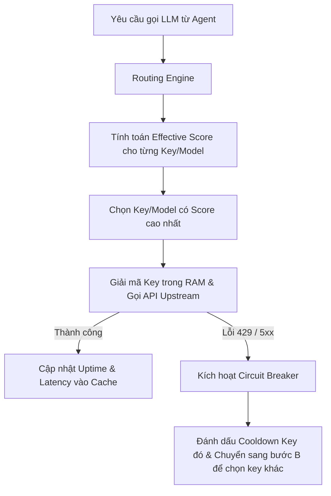

# 🗝️ LLM Key Manager: Trình Quản Lý API Key Bảo Mật & Định Tuyến AI Gateway

## 🌟 Điểm Sáng & Tính Năng Hay Nhất (Best Features)

*   **Định Tuyến Effective Score (Công Thức Điểm Hiệu Dụng):** Thuật toán chọn lọc key/model tối ưu trong thời gian thực bằng cách tính điểm số động:
    $$\text{Score} = \text{Power} + \text{Priority Bonus} + \text{Health Bonus} - \text{Latency Penalty}$$
    *   *Power:* Điểm số thông minh của model (vd: Claude 3.5 Sonnet = 90, GPT-4o = 85).
    *   *Priority Bonus:* User tự cấu hình ưu tiên (+20 cho tài khoản xịn, -20 cho tài khoản phụ).
    *   *Health Bonus:* Điểm thưởng cho uptime ổn định.
    *   *Latency Penalty:* Trừ 1 điểm cho mỗi 10ms độ trễ phản hồi trung bình.
*   **Bảo Mật Cực Cao Cục Bộ (Zero Backend required):** API key được mã hóa bằng thuật toán đối xứng AES-256-GCM thông qua Web Crypto API trước khi lưu xuống IndexedDB của trình duyệt. Quá trình giải mã chỉ diễn ra trong bộ nhớ RAM lúc gọi request, tuyệt đối không gửi key thô về server.
*   **Resilient Fallover & Circuit Breaker:** Khi một key trả về lỗi `429` (Rate limit) hoặc `5xx`, hệ thống tự động đánh dấu cooldown, ngắt mạch kết nối đó và chuyển tiếp request sang key có điểm số cao tiếp theo.

---

## 🧠 Bài Học & Cải Tiến Cho Auto Code OS (Takeaways & Improvements)

1.  **Áp Dụng Công Thức Effective Score Cho Go Backend:**
    *   *Chi tiết:* Auto Code OS cần một cơ chế chọn lựa API Key tối ưu khi người dùng cấu hình nhiều tài khoản OpenAI/Anthropic/Gemini.
    *   *Áp dụng:* Chuyển đổi công thức tính điểm Effective Score của LLM Key Manager thành code Go trong package `pkg/llm` để tự động chọn API key có latency thấp nhất và tỷ lệ uptime cao nhất cho các task chạy ngầm.
2.  **Circuit Breaker & Cooldown Cho API Key:**
    *   *Chi tiết:* Tránh việc liên tục gọi vào một key bị lỗi làm trễ luồng chạy của agent.

---

## 🏗️ Kiến Trúc & Các File Quan Trọng (Architecture & Key Paths)

*   `src/vault/`: Mã hóa và lưu trữ bảo mật bằng AES-256-GCM.
*   `src/routing/`: Routing engine dựa trên thuật toán Effective Score.
*   `src/resilience/`: Xử lý ngắt mạch (Circuit Breakers) và RetryScheduler.
*   `examples/ui-demo/`: Dashboard giao diện Next.js hiển thị biểu đồ latency và trạng thái key thời gian thực.

---

## 🔄 Luồng Hoạt Động (Main Flow)

