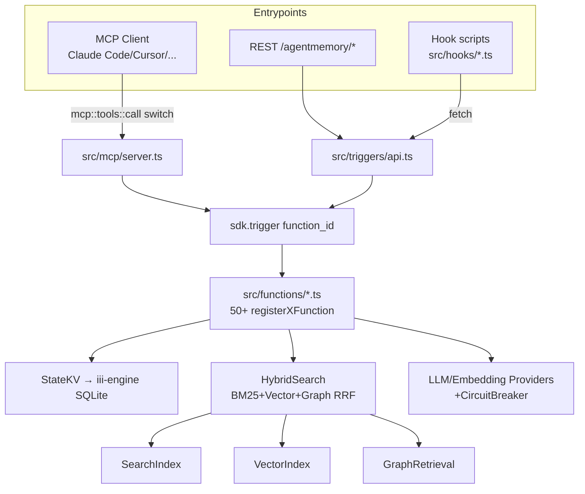
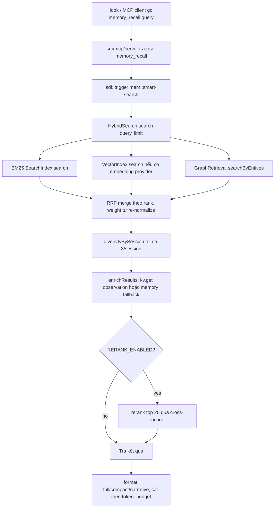

# Báo Cáo Phân Tích — agentmemory

## Tổng Quan
Persistent memory engine cho AI coding agents (Claude Code, Cursor, Copilot CLI, Codex, OpenClaw, pi, OpenCode...), publish dưới `@agentmemory/agentmemory` trên npm, build trên "iii-engine" (Worker/Function/Trigger primitives qua WebSocket, port 49134) với SQLite làm state store — zero external DB. Stack: TypeScript ESM thuần (không framework web), `tsdown` build, `vitest` test (1.423+ tests). Quy mô lớn: ~50 iii functions trong `src/functions/`, 53 MCP tools, 128 REST endpoints, 12 hook scripts, 15 skills — v0.9.27, maturity cao (6 GHSA security advisories đã vá, benchmark riêng LongMemEval-S đạt R@5 95.2%).

## Tính Năng Nổi Bật (Best Features)
1. **Triple-Stream Hybrid Search với Reciprocal Rank Fusion (RRF)**: `HybridSearch.tripleStreamSearch()` (`src/state/hybrid-search.ts:77-240`) chạy song song BM25 (`SearchIndex`), Vector (`VectorIndex`, cosine similarity) và Graph (entity BFS qua `GraphRetrieval`), merge bằng công thức RRF chuẩn `1/(RRF_K + rank)` với `RRF_K=60`, tự động re-normalize trọng số khi một stream rỗng (vd. không có embedding provider → fallback BM25+Graph). Kết quả đo được: R@5 = 95.2% trên LongMemEval-S với embedding local `all-MiniLM-L6-v2` (`benchmark/LONGMEMEVAL.md`), so với 86.2% nếu chỉ BM25.
2. **BM25 tự viết tay không phụ thuộc thư viện** (`src/state/search-index.ts`): inverted index + doc-term-count Maps, công thức BM25 chuẩn (`k1=1.2, b=0.75`), có prefix-matching qua binary-search trên sorted terms (`lowerBound`), synonym expansion (weight 0.7), CJK segmentation riêng (`cjk-segmenter.ts`) và Porter-like stemmer riêng — toàn bộ pipeline BM25 tự chủ, serialize/deserialize được để persist ra disk.
3. **4-Tier Memory Consolidation Pipeline** (`src/functions/consolidate.ts`, `consolidation-pipeline.ts`): observation → memory qua LLM XML-prompt consolidation theo concept-group (Jaccard similarity > 0.7 để supersede), giới hạn `MAX_LLM_CALLS = 10` mỗi lần chạy để chặn chi phí, và guard project-scoping tường minh (comment tại dòng 162-168 giải thích rõ lý do tránh cross-project memory corruption).
4. **Vận hành phòng thủ (defensive ops) ở tầng boot**: `src/index.ts:395-447` — khi load lại vector index đã persist, hệ thống validate dimension của TỪNG vector (không chỉ vector đầu tiên) trước khi phục hồi, vì cosine similarity giữa 2 vector khác chiều luôn trả 0 và làm hỏng recall một cách âm thầm. Nếu lệch dimension, mặc định **refuse to start** với thông báo lỗi chi tiết + 3 hướng khắc phục, trừ khi set `AGENTMEMORY_DROP_STALE_INDEX=true`.
5. **Circuit Breaker cho LLM Provider** (`src/providers/circuit-breaker.ts` + `resilient.ts`): state machine `closed → open → half-open` với `failureThreshold=3`, `failureWindowMs=60s`, `recoveryTimeoutMs=30s`, wrap mọi provider (`ResilientProvider implements MemoryProvider`) để consolidation/crystallize/summarize không dội request liên tục vào một provider đang down.

## Áp Dụng Cho Auto Code OS (Applied Takeaways — ranked)

> Ghi chú quan trọng: Auto Code OS **đã có** một hệ thống memory 4-tier + triple-stream RRF search gần như song song với agentmemory (`server/internal/service/memory.go`, `memory_search.go`, `server/internal/repository/memory.go`, `server/pkg/models/memory.go` — tier `working/episodic/semantic/procedural`, RRF merge với `rrfK=60` y hệt). Các takeaway dưới đây tập trung vào **khoảng trống cụ thể** giữa 2 implementation, không phải đề xuất xây lại từ đầu.

1. **Mở rộng bộ regex strip-secret** — What: `src/functions/privacy.ts:5-20` có 14 pattern (Bearer token, `sk-proj-`, `sk-ant-`, `gh[pus]_`, `github_pat_`, `xoxb-`, AWS `AKIA`, Google `AIza`, JWT `eyJ...`, `npm_`, `glpat-`, DigitalOcean `dop_v1_`...) — được bổ sung sau GHSA advisory #06 (`.github/security-advisories/06-privacy-redaction-incomplete.md`) khi phát hiện thiếu Bearer/`sk-proj-`/`ghs_`/`ghu_`. Apply: `server/internal/service/memory.go:213-218` hiện chỉ có 5 pattern (`api_key/token/secret`, `bearer`, `sk-`, `ghp_`, `glpat-`) — **thiếu chính xác các pattern mà agentmemory phải vá do lỗ hổng thực tế**: `sk-proj-`, `sk-ant-`, `ghs_/ghu_/github_pat_`, AWS `AKIA`, Google `AIza`, JWT, `npm_`. Bổ sung các regex này vào `secretPatterns` trong `stripSecrets()`. Impact: H (an ninh — memory là nơi lưu observation từ tool output, dễ dính leaked secrets) · Effort: L · Risk: L · Est: 0.5 day.
2. **Circuit breaker quanh embedding/LLM call trong MemoryService** — What: `ResilientProvider`/`CircuitBreaker` (`src/providers/resilient.ts`, `circuit-breaker.ts`) chặn consolidation dội request vào provider đang lỗi. Apply: `server/internal/service/memory.go` gọi `s.embedder.Embed()` trực tiếp (dòng ~50, ~SearchMemory) chỉ có `slog.Warn` fallback, không có breaker — nếu embedding provider (`server/pkg/llm/embedding.go`) rate-limit/down, mỗi `RecordObservation`/`Search` vẫn thử gọi lại. Thêm 1 struct `CircuitBreaker` tương tự (closed/open/half-open, ngưỡng lỗi + cửa sổ + recovery timeout) bọc quanh `MemoryEmbedder.Embed()` trong `server/pkg/llm/embedding.go`. Impact: M · Effort: L · Risk: L · Est: 1 day.
3. **Auto-forget / decay sweep định kỳ** — What: `src/functions/auto-forget.ts` chạy theo interval (`AUTO_FORGET_INTERVAL_MS`, mặc định 1h — wired ở `src/index.ts:539-547`), xử lý 3 việc: xoá memory hết TTL (`forgetAfter`), phát hiện contradiction giữa 2 memory cùng concept (Jaccard token similarity > 0.9 → memory cũ hơn bị đánh `isLatest=false`), và xoá observation cũ >180 ngày có `importance <= 2`. Apply: `MemoryService.ApplyDecay()` (`server/internal/service/memory.go:136`) hiện có logic decay nhưng cần verify có contradiction-detection và TTL sweep theo interval hay chỉ decay strength — nếu chưa có, bổ sung 1 cron job Go (giống `autoForgetTimer` pattern) gọi `ApplyDecay` mỗi giờ qua `time.NewTicker`, đăng ký trong `server/cmd/api/` bootstrap. Impact: M · Effort: M · Risk: L · Est: 2 days.
4. **Vector-index dimension guard khi đổi embedding model** — What: `src/index.ts:395-447` refuse-to-start khi phát hiện vector đã lưu có dimension khác model đang active, kèm thông báo lỗi liệt kê rõ obsId mẫu + hướng dẫn 3 cách khắc phục. Apply: pgvector column trong Postgres (`server/pkg/models/memory.go`) có fixed dimension theo schema migration, nên lỗi loại này ít xảy ra hơn ở tầng DB, nhưng nếu đổi `MemoryEmbedder` sang model khác dimension, INSERT sẽ lỗi runtime khó debug. Thêm 1 check ở boot (`server/cmd/api/`) so `embedder.Dimensions()` với dimension cột `embedding vector(N)` trong migration, log cảnh báo rõ ràng thay vì để Postgres trả lỗi generic. Impact: L · Effort: L · Risk: L · Est: 0.5 day.
5. **MCP tool surface có default "core 8" + `AGENTMEMORY_TOOLS=all`** — What: 53 MCP tools tổng nhưng chỉ 8 tool hiển thị mặc định (`CORE_TOOLS` trong `src/mcp/tools-registry.ts`), tránh làm ngợp context window của agent với danh sách tool quá dài; set env var để mở full surface khi cần. Apply: nếu Auto Code OS lộ MCP tools qua `server/internal/tool/registry.go`, áp dụng cùng pattern 2-tier (core subset mặc định + full registry opt-in qua flag) thay vì expose toàn bộ registry cho mọi agent invocation. Impact: M · Effort: L · Risk: L · Est: 1 day.

## Kiến Trúc (Architecture)
agentmemory không có "handler/router" kiểu web app — mọi capability là 1 **iii Function** đăng ký qua `sdk.registerFunction(name, handler)` trong `main()` (`src/index.ts:235-334`, hơn 50 lần gọi `registerXFunction`), rồi được expose ra 3 mặt: MCP tool (`src/mcp/server.ts` switch-case theo tool name → `sdk.trigger()`), REST endpoint (`src/triggers/api.ts`), và event trigger nội bộ (`src/triggers/events.ts`). Toàn bộ state đi qua `StateKV` (`src/state/kv.ts`) — một wrapper mỏng trên iii-engine's file-based SQLite, namespace theo `KV.xxx` (`src/state/schema.ts`). Dependency direction rõ ràng một chiều: `functions/*` → `state/*` (kv, index, vector) + `providers/*` (LLM) → `types.ts`; không có function nào import ngược lại từ `mcp/` hay `triggers/`. Confidence: High (đọc trực tiếp `src/index.ts` và `AGENTS.md` — file quy tắc nội bộ liệt kê rõ 8 nơi phải update đồng bộ khi thêm MCP tool).

### ADR Suy Luận (Inferred ADRs)
| Quyết Định | Bằng Chứng | Lợi Ích | Đánh Đổi | Confidence |
|---|---|---|---|---|
| Zero external DB, dùng iii-engine SQLite thay vì Postgres/Qdrant | `AGENTS.md`: "State: File-based SQLite via iii-engine's StateModule"; README stat badge "0 external DBs" | Cài đặt `npx agentmemory` không cần setup DB server, self-host cực nhẹ | Không scale ngang được, BM25/Vector index toàn bộ nằm in-memory (`Map`), phải serialize/restore thủ công (`IndexPersistence`) | High |
| Tự viết BM25 thay vì dùng Elasticsearch/Lucene | `src/state/search-index.ts` tự cài IDF/TF-IDF, stemmer, CJK segmenter riêng | Không phụ thuộc process ngoài, chạy embedded trong Node process | Phải tự bảo trì đúng edge-case (Unicode, CJK, prefix search) mà thư viện trưởng thành đã giải quyết | High |
| Optional embedding provider (BM25+Graph fallback khi không có) | `src/index.ts:178-184`: `bootLog("Embedding provider: none (BM25-only mode)")`; benchmark riêng cho BM25-only (86.2%) | Dùng được hoàn toàn free/offline, không cần API key | Recall thấp hơn ~9 điểm R@5 so với có vector | High |
| Circuit breaker + resilient wrapper quanh mọi LLM provider | `src/providers/resilient.ts`, `circuit-breaker.ts`, dùng trong `consolidate`, `crystallize`, `summarize` | Cô lập lỗi provider, tránh cascading failure khi rate-limited | Thêm độ phức tạp state machine cho mọi lời gọi LLM | High |
| Auto-compress và context-injection **tắt mặc định**, cảnh báo rõ khi bật | `src/index.ts:277-295` in 2 đoạn `bootLog` WARNING dài giải thích chi phí token | Người dùng mới không bị đốt token âm thầm | Trải nghiệm mặc định "kém thông minh hơn" cho tới khi user tự bật | High |

## Luồng Chính (Main Flow)
Ví dụ luồng `memory_recall` (MCP tool phổ biến nhất, dùng trong `PreToolUse`/`SessionStart` hook):

## Design Patterns & Chất Lượng Code
- **Function-as-capability registration pattern**: mọi feature (dù nhỏ như `mem::privacy`) đều là 1 `sdk.registerFunction` riêng biệt, độc lập test được (`test/*.test.ts` mock `vi.mock("iii-sdk")`). Ưu điểm: cô lập tốt, dễ enable/disable theo feature flag (`isSlotsEnabled()`, `isGraphExtractionEnabled()`...). Nhược điểm: `src/index.ts` dài 612 dòng chỉ để wiring, phải đọc tuần tự để hiểu boot order.
- **Explicit consistency checklist thay vì codegen**: `AGENTS.md` liệt kê tường minh "khi thêm MCP tool phải sửa 8 file" — không dùng codegen tự động để giữ đồng bộ (tool count trong README, plugin.json, test assertion...). Đây là compromise thực dụng nhưng dễ lệch nếu contributor bỏ sót 1 bước; có `scripts/skills/check.ts` để lint phần skill nhưng không thấy lint cho tool-count consistency.
- **Guarded optional imports**: `optionalDependencies` (`@node-rs/jieba`, `@xenova/transformers`, `onnxruntime-node`) cho phép chạy hoàn toàn không có native binary — embedding provider trả `null` một cách graceful thay vì crash (`src/index.ts:170,178-184`).
- **Keyed mutex tối giản** (`src/state/keyed-mutex.ts`, 18 dòng): promise-chaining theo key string, dùng trong `mem::remember` để tránh 2 lần `remember` cùng lúc tạo 2 memory trùng superseding-chain — không cần thư viện lock ngoài.
- **Naming/style**: camelCase nhất quán, `AGENTS.md` nói rõ "No code comments explaining WHAT — use clear naming instead", nhưng thực tế code vẫn có nhiều comment giải thích WHY (rationale) tại các quyết định tricky — ví dụ đoạn dimension-mismatch ở `src/index.ts:399-404` hay project-scope guard ở `consolidate.ts:162-168`. Đây là kỷ luật comment tốt: chỉ giải thích lý do không hiển nhiên, không diễn giải lại code.

## Kỹ Thuật Thú Vị & Thực Hành Kỹ Thuật
- **Testing**: 950+ unit test (vitest), pattern mock `vi.mock("iii-sdk")` để test function logic độc lập khỏi engine thật; `test:integration` tách riêng khỏi suite chính vì cần engine thật chạy.
- **Fire-and-forget hook với timeout kép**: `AGENTS.md` mô tả rất kỹ pattern cho "telemetry-only hooks" — `fetch(..., {signal: AbortSignal.timeout(N)}).catch(() => {})` kết hợp `setTimeout(() => process.exit(0), 500).unref()` để hook không block prompt boundary của Claude Code ngay cả khi request treo. Đây là bài học vận hành cụ thể rút ra từ một bug thật (nếu thiếu `setTimeout`, Node giữ event loop sống chờ fetch).
- **Config/flags qua env var có logging tường minh**: mọi tính năng tốn token (`AGENTMEMORY_AUTO_COMPRESS`, `AGENTMEMORY_INJECT_CONTEXT`) mặc định OFF và in cảnh báo chi tiết về chi phí ngay tại boot log nếu bật — một dạng "cost transparency by default" hiếm gặp.
- **Security**: repo tự công khai 6 GHSA advisory draft đã vá (`. github/security-advisories/`) — bao gồm stored XSS ở viewer (CVSS 9.6), curl|sh RCE khi cài iii-engine (CVSS 9.8), bind `0.0.0.0` mặc định không auth (CVSS 8.1), mesh sync không auth, path traversal ở Obsidian export, và thiếu pattern redact secret. Việc để lộ advisory công khai (thay vì giấu) là tín hiệu tốt về minh bạch, đồng thời là nguồn học thực chiến về class-lỗi điển hình của memory/agent tooling.
- **Error handling**: hầu hết external call (embedding, graph retrieval, rerank) bọc `try/catch` với fallback rõ ràng ("best-effort", "fall through to BM25-only") thay vì throw — ưu tiên graceful degradation cho search path.

## Engineering Gems
1. `src/index.ts:395-447` — Vấn đề: reload vector index đã persist từ disk khi embedding provider có thể đã đổi (model khác → dimension khác) → cosine similarity cross-dimension luôn = 0, làm hỏng recall **âm thầm** không lỗi. Cách làm phổ biến (yếu hơn): chỉ kiểm tra dimension của phần tử đầu tiên, hoặc bỏ qua hoàn toàn và để lỗi runtime xuất hiện ngẫu nhiên khi search. Vì sao elegant: `validateDimensions(activeDim)` duyệt **toàn bộ** vector, refuse-to-start theo default (fail loud) với message liệt kê obsId mẫu + 3 hướng khắc phục cụ thể, chỉ silent-drop khi user tường minh set `AGENTMEMORY_DROP_STALE_INDEX=true`. Đánh đổi: thêm một vòng lặp O(n) ở boot time, có thể chậm khởi động với index lớn. Bài học rút ra: khi migrate embedding model, đừng tin dimension nhất quán trong toàn bộ persisted data — luôn validate exhaustively trước khi trust, đặc biệt khi lỗi loại này im lặng thay vì crash.
2. `src/state/keyed-mutex.ts` (18 dòng) — Vấn đề: 2 lời gọi `mem::remember` đồng thời có thể cùng đọc `existingMemories`, cùng thấy chưa có bản trùng, và tạo ra 2 memory riêng biệt superseding sai (race condition). Cách làm phổ biến (yếu hơn): dùng thư viện lock ngoài (Redis lock, `async-mutex` npm package) hoặc DB-level unique constraint. Vì sao elegant: chỉ 18 dòng, promise-chaining thuần (`locks.get(key) ?? Promise.resolve()`), tự cleanup khi resolve (`if (locks.get(key) === cleanup) locks.delete(key)`) — không leak Map theo thời gian, không cần dependency. Đánh đổi: chỉ hoạt động trong 1 process (không phân tán được across nhiều worker instance). Bài học rút ra: với mutex trong-process, promise chaining tự viết đủ tốt và tránh được cả một dependency.
3. `.github/security-advisories/06-privacy-redaction-incomplete.md` + `src/functions/privacy.ts` — Vấn đề: privacy filter dựa trên whitelist regex luôn lag sau format token mới của các vendor (OpenAI đổi từ `sk-` sang `sk-proj-`, GitHub thêm `ghs_`/`ghu_` bên cạnh `ghp_`). Cách làm phổ biến (yếu hơn): viết 1 lần rồi quên, không track khi vendor đổi format. Vì sao elegant: quy trình ở đây là advisory công khai hoá cụ thể pattern nào bị miss và tại sao (`Authorization: Bearer` header, `sk-proj-*`, `ghs_*/ghu_*`), biến một bug bảo mật thành tài liệu học được cho người khác review lại bộ pattern của chính mình. Đánh đổi: whitelist regex về bản chất luôn là cuộc đua đuổi theo, không bao giờ "đủ" tuyệt đối. Bài học rút ra: khi copy secret-redaction logic sang project khác (như Auto Code OS đã làm ở `server/internal/service/memory.go`), phải đối chiếu định kỳ với danh sách pattern mới nhất — không coi 1 lần viết regex là xong.

## Top 10 Điều Đáng Học
| # | Khái Niệm | File | Vì Sao Hữu Ích | Độ Khó | Thứ Tự |
|---|---|---|---|---|---|
| 1 | Triple-Stream RRF Search | `src/state/hybrid-search.ts` | Merge BM25+Vector+Graph không cần chuẩn hoá score tuyệt đối, chỉ cần rank | ⭐⭐⭐ | 1 |
| 2 | BM25 tự viết + prefix search binary search | `src/state/search-index.ts` | Hiểu rõ cơ chế BM25 thay vì coi là black-box | ⭐⭐⭐⭐ | 2 |
| 3 | Vector-index dimension guard khi boot | `src/index.ts:395-447` | Bài học vận hành: silent corruption nguy hiểm hơn crash | ⭐⭐⭐ | 3 |
| 4 | Circuit Breaker cho LLM provider | `src/providers/circuit-breaker.ts` | State machine tối giản, dễ port sang ngôn ngữ khác | ⭐⭐ | 4 |
| 5 | Keyed in-process mutex | `src/state/keyed-mutex.ts` | Giải pháp 18 dòng cho race condition thường bị over-engineer | ⭐⭐ | 5 |
| 6 | Consolidation pipeline có MAX_LLM_CALLS cap | `src/functions/consolidate.ts` | Chặn chi phí LLM runaway trong batch job | ⭐⭐ | 6 |
| 7 | Auto-forget: TTL + contradiction detection + low-value pruning | `src/functions/auto-forget.ts` | 3 chiến lược decay khác nhau trong 1 sweep | ⭐⭐⭐ | 7 |
| 8 | Fire-and-forget hook với `setTimeout().unref()` | `AGENTS.md` (Hook Scripts section) | Pattern tránh block event loop khi fetch treo | ⭐⭐ | 8 |
| 9 | Explicit consistency checklist (8 file phải sync) | `AGENTS.md` | Compromise thực dụng khi không muốn build codegen | ⭐ | 9 |
| 10 | Public security advisories (GHSA draft) | `.github/security-advisories/*.md` | Case study lỗ hổng thực tế của memory/agent tooling | ⭐⭐ | 10 |

## Hướng Dẫn Đọc (Reading Guide)
**L0 Build & Run:** `package.json` scripts (`dev`, `test`, `bench:load`), `AGENTS.md`. **L1 Entry Points:** `src/index.ts` (boot + wiring), `src/mcp/server.ts` (MCP surface). **L2 Core Abstractions:** `src/state/hybrid-search.ts`, `src/state/search-index.ts`, `src/state/vector-index.ts`, `src/state/schema.ts` (KV namespaces). **L3 Architecture Glue:** `src/functions/remember.ts`, `consolidate.ts`, `auto-forget.ts`, `src/triggers/api.ts`. **L4 Engineering Gems:** `src/index.ts:395-447` (dimension guard), `src/state/keyed-mutex.ts`, `src/providers/circuit-breaker.ts`. **L5 Reimplement:** thử viết lại `SearchIndex` BM25 tối giản trong Go và so kết quả với Postgres `ts_rank`.

## Anti-Patterns & Không Nên Copy
1. **In-memory index toàn bộ + serialize/restore thủ công**: `SearchIndex`/`VectorIndex` sống hoàn toàn trong `Map` của Node process, phải tự viết `IndexPersistence` để save/load khỏi mất dữ liệu khi crash. Với Auto Code OS, Postgres + pgvector (đã dùng, `server/internal/repository/memory.go`) là lựa chọn đúng hơn — không nên bắt chước mô hình in-memory này vì Auto Code OS cần multi-instance/HA mà agentmemory (single-user local tool) không cần lo.
2. **`curl | sh` để cài dependency binary** (advisory #02, đã vá ở 0.8.2): là bài học phản diện rõ ràng — không bao giờ pipe remote script vào shell không pin version/checksum trong bất kỳ script cài đặt nào của Auto Code OS (`docker/Dockerfile.sandbox`, deploy scripts).
3. **Default bind `0.0.0.0` không auth** (advisory #03): REST API + streams server bind mọi interface mặc định, secret rỗng theo default. Auto Code OS nên tiếp tục audit mọi service nội bộ (nếu có REST debug port nào) để đảm bảo default bind là `127.0.0.1` hoặc yêu cầu secret bắt buộc, không opt-in.
4. **53 MCP tools nhưng chỉ 8 tool mặc định hiển thị**: dấu hiệu cho thấy bản thân tác giả cũng thấy con số tool quá lớn gây nhiễu context — nếu Auto Code OS build MCP surface riêng, nên thiết kế "core subset" ngay từ đầu thay vì để tool count phình ra rồi mới retrofit filtering.

## Câu Hỏi Đáng Suy Ngẫm
1. Auto Code OS đã có schema Postgres cho 4-tier memory + RRF search gần giống agentmemory — liệu nên tiếp tục phát triển song song, hay tách phần "capture" (hooks quan sát tool-use) thành module riêng độc lập khỏi orchestrator, giống cách agentmemory tách hoàn toàn iii-engine khỏi Claude Code?
2. agentmemory chọn BM25 tự viết thay vì Postgres full-text (`ts_rank`) vì họ không có DB server. Auto Code OS đã có Postgres — liệu `ts_rank`/`tsvector` (đang dùng ở `SearchBM25Ranked`) có đủ tốt so với BM25 tự viết có synonym+CJK+prefix-match, hay cần nâng cấp thêm synonym expansion ở tầng Go?
3. Circuit breaker + resilient wrapper của agentmemory chỉ bảo vệ single-process. Auto Code OS chạy nhiều orchestrator worker (`server/internal/orchestrator/worker.go`) — circuit breaker per-process có đủ, hay cần breaker state chia sẻ qua Postgres/Redis để tránh N worker cùng lúc dội request vào 1 provider đang down?
4. Việc công khai security advisory draft (`*.md` trong repo, chưa submit GHSA chính thức) là chiến lược minh bạch hay rủi ro (để lộ chi tiết khai thác trước khi user kịp vá)? Auto Code OS có nên áp dụng mô hình tương tự cho các lỗ hổng nội bộ đã fix?

## Đánh Giá Tổng Thể
| Architecture | Maintainability | Scalability | Clean Code | Learning Value |
|---|---|---|---|---|
| 8/10 | 7/10 | 5/10 | 8/10 | 9/10 |

## Lộ Trình Học Tập
- **Tuần 1 — Đọc & chạy thử**: `npm install -g @agentmemory/agentmemory`, chạy `agentmemory demo`, quan sát `src/index.ts` boot log để hiểu thứ tự đăng ký function. Đọc `AGENTS.md` toàn bộ (quy tắc consistency) và `DESIGN.md` (lưu ý: đây là design system UI/marketing site, không phải kiến trúc backend — bỏ qua khi học architecture).
- **Tuần 2 — Search internals**: đọc kỹ `src/state/search-index.ts` (BM25), `src/state/vector-index.ts`, `src/state/hybrid-search.ts`; viết lại RRF merge bằng Go từ đầu để đối chiếu với `server/internal/service/memory_search.go` đã có sẵn.
- **Tuần 3 — Resilience patterns**: đọc `src/providers/circuit-breaker.ts`, `resilient.ts`, `fallback-chain.ts`; port `CircuitBreaker` sang Go, wire vào `MemoryEmbedder` trong `server/pkg/llm/embedding.go`.
- **Tuần 4 — Security hardening**: đọc hết 6 file trong `.github/security-advisories/`, đối chiếu từng advisory với Auto Code OS hiện tại (đặc biệt #06 — mở rộng `secretPatterns` ở `server/internal/service/memory.go`; #03 — audit default bind của mọi service nội bộ).
- **Tuần 5 — Áp dụng**: implement takeaway #1 (mở rộng regex) và #2 (circuit breaker) làm PR thật, chạy benchmark nội bộ (nếu có) để so sánh recall trước/sau.
