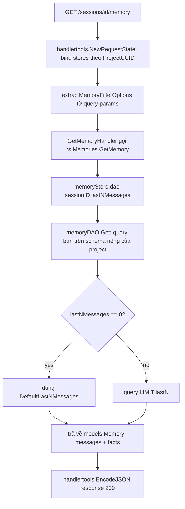
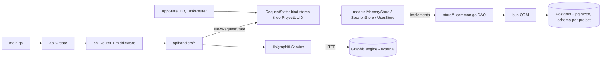

# Báo Cáo Phân Tích — Zep

## Tổng Quan (TL;DR)
Zep từng là một dự án cung cấp "bộ nhớ" dạng đồ thị tri thức cho AI agent, nhưng đã chuyển hướng thành dịch vụ đám mây đóng nguồn và tách phần lõi công nghệ ra một dự án riêng. Phần còn xem được hôm nay chỉ là bản cũ, không còn được duy trì, cho thấy hình ảnh một hệ thống lưu trữ hội thoại/bộ nhớ đã từng chạy thật ở quy mô production trước khi bị khai tử.

## Thông Tin Kỹ Thuật (Technical Overview)
- **Stack:** Go, dùng `chi` router, `bun` ORM (Postgres + pgvector), `zap` logging, `watermill` cho task queue.
- **Quy mô/Độ trưởng thành:** Repo hiện tại là "Zep Cloud: Examples & Integrations" (SDK examples, framework integrations, benchmarks) — không phải engine chính; phần có giá trị phân tích thực sự nằm ở `legacy/src/`, mã nguồn Zep Community Edition đã deprecated, không còn maintain, ~7.9K LOC, 0 file test còn sót lại — cảnh báo rõ về maturity thấp của phần này dù pattern code khá sạch.

## Luồng Chính (Main Flow)
Luồng "get memory cho 1 session" — từ HTTP request đến response, minh hoạ cách `RequestState` bind store và cách gọi song song Postgres store + Graphiti service:

## Tính Năng Nổi Bật (Best Features)
1. **Error Taxonomy tập trung, giàu ngữ cảnh (`zerrors` package)**
   - *Là gì:* Mỗi loại lỗi trong hệ thống được đặt tên rõ ràng và mang theo ngữ cảnh cụ thể (thay vì chỉ là một thông báo lỗi chung chung), giúp phần trả kết quả cho người dùng biết chính xác nên báo lỗi gì.
   - *Cách triển khai:* Mỗi loại lỗi domain (`NotFoundError`, `BadRequestError`, `UnauthorizedError`, `SessionEndedError`, `AdvisoryLockError`, `CustomMessageInternalError`...) là một struct riêng implement `error` + `Unwrap() error` trỏ về sentinel `Err*` dùng chung. HTTP layer chỉ cần `errors.Is(err, zerrors.ErrNotFound)` để map sang status code — tách hoàn toàn lỗi domain khỏi lỗi HTTP. (`legacy/src/lib/zerrors/errors.go`, `legacy/src/api/handlertools/tools.go:64-81` hàm `HandleErrorRequestState`)
2. **Postgres Advisory Lock làm distributed lock cho ghi đồng thời**
   - *Là gì:* Khi nhiều yêu cầu cùng cố gắng sửa cùng một dữ liệu cùng lúc, hệ thống dùng cơ chế khoá tạm thời của cơ sở dữ liệu để đảm bảo chỉ một yêu cầu được xử lý tại một thời điểm, tránh ghi đè/sai lệch dữ liệu.
   - *Cách triển khai:* `generateLockID` hash key bằng SHA-256 rồi lấy 8 byte đầu làm `uint64`, dùng `pg_try_advisory_lock` kèm `failsafe-go` retry policy (backoff 200ms→30s, tối đa 15 lần) để tránh race khi nhiều request cùng cập nhật metadata một session. (`legacy/src/store/memorystore_common.go:148-205`)
3. **Maximal Marginal Relevance (MMR) tự triển khai cho search đa dạng hoá kết quả**
   - *Là gì:* Khi trả kết quả tìm kiếm, hệ thống không chỉ lấy những kết quả "đúng nhất" mà còn cố tình chọn những kết quả khác nhau, tránh tình trạng cả danh sách kết quả đều gần giống hệt nhau và không mang thêm thông tin gì mới.
   - *Cách triển khai:* Thuật toán MMR (mượn ý tưởng từ LangChain) cân bằng độ liên quan (cosine similarity với query) và độ đa dạng (giảm trùng lặp giữa các kết quả đã chọn) bằng công thức `λ*queryScore - (1-λ)*redundantScore`, dùng thư viện SIMD `viterin/vek` cho cosine similarity vector float32. (`legacy/src/lib/search/mmr.go`)
4. **Multi-tenant qua Postgres schema-per-project**
   - *Là gì:* Dữ liệu của mỗi khách hàng/dự án được tách vật lý riêng biệt trong cơ sở dữ liệu, thay vì trộn chung rồi lọc bằng điều kiện — giảm nguy cơ một dự án vô tình nhìn thấy dữ liệu của dự án khác.
   - *Cách triển khai:* Mọi bảng (`SessionSchema`, `MessageStoreSchema`, `UserSchema`) đều có `BaseSchema{SchemaName, TableName}` và build table name động qua `bun.Ident(pgMessage.GetTableName())` — dữ liệu của mỗi project nằm ở schema Postgres riêng thay vì cột `tenant_id` chung một schema, giảm rủi ro leak chéo tenant ở tầng query. (`legacy/src/store/schema_common.go:18-37`, `legacy/src/store/message_common.go:44-52`)
5. **Interface + Mock song song theo naming convention nhất quán**
   - *Là gì:* Mỗi thành phần phụ trợ của hệ thống (theo dõi, log, thông báo...) được thiết kế theo một khuôn mẫu cố định giúp việc viết test dễ dàng mà không cần công cụ hỗ trợ phức tạp.
   - *Cách triển khai:* Mọi package `lib/*` pluggable (enablement, telemetry, observability, communication) đều có bộ 3 file `service.go` (interface), `service_mock.go` (test double), `<name>_ce.go` (implementation thật cho Community Edition) + singleton `_instance`/`Setup()`/`I()`. Tách biệt interface khỏi implementation rất rõ ràng mà không cần DI framework. (`legacy/src/lib/enablement/service.go`, `legacy/src/lib/graphiti/service_ce.go:91-116`)

## Áp Dụng Cho Auto Code OS (Applied Takeaways — ranked)
1. **Nâng cấp `DomainError` thành taxonomy giàu ngữ cảnh theo kiểu `zerrors`** — What: Zep dùng struct riêng cho từng loại lỗi (`NotFoundError{Resource}`, `AdvisoryLockError{Err}`...) thay vì 1 struct `DomainError{Kind, Msg}` chung chung như hiện tại. Apply: Mở rộng `server/internal/service/errors.go` (hiện chỉ có `DomainError{Kind, Msg}`, 4 sentinel `ErrNotFound/ErrConflict/ErrAuthorization/ErrInvalid`) thêm struct lỗi có field ngữ cảnh (vd `NotFoundError{Resource string}`) để log/observability giàu thông tin hơn mà vẫn giữ `errors.Is` hoạt động qua `Unwrap()`. Impact: M · Effort: L · Risk: L · Est: 1 day.
2. **Postgres advisory lock cho các thao tác ghi đồng thời trên cùng 1 task/step** — What: `pg_try_advisory_lock` + retry backoff tránh 2 worker cùng update 1 record. Apply: `server/internal/orchestrator/` hiện có nhiều nơi update trạng thái task/step đồng thời (cache_workers, agent_watchdog) — nếu chưa dùng row-lock/`SELECT FOR UPDATE`, có thể thêm advisory-lock helper trong `server/internal/repository/` (tương tự `mapError` hiện có trong `repository/errors.go`) cho các thao tác idempotent-update tránh lost update mà không cần transaction dài. Impact: M · Effort: M · Risk: M · Est: 2 days.
3. **Áp dụng MMR cho kết quả tìm kiếm memory/context để tránh trùng lặp** — What: Thuật toán MMR chọn top-k cân bằng relevance/diversity, công thức `λ*relevance - (1-λ)*maxSimilarityToSelected`. Apply: **Đã verify** `MemoryHandler.Search` (`server/internal/handler/memory.go:41`) chỉ gọi thẳng `MemoryService.Search` (`server/internal/service/memory_search.go:21`), và `rrfMerge()` (`memory_search.go:78`) chỉ merge rank giữa BM25/Vector/Graph rồi trả nguyên top-N theo `rrfScore` — **không có bước diversity/dedup nào sau RRF**, nên nếu top-5 kết quả đều gần giống nhau về nội dung (vd 3 memory cùng ghi nhận 1 lỗi tương tự ở 3 thời điểm khác nhau), cả 3 đều lọt vào context injection, tốn token cho thông tin trùng lặp. `grep` xác nhận không có `MMR`/`dedup`/`diversif` trong `server/internal/handler/` hay `server/internal/context/`. Thêm bước MMR re-rank ngay sau `rrfMerge()` trong `memory_search.go` (port thẳng logic từ `lib/search/mmr.go`, ~90 dòng, không phụ thuộc Zep-specific, cần có sẵn embedding vector của từng result để tính similarity-to-selected) sẽ giảm việc nhồi nhiều đoạn context gần giống nhau vào prompt. Impact: M · Effort: L · Risk: L · Est: 1 day.
4. **Convention interface/mock/impl 3-file nhất quán cho các service pluggable** — What: `service.go` + `service_mock.go` + `<name>_ce.go` + singleton `I()`. Apply: Chuẩn hoá các package trong `server/pkg/llm/` (LLM Gateway) và `server/internal/observability/` theo cùng convention (hiện đã có interfaces qua `interfaces.go` ở orchestrator nhưng chưa nhất quán toàn repo) giúp mock hoá dễ hơn khi viết test cho orchestrator mà không cần gọi LLM thật. Impact: L · Effort: M · Risk: L · Est: 2 days.
5. **Schema-per-tenant thay vì cột `tenant_id` cho các workspace nhạy cảm** — What: Zep cô lập dữ liệu multi-project bằng Postgres schema riêng. Apply: Auto Code OS hiện dùng GORM + `pgconn` (thấy trong `server/internal/repository/errors.go`) trên schema chung; nếu roadmap có multi-tenant SaaS, cân nhắc pattern schema-per-organization cho bảng `tasks`/`memories` nhạy cảm nhất thay vì chỉ dựa vào `WHERE org_id = ?` — giảm rủi ro thiếu điều kiện lọc gây leak dữ liệu. Impact: H (nếu multi-tenant) · Effort: H · Risk: M · Est: 1-2 tuần — chỉ nên làm khi đã có yêu cầu tenant isolation rõ ràng, không làm speculative.

## Kiến Trúc (Architecture)
Kiến trúc theo layer cổ điển: `main.go` → `api` (routing/HTTP) → `store` (DAO/Postgres qua `bun`) → `models` (domain structs + interfaces) → `lib/*` (cross-cutting: config, logger, zerrors, pg, search, observability, telemetry, enablement, communication). Điểm đặc biệt: package `models` không chỉ chứa struct dữ liệu mà còn định nghĩa **interface cho store** (`models.MemoryStore`, `models.UserStore`, `models.SessionStore`, `models.TaskRouter`) — đảo ngược dependency direction chuẩn Clean Architecture (interface ở "domain layer" trung tâm, implementation ở `store` phụ thuộc ngược vào `models`). `RequestState`/`AppState` là 2 struct trung tâm được truyền xuyên suốt: `AppState` (khởi tạo 1 lần lúc start, chứa DB connection, TaskRouter) và `RequestState` (khởi tạo mỗi request qua middleware, chứa store instances đã bind theo `ProjectUUID`/`SchemaName` của request đó) — đây là dependency injection thủ công không cần framework. Confidence: High (đọc trực tiếp `main.go`, `api/routes.go`, `models/state.go`, `store/memorystore_common.go`).

### ADR Suy Luận (Inferred ADRs)
| Quyết Định | Bằng Chứng | Lợi Ích | Đánh Đổi | Confidence |
|---|---|---|---|---|
| Tách knowledge-graph engine (Graphiti) ra process riêng, gọi qua HTTP | `lib/graphiti/service_ce.go` chỉ là HTTP client wrapper, không có graph logic | Cho phép viết engine graph bằng Python (dùng được ecosystem NLP/embeddings tốt hơn), scale độc lập | Thêm 1 network hop, phải retry/handle lỗi HTTP giữa Go và Python service | High |
| `bun` ORM thay vì raw SQL hoặc GORM | `go.mod` có `uptrace/bun` + `pgdialect`; `BeforeAppendModel` hooks trong `schema_common.go` | Query builder gần SQL, hỗ trợ tốt Postgres-specific (jsonb, soft-delete `nullzero`) | Ít phổ biến hơn GORM, ít tài liệu | High |
| Postgres schema-per-project thay vì cột tenant_id | `BaseSchema{SchemaName}`, `ModelTableExpr("?.messages", bun.Ident(schemaName))` | Cô lập vật lý mạnh, dễ backup/xoá theo tenant | Số lượng schema tăng theo số project → khó quản lý migration hàng loạt | High |
| Watermill làm task queue nội bộ (không dùng Kafka/RabbitMQ trực tiếp) | `models/tasks_common.go` dùng `watermill/message`; `logger.go` có `watermillLogger` adapter | Trừu tượng hoá pub/sub, dễ đổi backend (in-memory/Kafka/GCP PubSub) | Thêm 1 lớp abstraction, phải viết adapter logger riêng | Medium |
| Naming convention `_common.go` / `_ce.go` xuyên suốt codebase | Áp dụng nhất quán ở `models/`, `store/`, `lib/*` | Ngụ ý từng có kiến trúc build-tag tách Cloud/Community Edition (dù hiện không còn `//go:build` tag) | Legacy naming gây khó hiểu cho người đọc mới không biết lịch sử | Medium |

## Design Patterns & Chất Lượng Code
- **Repository/DAO pattern rõ ràng**: `store` package chia nhỏ theo domain (`memoryStore`, `messageDAO`, `sessionStore`, `userStore`), mỗi DAO nhận `as *models.AppState, rs *models.RequestState` qua constructor — không có global state ẩn ngoài 2 singleton hợp lý (`config`, `logger`). (`legacy/src/store/memorystore_common.go:22-40`)
- **Functional Options cho filter phức tạp**: `GetMemory(ctx, sessionID, lastN, opts ...models.MemoryFilterOption)` — mở rộng filter mà không phá vỡ signature cũ. (`legacy/src/store/memorystore_common.go:71-82`)
- **Generic helpers cho query params**: `IntFromQuery[T ~int | ~int32 | int64]`, `FloatFromQuery[T ~float32 | ~float64]` dùng Go generics với type constraint để tránh lặp code parse 3 kiểu số. (`legacy/src/api/handlertools/tools.go:113-165`)
- **Swagger annotations trực tiếp trên handler** (`@Summary`, `@Router`...) giúp generate OpenAPI spec tự động từ code thay vì maintain file YAML riêng — nhưng làm hàm handler dài hơn vì comment chiếm nhiều dòng. (`legacy/src/api/apihandlers/user_handlers.go:19-33`)
- **Điểm yếu**: một số hàm store dài (`message_common.go` 546 dòng, `userstore_common.go` 432 dòng) — nhiều method trên cùng 1 file thay vì tách theo hành vi (Create/Read/Update/Delete riêng file), là smell nhẹ về God File dù logic từng hàm vẫn ngắn gọn.
- **Điểm yếu 2**: **0 file `_test.go`** trong toàn bộ `legacy/src` — không có unit test nào còn sót lại (có thể bị xoá khi archive code), khiến không thể đánh giá test coverage thực tế, chỉ đọc được qua code tĩnh.

## Kỹ Thuật Thú Vị & Thực Hành Kỹ Thuật
- **Graceful shutdown có thứ tự tường minh**: comment trong `main.go:50-56` giải thích rõ lý do thứ tự shutdown (server → task router → ancillary services → DB → observability cuối cùng để capture lỗi shutdown). Đây là tài liệu hoá quyết định vận hành ngay tại chỗ code, tránh future-regression khi ai đó đổi thứ tự vô tình.
- **Structured logging nhất quán qua `zap.SugaredLogger`** với helper toàn cục (`logger.Info(msg, "key", val)`), và `watermillLogger` adapter implement interface `watermill.LoggerAdapter` để queue logs đi qua cùng 1 sink. (`legacy/src/lib/logger/logger.go`)
- **Config loading fail-fast bằng nil pointer panic**: `var _loaded *Config` — cố tình để `nil` trước khi `Load()`, mọi getter (`Http()`, `Postgres()`...) sẽ panic nếu gọi trước khi load xong, biến lỗi cấu hình "quên load" thành crash ngay lập tức thay vì bug ẩn runtime. (`legacy/src/lib/config/config.go:8-17`)
- **DB integrity error mapping**: `zerrors.CheckForIntegrityViolationError` dùng `errors.As` bắt `pgdriver.Error`, kiểm tra `IntegrityViolation()` để phân biệt lỗi trùng khoá (trả `BadRequestError` thân thiện) với lỗi hệ thống khác (wrap nguyên trạng). (`legacy/src/lib/zerrors/storage.go:51-57`)
- **Migration với `embed.FS` + advisory lock của chính `bun/migrate`**: SQL migration file được embed trực tiếp vào binary (`//go:embed *.sql`), migrator tự lock/unlock qua Postgres, có rollback tự động khi migrate fail giữa chừng kèm `panic` có chủ đích (chấp nhận crash khi migration thất bại vì đây là lỗi cần con người can thiệp). (`legacy/src/store/migrations/migrate.go`)
- **Security/Auth**: middleware tách biệt `SecretKeyAuthMiddleware` so với public token, dùng `context.WithValue` với type riêng `ZepContextKey` (không dùng string thô làm context key — tránh key collision). (`legacy/src/api/middleware/`)

## Engineering Gems
1. `legacy/src/lib/zerrors/errors.go` — Vấn đề: Map lỗi domain sang HTTP status code mà không làm rối logic nghiệp vụ với `net/http`. · Cách làm phổ biến (yếu hơn): dùng `if err.Error() == "not found"` so sánh string, hoặc trả trực tiếp `http.Error` từ tầng service. · Vì sao elegant: mỗi loại lỗi là 1 struct nhỏ implement `Unwrap()` trỏ về sentinel dùng chung — cho phép `errors.Is()` hoạt động dù đã wrap nhiều lớp, đồng thời struct có thể mang thêm field ngữ cảnh (`Resource`, `Message`) mà không phá vỡ contract. · Đánh đổi: phải định nghĩa 2 thực thể cho mỗi loại lỗi (sentinel `var Err* = errors.New(...)` + struct) — hơi verbose so với 1 enum đơn giản. · Bài học rút ra: sentinel + struct kết hợp `Unwrap()` là pattern Go idiomatic nhất cho error taxonomy có ngữ cảnh, tốt hơn nhiều so với `DomainError{Kind, Msg}` generic hiện tại của Auto Code OS.
2. `legacy/src/store/memorystore_common.go:148-205` (`safelyAcquireMetadataLock`, `tryAcquireAdvisoryLock`) — Vấn đề: nhiều goroutine/instance cùng cập nhật metadata 1 session gây race condition mà không muốn giữ transaction lock lâu. · Cách làm phổ biến (yếu hơn): `SELECT ... FOR UPDATE` giữ transaction mở suốt thời gian xử lý, dễ gây deadlock/timeout khi xử lý chậm. · Vì sao elegant: advisory lock là lock cấp session Postgres, không gắn với transaction/row cụ thể, giải phóng ngay khi xong việc, kết hợp `failsafe-go` retry với backoff thay vì busy-loop. · Đánh đổi: advisory lock không tự động release nếu connection bị kill bất thường (rely on Postgres tự dọn theo session), và lock ID là hash nên về lý thuyết có xác suất (rất nhỏ) collision giữa 2 key khác nhau. · Bài học rút ra: dùng advisory lock cho các thao tác "critical section ngắn, tần suất cao" thay vì transaction lock khi không cần ACID đầy đủ.
3. `legacy/src/lib/search/mmr.go` — Vấn đề: kết quả search vector similarity thuần dễ trả về nhiều đoạn nội dung gần giống nhau (redundant), lãng phí context window của LLM. · Cách làm phổ biến (yếu hơn): chỉ `ORDER BY cosine_similarity DESC LIMIT k` — không cân nhắc độ đa dạng. · Vì sao elegant: MMR chọn từng phần tử một cách tham lam (greedy), tại mỗi bước cân bằng giữa "gần query" và "khác các phần tử đã chọn" bằng 1 tham số `lambdaMult` duy nhất — dễ tune, dễ hiểu, không cần model ML riêng. · Đánh đổi: độ phức tạp O(k²·n) do tính lại similarity-to-selected mỗi vòng lặp — chấp nhận được với k, n nhỏ (top-N kết quả search) nhưng không scale cho re-rank hàng nghìn item. · Bài học rút ra: thuật toán 90 dòng, không phụ thuộc gì Zep-specific, có thể port thẳng vào bất kỳ hệ thống RAG/memory-retrieval nào cần giảm trùng lặp.

## Top 10 Điều Đáng Học
| # | Khái Niệm | File | Vì Sao Hữu Ích | Độ Khó | Thứ Tự |
|---|---|---|---|---|---|
| 1 | Error taxonomy sentinel + struct + `Unwrap()` | `lib/zerrors/errors.go` | Map lỗi domain → HTTP status mà không so sánh string | ⭐⭐ | 1 |
| 2 | Generic query-param helpers (`IntFromQuery[T]`) | `api/handlertools/tools.go` | Giảm lặp code parse query string đa kiểu | ⭐ | 2 |
| 3 | `AppState`/`RequestState` DI thủ công | `models/state.go`, `store/memorystore_common.go` | DI không cần framework, scope theo request rõ ràng | ⭐⭐ | 3 |
| 4 | Postgres advisory lock + retry backoff | `store/memorystore_common.go:148-205` | Xử lý concurrent write nhẹ hơn transaction lock | ⭐⭐⭐ | 4 |
| 5 | MMR re-ranking cho search | `lib/search/mmr.go` | Giảm redundancy trong kết quả retrieval | ⭐⭐⭐ | 5 |
| 6 | Config fail-fast qua nil pointer panic | `lib/config/config.go` | Bug "quên load config" thành crash tức thì thay vì lỗi ẩn | ⭐ | 6 |
| 7 | Schema-per-project multi-tenancy với `bun.Ident` | `store/schema_common.go`, `store/message_common.go` | Cô lập tenant vật lý ở tầng DB | ⭐⭐⭐⭐ | 7 |
| 8 | Interface-in-domain-layer (`models.MemoryStore`) | `models/memorystore_common.go` | Đảo dependency: domain định nghĩa contract, store implement | ⭐⭐⭐ | 8 |
| 9 | Graceful shutdown có thứ tự tường minh + comment lý do | `main.go:41-80` | Tránh regression khi refactor shutdown logic | ⭐ | 9 |
| 10 | `embed.FS` cho SQL migration + advisory lock migrator | `store/migrations/migrate.go` | Migration đóng gói trong binary, an toàn khi chạy đa instance | ⭐⭐ | 10 |

## Hướng Dẫn Đọc (Reading Guide)
**L0 Build & Run:** `legacy/src/go.mod`, `legacy/src/main.go` (entrypoint 80 dòng, rất ngắn, dễ đọc trước).
**L1 Entry Points:** `legacy/src/api/routes.go` (định nghĩa toàn bộ route tree qua `setupSessionRoutes`/`setupUserRoutes`/`setupFactRoutes`), `legacy/src/api/apihandlers/memory_handlers_common.go`.
**L2 Core Abstractions:** `legacy/src/models/state.go` (AppState/RequestState), `legacy/src/models/memorystore_common.go` (interface `MemoryStore`), `legacy/src/lib/zerrors/errors.go`.
**L3 Architecture Glue:** `legacy/src/store/memorystore_common.go` (DAO factory + advisory lock), `legacy/src/store/schema_common.go` (bun schema + multi-tenant), `legacy/src/lib/pg/db.go` (kết nối Postgres + pgvector).
**L4 Engineering Gems:** `legacy/src/lib/search/mmr.go`, `legacy/src/store/migrations/migrate.go`, `legacy/src/lib/graphiti/service_ce.go` (singleton pattern + HTTP client tới engine ngoài).
**L5 Reimplement:** Thử tự viết lại `MaximalMarginalRelevance` (mmr.go) từ đầu chỉ nhìn docstring, rồi so sánh; thử thiết kế 1 error taxonomy tương tự `zerrors` cho 1 domain nhỏ trong Auto Code OS.

## Anti-Patterns & Không Nên Copy
1. **Singleton toàn cục cho mọi service (`_instance` + `Setup()` + `I()`)**: tiện cho code nhỏ nhưng gây khó test song song (không thể có 2 instance độc lập trong cùng process), và ẩn dependency thực sự của hàm (không thấy trong signature). Với Auto Code OS đã có pattern constructor injection rõ ràng hơn (`NewMemoryHandler(memorySvc)` ở `server/internal/handler/memory.go`) — nên giữ nguyên hướng đó, không nên lùi về singleton toàn cục dù Zep làm vậy.
2. **0 test còn lại trong `legacy/src`**: dù kiến trúc sạch, việc archive code Community Edition không giữ test khiến không ai dám sửa nó nữa (chính là lý do nó bị deprecated). Bài học: kiến trúc đẹp không cứu được 1 codebase nếu thiếu test an toàn để refactor — không nên coi nhẹ test khi archive/handoff code.
3. **Gọi HTTP đồng bộ tới Graphiti service ngay trong request path** (`lib/graphiti/service_ce.go`): `PutMemory` gọi HTTP tới service ngoài trong lúc xử lý request — nếu Graphiti chậm/down, toàn bộ request bị block (dù có retry qua `httputil.NewRetryableHTTPClient`). Auto Code OS nên ưu tiên pattern queue/async (đã có `orchestrator/queue.go`) cho các thao tác ghi memory không cần real-time, thay vì gọi đồng bộ.
4. **Naming convention `_common.go`/`_ce.go` không còn ý nghĩa build-tag thực sự**: gây nhầm lẫn cho người đọc mới tưởng có `//go:build` tag phía sau nhưng thực ra không có — là di sản lịch sử. Bài học: khi archive/refactor, nên dọn dẹp naming convention không còn phản ánh đúng cấu trúc build.

## Câu Hỏi Đáng Suy Ngẫm
- Nếu Auto Code OS scale tới nhiều tenant/organization, schema-per-tenant của Zep có đáng đánh đổi so với chi phí vận hành hàng nghìn schema Postgres (migration, backup, connection pool per schema) hay không, hay cột `org_id` + row-level security (RLS) của Postgres là lựa chọn cân bằng hơn?
- Việc tách engine "graph/memory" (Graphiti) ra process Python riêng, giao tiếp qua HTTP, có phải là hướng đúng nếu Auto Code OS muốn thêm khả năng "học từ lịch sử task" (`server/internal/orchestrator/learning/`) — hay nên giữ trong cùng process Go để tránh thêm network hop và độ trễ?
- Advisory lock giải quyết race condition ở tầng ứng dụng khá tốt cho single-Postgres-instance, nhưng liệu có đủ khi Auto Code OS scale ra nhiều Postgres read-replica/connection pooler (PgBouncer transaction mode không giữ session state) — advisory lock có còn hoạt động đúng không?

## Đánh Giá Tổng Thể
| Architecture | Maintainability | Scalability | Clean Code | Learning Value |
|---|---|---|---|---|
| 8/10 | 5/10 (deprecated, 0 test) | 7/10 | 7/10 | 8/10 |

## Lộ Trình Học Tập
- **Tuần 1 (đọc & hiểu)**: Đọc `main.go` → `api/routes.go` → `models/state.go` → 1 handler đầy đủ (`memory_handlers_common.go`) để nắm luồng request end-to-end. Đối chiếu song song với `server/internal/handler/memory.go` và `server/internal/service/errors.go` của Auto Code OS để thấy khác biệt.
- **Tuần 2 (đào sâu store layer)**: Đọc `store/memorystore_common.go`, `store/message_common.go`, `store/schema_common.go` — hiểu cách bun ORM + schema-per-project hoạt động; note lại các đoạn có thể áp dụng vào `server/internal/repository/`.
- **Tuần 3 (reimplement engineering gems)**: Tự viết lại `zerrors` taxonomy (mở rộng `server/internal/service/errors.go`) và port `MaximalMarginalRelevance` (mmr.go) vào 1 nhánh thử nghiệm cho `server/internal/context/` hoặc `handler/memory.go`, viết test cho cả 2 (điều mà bản gốc Zep legacy thiếu).
- **Tuần 4 (đánh giá & quyết định)**: Viết ADR nội bộ quyết định có áp dụng advisory-lock pattern cho orchestrator concurrency hay không, dựa trên câu hỏi ở mục "Câu Hỏi Đáng Suy Ngẫm" — chỉ triển khai nếu có bằng chứng race condition thực tế trong `orchestrator/cache_workers.go` hoặc `agent_watchdog.go`.
