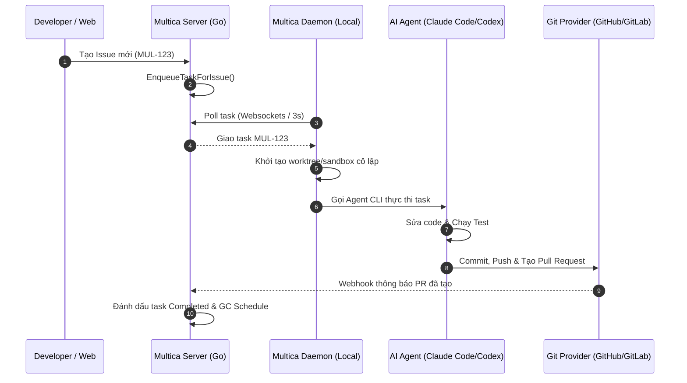

# 🛠️ Multica: Nền Tảng Điều Phối Multi-Agent Tự Vận Hành

## 🌟 Điểm Sáng & Tính Năng Hay Nhất (Best Features)

*   **Daemon & CLI Chạy Ngầm Tiện Lợi:** Multica thiết kế một background daemon chạy ngầm cục bộ trên máy tính của developer. Daemon này tự động quét và đăng ký các AI CLI cài sẵn trên máy (Claude Code, Cursor, Codex, OpenClaw...) lên server trung tâm.
*   **Hàng Đợi Task Kháng Race-Condition:** Xử lý việc qua một websocket queue kết hợp DB state. Khi có issue mới, server tạo task, daemon gọi hàm `ClaimTask` kiểm tra xem task đã có ai nhận chưa. Cơ chế này đảm bảo không có 2 agent cùng nhảy vào sửa một issue.
*   **Git Integration Đóng Gói Sẵn:** Tự động tạo branch mới theo format issue key (vd: `mul-123-fix-login`), commit, push, và tạo PR tự động khi task hoàn thành.

---

## 🧠 Bài Học & Cải Tiến Cho Auto Code OS (Takeaways & Improvements)

1.  **Dọn Dẹp Workspace Tự Động (Workspace GC):** 
    *   *Chi tiết:* Multica có cơ chế Garbage Collection cực hay. Nó tự động dọn dẹp các worktree hoặc sandbox của task đã `done`/`cancelled` sau một khoảng thời gian (GC TTL). Đặc biệt nó có chế độ "chỉ xóa thư mục nặng" (`node_modules`, `.next`, `.turbo`) của các task hoàn thành nhưng issue chưa đóng, giữ lại source và `.git` để agent có thể tiếp tục làm việc nhanh chóng khi cần.
    *   *Áp dụng:* Cần triển khai một Go routine `Pruner` tương tự trong backend của Auto Code OS để dọn dẹp các Docker sandbox container và Git worktree rác.
2.  **Đăng Ký Agent Tiện Lợi:** 
    *   *Chi tiết:* Tự động quét `PATH` tìm kiếm các binary AI.
    *   *Áp dụng:* Auto Code OS có thể bổ sung API phát hiện nhanh môi trường chạy hiện tại hỗ trợ các tool AI nào trên host machine.

---

## 🏗️ Kiến Trúc & Các File Quan Trọng (Architecture & Key Paths)

*   `server/internal/service/task.go`: Logic quản lý trạng thái task, phân phối công việc và cơ chế `ClaimTask`.
*   `CLI_AND_DAEMON.md`: Bản thiết kế chi tiết cho CLI và Daemon, bao gồm cơ chế kết nối qua Websockets và chu kỳ dọn dẹp GC.
*   `server/internal/repository/`: Tích hợp các câu lệnh lưu trữ trạng thái bằng PostgreSQL kết hợp `pgvector` phục vụ memory tracking.

---

## 🔄 Luồng Hoạt Động (Main Flow)

