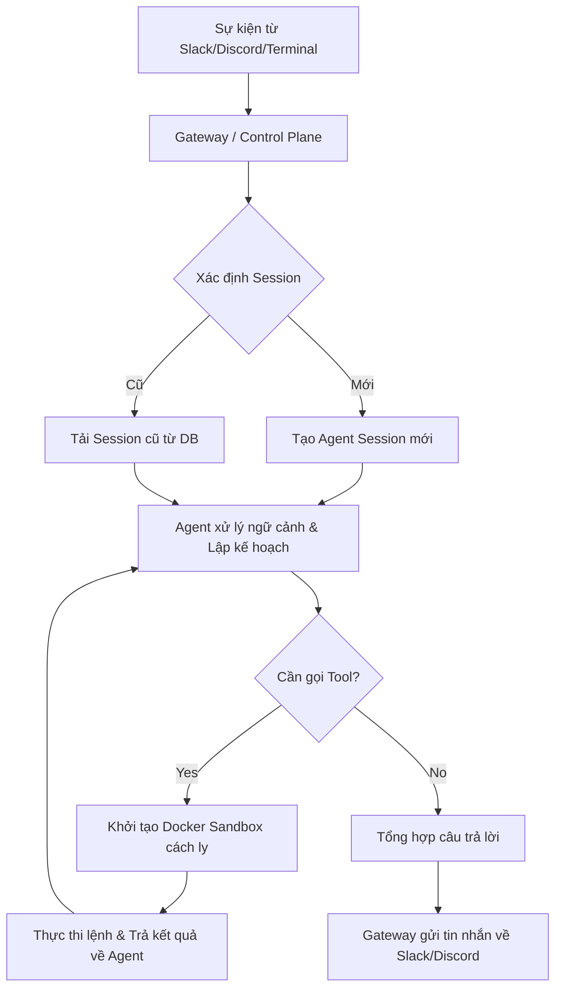

# 🚦 OpenClaw: Local-First AI Assistant Gateway

## 🌟 Điểm Sáng & Tính Năng Hay Nhất (Best Features)

*   **Kiến Trúc Control Plane Local-First:** OpenClaw đóng vai trò như một gateway tổng quản lý các phiên làm việc (agent sessions), các kênh giao tiếp đa dạng, các công cụ chạy ngầm và log sự kiện.
*   **Sandboxing An Toàn Tuyệt Đối:** Điểm đắt giá nhất của OpenClaw là cơ chế thực thi công cụ trong môi trường cách ly (Sandboxes). Agent không bao giờ được chạy code trực tiếp trên host machine mà phải đi qua Docker Sandbox, SSH hoặc OpenShell được thiết lập giới hạn tài nguyên và phân quyền.
*   **Multi-Channel Inbox:** Định tuyến tin nhắn thời gian thực từ các webhook/API của Slack, Discord, Telegram thẳng vào Context của Agent và trả lời ngược lại kênh tương ứng.

---

## 🧠 Bài Học & Cải Tiến Cho Auto Code OS (Takeaways & Improvements)

1.  **Thiết Kế Docker Sandbox Phân Quyền:**
    *   *Chi tiết:* OpenClaw quản lý quyền chạy lệnh của Agent cực kỳ chặt chẽ (chỉ đọc, ghi có chọn lọc, cấm truy cập mạng bên ngoài khi không cần thiết).
    *   *Áp dụng:* Auto Code OS hiện tại đang chạy các lệnh test/build trong Docker container. Cần củng cố thêm lớp bảo mật này, bổ sung các rule chặn các lệnh nguy hiểm (ví dụ: `rm -rf /`, `curl` tải script lạ chạy root) trước khi gửi vào Sandbox thực thi.
2.  **Giao Thức Định Nghĩa Skills/Tools Thống Nhất:**
    *   *Chi tiết:* Cấu trúc file cấu hình của công cụ dạng JSON Schema rõ ràng để Agent dễ dàng parse và gọi đúng.

---

## 🏗️ Kiến Trúc & Các File Quan Trọng (Architecture & Key Paths)

*   `packages/core/`: Nhân xử lý chính của control plane, định tuyến sự kiện và quản lý vòng đời sandbox.
*   `extensions/`: Thư mục chứa các module mở rộng, kết nối cổng trò chuyện (Slack, Discord, Telegram).
*   `skills/`: Nơi khai báo và cấu hình các kỹ năng (Tools) để Agent đọc hiểu.

---

## 🔄 Luồng Hoạt Động (Main Flow)

