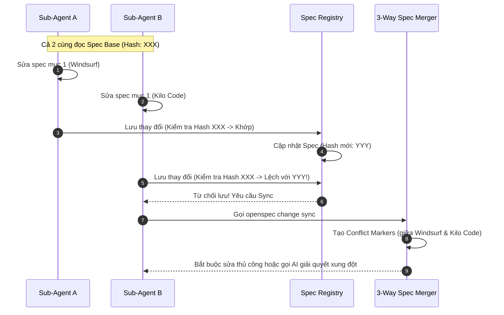

# 📝 OpenSpec: Đặc Tả Phát Triển Phần Mềm Song Song

## 🌟 Điểm Sáng & Tính Năng Hay Nhất (Best Features)

*   **Spec-driven Development (Phát triển theo đặc tả):** Quy định nghiêm ngặt việc phân rã yêu cầu của người dùng thành các cấu trúc Spec được xác thực chặt chẽ bằng JSON Schema trước khi đưa cho agent code.
*   **3-Way Spec Merge (Hợp nhất Đặc tả 3 chiều):** Khi nhiều agent cùng chạy song song và cập nhật spec, hệ thống sử dụng fingerprint hash của các requirement block để kiểm tra xem spec gốc có bị thay đổi/diverge hay không. Nếu có xung đột, hệ thống chặn lại và thực thi lệnh `openspec change sync` để merge 3 chiều (3-way merge) tương tự Git, viết các conflict markers để con người hoặc AI sửa lại.

---

## 🧠 Bài Học & Cải Tiến Cho Auto Code OS (Takeaways & Improvements)

1.  **Chống Ghi Đè Bản Thiết Kế (Spec Integrity):**
    *   *Chi tiết:* Khi Auto Code OS điều phối nhiều sub-agent code song song trên cùng một codebase, các file spec/design rất dễ bị ghi đè chéo làm mất thông tin.
    *   *Áp dụng:* Thêm cơ chế lưu trữ mã Hash (Fingerprint) của từng mục tiêu (Goal/Requirement) khi bắt đầu chạy Task. Khi nộp bài (Delivery), so sánh hash hiện tại trên DB với hash lúc bắt đầu. Nếu lệch, kích hoạt luồng Reviewer để tự động Rebase/Merge các thay đổi thay vì ghi đè thô bạo.
2.  **Sử Dụng JSON Schema Validate Đầu Ra:**
    *   *Chi tiết:* Mọi output của Agent đều được validate cấu trúc bằng schema.

---

## 🏗️ Kiến Trúc & Các File Quan Trọng (Architecture & Key Paths)

*   `openspec-parallel-merge-plan.md`: Tài liệu thiết kế xử lý xung đột spec khi chạy song song.
*   `src/core/archive.ts`: Logic nén, lưu trữ và thay thế các requirement blocks trong spec gốc.
*   `schemas/`: Nơi chứa toàn bộ cấu trúc định dạng JSON Schema của spec.

---

## 🔄 Luồng Hoạt Động (Main Flow)

---

## 📁 Hướng Dẫn Phân Rã và Tạo Một Bộ Spec Chuẩn OpenSpec

Một bộ đặc tả kỹ thuật chuẩn trong Auto Code OS được tổ chức theo cấu trúc phân rã thành **4 tài liệu cốt lõi** nằm trong một thư mục con dưới `docs/openspecs/<tên-tác-vụ>/`:

### 1. `proposal.md` (Đề xuất giải pháp)
*   **Mục đích**: Làm rõ bối cảnh, lý do cần triển khai tác vụ và phạm vi tác động tổng quan.
*   **Cấu trúc bắt buộc**:
    *   **Why**: Lý do cần thực hiện tác vụ (dựa trên vết lỗi thực tế, log trace cụ thể).
    *   **What Changes**: Mô tả chi tiết những gì sẽ thay đổi, chia theo từng vấn đề (Issue).
    *   **Capabilities**: Các tính năng mới (`New Capabilities`), sửa đổi (`Modified Capabilities`), hoặc loại bỏ (`Removed Capabilities`).
    *   **Impact**: Bảng thống kê các file bị tác động (`Area | Files Affected`).

### 2. `specs.md` (Đặc tả chi tiết các Requirement)
*   **Mục đích**: Định nghĩa cụ thể các kịch bản hành vi mong muốn dưới dạng kịch bản kiểm thử (Gherkin-style).
*   **Cấu trúc bắt buộc**:
    *   **Requirements (Added/Modified/Removed)**: Các yêu cầu cụ thể.
    *   **Scenario**: Định dạng `WHEN ... THEN ...` (và `AND ...`) để kiểm thử tính chính xác.
    *   **Trạng thái triển khai**: Đánh dấu bằng icon:
        *   `✅` (Đã hoàn thành)
        *   `⚠️` (Đang triển khai hoặc cần bổ sung)
        *   `❌` (Chưa triển khai)

### 3. `design.md` (Bản thiết kế kỹ thuật)
*   **Mục đích**: Bản thiết kế chi tiết về luồng hoạt động, cấu trúc dữ liệu, và API.
*   **Cấu trúc bắt buộc**:
    *   **Architecture Diagram**: Diagram luồng đi bằng Mermaid.
    *   **Data Models & API**: Định nghĩa cấu trúc JSON/YAML Schema, struct Go, hoặc API Endpoint mới.
    *   **Security & Execution Boundaries**: Phạm vi truy cập của các Agent trong sandbox (quyền đọc/ghi file).
    *   **Risk Mitigation**: Bản đánh giá rủi ro và các phương án xử lý tương ứng.

### 4. `tasks.md` (Danh sách đầu việc thực thi)
*   **Mục đích**: Chia nhỏ công việc thành các Task con có độ ưu tiên rõ ràng (P0, P1, P2, P3) để Coder Agent thực hiện từng bước.
*   **Cấu trúc bắt buộc**:
    *   **Task ID**: Được đánh số logic (ví dụ: `Task 1.1`, `Task 1.2`) liên kết trực tiếp với các kịch bản trong `specs.md`.
    *   **Acceptance Criteria**: Danh sách các tiêu chí chấp nhận cụ thể cho từng đầu việc.
    *   **Checklist**: Danh sách check-box `[ ]` để theo dõi tiến độ.

---

## 🚦 Quy Tắc Thiết Kế Vàng (Golden Rules)
1. **Single Source of Truth (Nguồn chân lý duy nhất)**: OpenSpec phải phản ánh chính xác cấu trúc thực thi thực tế. Agent Coder sẽ ưu tiên đọc Spec hơn là mô tả thô sơ ban đầu để tránh sai lệch context.
2. **Quy tắc Phân rã Song song**: Khi thiết kế các task chạy song song, các subtask phải độc lập về tài nguyên hoặc có luồng truyền context thay đổi file rõ ràng (Task 2.4).
3. **Validation & Security First**: Luôn quy định rõ JSON Schema để tự động validate đầu ra của Agent, đồng thời giới hạn chặt chẽ `execution_boundaries` để tránh lỗi tràn bộ nhớ hoặc rò rỉ bảo mật.

---

## 🔍 Cơ Chế Xác Thực & Bảo Mật Trong Dự Án OpenSpec Gốc (`references/OpenSpec`)

Dự án gốc **OpenSpec** (nằm tại `references/OpenSpec`) là một thư viện/CLI viết bằng **TypeScript** độc lập. Nó quản lý việc xác thực tính hợp lệ của tài liệu Spec thông qua hai tầng chính:

### 1. Xác thực Cấu trúc bằng Zod Schema (`src/core/schemas/`)
*   **`SpecSchema` (`spec.schema.ts`)**: Đảm bảo tài liệu Spec chính có `name`, `overview` (Purpose) và mảng `requirements` chứa ít nhất 1 phần tử.
*   **`RequirementSchema` (`base.schema.ts`)**: Đảm bảo từng requirement có `text` mô tả và danh sách `scenarios` không rỗng.
*   **`ChangeSchema` (`change.schema.ts`)**: Đảm bảo tài liệu Change chứa trường `why` (đáp ứng độ dài quy định), trường `whatChanges`, và danh sách các `deltas` thay đổi từ 1 đến số lượng tối đa cho phép.

### 2. Xác thực Ngữ nghĩa bằng Validator (`src/core/validation/validator.ts`)
*   **Bắt buộc từ khóa SHALL/MUST ở dòng nội dung (Body line)**: 
    *   Mỗi requirement bắt buộc phải chứa từ khóa `SHALL` hoặc `MUST` (viết hoa hoàn toàn, dạng từ độc lập khớp với regex `\b(SHALL|MUST)\b`).
    *   Từ khóa này phải nằm trong phần **thân (body)** của yêu cầu (dòng ngay sau tiêu đề). Nếu từ khóa chỉ xuất hiện ở tiêu đề (`### Requirement: ...`), hệ thống sẽ cảnh báo lỗi cụ thể và yêu cầu dời xuống phần thân.
*   **Kịch bản kiểm thử (Scenario Structure)**:
    *   Mỗi requirement bắt buộc phải đi kèm ít nhất một kịch bản với tiêu đề sử dụng chính xác 4 dấu thăng (`#### Scenario: <tên-kịch-bản>`). Kịch bản phải theo định dạng Gherkin-style (`WHEN ... THEN ...`).
*   **Tính toàn vẹn của Delta (Thay đổi Spec)**:
    *   Với thay đổi loại `ADDED` và `MODIFIED`: Yêu cầu bắt buộc có đầy đủ nội dung mô tả hành vi và kịch bản scenario mẫu.
    *   Với loại `REMOVED`: Chỉ cần khai báo tên requirement và lý do xóa, không cần scenario hay nội dung thân.
    *   **Ngăn chặn xung đột chéo (Cross-section Conflicts)**: Validator sẽ phát hiện và từ chối nếu một requirement vừa được khai báo là `ADDED`/`MODIFIED` vừa nằm trong phần `REMOVED` của cùng một spec file.
    *   Ngăn chặn khai báo trùng lặp tên requirement trong cùng một nhóm thay đổi.

