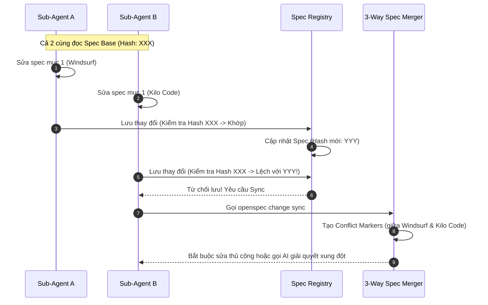

# 📝 OpenSpec: Đặc Tả Phát Triển Phần Mềm Song Song

## 🌟 Điểm Sáng & Tính Năng Hay Nhất (Best Features)

*   **Spec-driven Development (Phát triển theo đặc tả):** Quy định nghiêm ngặt việc phân rã yêu cầu của người dùng thành các cấu trúc Spec được xác thực chặt chẽ bằng JSON Schema trước khi đưa cho agent code.
*   **3-Way Spec Merge (Hợp nhất Đặc tả 3 chiều):** Khi nhiều agent cùng chạy song song và cập nhật spec, hệ thống sử dụng fingerprint hash của các requirement block để kiểm tra xem spec gốc có bị thay đổi/diverge hay không. Nếu có xung đột, hệ thống chặn lại và thực thi lệnh `openspec change sync` để merge 3 chiều (3-way merge) tương tự Git, viết các conflict markers để con người hoặc AI sửa lại.

---

## 🧠 Bài Học & Cải Tiến Cho Auto Code OS (Takeaways & Improvements)

1.  **Chống Ghi Đè Bản Thiết Kế (Spec Integrity):**
    *   *Chi tiết:* Khi Auto Code OS điều phối nhiều sub-agent code song song trên cùng một codebase, các file spec/design rất dễ bị ghi đè chéo làm mất thông tin.
    *   *Áp dụng:* Thêm cơ chế lưu trữ mã Hash (Fingerprint) của từng mục tiêu (Goal/Requirement) khi bắt đầu chạy Task. Khi nộp bài (Delivery), so sánh hash hiện tại trên DB với hash lúc bắt đầu. Nếu lệch, kích hoạt luồng Reviewer để tự động Rebase/Merge các thay đổi thay vì ghi đè thô bạo.
2.  **Sử Dụng JSON Schema Validate Đầu Ra:**
    *   *Chi tiết:* Mọi output của Agent đều được validate cấu trúc bằng schema.

---

## 🏗️ Kiến Trúc & Các File Quan Trọng (Architecture & Key Paths)

*   `openspec-parallel-merge-plan.md`: Tài liệu thiết kế xử lý xung đột spec khi chạy song song.
*   `src/core/archive.ts`: Logic nén, lưu trữ và thay thế các requirement blocks trong spec gốc.
*   `schemas/`: Nơi chứa toàn bộ cấu trúc định dạng JSON Schema của spec.

---

## 🔄 Luồng Hoạt Động (Main Flow)

