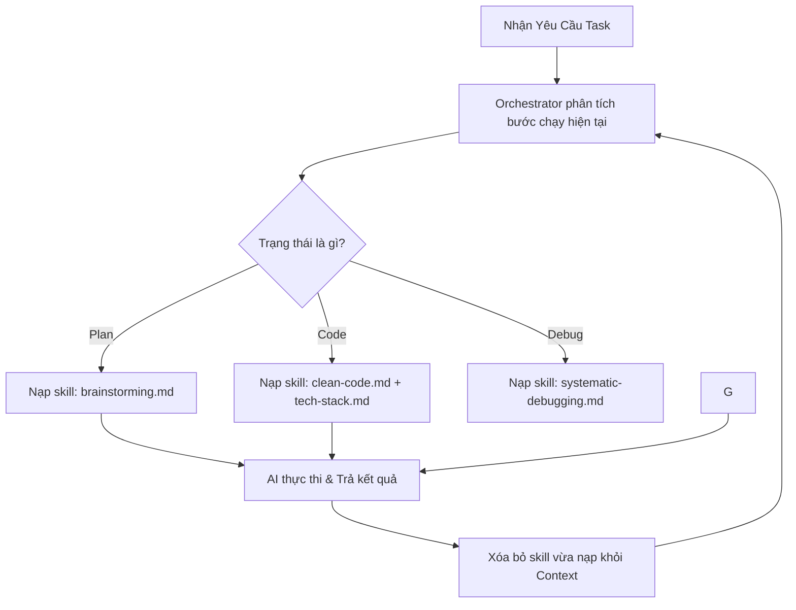

# 🧹 Prompt Base: Bộ Quy Tắc Toàn Cục & Nạp Skill JIT

## 🌟 Điểm Sáng & Tính Năng Hay Nhất (Best Features)

*   **Tối Ưu Ngữ Cảnh Triệt Để (Minimal Viable Context - MVC):** Prompt Base thiết lập cơ chế nạp JIT (Just-In-Time) động cho các kỹ năng của Agent. Các kỹ năng (Skills) chỉ được tải vào context hội thoại của AI khi agent bước vào giai đoạn tương ứng (như debug, code) và được gỡ bỏ (pruned) ngay lập tức khi hoàn thành, ngăn chặn tình trạng phồng token (token bloat).
*   **Quy Tắc Tier 0 Universal Rules (`core/rules.md`):** Các quy tắc tối thượng ép AI luôn viết Code sạch (Clean Code), nhận thức rõ sự phụ thuộc file (File Dependency Awareness) trước khi code, và giữ sự trung thực về mặt trí tuệ (Intellectual Integrity) - buộc AI phải suy nghĩ độc lập và phân tích rủi ro.

---

## 🧠 Bài Học & Cải Tiến Cho Auto Code OS (Takeaways & Improvements)

1.  **Loại Bỏ "Framework Tax" Bằng JIT Skill Loading:**
    *   *Chi tiết:* AI thường bị giảm độ chính xác khi nhồi nhét quá nhiều hướng dẫn kỹ năng vào System Prompt ngay từ đầu.
    *   *Áp dụng:* Thay thế cơ chế tạo prompt tĩnh hiện tại của Auto Code OS bằng một trình dựng prompt động (Dynamic Prompt Builder). Go orchestrator sẽ đọc trạng thái hiện tại của task và chỉ gộp file kỹ năng cần thiết vào prompt.
2.  **Snippet-Only Reading:**
    *   *Chi tiết:* Ràng buộc AI chỉ được đọc khoảng dòng cần thiết (`StartLine`/`EndLine`) thay vì tải toàn bộ file code lớn.
    *   *Áp dụng:* Xây dựng tool đọc file tối ưu trong sandbox để giới hạn số dòng tối đa AI được đọc mỗi lượt gọi.

---

## 🏗️ Kiến Trúc & Các File Quan Trọng (Architecture & Key Paths)

*   `core/rules.md`: Chứa các quy tắc ứng xử toàn cầu Tier 0 (Clean Code, Socratic Gate).
*   `registry.min.json`: Bảng manifest ánh xạ tất cả các file kỹ năng và điều kiện kích hoạt.
*   `GEMINI.md`: Hướng dẫn cấu hình Maestro và progressive disclosure.

---

## 🔄 Luồng Hoạt Động (Main Flow)

