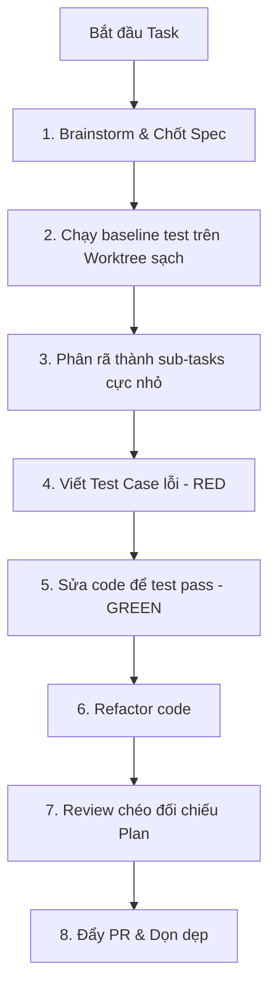

# ⚡ Superpowers: Quy Trình Phát Triển TDD Chuẩn Hóa

## 🌟 Điểm Sáng & Tính Năng Hay Nhất (Best Features)

*   **Quy Trình Chuẩn Hóa Nghiêm Ngặt (Rigid Pipeline):** Ép buộc AI Agent phải tuân thủ đúng 7 bước phát triển, không được nhảy cóc:
    1.  `brainstorming`: Hỏi đáp Socratic Q&A với người dùng để chốt Spec.
    2.  `using-git-worktrees`: Tạo môi trường cô lập, chạy test baseline đảm bảo code cũ không lỗi.
    3.  `writing-plans`: Phân rã spec thành các sub-task cực nhỏ.
    4.  `subagent-driven-development`: Giao việc cho các agent con.
    5.  `test-driven-development`: Cưỡng chế RED-GREEN-REFACTOR.
    6.  `requesting-code-review`: Review nội bộ đối chiếu với plan.
    7.  `finishing-a-development-branch`: Đẩy PR và dọn dẹp.
*   **Cưỡng Chế Test-Driven Development (TDD):** Agent BẮT BUỘC phải viết test case lỗi trước (RED), sau đó mới được sửa code cho test pass (GREEN), rồi mới tiến hành refactor. Nếu agent sửa code trước khi viết test, hệ thống sẽ phát hiện và xóa code bắt làm lại.
*   **Skill Plugins Dưới Dạng Markdown:** Thay vì viết code logic điều phối phức tạp, các skill được định nghĩa hoàn toàn bằng Markdown (prompt rules), giúp chúng dễ dàng di động và chạy trên bất kỳ LLM nào.

---

## 🧠 Bài Học & Cải Tiến Cho Auto Code OS (Takeaways & Improvements)

1.  **Cưỡng Chế Viết Test Trước Khi Sửa Code (TDD):**
    *   *Chi tiết:* AI thường lười viết test hoặc chỉ viết test sau khi viết code, dẫn đến chất lượng test kém.
    *   *Áp dụng:* Bổ sung Quality Gate trong Auto Code OS: Khi Agent bắt đầu sửa code, hệ thống yêu cầu Agent tạo test file trước. Hệ thống chạy thử test file này, nếu không fail (hoặc không có test mới), hệ thống sẽ từ chối bước tiếp theo.
2.  **Baseline Test Checking:**
    *   *Chi tiết:* Đảm bảo test suite đang pass hoàn toàn trước khi AI sửa code để tránh đổ lỗi oan cho AI khi test gốc vốn đã lỗi.
    *   *Áp dụng:* Chạy test toàn bộ dự án ở trạng thái clean trước khi cho Agent sửa code.

---

## 🏗️ Kiến Trúc & Các File Quan Trọng (Architecture & Key Paths)

*   `skills/tdd-workflow/SKILL.md`: Playbook cưỡng chế quy trình RED-GREEN-REFACTOR.
*   `skills/systematic-debugging/SKILL.md`: Playbook hướng dẫn tìm lỗi có hệ thống.
*   `README.md`: Triết lý thiết kế cưỡng chế đường ray hành vi cho AI.

---

## 🔄 Luồng Hoạt Động (Main Flow)

