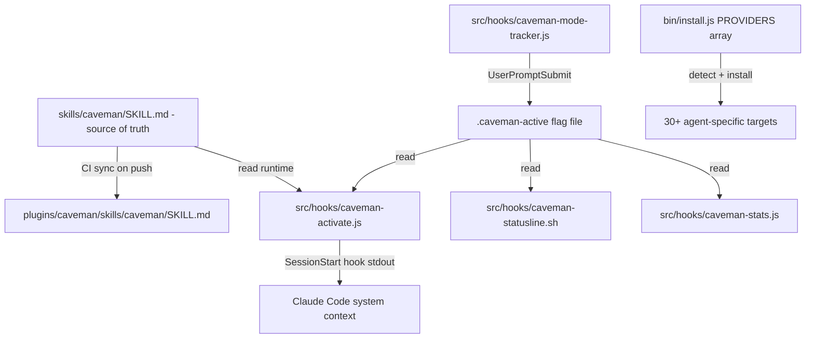

# Báo Cáo Phân Tích — Caveman

## Tổng Quan
Skill/plugin cho AI coding agent (Claude Code, Codex, Gemini CLI, Cursor, Windsurf, Cline, Copilot, 30+ agents khác) khiến agent trả lời theo văn phong "caveman" (tối giản, bỏ mạo từ/filler/hedging) — giảm trung bình **65% output tokens** (đo thật qua Claude API, 10 prompts, dao động 22–87%), giữ nguyên độ chính xác kỹ thuật. Toàn bộ cơ chế nằm ở **prompt engineering** (nội dung `SKILL.md`) cộng một lớp hook Node.js nhỏ để bật/tắt mode, không có mô hình ML hay thuật toán nén phức tạp nào. Stack: Node.js (hooks/installer) + Python 3.10+ (`caveman-compress` script) + Markdown (skill prompts). Quy mô nhỏ (~3.8k dòng JS cho hooks+installer, skill files vài chục dòng mỗi cái), nhưng cực kỳ trưởng thành về vận hành: security hardening (symlink-safe file I/O), CI sync, eval harness 3-arm, tài liệu "Honest Numbers" thẳng thắn về khi nào kỹ thuật này *lỗ* token.

## Tính Năng Nổi Bật (Best Features)
1. **Compression bằng prompt rule thuần túy, không cần code nén** — Toàn bộ giảm token dựa vào một tập luật ngôn ngữ trong `skills/caveman/SKILL.md` (drop mạo từ, filler, pleasantries, hedging; câu rời rạc "fragments OK"; giữ nguyên code/lệnh/error message). Không finetune, không thuật toán, chỉ system-prompt injection. Đo được 65% giảm output token trung bình, có bộ benchmark thật trong `benchmarks/` và `evals/` (không phải số tự bịa). File: `skills/caveman/SKILL.md:11-30`.
2. **6 mức cường độ (intensity levels) chọn được runtime** — `lite / full / ultra / wenyan-lite / wenyan-full / wenyan-ultra`, mode "wenyan" dùng văn ngôn cổ Trung Quốc vì mật độ ngữ nghĩa/token cao nhất trong các ngôn ngữ tự nhiên hiện có. Người dùng đổi mode bằng `/caveman <level>`, mode "dính" (persist) tới hết session hoặc user đổi tay. File: `skills/caveman/SKILL.md:32-56`.
3. **Auto-Clarity guard-rail** — Tự động rời khỏi caveman-mode khi gặp: security warning, xác nhận hành động không thể hoàn tác (destructive op), chuỗi multi-step dễ hiểu nhầm do thiếu liên từ, hoặc user hỏi lại vì không hiểu. Đây là cơ chế an toàn quan trọng nhất của kỹ thuật nén output — tránh nén quá đà gây hiểu sai lệnh nguy hiểm. File: `skills/caveman/SKILL.md:58-74`.
4. **Symlink-safe flag I/O layer** — Toàn bộ state (mode hiện tại, lịch sử session, thống kê) được ghi qua `safeWriteFlag()`/`readFlag()`/`appendFlag()` trong `src/hooks/caveman-config.js:112-300`: mở file bằng `O_NOFOLLOW`, ghi atomic (temp + rename), cap kích thước đọc (`MAX_FLAG_BYTES = 64`), whitelist giá trị hợp lệ (`VALID_MODES`), kiểm tra ownership khi parent dir là symlink. Chống local attacker thay flag file bằng symlink trỏ tới `~/.ssh/id_rsa` để exfiltrate secret qua statusline/hook output.
5. **`caveman-shrink` — MCP middleware nén mô tả tool** — Một proxy MCP thuần Node (`src/mcp-servers/caveman-shrink/compress.js`) áp dụng cùng luật nén (bỏ filler/pleasantries/hedging/mạo từ) lên trường `description` trong response `tools/list`/`prompts/list`/`resources/list` của bất kỳ MCP server nào, bảo vệ code block, inline code, URL, path, CONST_CASE, hàm gọi (`func()`), số version bằng cơ chế "sentinel + restore" (thay thế tạm bằng số index, xử lý xong thì khôi phục). Publish độc lập trên npm, tách biệt khỏi luồng skill chính.
6. **Eval harness 3-arm trung thực (`__baseline__` / `__terse__` / skill)** — So sánh caveman với "Answer concisely." system prompt trần (`__terse__`), không so với baseline verbose mặc định — tránh đánh lận "hiệu quả của caveman" với "hiệu quả của việc yêu cầu ngắn gọn nói chung". `evals/llm_run.py` + `evals/measure.py`, kết quả commit vào `evals/snapshots/results.json` để CI đọc offline không tốn API call.

## Áp Dụng Cho Auto Code OS (Applied Takeaways — ranked)
1. **System-prompt style rule để nén output của LLM agent trong orchestrator** — What: `skills/caveman/SKILL.md` chứng minh chỉ cần một đoạn rule ngắn (~1–1.5k token) chèn vào system prompt là giảm được 65% output token mà không đổi model/pipeline. Apply: Auto Code OS đang render prompt qua Go templates ở `server/internal/prompts/` (`assembler.go`, `builder.go`, `compiler.go`). Thêm 1 template fragment "terse-output" tùy chọn (bật qua flag per-task hoặc per-workspace) chèn vào system prompt khi gọi LLM cho các bước sinh review comment, log tóm tắt, PR description — nơi output dài nhưng ít khi cần đọc verbatim. Impact: M · Effort: L · Risk: L · Est: 0.5-1 day.
2. **Compress mô tả tool trước khi gửi cho LLM (giảm input token phía tool-definition)** — What: `src/mcp-servers/caveman-shrink/compress.js` nén field `description` của MCP tool responses bằng regex + sentinel-protect, không đụng code/path/URL. Apply: `server/internal/tool/` (`adapter.go`, `capability.go`) định nghĩa tool schema/description gửi cho LLM Gateway (`server/pkg/llm/`). Áp dụng cùng kỹ thuật (bảo vệ code/path, bỏ filler) lên các description dài trong tool registry trước khi build request tới `anthropic.go`/`gemini.go` — giảm input token cố định mỗi lần gọi tool-augmented request. Impact: M · Effort: M · Risk: L · Est: 1-2 days.
3. **Honest-numbers discipline cho mọi optimization claim** — What: `docs/HONEST-NUMBERS.md` công khai khi nào kỹ thuật *lỗ* (input overhead ~1-1.5k token/turn có thể vượt phần tiết kiệm output trên các task ngắn), kèm cách tự đo lại. Apply: Auto Code OS nên áp dụng nguyên tắc này cho mọi optimization ở `server/pkg/llm/fallback.go`/`nine_router.go` (routing, model fallback) — mỗi tối ưu chi phí LLM cần công khai điều kiện net-negative, không chỉ số trung bình đẹp. Impact: L · Effort: L · Risk: L · Est: 0.5 day (quy trình, không phải code).
4. **Mode-flag pattern với symlink-safe atomic write cho state cấu hình runtime** — What: `safeWriteFlag`/`readFlag` trong `caveman-config.js` là pattern tốt cho bất kỳ state file nào đọc/ghi bởi nhiều tiến trình cục bộ (hook, statusline, CLI). Apply: Nếu Auto Code OS có local dev CLI hoặc sandbox agent ghi state ra file (`server/internal/sandbox/`), áp dụng cùng nguyên tắc O_NOFOLLOW + atomic rename + size cap + whitelist khi file đó có thể bị local attacker (trong sandbox multi-tenant) thao túng. Impact: L · Effort: M · Risk: L · Est: 1 day, chỉ áp dụng nếu có use-case tương ứng.
5. **Config resolution order (env var → repo-local config → user config → default)** — What: `getDefaultMode()` trong `caveman-config.js:90-110` là ví dụ resolution chain rõ ràng, dễ test, dễ audit. Apply: Auto Code OS có nhiều nơi cần cấu hình theo cấp (workspace > user > global) — ví dụ chọn LLM provider mặc định ở `server/pkg/llm/`. Có thể tham khảo pattern 4-cấp làm chuẩn chung cho toàn bộ config resolution trong server, thay vì mỗi module tự làm khác nhau. Impact: L · Effort: L · Risk: L · Risk thấp vì chỉ là refactor style. Est: 1 day.

## Kiến Trúc (Architecture)
Kiến trúc "phân phối skill qua nhiều IDE/agent" (distribution-first), không phải kiến trúc runtime phức tạp. Lớp lõi là **prompt content** (`skills/*/SKILL.md`), lớp thứ hai là **hook layer** (Node.js scripts ăn theo lifecycle event của Claude Code — SessionStart, UserPromptSubmit), lớp thứ ba là **installer** (`bin/install.js`, 1530 dòng, một mảng `PROVIDERS` mô tả cách detect + cài cho 30+ agent). Không có server, không có database, không có network call sau khi cài (privacy-by-design, xác nhận trong README dòng 279-281).

Dependency direction: `skills/*/SKILL.md` (source of truth) → CI sync workflow copy sang `plugins/caveman/skills/*` (bản mirror cho Claude Code plugin loader) → `dist/caveman.skill` (ZIP release artifact). Hooks đọc `SKILL.md` runtime (`caveman-activate.js:70-85`, dò 3 đường dẫn candidate) thay vì hardcode nội dung, tránh duplicate-drift.



### ADR Suy Luận (Inferred ADRs)
| Quyết Định | Bằng Chứng | Lợi Ích | Đánh Đổi | Confidence |
|---|---|---|---|---|
| Nén qua prompt rule thay vì post-process/truncate output | `skills/caveman/SKILL.md` toàn bộ là văn bản luật ngôn ngữ, không có code xử lý text sau khi LLM trả lời | Không risk cắt cụt câu/code giữa chừng, LLM tự đảm bảo tính đúng đắn khi sinh câu ngắn | Không kiểm soát được 100% — phụ thuộc LLM tuân thủ system prompt; cần Auto-Clarity guard-rail bù lại | High |
| Flag file trên đĩa thay vì biến môi trường / IPC | `caveman-config.js` toàn bộ xoay quanh flag file `$CLAUDE_CONFIG_DIR/.caveman-active` | Đơn giản, cross-process (hook + statusline + CLI đọc chung), không cần daemon | Cần lớp bảo mật symlink-safe phức tạp (100+ dòng) để bù lại rủi ro file-based state | High |
| SKILL.md đọc runtime thay vì hardcode trong hook | `caveman-activate.js:59-85` — comment giải thích rõ lý do (tránh duplicate đi lệch) | Một nguồn sự thật, sửa 1 file lan tỏa mọi agent | Cần fallback ruleset hardcode phòng khi không tìm thấy file — thêm code path phải test riêng | High |
| Compress-nén description bằng regex thuần, không gọi LLM | `src/mcp-servers/caveman-shrink/compress.js` chỉ dùng RegExp, không có network call | Nhanh, không tốn thêm token/API call, chạy được ở proxy layer | Kém "thông minh" hơn LLM-based compression — chỉ xử lý được filler/hedging cấp câu, không rewrite ý | Medium |

## Luồng Chính (Main Flow)
```mermaid
flowchart TD
    A[User gõ /caveman hoặc nói talk like caveman] --> B[caveman-mode-tracker.js UserPromptSubmit hook]
    B --> C{Regex match activation/deactivation intent?}
    C -- activate --> D[getDefaultMode từ config resolution chain]
    D --> E[recordModeChange ghi .caveman-mode-log.jsonl]
    E --> F[safeWriteFlag ghi .caveman-active]
    C -- deactivate --> G[unlink flag file]
    F --> H[Mỗi turn sau: hook đọc flag qua readFlag]
    H --> I[Emit hookSpecificOutput.additionalContext nhắc lại rule ngắn]
    I --> J[Model sinh câu trả lời nén theo level]
    F --> K[caveman-statusline.sh đọc flag hiển thị badge CAVEMAN]
    L[/caveman-stats] --> M[caveman-stats.js đọc session JSONL + mode-log]
    M --> N[Tính token thật + ước lượng saved theo COMPRESSION ratio 65%]
```

## Design Patterns & Chất Lượng Code
- **Single source of truth + sync mirror pattern**: `skills/*/SKILL.md` là nguồn duy nhất, mọi bản copy khác (`plugins/caveman/skills/`, `dist/caveman.skill`) đều auto-sync qua CI (`.github/workflows/sync-skill.yml`), không cho phép edit tay bản mirror — giảm drift.
- **Defensive I/O pattern nhất quán**: mọi hàm ghi file trong `caveman-config.js` đều theo cùng khuôn: kiểm tra symlink → resolve real path → verify ownership → atomic write → silent-fail. Lặp lại pattern này ở `safeWriteFlag`, `appendFlag` — hơi trùng lặp code (có thể refactor chung 1 helper) nhưng nhất quán và dễ audit security.
- **Regex-based text transformation với "protect-then-transform-then-restore"**: `compress.js` dùng kỹ thuật thay thế các đoạn cần bảo vệ (code/URL/path) bằng sentinel số trước khi áp transform, sau đó khôi phục — tránh accidental mangling. Đây là pattern tái sử dụng tốt cho bất kỳ text-transform an toàn nào.
- **Provider registry pattern**: `bin/install.js` PROVIDERS array (dòng 206+) — mỗi agent là 1 object khai báo `id/label/mech/detect/profile/soft`, không branch if-else rải rác. Thêm agent mới chỉ cần thêm 1 dòng, có `--list` để verify.
- **Naming/style**: code JS đơn giản, comment giải thích "why" nhiều (đặc biệt các security decision và bug-fix reference `#598`, `#601`...) — traceability tốt, dễ hiểu lý do quyết định thiết kế dù không có ADR doc riêng.

## Kỹ Thuật Thú Vị & Thực Hành Kỹ Thuật
- **Testing**: `tests/` có 15 file, mix Node (`node --test`) và Python (`pytest`), test riêng cho: symlink safety (`test_symlink_flag.js`), mode tracker stdin parsing (`test_mode_tracker_stdin.js`), MCP shrink (`test_mcp_shrink.js`), compress safety (`test_compress_safety.py`), model overrides (`test_cavecrew_model_overrides.js`). Test theo đúng các "rủi ro" đã note trong code (bug số hiệu issue).
- **Logging/observability tối giản nhưng đủ**: `.caveman-mode-log.jsonl` ghi transition log `{ts, mode, prev}` chỉ khi mode thực sự đổi (no-op nếu không đổi) — dùng để attribute token cho đúng mode active tại thời điểm sinh message, tránh sai lệch khi user đổi mode giữa session.
- **Config**: 4-cấp resolution (env var → repo-local `.caveman/config.json` → user `~/.config/caveman/config.json` → default) implement rõ ràng, có giới hạn 64 cấp thư mục cha để chống symlink cycle vô hạn.
- **Security**: Toàn bộ flag I/O chống symlink-clobber attack — đây là phần kỹ nhất của repo. `MAX_FLAG_BYTES = 64` giới hạn đọc để chặn exfiltration qua flag file bị thay bằng symlink trỏ secret. `validateHookFields()` trong `bin/lib/settings.js` chặn 1 hook lỗi làm Claude Code Zod silently discard toàn bộ `settings.json`.
- **Error handling**: mọi hook silent-fail có chủ đích ("Hook files must silent-fail on all filesystem errors. Never let hook crash block session start" — rule trong `CLAUDE.md` maintainer guide) — ưu tiên availability của agent hơn là báo lỗi optimization phụ.
- **Pricing awareness**: `caveman-stats.js` maintain bảng giá `MODEL_OUTPUT_PRICE_PER_M` theo prefix model, match "most specific first" để tính USD tiết kiệm thực tế — không chỉ đếm token suông.

## Engineering Gems
1. `src/hooks/caveman-config.js:132-196` (`safeWriteFlag`) — Vấn đề: local attacker có quyền ghi vào `~/.claude/` có thể thay flag file bằng symlink trỏ tới file nhạy cảm để clobber hoặc đọc lén. · Cách làm phổ biến (yếu hơn): `fs.writeFileSync(flagPath, content)` trực tiếp, không kiểm tra gì. · Vì sao elegant: kết hợp `O_NOFOLLOW` + kiểm tra symlink cả ở parent dir lẫn file đích + atomic temp-then-rename + verify ownership khi parent là symlink hợp lệ (hỗ trợ use-case symlink `~/.claude` sang ổ khác) — cân bằng đúng giữa an toàn và tính linh hoạt thực tế. · Đánh đổi: code dài hơn nhiều so với 1 dòng `writeFileSync`, cần đọc kỹ mới hiểu hết nhánh. · Bài học rút ra: bất kỳ state file nào ở predictable path trong home directory, được đọc bởi hook/script tự động, đều là attack surface — không nên bỏ qua chỉ vì "chỉ là cờ nội bộ".
2. `src/mcp-servers/caveman-shrink/compress.js:65-87` (`withProtectedSegments`) — Vấn đề: cần nén văn bản tự nhiên trong tool description nhưng tuyệt đối không được đụng vào code/path/URL nằm xen trong đó. · Cách làm phổ biến (yếu hơn): dùng LLM để "rewrite ngắn gọn hơn" — tốn thêm 1 lần gọi API, rủi ro model tự ý sửa cả code. · Vì sao elegant: thay các đoạn cần bảo vệ bằng sentinel số trước khi transform, sau đó khôi phục qua nhiều pass (tối đa 8) để xử lý cả trường hợp pattern lồng nhau (nested) — hoàn toàn deterministic, không cần network call. · Đánh đổi: regex protect-list phải maintain thủ công, dễ sót edge-case ký tự đặc biệt mới. · Bài học rút ra: transform văn bản có ràng buộc an toàn nghiêm ngặt nên ưu tiên deterministic regex + sentinel-restore trước khi nhảy sang giải pháp LLM tốn kém.
3. `src/hooks/caveman-activate.js:87-140` (SKILL.md intensity-table filter) — Vấn đề: SKILL.md chứa bảng ví dụ cho cả 6 mức cường độ, nhưng session chỉ cần đúng 1 mức active — inject cả bảng là lãng phí input token (tự phản lại mục đích của chính skill!). · Cách làm phổ biến (yếu hơn): copy-paste rule riêng cho từng mode thành 6 file khác nhau, dễ đi lệch khi sửa. · Vì sao elegant: giữ 1 file SKILL.md duy nhất chứa đủ bảng, hook filter runtime chỉ giữ dòng khớp `modeLabel` bằng regex match trên format bảng markdown cố định (`| **level** |`) trước khi emit vào system context. · Đánh đổi: filter phụ thuộc format bảng markdown đúng cấu trúc — sửa SKILL.md không cẩn thận (đổi format bảng) sẽ làm filter câm lặng không match được gì. · Bài học rút ra: khi 1 file config phục vụ nhiều runtime variant, filter-at-read-time rẻ hơn nhiều so với duplicate-at-write-time, miễn là parser đủ chắc và có fallback.

## Top 10 Điều Đáng Học
| # | Khái Niệm | File | Vì Sao Hữu Ích | Độ Khó | Thứ Tự |
|---|---|---|---|---|---|
| 1 | System-prompt rule nén output không cần code | `skills/caveman/SKILL.md` | Baseline rẻ nhất để giảm token — chỉ cần viết rule tốt | ⭐ | 1 |
| 2 | Auto-Clarity guard-rail (khi nào KHÔNG nén) | `skills/caveman/SKILL.md:58-74` | Ranh giới an toàn bắt buộc phải có khi áp dụng bất kỳ output-compression nào | ⭐⭐ | 2 |
| 3 | Symlink-safe atomic flag write | `src/hooks/caveman-config.js:132-196` | Pattern bảo mật tái sử dụng cho mọi state file cục bộ | ⭐⭐⭐⭐ | 3 |
| 4 | Sentinel protect-then-transform-restore | `src/mcp-servers/caveman-shrink/compress.js:65-87` | Nén text an toàn không cần LLM, áp dụng được cho tool description | ⭐⭐⭐ | 4 |
| 5 | Config resolution 4-cấp | `src/hooks/caveman-config.js:90-110` | Chuẩn hóa cách đọc cấu hình theo cấp ưu tiên rõ ràng | ⭐⭐ | 5 |
| 6 | Read SKILL.md runtime thay vì hardcode | `src/hooks/caveman-activate.js:59-85` | Tránh duplicate-drift giữa nhiều bản mirror | ⭐⭐ | 6 |
| 7 | Eval harness 3-arm (baseline/terse/skill) | `evals/` | Đo đúng "giá trị tăng thêm" của skill, tránh đánh lận với terseness chung | ⭐⭐⭐ | 7 |
| 8 | Honest-numbers self-disclosure | `docs/HONEST-NUMBERS.md` | Chuẩn mực công bố hiệu năng optimization trung thực | ⭐ | 8 |
| 9 | Provider registry array cho installer | `bin/install.js:206+` | Mẫu mở rộng hỗ trợ N target không phình if-else | ⭐⭐ | 9 |
| 10 | Mode-transition log để attribute token đúng thời điểm | `src/hooks/caveman-config.js:302-323` | Giải quyết vấn đề "đo lường sau khi state đã đổi" phổ biến trong observability | ⭐⭐⭐ | 10 |

## Hướng Dẫn Đọc (Reading Guide)
**L0 Build & Run:** `package.json`, `install.sh` → `bin/install.js` **L1 Entry Points:** `skills/caveman/SKILL.md` (nội dung agent thực sự đọc), `src/hooks/caveman-activate.js` (SessionStart) **L2 Core Abstractions:** `src/hooks/caveman-config.js` (mode resolution + safe I/O), `src/hooks/caveman-mode-tracker.js` (activation logic) **L3 Architecture Glue:** `bin/install.js` PROVIDERS array, `.github/workflows/sync-skill.yml` **L4 Engineering Gems:** `safeWriteFlag`, `src/mcp-servers/caveman-shrink/compress.js` **L5 Reimplement:** viết lại 1 system-prompt fragment tương tự cho 1 loại output cụ thể trong Auto Code OS (vd. PR review comment), đo bằng eval harness kiểu 3-arm.

## Anti-Patterns & Không Nên Copy
1. **Ước lượng token tiết kiệm bằng ratio cố định (`COMPRESSION = { full: 0.65 }`) áp cho mọi loại task** — `/caveman-stats` extrapolate "saved" bằng đúng 1 con số benchmark trung bình, dán nhãn `est.` nhưng vẫn có thể gây hiểu lầm với người dùng không đọc kỹ. Với Auto Code OS, nếu làm dashboard chi phí LLM, nên đo per-task-type thay vì 1 hệ số chung.
2. **Input overhead cố định 1-1.5k token/turn cho mọi request dù rule có cần hay không** — Skill luôn inject toàn bộ ruleset mỗi session, kể cả khi user không cần compression (task ngắn). Chính README/HONEST-NUMBERS thừa nhận đây là nguyên nhân net-negative trên workload terse. Auto Code OS nên làm rule "conditional injection" — chỉ chèn khi output dự kiến dài (heuristic theo loại task) thay vì luôn luôn on.
3. **Nhiều lớp mirror thủ công còn sót lại chưa dọn hết** — `CLAUDE.md` của chính repo thừa nhận có "dotdir leftovers" (`.junie/`, `.kiro/`, `.roo/`, `.agents/`) chứa bản `cavecrew/SKILL.md` cũ không còn được đọc bởi bất kỳ code path nào — rác kỹ thuật để "remove on sight, no migration needed". Bài học: khi refactor kiến trúc phân phối (source-of-truth → mirror), cần dọn sạch mirror cũ ngay, không để lại "may đọc nhầm" tiềm ẩn.

## Câu Hỏi Đáng Suy Ngẫm
- Compression bằng system-prompt rule phụ thuộc hoàn toàn vào việc model *tuân thủ* — không có cơ chế verify/enforce ở tầng code. Nếu model trôi dạt (drift) giữa long-context, làm sao phát hiện tự động thay vì dựa vào per-turn reinforcement injection?
- Input overhead cố định (~1-1.5k token/turn) có đáng để làm "adaptive injection" — chỉ bật rule khi heuristic dự đoán output sẽ dài — thay vì luôn always-on? Độ phức tạp thêm có đáng so với lợi ích?
- `caveman-shrink` nén description bằng regex tĩnh — liệu cách tiếp cận này có scale tốt khi tool description ngày càng đa dạng ngôn ngữ/cấu trúc, hay sẽ cần một lớp NLP nhẹ hơn LLM nhưng thông minh hơn regex?

## Đánh Giá Tổng Thể
| Architecture | Maintainability | Scalability | Clean Code | Learning Value |
|---|---|---|---|---|
| 7/10 | 9/10 | 6/10 | 8/10 | 8/10 |

## Lộ Trình Học Tập
- **Tuần 1**: Đọc `skills/caveman/SKILL.md`, `docs/HONEST-NUMBERS.md`, và `README.md` — hiểu cơ chế cốt lõi (prompt rule) và giới hạn thật của kỹ thuật (không phải magic, có điều kiện net-negative).
- **Tuần 2**: Đọc `src/hooks/caveman-config.js` toàn bộ, đặc biệt `safeWriteFlag`/`readFlag`/`appendFlag` — thực hành viết lại 1 phiên bản Go tương đương cho use-case tương tự trong `server/internal/sandbox/` nếu có nhu cầu ghi state file cục bộ an toàn.
- **Tuần 3**: Đọc `evals/` (harness 3-arm) và `benchmarks/run.py` — thử áp dụng cùng phương pháp đo lường cho 1 optimization thật trong Auto Code OS (ví dụ rule nén output cho PR review comment ở `server/internal/prompts/`), viết eval trước khi implement.
- **Tuần 4**: Implement thử nghiệm Applied Takeaway #1 (system-prompt terse-rule cho 1 luồng cụ thể) + #2 (compress tool description ở `server/internal/tool/`), đo bằng eval harness tự viết, so sánh input/output token trước/sau — quyết định giữ hay bỏ dựa trên số đo thật, không phải cảm tính.
