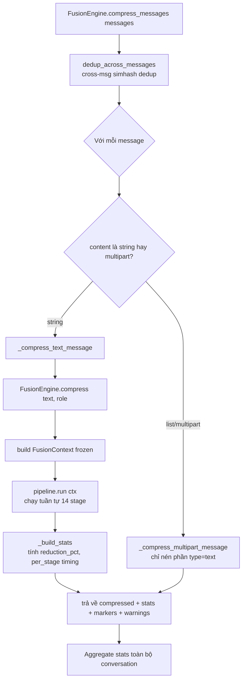

# Báo Cáo Phân Tích — Claw Compactor

## Tổng Quan
Engine nén token cho LLM mã nguồn mở, kiến trúc **14-stage Fusion Pipeline** viết bằng Python (package `claw_compactor`, v7.1.0), đi kèm proxy Node.js (`proxy/server.mjs`, ~2100 dòng) đóng vai trò gateway giữa OpenClaw instances và Claude CLI. Đạt 15–82% giảm token tùy loại nội dung, không cần LLM inference (zero cost), có cơ chế **reversible compression** qua `RewindStore`. Quy mô: ~16k dòng Python/JS, 1600+ test (`tests/` có 59 file, hàng nghìn test case), maturity cao (CI, codecov, PyPI package, changelog dài).

## Tính Năng Nổi Bật (Best Features)
1. **Content-aware routing qua Cortex + ContentDetector**: Stage đầu tiên (`order=5`) phân loại nội dung thành 6 loại (`code|json|log|diff|search|text`) và 16 ngôn ngữ bằng cascade heuristic có ưu tiên rõ ràng — code fence > diff header > JSON parse > shebang > log density > search density > keyword density > fallback text (`scripts/lib/fusion/content_detector.py:1-14`, `scripts/lib/fusion/cortex.py:19-48`). Nhờ vậy các stage sau chỉ chạy khi phù hợp, tránh phá hỏng code/JSON bằng abbreviation dành cho văn xuôi.
2. **Immutable pipeline với gate-before-compress**: `FusionContext` và `FusionResult` là `frozen dataclass`; mỗi stage chỉ implement `should_apply()` (gate rẻ, O(1)) và `apply()` (nén thật). `FusionPipeline.run()` chạy tuần tự, output stage N là input stage N+1 (`scripts/lib/fusion/base.py:34-97`, `scripts/lib/fusion/pipeline.py:57-94`). Kết quả đo được: 10/14 stage skip trên nội dung không phù hợp gần như miễn phí — tổng latency 10-80ms cho context 8K-128K token (`ARCHITECTURE.md:503-507`).
3. **Reversible compression qua RewindStore (hash-addressed LRU)**: Các stage lossy (Ionizer, LogCrunch, SearchCrunch, Photon) lưu nội dung gốc vào `RewindStore` (LRU 500 entries, TTL 600s, key = SHA-256[:24]) và chèn marker `[[REWIND:sha256:...]]` vào output nén. LLM có thể gọi tool `rewind_retrieve(hash)` để lấy lại bản gốc khi cần chi tiết (`scripts/lib/rewind/store.py:34-90`, `ARCHITECTURE.md:266-317`). Đây là cơ chế cho phép nén aggressive (Ionizer đạt 81.9% trên JSON 100 item) mà không mất thông tin vĩnh viễn.
4. **QuantumLock — ổn định KV-cache prefix**: Stage `order=3` (chạy trước cả Cortex) chỉ áp dụng cho message `role=system`, dùng 7 regex pattern (ISO date, JWT, API key, UUID, unix timestamp, hex id...) để thay thế nội dung động (date, token, session id) bằng placeholder cố định, rồi gộp giá trị thật vào một "appendix" ở cuối message (`scripts/lib/fusion/quantum_lock.py:44-175`). Mục đích: giữ prefix system prompt bất biến giữa các request để tối đa hóa tỉ lệ cache-hit của Anthropic prompt caching — một request thay đổi 1 token ở đầu prompt vốn sẽ làm mất toàn bộ cache.
5. **Neurosyntax — AST-aware compression an toàn về semantics**: Dùng `tree-sitter` (qua `tree_sitter_language_pack`, optional dependency) để parse code, áp dụng các biến đổi giữ nguyên cấu trúc (loại bỏ dead code, chuẩn hóa whitespace/comment, xóa type annotation dư thừa) nhưng **tuyệt đối không rút gọn identifier** — "Class/function/variable names are semantic anchors that LLMs use to understand code context. Shortening them destroys comprehension and causes downstream task failures (validated on SWE-bench)" (`scripts/lib/fusion/neurosyntax.py:1-16`). Khi tree-sitter không khả dụng/parse fail, fallback về regex an toàn (strip comment, blank-line normalize) chứ không bao giờ đoán mò sửa cú pháp.

## Áp Dụng Cho Auto Code OS (Applied Takeaways — ranked)
1. **Content-type-aware compression pipeline trước khi gọi LLM** — What: Cortex phân loại nội dung rồi route tới stage phù hợp, thay vì một bộ regex chung cho mọi loại text (`scripts/lib/fusion/cortex.py`, `content_detector.py`). Apply: Thêm bước tiền xử lý trong `server/pkg/llm/pricing.go` (cạnh hàm `EstimateMessageTokens`, dòng 74) hoặc một package mới `server/pkg/llm/compact/` chạy trước khi build request — phân loại nội dung tool-result (log build, diff git, JSON từ `server/internal/context/repomap`) và áp compressor tương ứng (fold log lặp, gấp diff context, sample JSON array) trước khi đưa vào `server/internal/orchestrator/llm_step.go`. Impact: H · Effort: M · Risk: L · Est: 4-5 ngày.
2. **DiffCrunch — gấp git diff context giống pattern GitOps của Auto Code OS** — What: Parse unified diff hunks, chỉ giữ dòng thay đổi + window context (mặc định 3 dòng), gấp phần unchanged còn lại thành marker đếm dòng, giảm 60-80% trên diff lớn (`ARCHITECTURE.md:187-193`). Apply: Áp dụng trực tiếp cho diff output ở `server/internal/gitops/` và `server/internal/orchestrator/gitops/` trước khi đưa vào prompt review/commit-message step — vì repo có sẵn full diff trong VCS, không cần RewindStore, chỉ cần reference marker. Impact: M · Effort: L · Risk: L · Est: 2-3 ngày.
3. **Reversible compression (Rewind pattern) cho tool-result lớn** — What: Lưu bản gốc vào hash-addressed store, cho phép LLM tool-call lấy lại khi cần (`scripts/lib/rewind/store.py`). Apply: Auto Code OS đã có `server/internal/tool/` framework — thêm 1 tool mới `context_retrieve(hash)` đọc từ Postgres/Redis (thay LRU in-memory) lưu output tool gốc trước khi nén, dùng cho output dài từ `server/internal/sandbox/` (test logs, build logs). Impact: H · Effort: M · Risk: M (cần schema lưu trữ + TTL cleanup) · Est: 3-4 ngày.
4. **QuantumLock — ổn định prompt prefix cho prompt caching** — What: Regex tách phần động (date/uuid/token) ra khỏi system prompt để giữ prefix cố định, tối ưu cache-hit rate (`scripts/lib/fusion/quantum_lock.py`). Apply: Áp dụng cho `server/internal/prompts/` (Go templates) — tách các giá trị runtime-injected (timestamp, task ID, session ID) khỏi phần đầu system prompt, đẩy xuống cuối, giúp Anthropic prompt caching (nếu `server/pkg/llm/anthropic.go` đã dùng `cache_control`) đạt hit-rate cao hơn giữa các step trong cùng 1 task. Impact: M · Effort: S · Risk: L · Est: 1-2 ngày.
5. **Tiered compaction với CircuitBreaker (micro/auto/full)** — What: `tiered_compaction.py` chọn mức nén theo % context đầy (60/80/95%), có `CircuitBreaker` tự tắt compaction sau 3 lần thất bại liên tiếp để tránh vòng lặp retry vô hạn (bug đã từng làm Claude Code tốn 250K API call/ngày) (`scripts/lib/fusion/tiered_compaction.py:1-127`). Apply: Orchestrator hiện có `agent_watchdog.go` theo dõi agent — bổ sung logic tương tự: khi `EstimateMessageTokens` vượt ngưỡng token_budget của task, kích hoạt nén theo tầng (trim tool-result → summarize hội thoại → nén toàn bộ context) thay vì fail cứng; thêm circuit-breaker để tránh loop nén thất bại liên tục. Impact: H · Effort: M · Risk: M · Est: 4 ngày.

## Kiến Trúc (Architecture)
- **Style**: Pipeline/Chain-of-Responsibility với dữ liệu bất biến (immutable data flow) — mỗi stage là 1 class kế thừa `FusionStage` ABC, có `order` số nguyên quyết định thứ tự thực thi, được `FusionPipeline` tự sort khi khởi tạo (`scripts/lib/fusion/pipeline.py:41-51`).
- **Layers**: `FusionEngine` (entry point public API, `compress()`/`compress_messages()`) → `FusionPipeline` (executor có thứ tự) → 14 `FusionStage` con → 3 stage được wrap dạng adapter từ module legacy (`RLEStage`, `TokenOptStage`, `AbbrevStage` bọc `lib.rle`, `lib.tokenizer_optimizer`, `compressed_context.compress_ultra` — `scripts/lib/fusion/engine.py:86-171`).
- **Dependency direction**: Stage không gọi lẫn nhau, không share mutable state — chỉ phụ thuộc vào `FusionContext` truyền vào và constructor argument riêng (vd `Ionizer(rewind_store=...)`). Điều này cho phép test từng stage độc lập và thêm/xóa/reorder stage mà không đụng code khác (`ARCHITECTURE.md:75-82`, đúng như quan sát thực tế trong `engine.py:196-212`).
- Ngoài package Python còn có 1 proxy Node.js riêng biệt (`proxy/server.mjs`) — không phải một phần của Fusion Pipeline mà là gateway điều phối nhiều instance OpenClaw gọi qua Claude CLI (fair-queue, rate-limiter, process-registry, retry, redis-client...). Đây là 2 concern tách biệt: **compression library** (Python) và **routing/queueing proxy** (JS) — chỉ liên kết lỏng lẻo qua `compression-middleware.mjs` và `quantum-lock.mjs` (bản JS song song với bản Python, có vẻ là bản port/đồng bộ thủ công — điểm đáng lưu ý ở phần Anti-Pattern).
- Confidence: **High** — đọc trực tiếp source `base.py`, `pipeline.py`, `engine.py`, và xác nhận khớp với mô tả trong `ARCHITECTURE.md`.

```mermaid
flowchart LR
    IN[Input text / messages] --> DEDUP[Cross-msg SemanticDedup\nchỉ khi compress_messages]
    DEDUP --> QL[QuantumLock order=3]
    QL --> COR[Cortex order=5\ncontent-type + language detect]
    COR --> PH[Photon order=8\nbase64/image]
    PH --> RLE[RLEStage order=10\npath/IP/enum]
    RLE --> SD[SemanticDedup order=12\nsimhash/shingle]
    SD --> ION[Ionizer order=15\nJSON sampling]
    ION --> LOG[LogCrunch order=16]
    LOG --> SEARCH[SearchCrunch order=17]
    SEARCH --> DIFF[DiffCrunch order=18]
    DIFF --> SC[StructuralCollapse order=20]
    SC --> NS[Neurosyntax order=25\ntree-sitter AST]
    NS --> NX[NexusStage order=35\nML token-level]
    NX --> TO[TokenOptStage order=40]
    TO --> AB[AbbrevStage order=45\ntext only]
    AB --> OUT[Compressed output]
    ION -.store original.-> RW[(RewindStore\nSHA-256 LRU)]
    LOG -.store folded.-> RW
    SEARCH -.store snippets.-> RW
    PH -.store blob.-> RW
```

### ADR Suy Luận (Inferred ADRs)
| Quyết Định | Bằng Chứng | Lợi Ích | Đánh Đổi | Confidence |
|---|---|---|---|---|
| Immutable `frozen dataclass` cho Context/Result | `base.py:34-63` mọi field đều `frozen=True` | Loại bỏ bug do mutation ẩn giữa stage, dễ test đơn vị | Mỗi lần transform phải tạo object mới (chi phí allocation nhỏ) | High |
| Gate `should_apply()` tách khỏi `apply()` | `base.py:71-79`, mọi stage implement 2 method riêng | Stage không phù hợp bị skip ở chi phí O(1), không tốn CPU chạy logic nén | Thêm 1 method boilerplate cho mỗi stage mới | High |
| Rewind thay vì drop cứng dữ liệu | `rewind/store.py` + marker `[[REWIND:sha256:...]]` trong output | Cho phép nén aggressive (Ionizer 81.9%) mà vẫn recoverable | Cần thêm 1 tool-call round-trip nếu LLM cần dữ liệu gốc; tăng độ phức tạp prompt | High |
| Zero-dependency core (không bắt buộc torch/transformers) | So sánh bảng "How It Compares" trong README, `tree_sitter_language_pack` là optional import (`neurosyntax.py:27-33`) | Cài đặt nhẹ, chạy được ở môi trường không có GPU | Chất lượng nén thấp hơn ML-based approach (LLMLingua) trên 1 số loại text; Nexus fallback về stopword-list khi không có model | Medium (suy luận từ code, chưa thấy benchmark ROUGE chi tiết cho case fallback) |
| Tách proxy Node.js khỏi core Python | `proxy/server.mjs` độc lập hoàn toàn, import riêng các `.mjs` module | Cho phép compression core dùng lại như thư viện Python thuần, proxy layer xử lý routing/queueing riêng theo nhu cầu OpenClaw | Duy trì 2 codebase (Python + JS) — thấy dấu hiệu bản `quantum-lock.mjs` song song `quantum_lock.py`, dễ lệch pha khi update 1 bên | Medium |

## Luồng Chính (Main Flow)

## Design Patterns & Chất Lượng Code
- **Strategy/Chain-of-Responsibility**: mỗi `FusionStage` là 1 strategy độc lập, `FusionPipeline` là chain executor — pattern giáo khoa, dễ đọc (`base.py`, `pipeline.py`).
- **Adapter Pattern**: `RLEStage`, `TokenOptStage`, `AbbrevStage` trong `engine.py:86-171` bọc lại 3 module legacy (`lib.rle`, `lib.tokenizer_optimizer`, `compressed_context`) để chúng tham gia cùng pipeline mới mà không cần viết lại — ví dụ tốt về cách migrate code cũ vào kiến trúc mới không phá vỡ tương thích.
- **Immutable value objects + `dataclasses.replace()`**: dùng nhất quán xuyên suốt codebase (`FusionContext.evolve()` gọi `replace(self, **kwargs)` — `base.py:46-48`), giảm hẳn lớp bug side-effect.
- **Docstring chuẩn NumPy-style rất đầy đủ** ở hầu hết module (`engine.py`, `pipeline.py`, `tiered_compaction.py`) — mỗi file có đoạn mô tả kiến trúc + rationale ngay đầu file, giúp code tự giải thích ("Part of claw-compactor vX. License: MIT." lặp lại cuối mỗi docstring — quy ước version-tracking đơn giản nhưng hữu ích).
- **Naming ẩn dụ hoa mỹ** (Cortex, Neurosyntax, Ionizer, QuantumLock, Nexus, Photon) — dễ nhớ nhưng thiếu tính tự giải thích cho người mới đọc code lần đầu; phải đọc docstring mới hiểu Cortex = content-type detector, Ionizer = JSON sampler.
- **Test coverage tốt**: 59 file test dưới `tests/`, README claim "1600+ tests" (khớp `ARCHITECTURE.md:462` nói 1663 test, `docs/README.md` nhắc 1676). Có fixture chuẩn `make_context()` cho unit test stage riêng lẻ.

## Kỹ Thuật Thú Vị & Thực Hành Kỹ Thuật
- **Path bootstrap thủ công** (`scripts/lib/fusion/engine.py:37-43`): tự chèn `sys.path` để chạy được từ bất kỳ cwd nào — giải pháp thực dụng cho 1 CLI tool không đóng gói namespace package chuẩn, nhưng là code smell nếu nhìn theo chuẩn packaging hiện đại (nên dùng `pyproject.toml` entry point + relative import thay vì tự sửa `sys.path`).
- **Optional dependency pattern cho tree-sitter** (`neurosyntax.py:27-33`): `try/except ImportError` để core vẫn chạy được khi thiếu `tree_sitter_language_pack`, tự động fallback về regex — best practice cho thư viện muốn giữ zero required dependencies mà vẫn tận dụng optional performance boost.
- **CircuitBreaker chống vòng lặp compaction vô hạn** (`tiered_compaction.py:91-127`): dataclass đơn giản đếm `consecutive_failures`, tự `disabled=True` sau `MAX_CONSECUTIVE_FAILURES=3`. Docstring dẫn chứng cụ thể: "the same bug Claude Code discovered wasting 250K API calls/day globally" — một ví dụ tốt về việc ghi lý do (why) ngay trong code thay vì chỉ ghi cái gì (what).
- **Environment variable override có validate** (`tiered_compaction.py:71-88`, `_get_pct_override()`): đọc `CLAW_AUTOCOMPACT_PCT_OVERRIDE`, validate range (0,1], log warning rõ ràng thay vì crash khi giá trị sai — pattern cấu hình an toàn đáng học.
- **Content-type-safe gating** để tránh phá hỏng structured data: `AbbrevStage.should_apply()` chỉ chạy khi `content_type == "text"` (`engine.py:156-157`) — never abbreviates code/JSON/log/diff, tránh lỗi kinh điển của các compressor generic (regex phá cú pháp).
- **Statistical sampling có bảo toàn error case**: `Ionizer._sample_dict_array()` (`ionizer.py:88-113`) luôn giữ lại item chứa keyword lỗi (`error/exception/failed/failure/fatal`) trước khi random-sample phần còn lại — ưu tiên đúng: dev cần thấy lỗi hơn là thấy item ngẫu nhiên.

## Engineering Gems
1. `scripts/lib/fusion/base.py:66-97` — Vấn đề: làm sao đảm bảo 14 stage độc lập không stage nào vô tình sửa dữ liệu của stage khác, đồng thời vẫn đo được timing/skip chính xác. Cách làm phổ biến (yếu hơn): 1 hàm lớn `compress(text) -> text` gọi tuần tự các sub-function, mutate 1 biến string, không có gate rõ ràng, khó test riêng từng bước. Vì sao elegant: tách `should_apply()`/`apply()` thành 2 method trừu tượng, `timed_apply()` bọc timing + skip-logic 1 chỗ duy nhất, `FusionResult` trả `skipped=True` mà không cần gọi `apply()` — đảm bảo stage rỗng có chi phí gần 0. Đánh đổi: thêm 1 lớp abstraction (ABC + 2 dataclass) so với hàm thuần, người mới cần đọc `base.py` trước khi hiểu bất kỳ stage nào. Bài học rút ra: tách "điều kiện áp dụng" khỏi "logic thực thi" thành 2 method riêng là pattern rẻ nhưng lợi ích lớn cho testability và performance profiling.
2. `scripts/lib/rewind/store.py:34-90` — Vấn đề: nén aggressive (bỏ 95%+ dữ liệu JSON) rủi ro mất thông tin quan trọng khi LLM cần chi tiết. Cách làm phổ biến (yếu hơn): truncate cứng và mất vĩnh viễn, hoặc không nén gì để an toàn (tốn token). Vì sao elegant: `RewindStore` là LRU + TTL cache hash-addressed (SHA-256[:24]) — nén output ngắn nhưng bản gốc vẫn "reachable" qua 1 marker 75 ký tự, LLM tự quyết định có cần rewind hay không qua tool-call, không tốn token nếu không cần. Đánh đổi: cần thêm 1 tool trong function-calling schema và xử lý round-trip phía proxy; dữ liệu bị mất nếu LRU evict trước khi LLM kịp hỏi lại (TTL 600s, max 500 entries — giới hạn cứng). Bài học: "nén nhưng đừng xóa" — giữ 1 con đường quay lại rẻ tiền biến compression aggressive từ rủi ro thành an toàn.
3. `scripts/lib/fusion/quantum_lock.py:148-175` — Vấn đề: prompt caching (Anthropic) chỉ hit khi prefix giống hệt, nhưng system prompt thường chèn timestamp/session-id/API-key làm token đầu tiên đã khác mỗi request. Cách làm phổ biến (yếu hơn): chấp nhận cache miss liên tục, hoặc cache theo hash toàn bộ prompt (không hoạt động khi có bất kỳ field động nào). Vì sao elegant: tách phần "ổn định" (đưa lên đầu, giữ nguyên) khỏi phần "động" (đẩy xuống cuối thành block phụ lục có delimiter rõ ràng `<!-- quantum-lock: dynamic context -->`), nên hash của prefix ổn định qua nhiều request dù giá trị động thay đổi. Đánh đổi: thêm overhead token cho appendix (đã tự warning khi appendix làm tổng token tăng — `quantum_lock.py:227-232`); cần 7 regex pattern bảo trì đúng theo định dạng dynamic value thực tế. Bài học: tối ưu cache-hit không phải là nén nhỏ hơn, mà là làm cho phần lặp lại "trông giống hệt nhau" giữa các lần gọi.

## Top 10 Điều Đáng Học
| # | Khái Niệm | File | Vì Sao Hữu Ích | Độ Khó | Thứ Tự |
|---|---|---|---|---|---|
| 1 | Immutable FusionContext/FusionResult + gate-before-compress | `scripts/lib/fusion/base.py` | Nền tảng của toàn bộ kiến trúc, dễ áp dụng cho bất kỳ pipeline xử lý dữ liệu nào | ⭐⭐ | 1 |
| 2 | FusionPipeline sort-by-order | `scripts/lib/fusion/pipeline.py` | Cho phép thêm/xóa/reorder stage không đụng code khác — áp dụng được cho DAG step của Auto Code OS | ⭐⭐ | 2 |
| 3 | Content-type detection cascade (Cortex) | `scripts/lib/fusion/content_detector.py` | Pattern routing theo priority rõ ràng, dễ mở rộng thêm content type mới | ⭐⭐⭐ | 3 |
| 4 | RewindStore hash-addressed LRU | `scripts/lib/rewind/store.py` | Cơ chế reversible compression tối giản (90 dòng) nhưng đủ dùng | ⭐⭐ | 4 |
| 5 | QuantumLock KV-cache stabilization | `scripts/lib/fusion/quantum_lock.py` | Kỹ thuật ít người biết nhưng tác động trực tiếp tới chi phí prompt caching | ⭐⭐⭐ | 5 |
| 6 | Ionizer statistical sampling với error-preservation | `scripts/lib/fusion/ionizer.py` | Cách nén JSON array thông minh hơn truncate/head-N | ⭐⭐⭐ | 6 |
| 7 | Neurosyntax — AST compression giữ nguyên identifier | `scripts/lib/fusion/neurosyntax.py` | Bài học an toàn: đừng rút gọn semantic anchor dù muốn giảm token | ⭐⭐⭐⭐ | 7 |
| 8 | Tiered compaction + CircuitBreaker | `scripts/lib/fusion/tiered_compaction.py` | Chiến lược 3-tầng (micro/auto/full) áp dụng trực tiếp cho context budget management | ⭐⭐⭐ | 8 |
| 9 | Adapter pattern để migrate module legacy vào pipeline mới | `scripts/lib/fusion/engine.py:86-171` | Kỹ thuật refactor an toàn khi không muốn viết lại toàn bộ | ⭐⭐ | 9 |
| 10 | SemanticDedup bằng 3-word shingle Jaccard (không cần ML) | `scripts/lib/fusion/semantic_dedup.py` | Dedup gần-trùng-lặp không phụ thuộc thư viện ngoài, đơn giản để port sang Go | ⭐⭐⭐ | 10 |

## Hướng Dẫn Đọc (Reading Guide)
**L0 Build & Run:** `pyproject.toml`, `scripts/cli.py` (dispatch tới `scripts/mem_compress.py`), `SKILL.md` (mô tả 6-layer legacy + Engram).
**L1 Entry Points:** `scripts/lib/fusion/engine.py` (`FusionEngine.compress()` / `.compress_messages()`).
**L2 Core Abstractions:** `scripts/lib/fusion/base.py` (FusionContext/Result/Stage), `scripts/lib/fusion/pipeline.py` (executor).
**L3 Architecture Glue:** `scripts/lib/fusion/cortex.py` + `content_detector.py` (routing), `scripts/lib/rewind/store.py` (reversibility), `ARCHITECTURE.md` (tài liệu tổng hợp rất chi tiết, nên đọc song song code).
**L4 Engineering Gems:** `quantum_lock.py`, `ionizer.py`, `neurosyntax.py`, `tiered_compaction.py`.
**L5 Reimplement:** Viết lại `FusionStage` interface bằng Go (`interface { ShouldApply(ctx) bool; Apply(ctx) Result }`), port Cortex content-detector và QuantumLock trước (ít phụ thuộc, giá trị cao, effort thấp).

## Anti-Patterns & Không Nên Copy
1. **Trùng lặp logic Python/JS không đồng bộ**: `scripts/lib/fusion/quantum_lock.py` (Python, đang phân tích) và `proxy/quantum-lock.mjs` (JS, 263 dòng) là 2 bản triển khai song song cùng 1 ý tưởng. Không có bằng chứng code-gen hay shared spec giữa 2 bản — rủi ro lệch pha khi 1 bên được sửa mà bên kia không theo kịp. Với Auto Code OS (chỉ có 1 backend Go), không cần lo vấn đề này, nhưng là bài học: nếu buộc phải duplicate logic giữa 2 runtime, cần một cơ chế test đối chiếu (golden test chung) chứ không chỉ trust code review.
2. **`ARCHITECTURE.md` mô tả "Repository Layout" dùng đuôi `.mjs` cho toàn bộ `scripts/lib/fusion/*` (dòng 517-540)** trong khi code thực tế là `.py` — tài liệu bị lỗi thời/copy nhầm từ 1 phiên bản khác (có thể doc gốc viết cho bản JS trước khi port sang Python, hoặc ngược lại). Bài học cho Auto Code OS: tài liệu kiến trúc cần kiểm tra định kỳ (`docs/` phải đồng bộ với code thật) — không tin tưởng 100% doc khi chưa verify bằng cách đọc source.
3. **`scripts/cli.py` dùng path bootstrap thủ công (`sys.path.insert`)** thay vì cấu trúc package/entry-point chuẩn (`engine.py:41-43` cũng làm vậy) — hoạt động nhưng fragile khi cấu trúc thư mục thay đổi. Auto Code OS (Go) không có vấn đề tương tự vì Go module resolution rõ ràng hơn, nhưng nếu viết script Python phụ trợ (`scripts/` ở root Auto Code OS) nên tránh pattern này, dùng `pip install -e .` + proper package thay vì tự chèn `sys.path`.
4. **Naming ẩn dụ (Cortex/Neurosyntax/Ionizer/Photon/Nexus) đẹp cho marketing nhưng cản trở onboarding**: người đọc code lần đầu không đoán được `Ionizer` = "JSON array sampler" nếu không đọc docstring/ARCHITECTURE.md trước. Khi đặt tên module trong Auto Code OS, nên ưu tiên tên mô tả chức năng (`json_sampler.go` thay vì tên ẩn dụ) trừ khi có tài liệu đi kèm rất đầy đủ như dự án này.

## Câu Hỏi Đáng Suy Ngẫm
1. Compression rate benchmark (bảng "How It Compares" trong README, ROUGE-L 0.653–0.723) được đo trên tập dữ liệu nào, có đại diện cho workload thực tế của Auto Code OS (Go source, PR diff, sandbox test log) hay chỉ tối ưu cho các benchmark sample trong `benchmark/data/`? Cần tự benchmark trên dữ liệu Go/Next.js thật trước khi tin số liệu.
2. `Ionizer` random-sample phần "middle" của JSON array (`random.sample` không seed cố định — `ionizer.py:108`) — điều này có nghĩa compression không deterministic giữa 2 lần chạy cùng input. Với Auto Code OS cần reproducibility (task audit, replay), đây có phải là thiết kế chấp nhận được, hay cần seed cố định / sample theo chỉ số quyết định (không random) để đảm bảo audit log nhất quán?
3. `RewindStore` hiện tại là in-memory LRU per-process — trong 1 hệ thống multi-instance/multi-pod như Auto Code OS backend, marker `[[REWIND:sha256:...]]` được nén ở instance A có thể không retrieve được ở instance B. Nếu áp dụng ý tưởng Rewind, cần store tập trung (Postgres/Redis) — đã có `server/internal/database/` sẵn, nhưng chi phí latency/consistency cho lookup ở mỗi tool-call là bao nhiêu?
4. `CircuitBreaker` trong `tiered_compaction.py` disable toàn bộ compaction sau 3 lần fail liên tiếp cho **toàn bộ session** — nếu áp dụng cho Auto Code OS orchestrator (nhiều task chạy song song), circuit breaker nên scope theo task hay theo global service instance? Scope sai có thể khiến 1 task lỗi làm tắt compaction cho toàn bộ hệ thống.

## Đánh Giá Tổng Thể
| Architecture | Maintainability | Scalability | Clean Code | Learning Value |
|---|---|---|---|---|
| 9/10 | 8/10 | 7/10 | 8/10 | 9/10 |

## Lộ Trình Học Tập
- **Tuần 1 — Đọc & hiểu core**: Đọc `ARCHITECTURE.md` toàn bộ (đối chiếu với source thật vì có phần lỗi thời), sau đó đọc kỹ `base.py` → `pipeline.py` → `engine.py`. Chạy thử `benchmark/run_benchmark.py` để thấy số liệu thực trên `benchmark/data/*.json`.
- **Tuần 2 — Deep-dive từng stage**: Đọc `content_detector.py`, `cortex.py`, `quantum_lock.py`, `ionizer.py`, `neurosyntax.py`, `semantic_dedup.py` — với mỗi stage, viết lại `should_apply()`/`apply()` bằng Go interface tương đương để làm bài tập tư duy port sang stack Auto Code OS.
- **Tuần 3 — Prototype trong Auto Code OS**: Implement `server/pkg/llm/compact/` package với 3 stage đầu tiên (content-type detector kiểu Cortex, QuantumLock cho system prompt trong `server/internal/prompts/`, DiffCrunch cho gitops diff) — đo compression rate thật trên dữ liệu Go/Next.js của chính dự án, so sánh với con số 15-82% claim trong README.
- **Tuần 4 — Reversibility & compaction tầng**: Implement RewindStore dùng Postgres/Redis (không phải in-memory LRU vì cần multi-instance), tích hợp tool-call `context_retrieve` vào `server/internal/tool/`; sau đó thêm tiered compaction logic (micro/auto/full) với CircuitBreaker scope theo task vào `agent_watchdog.go`, benchmark tác động tới token cost thực tế qua `server/pkg/llm/pricing.go`.
