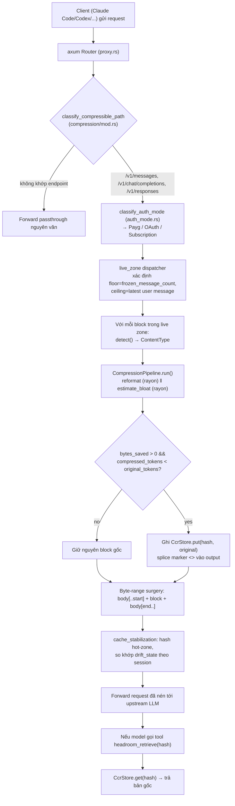
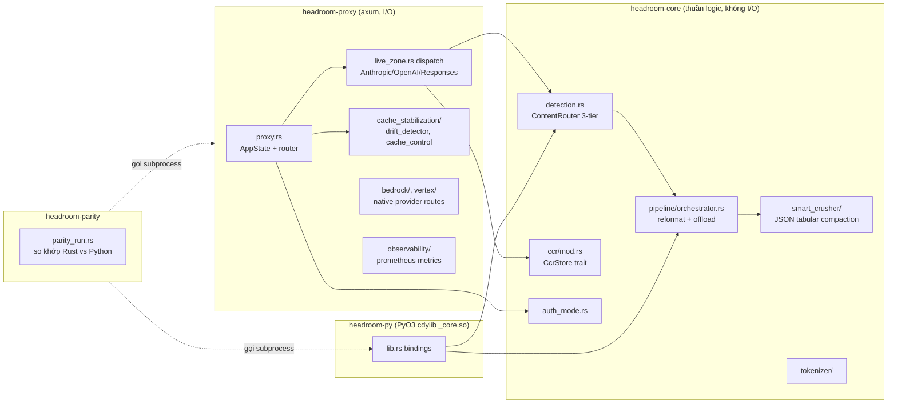

# Báo Cáo Phân Tích — Headroom

## Tổng Quan (TL;DR)
Headroom đứng chắn giữa các công cụ lập trình AI và nhà cung cấp mô hình AI, tự động rút gọn nội dung nặng (log, dữ liệu, kết quả công cụ) trước khi gửi đi để tiết kiệm chi phí, nhưng vẫn giữ lại bản gốc ở một nơi lưu trữ riêng để AI có thể xin lại đầy đủ khi thực sự cần. Nhờ vậy người dùng vừa tiết kiệm tiền vừa không mất thông tin quan trọng.

## Thông Tin Kỹ Thuật (Technical Overview)
- **Stack:** Reverse proxy (Rust/axum) + library (Python/TypeScript) chặn mọi request tới Anthropic/OpenAI/Bedrock/Vertex, nén tool outputs/logs/JSON/diff, và cache lại bản gốc để LLM có thể "retrieve" khi cần (CCR — Compress-Cache-Retrieve). Repo đang trong quá trình port lõi từ Python sang Rust (workspace 5 crates, ~72.9k dòng Rust: `headroom-core`, `headroom-proxy`, `headroom-simulators`, `headroom-py` bindings PyO3, `headroom-parity` harness so khớp Python↔Rust).
- **Quy mô/Độ trưởng thành:** Dự án rất trưởng thành: CI, benchmarks (`benchmarks/*.py`, 20+ script), release trên PyPI/npm, docs site riêng, ~0.31.0 release qua release-please.

## Luồng Chính (Main Flow)

## Tính Năng Nổi Bật (Best Features)
1. **CCR (Compress-Cache-Retrieve) — nén "reversible" bằng marker thay vì xoá vĩnh viễn**
   - *Là gì:* Khi rút gọn một phần nội dung, hệ thống không xóa hẳn mà cất bản gốc sang một chỗ lưu trữ riêng và để lại một "dấu tham chiếu" ngắn gọn — AI có thể yêu cầu lấy lại nguyên văn nếu thực sự cần.
   - *Cách triển khai:* Mỗi transform khi cắt bớt payload sẽ lưu bản gốc vào một `CcrStore` (SQLite mặc định — WAL mode; hoặc Redis đa-worker; hoặc `DashMap` in-memory cho test) keyed theo BLAKE3 hash 24-hex-char, rồi chèn marker `<<ccr:HASH>>` vào output. Model có thể gọi tool `headroom_retrieve` để lấy lại nguyên văn. Thiết kế đảm bảo "lossy trên wire, lossless end-to-end". File: `crates/headroom-core/src/ccr/mod.rs:1-119` (đặc biệt `compute_key`, `marker_for`), backend SQLite tại `crates/headroom-core/src/ccr/backends/sqlite.rs`.
2. **Cache-safety invariant bằng byte-range surgery, không phải serialize lại JSON**
   - *Là gì:* Khi chỉnh sửa một phần nhỏ của tin nhắn gửi đi, hệ thống cố tình không đụng vào các phần còn lại — để nhà cung cấp AI vẫn nhận ra "phần quen thuộc" và tận dụng được bộ nhớ đệm của họ, tránh bị tính phí cao hơn do mất cache.
   - *Cách triển khai:* Dispatcher live-zone (`crates/headroom-core/src/transforms/live_zone.rs:63-86`) không parse-rồi-serialize body — nó định vị block cần nén bằng con trỏ vào `serde_json::value::RawValue` (giữ nguyên offset gốc) và splice: `out = body[..start] || replacement || body[end..]`. Nhờ đó phần "cache hot zone" (system prompt, tools, message cũ) được copy byte-for-byte, đảm bảo SHA-256 của phần không đổi luôn khớp — giữ nguyên KV-cache của provider (tránh "cache bust" làm tăng chi phí ngược).
3. **ContentRouter 3 tầng, không lệ thuộc regex trong production**
   - *Là gì:* Hệ thống nhận diện loại nội dung (code, diff, văn bản thường...) bằng nhiều lớp kiểm tra nối tiếp, ưu tiên độ chính xác cao hơn là quy tắc đoán mò đơn giản, để tránh nhận diện sai và nén nhầm.
   - *Cách triển khai:* `crates/headroom-core/src/transforms/detection.rs` — Tier 1 Magika (ONNX content classifier của Google), Tier 2 `unidiff` parser (oracle "parse được → là diff"), Tier 3 fallthrough PlainText. Quyết định khoá thiết kế (2026-04-25) loại regex detector khỏi production path vì false-positive cao trên diff không có header `diff --git`; regex chỉ còn làm "comparison oracle" cho parity test. Mỗi tier lỗi (vd. ONNX AVX2 không khả dụng) chỉ log warn rồi fallthrough, không bao giờ panic hay chặn chain.
4. **CompressionPipeline — reformat lossless trước, offload lossy sau, chạy song song**
   - *Là gì:* Hệ thống thử cách rút gọn an toàn (không mất thông tin) trước, chỉ chuyển sang cách rút gọn mạnh tay hơn khi thực sự cần, và làm cả hai việc cùng lúc để tiết kiệm thời gian xử lý.
   - *Cách triển khai:* `crates/headroom-core/src/transforms/pipeline/orchestrator.rs:82-269`. Pha reformat (VD `JsonMinifier`, `LogTemplate` — lossless, dừng sớm khi đạt tỉ lệ mục tiêu) và pha ước lượng "bloat" của từng offload chạy đồng thời qua `rayon::join` (cùng quét buffer, không tranh chấp bộ nhớ vì đều read-only). Offload chỉ chạy khi `bloat_score >= threshold` HOẶC (`reformat_ratio` vẫn > `offload_fallback_ratio` VÀ `score > 0`) — cơ chế "gate kép" tránh chạy nén tốn kém khi reformat đã đủ tốt, nhưng vẫn có fallback khi reformat "underwhelm".
5. **AuthMode classifier điều khiển toàn bộ policy nén theo hình thức thanh toán**
   - *Là gì:* Mức độ rút gọn nội dung được điều chỉnh tùy theo cách người dùng trả tiền cho dịch vụ AI — nén mạnh hơn khi trả theo lượt dùng (tiết kiệm tiền trực tiếp), nén nhẹ nhàng và kín đáo hơn khi dùng gói thuê bao để không bị phát hiện là đang qua trung gian.
   - *Cách triển khai:* `crates/headroom-core/src/auth_mode.rs:1-65`. Phân loại request thành `Payg` (nén aggressive vì tiết kiệm tiền trực tiếp), `OAuth` (chỉ nén lossless, không tự thêm `cache_control` vì scope OAuth pin theo account/model/session), `Subscription` (thêm yêu cầu "stealth" — giữ nguyên `User-Agent`, không inject header `X-Headroom-*`, không strip `accept-encoding` để không bị provider fingerprint là traffic proxy). Đây là một layer chính sách rõ ràng tách biệt khỏi cơ chế nén, chạy <10μs/call, không bao giờ panic trên header lỗi (fallback an toàn về `Payg` kèm log warn).

## Áp Dụng Cho Auto Code OS (Applied Takeaways — ranked)
1. **Thay truncation "chặt cụt" bằng content-aware compression cho tool results** — What: Auto Code OS hiện cắt tool result thô ở `server/internal/orchestrator/llmrunner/toolloop.go:44-58` (`maxToolResultChars = 8000`, cắt chuỗi ký tự cứng + note "[truncated N chars]"), tức là bỏ hẳn phần đuôi output của `run_tests`/`run_build`/`run_lint` không phân biệt log lặp lại hay lỗi thực. Headroom dùng `ContentRouter` (`detection.rs`) để nhận diện log/diff/JSON rồi áp `LogTemplate`/`LogOffload`/`DiffOffload` — nén theo cấu trúc (gom dòng lặp, giữ dòng lỗi) thay vì cắt mù. Apply: thêm bước phân loại content-type đơn giản (regex log pattern, JSON detect) trước khi gọi `truncateToolResult`, ưu tiên giữ lại các dòng chứa `FAIL|ERROR|Traceback` giống `error_keywords.rs`. Impact: H · Effort: M · Risk: L · Est: 3-4 ngày.
2. **CCR-style retrieval cho phần bị cắt, thay vì mất vĩnh viễn** — What: `crates/headroom-core/src/ccr/mod.rs` lưu bản gốc theo hash + marker `<<ccr:HASH>>`, cho phép model tự yêu cầu lại nguyên văn nếu cần debug sâu. Hiện tại `truncateToolResult` xoá thẳng phần vượt 8000 ký tự, không có cách nào LLM lấy lại được nếu thực sự cần (VD stack trace dài bị cắt mất phần gốc lỗi). Apply: thêm bảng/tool "retrieve_tool_output" trong `server/internal/tool/tools/` — lưu full output vào Postgres (hoặc Redis) keyed theo hash SHA-256 24 ký tự đầu, expose thêm 1 tool cho LLM gọi lại khi cần. Impact: M · Effort: M · Risk: L · Est: 2-3 ngày.
3. **Tokenizer-validated compression gate** — What: Live-zone dispatcher của Headroom có "per-block tokenizer-validation gate": nếu `compressed.tokens >= original.tokens` thì fallback về bản gốc (`live_zone.rs` §PR-B4, xác nhận trong `observability/compression_ratio.rs` comment: "`BlockAction::Compressed` enforces compressed_tokens < original_tokens"). Auto Code OS đã có bộ đếm token chính xác ở `server/internal/context/repomap/pruning.go:15-29` (`tiktoken-go`, `CountTokens`) dùng cho repomap nhưng chưa áp dụng cho tool-result truncation. Apply: gọi `CountTokens` trước/sau khi cắt tool result để đảm bảo không "nén" ngược làm phình token (VD marker text dài hơn nội dung ngắn). Impact: M · Effort: L · Risk: L · Est: 1 ngày.
4. **AuthMode / policy tách biệt khỏi cơ chế nén** — What: `auth_mode.rs` là pure function ánh xạ HeaderMap → policy 3 lớp (Payg/OAuth/Subscription), mọi quyết định nén sau đó đọc từ đây thay vì rải rác if/else. Auto Code OS gọi nhiều LLM provider qua `server/pkg/llm/router.go` + `provider.go` nhưng chưa có lớp policy tương tự cho "mức độ nén context theo provider/subscription". Apply: thêm `server/internal/context` một `CompressionPolicy` nhỏ (enum theo provider/plan) để `repomap/pruning.go` và tool-result truncation cùng đọc, tránh policy rời rạc từng chỗ. Impact: L · Effort: M · Risk: L · Est: 2 ngày.
5. **Cache-hot-zone / cache-drift observability cho prompt caching** — What: `crates/headroom-proxy/src/cache_stabilization/drift_detector.rs` băm SHA-256 system+tools+3 message đầu theo session, log `cache_drift_observed` khi phần "hot zone" đổi ngoài dự kiến (phá vỡ KV-cache provider, tăng cost/latency âm thầm). Apply: **Đã verify — vấn đề còn cơ bản hơn dự đoán ban đầu**: `grep -rn "cache_control\|CacheControl" server/pkg/llm` trả về **rỗng**. Auto Code OS **chưa hề dùng Anthropic prompt caching** (`server/pkg/llm/anthropic.go:51` `ChatWithOptions` build request map thủ công, không có field `cache_control` trên block system/tools nào). Nghĩa là trước khi làm drift-detector kiểu headroom, việc cần làm trước là thêm `"cache_control": {"type": "ephemeral"}` vào block system prompt + tool definitions cố định trong `anthropicMessage`/`ChatWithOptions` — đây là quick win giảm cost/latency ngay lập tức cho mọi task nhiều-turn (tool loop), độc lập với drift detection. Sau khi có caching, mới cần drift-detector (hash `system prompt + tool defs` mỗi lần gọi `llm.Chat`, cảnh báo khi hash đổi giữa 2 lượt trong cùng task) để tránh vô tình phá cache. Impact: H (bước 1 — bật caching) rồi M (bước 2 — drift detection) · Effort: S (bước 1, ~0.5 ngày) + M (bước 2) · Risk: L · Est: 0.5 ngày + 2-3 ngày.

## Kiến Trúc (Architecture)
- **Style**: Cargo workspace nhiều crate theo layer rõ ràng — `headroom-core` (thuần logic: transforms, tokenizer, relevance, CCR — không biết HTTP) → `headroom-proxy` (axum server, biết HTTP/SSE/WS/Bedrock/Vertex, phụ thuộc `headroom-core`) → `headroom-py` (PyO3 binding, phụ thuộc `headroom-core`, không phụ thuộc `headroom-proxy`) → `headroom-simulators` (mock provider server độc lập cho test) → `headroom-parity` (harness so sánh Rust vs Python, phụ thuộc cả hai qua CLI subprocess). Hướng phụ thuộc chỉ đi một chiều: proxy/py → core; không có phụ thuộc ngược.
- **Lý do**: tách `core` khỏi `proxy` để cùng logic nén dùng lại được ở cả proxy Rust (perf) lẫn binding Python (`headroom-py`) — một codebase nén, hai bề mặt tích hợp (proxy zero-code-change vs library gọi trực tiếp). Confidence: **High** (xác nhận qua chú thích trong `Cargo.toml` workspace và cấu trúc `default-members`).

### ADR Suy Luận (Inferred ADRs)
| Quyết Định | Bằng Chứng | Lợi Ích | Đánh Đổi | Confidence |
|---|---|---|---|---|
| Port lõi Python → Rust theo từng "Phase" (A/B/C/D/E/F/G) có gate rõ ràng, giữ Python là nguồn sự thật | Docstring `REALIGNMENT/*.md`, comment "Phase A lockdown", `headroom-parity` crate | Có thể release Rust từng phần mà không phá hành vi cũ; parity test tự động phát hiện lệch | Duy trì 2 codebase song song trong lúc port (Python `headroom/` + Rust `crates/`) — chi phí bảo trì đôi | High |
| Byte-range surgery thay vì parse→mutate→serialize JSON | `live_zone.rs:63-86`, dùng `serde_json::value::RawValue` | Đảm bảo cache hot-zone byte-identical tuyệt đối, không phụ thuộc serializer ổn định key-order | Code phức tạp hơn nhiều (con trỏ offset, splice thủ công) so với deserialize-mutate-serialize thông thường | High |
| Không dùng regex detector trong production detection chain | Comment khoá thiết kế trong `detection.rs:13-19`, ngày 2026-04-25 | Giảm false-positive trên input dị hình (diff không header, log giống code) | Phải cõng ONNX runtime (Magika) — thêm build complexity, cần fallback AVX2 | High |
| SQLite làm CCR backend mặc định, Redis opt-in qua feature flag | `Cargo.toml` core: `rusqlite bundled`, `redis optional` | Zero external dependency cho single-instance deploy; multi-worker cần Redis mới bật | Redis feature tăng compile matrix; SQLite không scale multi-instance nếu không bật Redis | Medium |
| Panic-unwind giữ nguyên (không set `panic=abort`) dù build release tối ưu size | Comment trong `Cargo.toml` root profile.release | Một request lỗi không kéo sập cả proxy đang phục vụ nhiều client đồng thời | Bỏ lỡ phần tối ưu size/perf mà `panic=abort` mang lại | High |

## Design Patterns & Chất Lượng Code
- **Trait-based transform pipeline (Strategy pattern)**: `ReformatTransform` / `OffloadTransform` (`transforms/pipeline/traits.rs`) là trait object (`Arc<dyn ...>`), đăng ký qua builder `CompressionPipelineBuilder::with_reformat/with_offload` theo `ContentType`. Thêm compressor mới không cần sửa orchestrator.
- **Builder pattern nhất quán**: `CompressionPipeline::builder()`, `AppState::new().with_credentials(...)` (chained builder trong `proxy.rs`).
- **Fail-open, never-panic trên hot path**: mọi lỗi transform (`TransformError::Internal`) chỉ log warn rồi bỏ qua bước đó, output luôn trả về ít nhất bản gốc — comment "MUST NOT panic" lặp lại nhiều nơi (`orchestrator.rs:52`, `detection.rs`).
- **Doc-comment cực kỳ dày, giải thích "why" không chỉ "what"**: mỗi module có docstring dài giải thích quyết định thiết kế, đánh đổi, và trỏ tới tài liệu quyết định ngoài code (`REALIGNMENT/*.md`, `project_*.md` trong "project memory"). Đây là phong cách nổi bật nhất của repo — code tự giải thích lịch sử quyết định thay vì chỉ mô tả hành vi.
- **Test dày đặc theo tầng**: mỗi file source có `#[cfg(test)] mod tests` ngay cạnh (VD `ccr/mod.rs`, `orchestrator.rs` có >20 test kịch bản gate offload), cộng `tests/` cấp crate cho integration, cộng `benches/` (criterion) và `proptest-regressions/` (property-based testing để bắt input dị hình).
- **Điểm yếu nhỏ**: một số comment/docstring dài hơn code thực (tỷ lệ giải thích/code cao) — dễ đọc nhưng tăng chi phí duy trì khi hành vi đổi mà quên cập nhật docstring; đã thấy vài chỗ đánh dấu "TODO" còn tồn (VD comment trong `Cargo.toml` core: "the module + dispatch gating is the collaborative half of this change — flagged in the PR").

## Kỹ Thuật Thú Vị & Thực Hành Kỹ Thuật
- **Parity harness (`headroom-parity`)**: thay vì chỉ tin unit test, có hẳn 1 crate gọi cả Rust binary lẫn Python package trên cùng input rồi so khớp byte-for-byte — kỹ thuật hiếm gặp để đảm bảo port ngôn ngữ không lệch hành vi.
- **Property-based testing cho parser nhận input bất định**: `proptest` cho SSE byte-parser ("100K cases là default cho parser invariants — không được panic trên bất kỳ input byte nào, kể cả UTF-8 bị cắt giữa codepoint").
- **Metric cardinality kỷ luật**: `observability/compression_ratio.rs` giới hạn rõ label `strategy`/`content_type` chỉ nhận giá trị từ tập `&'static str` cố định — không bao giờ để giá trị do khách hàng kiểm soát lọt vào label Prometheus (tránh cardinality explosion).
- **Security/Privacy trong log**: `drift_detector.rs` băm Authorization/API-key/session-id TRƯỚC khi rời module, không bao giờ log raw secret hay nội dung message — chỉ log prefix ngắn của hash.
- **Zstd/size-conscious release engineering**: comment trong root `Cargo.toml` mô tả rất cụ thể việc PyPI giới hạn 10GB tổng dung lượng gói, và cách profile `release` (strip symbols + thin LTO + codegen-units=1) giảm 18MB → 10-11MB/wheel — một mức độ chi tiết vận hành hiếm thấy trong comment code.
- **CI profile riêng cho tốc độ build** (`profile.ci`: no LTO, codegen-units=256, opt-level=1) tách biệt khỏi profile release production — build test nhanh, build release tối ưu size.

## Engineering Gems
1. `crates/headroom-core/src/transforms/pipeline/orchestrator.rs:122-155` — Vấn đề: chạy song song 2 pha (reformat quét bytes + ước lượng bloat của N offload) mà không tranh chấp CPU/memory bandwidth và vẫn giữ đúng thứ tự offload theo `steps_applied`. Cách làm phổ biến (yếu hơn): chạy tuần tự reformat rồi từng offload, hoặc dùng thread pool tuỳ biến dễ lệch thứ tự kết quả. Vì sao elegant: `rayon::join` trả về tuple `(reformat_acc, bloat_scores)` giữ nguyên thứ tự offload qua `.zip()`, đơn giản hoá logic gate ("above_threshold OR reformat_underwhelmed") thành 2 dòng điều kiện dễ test độc lập (test file có 10+ case riêng cho từng nhánh gate). Đánh đổi: rayon thêm runtime overhead nhỏ cho input bé (nhưng orchestrator không panic nếu rayon serialize trên 1 thread — "the pipeline doesn't care which way it falls"). Bài học: tách rõ "ước lượng chi phí song song" khỏi "quyết định + thực thi tuần tự" là pattern tái dùng được cho bất kỳ pipeline nén nhiều-chiến-lược nào.
2. `crates/headroom-core/src/ccr/mod.rs:68-86` — Vấn đề: cần một cơ chế nén "lossy trên wire, lossless khi cần" mà không phải thiết kế lại toàn bộ protocol trò chuyện với LLM. Cách làm phổ biến (yếu hơn): xoá thẳng dữ liệu (như `truncateToolResult` của Auto Code OS) hoặc tóm tắt bằng LLM khác (tốn thêm 1 lần gọi API, không lossless). Vì sao elegant: chỉ cần 1 hàm hash thuần (`compute_key`) + 1 hàm format marker thuần (`marker_for`) + trait `CcrStore` 3 method (`put/get/len`) — bề mặt API cực nhỏ nhưng đủ để cắm 3 backend khác nhau (memory/SQLite/Redis) mà logic gọi nơi khác không đổi 1 dòng. Đánh đổi: cần TTL + capacity bound (`DEFAULT_TTL = 30min`, `DEFAULT_CAPACITY = 1000`) để tránh phình bộ nhớ vô hạn — đồng nghĩa retrieval có thể miss nếu quá hạn, phải chấp nhận "lossless trong khung thời gian hợp lý" chứ không tuyệt đối. Bài học: một cơ chế reversible tốt không cần thông minh — chỉ cần hash ổn định + store pluggable + TTL rõ ràng.
3. `crates/headroom-core/src/transforms/detection.rs:59-95` — Vấn đề: chain nhiều detector (ONNX model + parser + fallback) mà một tầng lỗi (ONNX không có AVX2, hoặc init fail) không được phép làm sập toàn bộ hệ thống định tuyến nội dung. Cách làm phổ biến (yếu hơn): coi lỗi detector là lỗi cứng, trả `Err` lên trên buộc caller xử lý branching phức tạp. Vì sao elegant: hàm `detect()` không bao giờ trả `Result` — luôn trả `ContentType` cụ thể, lỗi tier-1 chỉ tracing::warn rồi rơi xuống tier-2. Việc "tier tiếp theo là fallback hợp pháp" được coi là thiết kế, không phải xử lý ngoại lệ. Đánh đổi: có thể "che giấu" lỗi thật sự nghiêm trọng (VD ONNX runtime hỏng toàn cục) nếu không theo dõi log warn riêng — nhưng tác giả chấp nhận đánh đổi này có chủ đích và ghi rõ trong docstring. Bài học: với hệ thống nằm trên hot path của mọi request, "graceful degrade + log loud" luôn thắng "fail hard" miễn là có observability đi kèm.

## Top 10 Điều Đáng Học
| # | Khái Niệm | File | Vì Sao Hữu Ích | Độ Khó | Thứ Tự |
|---|---|---|---|---|---|
| 1 | CCR reversible compression (hash + marker + pluggable store) | `crates/headroom-core/src/ccr/mod.rs` | Mẫu nén "không mất dữ liệu thật" áp dụng được cho bất kỳ hệ thống cắt bớt context nào | ⭐⭐ | 1 |
| 2 | ContentRouter 3-tier fail-open detection | `crates/headroom-core/src/transforms/detection.rs` | Mẫu chain-of-responsibility chịu lỗi tốt, dễ mở rộng thêm tier | ⭐⭐ | 2 |
| 3 | Byte-range surgery giữ cache hot-zone bất biến | `crates/headroom-core/src/transforms/live_zone.rs` | Kỹ thuật quan trọng khi cần sửa 1 phần payload mà không phá cache/hash phần còn lại | ⭐⭐⭐⭐ | 3 |
| 4 | CompressionPipeline reformat‖bloat song song + gate kép | `crates/headroom-core/src/transforms/pipeline/orchestrator.rs` | Pattern tổng quát: ước lượng chi phí song song, quyết định tuần tự | ⭐⭐⭐ | 4 |
| 5 | AuthMode policy classifier tách biệt cơ chế | `crates/headroom-core/src/auth_mode.rs` | Ví dụ policy-as-pure-function, dễ test, dễ audit | ⭐⭐ | 5 |
| 6 | Cache-bust drift detector (SHA-256 hot-zone theo session, LRU) | `crates/headroom-proxy/src/cache_stabilization/drift_detector.rs` | Observability pattern phát hiện lỗi tốn tiền âm thầm (cache miss) | ⭐⭐⭐ | 6 |
| 7 | Tool-pair atomicity (giữ tool_use/tool_result đồng bộ khi nén) | `crates/headroom-core/src/transforms/safety.rs` | Bài học bắt buộc khi nén conversation có tool-calling — tránh 400 lỗi upstream | ⭐⭐⭐ | 7 |
| 8 | TabularCompactor — JSON array → IR có schema/bucket/nested-flatten | `crates/headroom-core/src/transforms/smart_crusher/compaction/compactor.rs` | Thuật toán nén JSON tổng quát, áp dụng được cho log/API response dạng bảng | ⭐⭐⭐⭐ | 8 |
| 9 | Parity harness Rust↔Python | `crates/headroom-parity/` | Kỹ thuật đảm bảo port ngôn ngữ không lệch hành vi, hữu ích khi Auto Code OS port logic giữa Go/TS | ⭐⭐⭐ | 9 |
| 10 | Metric cardinality discipline (label từ tập `&'static str` cố định) | `crates/headroom-proxy/src/observability/compression_ratio.rs` | Best-practice Prometheus tránh cardinality explosion | ⭐ | 10 |

## Hướng Dẫn Đọc (Reading Guide)
**L0 Build & Run:** `Cargo.toml` (workspace root) → `crates/headroom-proxy/src/main.rs`.
**L1 Entry Points:** `crates/headroom-proxy/src/proxy.rs` (router + `AppState`), `crates/headroom-py/src/lib.rs` (Python binding entry).
**L2 Core Abstractions:** `crates/headroom-core/src/transforms/pipeline/traits.rs` (`ReformatTransform`/`OffloadTransform`), `crates/headroom-core/src/ccr/mod.rs` (`CcrStore`), `crates/headroom-core/src/auth_mode.rs`.
**L3 Architecture Glue:** `crates/headroom-core/src/transforms/live_zone.rs` (dispatcher nối detection → pipeline → CCR), `crates/headroom-proxy/src/compression/mod.rs` (route theo provider).
**L4 Engineering Gems:** `orchestrator.rs` (song song hoá), `smart_crusher/compaction/compactor.rs` (thuật toán nén bảng), `cache_stabilization/drift_detector.rs`.
**L5 Reimplement:** thử viết lại `ccr::compute_key` + `CcrStore` trait + 1 backend in-memory bằng Go cho Auto Code OS — bài tập nhỏ nhưng nắm trọn ý tưởng cốt lõi.

## Anti-Patterns & Không Nên Copy
1. **Docstring quá dài lồng trong code production** — nhiều file có docstring dài hơn 50-80 dòng ngay đầu file (`live_zone.rs`, `orchestrator.rs`, `drift_detector.rs`) trỏ tới tài liệu ngoài (`REALIGNMENT/*.md`, "project memory") không có trong repo công khai — độc giả bên ngoài không truy cập được ngữ cảnh đầy đủ. Với Auto Code OS nên tách phần "quyết định kiến trúc/lý do" ra `docs/openspecs/*/design.md` thay vì nhồi hết vào doc-comment, giữ code comment ngắn gọn hơn.
2. **Song hành 2 codebase (Python gốc + Rust port) trong thời gian dài** — hợp lý cho migration an toàn nhưng là gánh nặng bảo trì kép nếu kéo dài; team Auto Code OS (thuần Go+Next.js, không port ngôn ngữ) không cần áp dụng pattern này, chỉ nên học phần "parity harness" khi thực sự cần đổi ngôn ngữ một module.
3. **Phụ thuộc ONNX Runtime (Magika, fastembed) opt-in qua feature flag `ml`** — linh hoạt nhưng tăng đáng kể độ phức tạp build (AVX2 guard, dynamic loading, cross-platform linking) — chỉ nên copy nếu Auto Code OS thực sự cần content classification bằng ML; nếu không, dùng heuristic/regex đơn giản (như `unidiff`/log pattern) là đủ và rẻ hơn nhiều về vận hành.

## Câu Hỏi Đáng Suy Ngẫm
- Nếu Auto Code OS thêm CCR-style retrieval cho tool output, ai chịu trách nhiệm dọn store (TTL/capacity) khi orchestrator chạy hàng nghìn task/ngày — Postgres row bloat có chấp nhận được không, hay cần Redis riêng như Headroom?
- `frozen_message_count`/"cache hot zone" là khái niệm gắn chặt với Anthropic prompt caching (`cache_control: ephemeral`). Auto Code OS hiện gọi LLM qua `server/pkg/llm/anthropic.go` — liệu đã tận dụng prompt caching của Anthropic chưa, hay đang trả tiền lặp lại cho system prompt + tool defs mỗi lượt?
- Gate "compressed_tokens < original_tokens" của Headroom dựa trên tokenizer chính xác (`tiktoken-rs`/HF tokenizers) — Auto Code OS đã có `tiktoken-go` ở `repomap/pruning.go`; có nên thống nhất 1 module đếm token dùng chung cho cả repomap lẫn tool-result compression để tránh 2 nguồn ước lượng token lệch nhau?

## Đánh Giá Tổng Thể
| Architecture | Maintainability | Scalability | Clean Code | Learning Value |
|---|---|---|---|---|
| 9/10 | 7/10 | 9/10 | 8/10 | 9/10 |

## Lộ Trình Học Tập
- **Tuần 1**: Đọc README.md (đặc biệt phần "How it works") + `crates/headroom-core/src/ccr/mod.rs` + `crates/headroom-core/src/transforms/detection.rs`. Chạy thử `cargo test -p headroom-core` để thấy test-suite dày ra sao.
- **Tuần 2**: Đọc `transforms/pipeline/orchestrator.rs` + `transforms/pipeline/traits.rs` + 1 offload cụ thể (`offloads/log_offload.rs`) để hiểu trait Strategy pattern đầu-cuối. Thử viết 1 `OffloadTransform` giả lập theo trait để nắm API surface.
- **Tuần 3**: Đọc `crates/headroom-proxy/src/proxy.rs` + `live_zone.rs` + `cache_stabilization/drift_detector.rs` để hiểu cách ghép detection → pipeline → CCR → observability thành 1 luồng request thật.
- **Tuần 4**: Reimplement rút gọn cho Auto Code OS: viết 1 package Go nhỏ mô phỏng `CcrStore` (hash + put/get + TTL) và tích hợp thay thế `truncateToolResult` ở `server/internal/orchestrator/llmrunner/toolloop.go`, đo lại token trước/sau bằng `repomap.CountTokens` để có số liệu thực nghiệm giống benchmark của Headroom.
