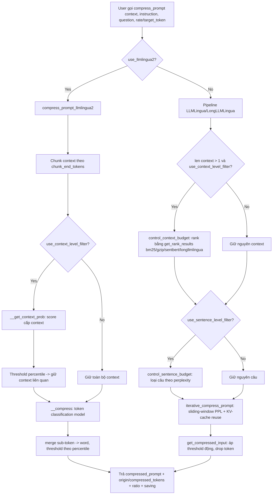
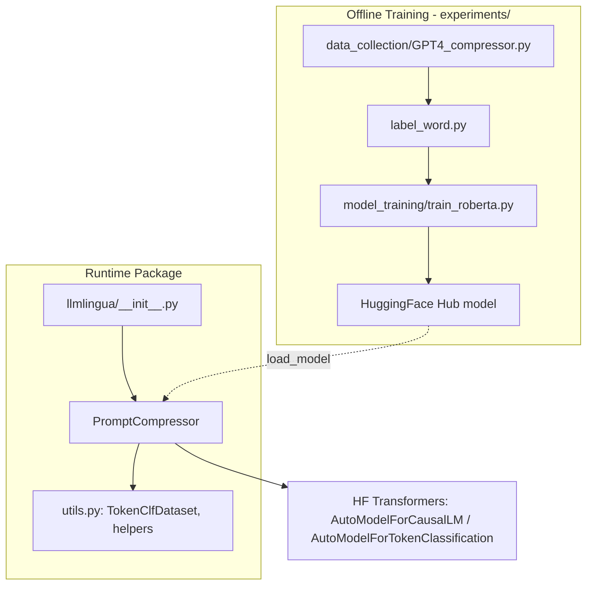

# Báo Cáo Phân Tích — LLMLingua

## Tổng Quan (TL;DR)
LLMLingua là một thư viện giúp rút gọn văn bản đưa vào các mô hình AI mà vẫn giữ được phần lớn ý nghĩa — có thể nén tới 20 lần trong khi chất lượng câu trả lời gần như không đổi. Nó dùng chính các mô hình ngôn ngữ nhỏ để "đoán" phần nào của văn bản quan trọng cần giữ, phần nào có thể bỏ bớt.

## Thông Tin Kỹ Thuật (Technical Overview)
- **Stack:** Thư viện nghiên cứu của Microsoft, Python, PyTorch, HuggingFace Transformers, tiktoken, nltk. Gồm 3 thế hệ thuật toán trong cùng một package: **LLMLingua** (perplexity-based, dùng causal LM nhỏ như GPT2/LLaMA/Phi-2 để đo "độ bất ngờ" của từng token), **LongLLMLingua** (mở rộng cho RAG dài, chống "lost in the middle"), và **LLMLingua-2** (token-classification nhanh hơn 3-6x, huấn luyện qua data distillation từ GPT-4). Toàn bộ core logic nằm trong đúng 1 file `llmlingua/prompt_compressor.py` (2455 dòng).
- **Quy mô/Độ trưởng thành:** Maturity: nghiên cứu production-grade (đã tích hợp LangChain, LlamaIndex, Prompt flow), version hiện tại 0.2.2, MIT license.

## Luồng Chính (Main Flow)

## Tính Năng Nổi Bật (Best Features)
1. **Coarse-to-Fine 3-Tầng Compression (Context → Sentence → Token)**
   - *Là gì:* Thay vì rút gọn văn bản trong một bước, hệ thống lọc dần từ thô đến tinh — bỏ hẳn đoạn không liên quan trước, rồi bỏ câu, rồi mới bỏ từng từ — để việc tính toán tốn kém nhất chỉ phải chạy trên phần văn bản còn ít ỏi cuối cùng.
   - *Cách triển khai:* `control_context_budget` loại bỏ toàn bộ đoạn văn (context) không liên quan bằng ranking (`llmlingua/prompt_compressor.py:1173-1241`), `control_sentence_budget` loại câu (`:1243` trở đi), và `iterative_compress_prompt` loại từng token dựa trên perplexity (`:1523-1749`). Thiết kế cho phép áp dụng ngân sách token (`target_token`) phân bổ dần qua từng tầng — giảm chi phí tính toán vì các tầng thô loại bỏ nhanh trước khi tầng tinh (tốn kém nhất, cần forward-pass LM) chỉ chạy trên phần còn lại.
2. **KV-Cache Reuse trong Iterative Token Dropping**
   - *Là gì:* Khi xử lý văn bản dài theo từng đoạn nhỏ nối tiếp nhau, hệ thống tái sử dụng những gì đã tính được từ đoạn trước thay vì tính lại từ đầu — giúp xử lý văn bản rất dài nhanh hơn nhiều mà không tốn thêm bộ nhớ.
   - *Cách triển khai:* Vòng lặp `iterative_compress_prompt` (`:1523`) chia văn bản thành cửa sổ `iterative_size` (mặc định 200 token), tính perplexity bằng 1 forward-pass duy nhất có `past_key_values` tái sử dụng qua các cửa sổ kế tiếp (`:1636-1662`), tránh phải re-encode toàn bộ context mỗi vòng. Khi vượt `max_position_embeddings`, có cơ chế "pop" KV-cache cũ (`:1588-1634`) để giữ cửa sổ trượt trong giới hạn context length của model nén — một kỹ thuật quản lý bộ nhớ tinh vi hiếm gặp trong code nghiên cứu.
3. **Question-Conditioned Perplexity (LongLLMLingua)**
   - *Là gì:* Khi biết trước câu hỏi người dùng đang hỏi, hệ thống ưu tiên giữ lại những phần văn bản thực sự liên quan tới câu hỏi đó, thay vì giữ lại những phần "nghe có vẻ quan trọng" một cách chung chung.
   - *Cách triển khai:* `condition_in_question`/`condition_compare` cho phép tính perplexity của mỗi token *có điều kiện theo câu hỏi* (đặt câu hỏi trước context khi encode, `condition_in_question="after"`), rồi so sánh với perplexity không điều kiện để ước lượng "độ liên quan đến câu hỏi" của từng đoạn (`get_distance_longllmlingua` trong `get_rank_results`, `:2032`). Đây là ý tưởng cốt lõi giúp LongLLMLingua giữ lại thông tin liên quan tới câu hỏi thay vì chỉ giữ thông tin "informative" chung chung.
4. **LLMLingua-2: Token Classification thay Perplexity**
   - *Là gì:* Một phiên bản nhanh hơn nhiều lần, dùng một mô hình nhỏ gọn để phân loại trực tiếp "giữ hay bỏ" từng từ, thay vì phải suy luận từng bước tuần tự như phiên bản gốc — phù hợp hơn khi cần tốc độ cao.
   - *Cách triển khai:* Thay vì cần 1 causal LM sinh perplexity (chậm, cần nhiều forward pass tuần tự), LLMLingua-2 dùng encoder nhỏ (BERT/XLM-RoBERTa) làm bài toán classification nhị phân "giữ/bỏ" cho mỗi token, chạy 1 forward-pass duy nhất, batch song song (`__compress`, `:2304-2453`). Có `__merge_token_to_word` + `__token_prob_to_word_prob` để gộp xác suất sub-token thành xác suất cấp từ (đảm bảo không cắt giữa từ), threshold chọn bằng percentile của phân phối xác suất (`np.percentile`, `:2407`). Nhanh hơn 3-6x, tốt hơn khi domain khác với data huấn luyện của causal LM gốc.
5. **Structured JSON Compression**
   - *Là gì:* Cho phép nén có chọn lọc bên trong dữ liệu có cấu trúc như JSON — ví dụ giữ nguyên tên trường nhưng rút gọn nội dung giá trị dài, hữu ích khi dữ liệu đưa vào AI có định dạng rõ ràng thay vì chỉ là văn xuôi.
   - *Cách triển khai:* `compress_json`/`structured_compress_prompt` (`:215-424`) cho phép áp đặt tag `<llmlingua rate=... compress=...>` lồng trong JSON để nén selective theo từng key/value (ví dụ giữ nguyên key nhưng nén value dài), dùng trong RAG có payload có cấu trúc. `process_structured_json_data` trong `llmlingua/utils.py:123-151` build lại chuỗi context với annotation tag.

## Áp Dụng Cho Auto Code OS (Applied Takeaways — ranked)
1. **Token-classification compression cho context injection (kiểu LLMLingua-2)** — What: Thay vì causal-LM perplexity (chậm, cần GPU riêng), dùng encoder nhỏ fine-tuned để phân loại "giữ/bỏ" từng token trong context được đưa vào prompt (file tree, diff, log). Cơ chế: `PromptCompressor.compress_prompt_llmlingua2` (`llmlingua/prompt_compressor.py:727-973`). Apply: Auto Code OS build context cho agent tại `server/internal/context/` (repo analysis) trước khi nạp vào `server/internal/prompts/`. Thêm bước "context compression" tùy chọn (gọi ra 1 service Python nhỏ hoặc port logic threshold-based sang Go) áp dụng cho các block context lớn (file content, test output) trước khi nhét vào prompt template, giảm token spend trên LLM Gateway (`server/pkg/llm/`). Impact: H · Effort: H (cần model riêng hoặc port thuật toán) · Risk: M (nén sai có thể làm mất thông tin quan trọng, cần test kỹ) · Est: 1-2 tuần (PoC).
2. **Coarse-to-fine budget theo 3 tầng (context → sentence → token)** — What: Ý tưởng phân bổ ngân sách token dần dần từ thô đến tinh, không cần model ML — có thể làm bằng heuristic ranking (BM25/keyword score) thay vì perplexity. Cơ chế: `control_context_budget` (`:1173`), `control_sentence_budget` (`:1243`). Apply: Áp dụng ngay cho `server/internal/context/` khi build context từ nhiều file: bước 1 loại file không liên quan bằng relevance score (đã có sẵn trong repo analysis), bước 2 loại đoạn/hàm không liên quan, bước 3 (optional) cắt bớt whitespace/comment dư thừa. Không cần LLM riêng — port logic sang Go thuần dựa trên `target_token` budget giống `iterative_ratios` (`get_dynamic_compression_ratio`, `:1023`). Impact: H · Effort: M · Risk: L · Est: 3-5 ngày.
3. **Force-token / force-context preservation cho code & path** — What: `force_tokens`, `force_context_ids`, `force_reserve_digit` đảm bảo các token quan trọng (dấu câu, số, token bắt buộc) không bị nén mất (`:463-465`, `:742-744`, `get_pure_token`/`is_begin_of_new_word` trong `llmlingua/utils.py:81-120`). Apply: Nếu Auto Code OS làm compression cho code snippet/diff đưa vào `server/internal/orchestrator/gitops/`, cần whitelist các token có ý nghĩa cú pháp (dấu ngoặc, tên biến, số dòng diff `@@`) không bao giờ bị cắt — tránh nén phá vỡ code hợp lệ. Impact: M · Effort: L · Risk: L · Est: 1-2 ngày.
4. **Structured tag-based selective compression (`<llmlingua rate=...>`)** — What: Annotate từng phần payload có cấu trúc (JSON/dict) với rate nén riêng, giữ nguyên key nhưng nén value (`process_structured_json_data`, `llmlingua/utils.py:123-151`). Apply: `server/internal/prompts/` (Go templates) có thể áp dụng ý tưởng tương tự: đánh dấu block nào trong template (ví dụ log output, test stacktrace) được phép nén, block nào (system instruction, task ID) luôn giữ nguyên — implement bằng annotation trong template thay vì regex tag như LLMLingua. Impact: M · Effort: M · Risk: L · Est: 2-3 ngày.
5. **Đo lường "saving" (ước tính $ tiết kiệm) trả về cùng kết quả compress** — What: Mọi hàm compress trả về dict có `origin_tokens`, `compressed_tokens`, `ratio`, `rate`, `saving` (ước tính USD dựa trên giá GPT-4, `:893, :951`). Apply: `server/pkg/llm/` nên log các field tương tự mỗi khi context được rút gọn trước khi gọi provider, để dashboard chi phí (`web/src/app/`) hiển thị token/$ tiết kiệm theo từng task — tận dụng observability sẵn có mà không cần thêm hạ tầng. Impact: M · Effort: L · Risk: L · Est: 1 ngày.

## Kiến Trúc (Architecture)
LLMLingua là **monolithic single-class library**, không phải service — toàn bộ API expose qua class `PromptCompressor` (`llmlingua/prompt_compressor.py:36`). Không có dependency injection, không có plugin architecture; các biến thể thuật toán (LLMLingua v1, LongLLMLingua, LLMLingua-2, SecurityLingua) được chọn qua constructor flags (`use_llmlingua2`, `use_slingua`) rồi rẽ nhánh nội bộ trong `compress_prompt` (`:536-556`: nếu `use_llmlingua2` thì gọi thẳng `compress_prompt_llmlingua2`, nếu không thì chạy pipeline perplexity gốc). Đây là lựa chọn hợp lý cho research library (dễ đọc tuần tự, ít abstraction) nhưng sẽ khó mở rộng nếu thêm nhiều biến thể mới (file 2455 dòng, method `compress_prompt` với hơn 30 tham số).

Dependency direction: `llmlingua/__init__.py` → `prompt_compressor.py` → `utils.py` (dataset class + helper functions thuần, không phụ thuộc ngược). `experiments/` (data collection, training script cho model LLMLingua-2/SecurityLingua) hoàn toàn tách biệt khỏi package `llmlingua/` runtime — chỉ dùng để train model rồi publish lên HuggingFace Hub, sau đó `PromptCompressor` load về qua `AutoModelForTokenClassification`/`AutoModelForCausalLM`.

Confidence: High (đọc trực tiếp `__init__.py`, `prompt_compressor.py`, `utils.py`, cấu trúc `experiments/`).

### ADR Suy Luận (Inferred ADRs)
| Quyết Định | Bằng Chứng | Lợi Ích | Đánh Đổi | Confidence |
|---|---|---|---|---|
| Một class `PromptCompressor` duy nhất cho cả 3+ thuật toán | `compress_prompt` rẽ nhánh `if self.use_llmlingua2` (`:536`) | API đơn giản, 1 entry point cho user | File monolith 2455 dòng, method có 30+ tham số, khó test unit riêng lẻ | High |
| Dùng token-classification model riêng (không phải LLM lớn) cho LLMLingua-2 | `AutoModelForTokenClassification`, `TokenClfDataset` (`utils.py:13`) | Nhanh hơn 3-6x, không cần GPU lớn | Cần train + host model riêng biệt (BERT/XLM-R), thêm bước MLOps | High |
| Threshold chọn bằng percentile động (`np.percentile`) thay vì ngưỡng cố định | `:850`, `:2407` | Tự động thích nghi theo phân phối perplexity/probability của từng batch, không cần tune tay | Không đảm bảo target_token chính xác tuyệt đối (chỉ xấp xỉ) — README ghi rõ "actual compression rate is generally lower than specified" | High |
| Tái sử dụng KV-cache qua sliding window trong `iterative_compress_prompt` | `:1636-1662`, `past_key_values` cat/pop | Giảm re-computation, quan trọng khi context dài hơn `max_position_embeddings` | Code phức tạp, nhiều edge-case off-by-one (index `end - iterative_size`) khó bảo trì | Medium |
| Tag `<llmlingua rate=... compress=...>` nhúng trong chuỗi text cho structured compression | `structured_compress_prompt` docstring (`:306-309`), `utils.py:123-238` | Không cần thay đổi schema API, tận dụng lại pipeline compress cũ | Parse tag bằng string manipulation dễ vỡ nếu payload chứa ký tự đặc biệt | Medium |

## Design Patterns & Chất Lượng Code
- **Strategy Pattern qua flag, không qua interface**: `rank_method` (`"llmlingua"`, `"longllmlingua"`, `"bm25"`, `"gzip"`, `"sentbert"`, ...) chọn strategy ranking bằng if/elif string bên trong `get_rank_results` (`:1818-2071`), mỗi biến thể là 1 closure lồng nhau (`get_distance_bm25`, `get_distance_gzip`, `get_distance_sentbert`, v.v.). Đơn giản, dễ thêm biến thể mới, nhưng không type-safe và khó unit test độc lập từng strategy vì chúng là hàm lồng bên trong method lớn.
- **Docstring cực kỳ chi tiết**: Mọi public method (`compress_prompt`, `structured_compress_prompt`, `compress_prompt_llmlingua2`) có docstring Google-style liệt kê từng tham số + giải thích công thức toán (compression rate) + trích dẫn paper gốc. Tốt cho thư viện nghiên cứu công khai nhưng khiến class primary khó "lướt đọc" (mỗi method 50-150 dòng docstring).
- **Private methods dùng name-mangling `__`**: `__compress`, `__chunk_context`, `__merge_token_to_word`, `__token_prob_to_word_prob`, `__get_context_prob` (Python double-underscore) — rõ ràng phân định API công khai vs nội bộ, nhưng gây khó khăn khi viết test vì Python mangling (`_PromptCompressor__compress`).
- **Không có custom exception/error taxonomy**: Lỗi được raise qua `assert` thô (`:556-558`, `:564-566`) hoặc `NotImplementedError`/`ValueError` chung chung trong `utils.py` (`:41, :101, :120, :210`) — không có exception class riêng cho domain (ví dụ `CompressionError`), khó phân biệt lỗi cấu hình vs lỗi runtime khi tích hợp vào hệ thống lớn hơn.
- **Testing**: 3 file test end-to-end (`tests/test_llmlingua.py`, `test_longllmlingua.py`, `test_llmlingua2.py`, tổng 494 dòng) — kiểm tra output cụ thể (string match) sau khi load model thật, không mock. Đây là integration test nặng (cần tải model, cần GPU/CPU đủ mạnh), không có unit test tách biệt cho các hàm thuần như `get_estimate_threshold_base_distribution` hay `__merge_token_to_word`.

## Kỹ Thuật Thú Vị & Thực Hành Kỹ Thuật
- **Threshold ước lượng bằng phân phối thống kê**: `get_estimate_threshold_base_distribution` (`:1508`, dùng trong `iterative_compress_prompt:1712`) và `np.percentile` trong LLMLingua-2 (`:2407`) đều chọn ngưỡng "giữ/bỏ" động dựa trên phân phối loss/probability thực tế của batch hiện tại, thay vì hard-code — giúp thuật toán tổng quát hoá tốt hơn across nhiều loại văn bản.
- **Xử lý tokenizer mismatch (oai_tokenizer vs model tokenizer)**: Vì `origin_tokens`/`compressed_tokens` cần phản ánh chi phí thực tế trên GPT-3.5/4 (không phải trên tokenizer của model nén nội bộ), code dùng riêng `self.oai_tokenizer = tiktoken.encoding_for_model("gpt-3.5-turbo")` (`:89`) để đo token count cho báo cáo, tách biệt khỏi tokenizer dùng để chạy model nén. Chi tiết dễ bị bỏ sót nhưng quan trọng cho tính đúng đắn của con số "saving".
- **Word-boundary awareness across tokenizer families**: `is_begin_of_new_word`/`get_pure_token` (`llmlingua/utils.py:81-120`) xử lý khác nhau cho BERT-style (`##` prefix) và XLM-RoBERTa-style (`▁` prefix) để đảm bảo việc gộp sub-token thành từ không làm hỏng nghĩa khi threshold cắt ngay giữa 1 từ.
- **`seed_everything`** (`utils.py:71-78`) set seed cho random/numpy/torch/cudnn cùng lúc — thực hành chuẩn cho reproducibility trong code nghiên cứu, được gọi tự động khi `init_llmlingua2` (`:100`).

## Engineering Gems
1. `llmlingua/prompt_compressor.py:1588-1634` — Vấn đề: khi context vượt quá `max_position_embeddings` của model nén, không thể giữ toàn bộ KV-cache trong sliding window. Cách làm phổ biến (yếu hơn): re-encode lại từ đầu mỗi khi vượt giới hạn, tốn O(n²) tổng thể. Vì sao elegant: code "pop" phần đầu KV-cache (`torch.cat([k[..., :s, :], k[..., s+e:, :]], dim=-2)`) để giữ `cache_bos_num` token đầu (thường chứa instruction quan trọng) + phần cuối cửa sổ hiện tại, dồn phần đã xử lý ra `pop_compressed_input_ids` — đạt O(n) tổng thể mà vẫn giữ ngữ cảnh đầu văn bản. Đánh đổi: code rất khó đọc/debug (nhiều biến offset lồng nhau), không có comment giải thích invariant. Bài học rút ra: khi cần xử lý sliding-window trên sequence dài hơn context limit, tách rõ "phần đã chốt" (immutable, append vào kết quả) khỏi "phần đang xử lý" (mutable window) — pattern này áp dụng được cho streaming log compression trong Auto Code OS.
2. `llmlingua/prompt_compressor.py:999-1021` (get_condition_ppl) kết hợp với `condition_compare` — Vấn đề: đo "độ quan trọng" của 1 đoạn văn theo câu hỏi cụ thể, không chỉ độ "informative" chung. Cách làm phổ biến (yếu hơn): dùng embedding similarity (cosine) giữa câu hỏi và đoạn văn — nhanh nhưng không nắm được ngữ cảnh sinh xác suất của LM. Vì sao elegant: so sánh perplexity của cùng đoạn văn *có* và *không có* câu hỏi đứng trước — token nào giảm perplexity nhiều khi biết câu hỏi thì token đó "liên quan tới câu hỏi", giữ lại ưu tiên. Đánh đổi: cần 2x forward-pass (with/without condition), tốn compute gấp đôi cho tầng token-level. Bài học: đo relevance bằng chênh lệch perplexity có-điều-kiện là kỹ thuật generalizable cho bất kỳ bài toán "compress nhưng giữ phần liên quan tới query" nào — áp dụng được khi Auto Code OS cần rút gọn context nhưng giữ phần liên quan tới task hiện tại.
3. `llmlingua/utils.py:123-238` (`process_structured_json_data`, `precess_jsonKVpair`, `process_sequence_data`) — Vấn đề: cần nén selective bên trong 1 cấu trúc JSON (giữ key, nén value; giữ số/bool nguyên vẹn) mà không viết riêng 1 JSON-aware compressor. Cách làm phổ biến (yếu hơn): viết parser JSON riêng biệt để duyệt cây và áp rate khác nhau cho từng node — nhiều code hơn, dễ lỗi khi JSON có cấu trúc phức tạp (nested list/dict). Vì sao elegant: encode lại toàn bộ cấu trúc JSON thành 1 chuỗi text có annotation tag `<llmlingua rate=... compress=...>` rồi tái sử dụng nguyên xi pipeline `compress_prompt` có sẵn — không phải viết logic nén JSON riêng, chỉ cần "compile" JSON → tagged text → decode ngược. Đánh đổi: string-based tag dễ vỡ nếu value chứa ký tự `<`/`>`, và phải `json.loads` lại sau khi nén (`compress_json:271`) nên lỗi cú pháp JSON có thể xảy ra nếu nén cắt vào dấu ngoặc. Bài học: khi cần nén 1 cấu trúc dữ liệu có schema, có thể "biên dịch" nó về representation phẳng (flat text + annotation) để tái dùng pipeline nén text hiện có, thay vì viết compressor riêng cho từng loại dữ liệu.

## Top 10 Điều Đáng Học
| # | Khái Niệm | File | Vì Sao Hữu Ích | Độ Khó | Thứ Tự |
|---|---|---|---|---|---|
| 1 | Coarse-to-fine 3 tầng nén (context/sentence/token) | `prompt_compressor.py:1173-1402` | Pattern tổng quát cho bất kỳ hệ thống rút gọn context nào | ⭐⭐⭐ | 1 |
| 2 | Percentile-based dynamic threshold | `prompt_compressor.py:850, 2407`, `:1508` | Ngưỡng tự thích nghi, không cần tune tay | ⭐⭐ | 2 |
| 3 | Token classification thay perplexity (LLMLingua-2) | `prompt_compressor.py:727-973`, `:2304-2453` | Cách tiếp cận nhanh hơn 3-6x, dễ port sang production | ⭐⭐⭐ | 3 |
| 4 | Question-conditioned perplexity (LongLLMLingua) | `prompt_compressor.py:999-1021`, `:2032-2071` | Đo relevance theo query, không chỉ độ "informative" | ⭐⭐⭐⭐ | 4 |
| 5 | KV-cache sliding window reuse | `prompt_compressor.py:1523-1749` | Tối ưu compute cho sequence dài hơn context limit | ⭐⭐⭐⭐⭐ | 5 |
| 6 | Word-boundary merge cho sub-token | `utils.py:81-120`, `prompt_compressor.py:2255-2303` | Tránh cắt token phá vỡ nghĩa từ | ⭐⭐⭐ | 6 |
| 7 | Structured JSON compression qua tag annotation | `utils.py:123-238` | Tái dùng pipeline text-compress cho dữ liệu có cấu trúc | ⭐⭐⭐ | 7 |
| 8 | Force-token preservation | `prompt_compressor.py:463-465, 742-744` | Đảm bảo token quan trọng (số, cú pháp) không bị mất | ⭐⭐ | 8 |
| 9 | Pluggable ranking strategies (bm25/gzip/sentbert/openai) | `prompt_compressor.py:1818-2071` | Nhiều lựa chọn ranking context theo chi phí/độ chính xác | ⭐⭐ | 9 |
| 10 | Tách oai_tokenizer khỏi model tokenizer để đo chi phí | `prompt_compressor.py:89, 578-582` | Đo đúng "tiền tiết kiệm" trên API đích, không lệ thuộc tokenizer nội bộ | ⭐ | 10 |

## Hướng Dẫn Đọc (Reading Guide)
**L0 Build & Run:** `pyproject.toml`, `setup.py`, README mục "Quick Start" (`pip install llmlingua`, ví dụ `PromptCompressor()` + `compress_prompt`).
**L1 Entry Points:** `llmlingua/__init__.py` (export `PromptCompressor`), `llmlingua/prompt_compressor.py:71` (`__init__`), `:426` (`compress_prompt` — điểm vào chính cho cả 2 thuật toán).
**L2 Core Abstractions:** `iterative_compress_prompt` (`:1523`, LLMLingua v1/Long), `compress_prompt_llmlingua2` (`:727`, LLMLingua-2), `control_context_budget`/`control_sentence_budget` (`:1173`, `:1243`).
**L3 Architecture Glue:** `utils.py` (helper functions thuần + `TokenClfDataset`), `get_rank_results` (`:1818`, các strategy ranking).
**L4 Engineering Gems:** KV-cache pop logic (`:1588-1634`), `get_condition_ppl` (`:999`), `process_structured_json_data` (`utils.py:123`).
**L5 Reimplement:** Bắt đầu port ý tưởng "coarse-to-fine budget + percentile threshold" (không cần ML model) sang Go cho `server/internal/context/`, sau đó nếu cần độ chính xác cao hơn mới cân nhắc port token-classification model (LLMLingua-2) như 1 service Python riêng gọi qua gRPC/HTTP từ `server/pkg/llm/`.

## Anti-Patterns & Không Nên Copy
1. **Method với 30+ tham số**: `compress_prompt` (`:426-467`) và `structured_compress_prompt` (`:274-301`) có hơn 25-30 tham số keyword, nhiều tham số phụ thuộc lẫn nhau theo cách không tường minh (ví dụ `condition_in_question` bị string-manipulate thêm hậu tố `_condition` ở `:598-599, 567-568`). Với Auto Code OS, nếu port ý tưởng này nên tách thành `CompressionConfig` struct/options pattern trong Go thay vì flat parameter list, và tránh string-flag mang nhiều nghĩa cùng lúc.
2. **Lỗi qua `assert` thô, không có error taxonomy**: `assert rate <= 1.0, "Error: ..."` (`:556-558`) sẽ bị strip khi Python chạy với `-O` flag (optimization), và không phân biệt được lỗi cấu hình vs lỗi logic khi tích hợp vào pipeline lớn hơn. Auto Code OS nên dùng error wrapping có mã lỗi rõ ràng (Go: `errors.Is`/custom error types) thay vì assert.
3. **Coupling chặt vào chuỗi string-tag cho structured data** (`<llmlingua rate=...>` nhúng trong text, `utils.py:123-238`): dễ vỡ khi dữ liệu chứa ký tự đặc biệt (`<`, `>`, dấu ngoặc kép chưa escape), và phải `json.loads` lại kết quả nén (rủi ro parse lỗi nếu nén cắt sai vị trí, `prompt_compressor.py:268-271`). Nếu Auto Code OS cần nén dữ liệu có schema (ví dụ diff JSON), nên dùng structured representation (AST/tree) thay vì flatten về tagged string.
4. **Toàn bộ core logic gói trong 1 class 2455 dòng**: dễ đọc tuần tự cho research nhưng không mở rộng tốt cho nhiều biến thể thuật toán tương lai (đã thấy: v1 → Long → v2 → SecurityLingua, mỗi lần thêm 1 flag boolean mới + if/elif rẽ nhánh). Auto Code OS nên tách theo interface/strategy pattern ngay từ đầu nếu port ý tưởng này.

## Câu Hỏi Đáng Suy Ngẫm
1. Ngưỡng percentile động (`np.percentile`) đảm bảo tỉ lệ nén tương đối chính xác trên batch hiện tại, nhưng không đảm bảo `target_token` tuyệt đối (README tự thừa nhận "actual rate is generally lower than specified") — nếu Auto Code OS cần budget token *cứng* (ví dụ context window giới hạn nghiêm ngặt của 1 model), có nên thêm 1 vòng lặp điều chỉnh threshold tới khi đạt đúng target, đánh đổi thêm compute?
2. Việc tách biệt hoàn toàn `experiments/` (training) khỏi `llmlingua/` (runtime) là baseline tốt cho reproducibility, nhưng liệu Auto Code OS có cần tự train model classification riêng cho domain code (thay vì dùng model MeetingBank pretrained), và chi phí MLOps đó có đáng so với lợi ích so với heuristic thuần (BM25/keyword)?
3. Cơ chế KV-cache sliding-window rất tối ưu về compute nhưng cực kỳ phức tạp để bảo trì (nhiều offset index thủ công) — ranh giới nào là hợp lý giữa "tối ưu hiệu năng tối đa" và "code có thể bảo trì được bởi team khác ngoài tác giả gốc"?

## Đánh Giá Tổng Thể
| Architecture | Maintainability | Scalability | Clean Code | Learning Value |
|---|---|---|---|---|
| 6/10 | 5/10 | 7/10 | 5/10 | 9/10 |

## Lộ Trình Học Tập
- **Tuần 1**: Đọc README + chạy thử `examples/LLMLingua2.ipynb` và `examples/RAG.ipynb` để hiểu trực quan trade-off giữa rate/target_token và chất lượng output. Đọc `llmlingua/__init__.py`, `compress_prompt` (`:426-727`) để nắm luồng chính LLMLingua v1/Long.
- **Tuần 2**: Đọc sâu `iterative_compress_prompt` (`:1523-1749`) cùng `get_dynamic_compression_ratio` (`:1023`) và `get_compressed_input` (`:1402`) — vẽ lại state machine của sliding window + KV-cache để hiểu cơ chế pop/reuse.
- **Tuần 3**: Đọc `compress_prompt_llmlingua2` (`:727-973`) và `__compress` (`:2304-2453`) — so sánh cách tiếp cận classification vs perplexity, thử tự train 1 classifier nhỏ bằng script trong `experiments/llmlingua2/model_training/`.
- **Tuần 4**: Prototype port ý tưởng "coarse-to-fine budget + percentile threshold" (không cần ML) sang Go cho `server/internal/context/` trong Auto Code OS — bắt đầu bằng heuristic ranking (giống `get_distance_bm25`) trước khi cân nhắc gọi model riêng qua service Python.
