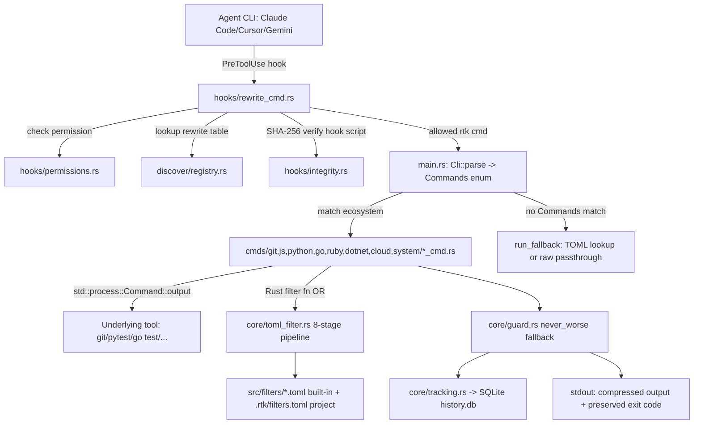
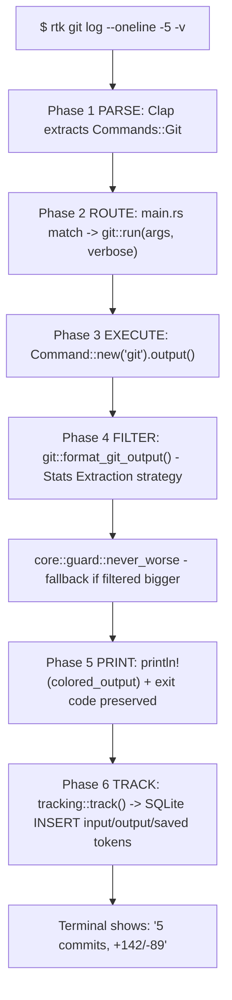

# Báo Cáo Phân Tích — rtk (Rust Token Killer)

## Tổng Quan
CLI proxy viết bằng Rust, đứng giữa agent (Claude Code, Codex, Cursor, Gemini CLI...) và hơn 100 công cụ dev (git, cargo, pytest, go test, docker, kubectl...), lọc/nén output trước khi nó vào context LLM, tiết kiệm 60–90% token.
Stack: Rust 2021 (single binary, `panic = "abort"`, LTO), SQLite (rusqlite bundled) cho tracking, TOML DSL cho filter cấu hình. Quy mô: ~36.000 dòng Rust trong `src/`, 64 module lệnh + hạ tầng, 64 file TOML filter, hỗ trợ 9 coding agent qua hook system (`hooks/claude`, `hooks/cursor`, `hooks/gemini`...). Version 0.42.4, dự án mature (release-please tự động hoá versioning, semgrep CI, đa ngôn ngữ README).

## Tính Năng Nổi Bật (Best Features)
1. **Command Proxy Architecture với 12 chiến lược filter đã phân loại rõ ràng** — `main.rs` định nghĩa một `Commands` enum (Clap derive) khổng lồ (~850 dòng, dòng 82–846) ánh xạ mọi lệnh (`rtk git status`, `rtk pytest`, `rtk go test`...) sang module filter tương ứng trong `src/cmds/<ecosystem>/`. Mỗi ecosystem dùng chiến lược nén phù hợp: Stats Extraction (git log/status), Failure Focus (test runners), NDJSON Streaming (`go test`), State Machine Parsing (pytest), JSON/Text Dual Mode (ruff). Tài liệu hoá đầy đủ trong `docs/contributing/ARCHITECTURE.md` (12 strategy taxonomy, dòng 199–308). Kết quả đo: 60–99% token reduction tuỳ ecosystem.
2. **TOML Filter DSL — "config thay vì code" cho việc mở rộng filter** — `src/core/toml_filter.rs` (1972 dòng) định nghĩa pipeline 8 giai đoạn khai báo (strip_ansi → replace → match_output short-circuit → strip/keep lines → truncate → head/tail → max_lines → on_empty), build từ 64 file TOML trong `src/filters/*.toml` được `build.rs` gộp lại (`include_str!(concat!(env!("OUT_DIR"), "/builtin_filters.toml"))`, dòng 32) và embed vào binary lúc compile. Mỗi filter TOML có `[[tests.<filter>]]` inline test cases (ví dụ `src/filters/gradle.toml` dòng 22-35: input/expected pairs chạy qua `rtk verify`). Lookup ưu tiên: `.rtk/filters.toml` (project-local) → `~/.config/rtk/filters.toml` (global) → built-in → passthrough (dòng 5-8). Thêm 1 tool mới ⇒ thêm 1 file TOML, không cần recompile logic Rust cho case đơn giản.
3. **Never-worse Guard — bảo đảm output filter không bao giờ tệ hơn raw** — `src/core/guard.rs::never_worse()` (17 dòng) so sánh `estimate_tokens(filtered)` với `estimate_tokens(raw)` và fallback về raw nếu filter làm output *lớn hơn* (case JSON pretty-print thêm khoảng trắng). Đơn giản, không phụ thuộc gì, được test kỹ (6 test case bao gồm cả tie-breaking và empty input).
4. **Hook Rewrite System với Integrity Verification chống command-injection** — `src/hooks/rewrite_cmd.rs::evaluate()` (dòng 47-65) kết hợp permission check (`hooks/permissions.rs` — deny/ask/allow theo đúng rule của Claude Code, ưu tiên Deny > Ask > Allow > Default-ask) với registry rewrite (`discover/registry.rs`, 4617 dòng — bảng ánh xạ command gốc → rtk equivalent). Vì hook `rtk-rewrite.sh` có quyền auto-approve lệnh đã rewrite (bypass permission prompt), rtk tự bảo vệ bằng `src/hooks/integrity.rs`: SHA-256 hash của hook script được lưu tại install-time (`store_hash`, dòng 79) và verify runtime trước mỗi lệnh "operational" (`hooks::integrity::runtime_check()` gọi từ `main.rs` dòng 1566-1567) — phát hiện nếu ai đó sửa hook script ngoài `rtk init` (tham chiếu tới security advisory nội bộ SA-2025-RTK-001).
5. **SQLite Token Tracking + Economics Reporting** — `src/core/tracking.rs` (1689 dòng) ghi mỗi lệnh vào `~/.local/share/rtk/history.db` (bảng `commands`: input/output/saved tokens, savings_pct, exec_time_ms), ước lượng token bằng heuristic 4 ký tự/token (`estimate_tokens`, doctested dòng 1277-1282), tự động dọn dữ liệu >90 ngày. `rtk gain` và `src/analytics/gain.rs` + `cc_economics.rs` tổng hợp báo cáo so sánh chi phí Claude Code (ccusage) với mức tiết kiệm token thực tế — biến "token saving" từ tuyên bố marketing thành số liệu đo được của từng dự án.

## Áp Dụng Cho Auto Code OS (Applied Takeaways — ranked)
1. **TOML/YAML declarative filter DSL cho tool-output compression** — What: Pipeline 8 stage khai báo (strip_ansi → replace regex → short-circuit match → line filter → truncate → head/tail → max_lines → on_empty) trong `src/core/toml_filter.rs`, mỗi filter có inline test case. Apply: Auto Code OS hiện xử lý output của sandbox commands (build/test/lint chạy trong Docker) và gửi raw log về LLM qua `server/internal/tool/` — tạo `server/internal/tool/filter/` với cấu hình YAML tương tự (Go có `gopkg.in/yaml.v3`), áp dụng trước khi log build/test được đưa vào prompt context ở `server/internal/prompts/`. Impact: H · Effort: M · Risk: L · Est: 4-5 ngày.
2. **Never-worse Guard (fail-safe fallback)** — What: `core::guard::never_worse()` so token-count filtered vs raw, fallback raw nếu filter phản tác dụng — đơn giản 12 dòng logic, luôn an toàn. Apply: Wrap mọi output-compression step trong `server/internal/tool/` (kết quả tool execution trả về orchestrator) bằng helper tương tự trước khi ghi vào DB / gửi cho LLM gateway (`server/pkg/llm/`), tránh trường hợp nén JSON lại phình to hơn do format lại. Impact: M · Effort: L (rất nhỏ) · Risk: L · Est: 0.5 ngày.
3. **SQLite/Postgres-backed token savings tracking + gain report** — What: `core::tracking` ghi input/output token, savings_pct, exec_time_ms mỗi lệnh, `rtk gain` tổng hợp báo cáo theo project/thời gian. Apply: Auto Code OS đã có Postgres (`server/internal/database/`) — thêm bảng `tool_output_compression_stats` (task_id, tool_name, raw_tokens, compressed_tokens, saved_pct) ghi trong quá trình DAG chạy tool, phục vụ dashboard "token saved" ở `web/src/app/` cho từng task. Impact: M · Effort: M · Risk: L · Est: 2-3 ngày.
4. **Exit-code / structured-result preservation qua proxy layer** — What: Mọi module filter của rtk giữ nguyên exit code gốc (`std::process::exit(output.status.code().unwrap_or(1))`, pattern lặp lại toàn bộ `src/cmds/*`) để không phá vỡ CI/CD semantics dù output đã bị nén. Apply: Khi `server/internal/sandbox/` chạy lệnh build/test trong Docker container và tool framework (`server/internal/tool/`) tóm tắt output cho LLM, đảm bảo status/exit-code field tách biệt khỏi phần "compressed log" được truyền lên DAG state — hiện cần audit xem `server/internal/orchestrator/` có đang lẫn lộn 2 khái niệm này không. Impact: M · Effort: L · Risk: L · Est: 1 ngày audit + fix nếu cần.
5. **Integrity-verified auto-rewrite hook cho command an toàn hơn** — What: `hooks/integrity.rs` lưu SHA-256 hash của hook script bị agent tự động tin cậy, verify runtime để chặn command-injection nếu hook bị sửa ngoài luồng chính thức. Apply: Nếu Auto Code OS cho phép agent tự sinh/sửa script chạy trong sandbox (`server/internal/sandbox/`) hoặc custom tool definitions trong `server/internal/tool/`, áp dụng cùng pattern: hash + verify trước khi execute các script do agent generate mà được auto-trust. Impact: M (security) · Effort: M · Risk: L · Est: 2 ngày.

## Kiến Trúc (Architecture)
rtk là kiến trúc **Proxy/Adapter layered**: entry point (`main.rs`) → Clap parser (định nghĩa `Commands` enum static) → routing sang module filter theo ecosystem (`src/cmds/<ecosystem>/*_cmd.rs`) → mỗi module gọi `Command::new(tool).output()` để chạy tool gốc → áp filter (Rust code hoặc TOML DSL) → in ra + ghi tracking SQLite. Song song có 3 subsystem độc lập: `hooks/` (tích hợp agent CLI qua PreToolUse hook, rewrite command trước khi execute), `discover/` (phân tích lịch sử Claude Code để tìm lệnh lẽ ra nên dùng rtk), `learn/` (phát hiện agent tự sửa lệnh sai — feedback loop). Dependency direction: `cmds/*` → `core/*` (dùng chung utils/filter/tracking) và `hooks/*` → `discover/registry` (bảng rewrite dùng chung). Không có async runtime (chủ đích, giữ startup <10ms) — toàn bộ I/O blocking, single-threaded.
Confidence: High (dựa trên đọc trực tiếp `main.rs`, `ARCHITECTURE.md` chính thức của repo, và source code các module lõi).

### ADR Suy Luận (Inferred ADRs)
| Quyết Định | Bằng Chứng | Lợi Ích | Đánh Đổi | Confidence |
|---|---|---|---|---|
| Rust, no async | `CLAUDE.md`: "No async: single-threaded by design (startup <10ms)"; `Cargo.toml` release profile `panic="abort"`, `lto=true` | Startup ~5-10ms, binary ~4.1MB, phù hợp gọi hàng trăm lần/session | Không tận dụng song song I/O khi filter nhiều output lớn cùng lúc | High |
| TOML DSL thay vì hardcode filter cho mọi tool | `src/core/toml_filter.rs` (1972 dòng), 64 file `src/filters/*.toml`, build.rs gộp và embed | Thêm tool mới không cần sửa Rust core, cộng đồng contribute dễ, có inline test | DSL giới hạn (8 stage cố định) — case phức tạp (NDJSON streaming go test) vẫn phải viết Rust riêng | High |
| SQLite cho tracking thay vì file JSON/log | ARCHITECTURE.md "Why SQLite": zero-config, ACID, queryable qua SQL cho `rtk gain` | Query linh hoạt, tự cleanup 90 ngày bằng SQL DELETE | Thêm dependency `rusqlite bundled` (tăng binary size), không multi-process safe nếu chạy song song nhiều rtk instance | High |
| Fallback-first / never-worse philosophy | `core/guard.rs::never_worse`, "Fail-Safe: If filtering fails, fall back to original output" (ARCHITECTURE.md dòng 36) | Không bao giờ làm hại user — token tăng thì trả raw | Một số filter lỗi âm thầm im lặng trả raw, khó phát hiện bug filter nếu không có snapshot test | High |
| SHA-256 hook integrity check | `src/hooks/integrity.rs` dòng 1-13 dẫn "Reference: SA-2025-RTK-001 (Finding F-01)" | Giảm rủi ro command-injection qua hook tự động approve | Chỉ là "speed bump" (comment dòng 76-78: chmod vẫn bypass được), không phải security boundary thật sự | Medium |

## Luồng Chính (Main Flow)

## Design Patterns & Chất Lượng Code
- **Module-per-responsibility**: mỗi `*_cmd.rs` trong `src/cmds/<ecosystem>/` theo template cố định (import → Args struct → `lazy_static!` regex → `pub fn run()` → private filter fn → `#[cfg(test)] mod tests`), quy định rõ trong `.claude/rules/rust-patterns.md`. Naming rất nhất quán (`<tool>_cmd.rs`, hàm `run()`/`filter_<tool>()`).
- **Fallback Pattern bắt buộc**: mọi filter phải bọc trong `unwrap_or_else` trả raw khi lỗi (xem block ví dụ trong `rust-patterns.md`) — chống lỗi filter làm mất output của user, khác hẳn cách phổ biến (throw lỗi/exit) khi 1 regex parse fail.
- **Lazy static regex bắt buộc** (`lazy_static!`), cấm compile regex trong hàm — best practice hiệu năng CLI khởi động nhanh, enforce qua rule doc chứ không phải lint tool riêng.
- **Newtype cho validation** (ví dụ pattern `CommandName(String)` mô tả trong rules) để chặn shell metacharacter injection ngay ở kiểu dữ liệu.
- **Sub-Enum Router Pattern** cho ecosystem có nhiều sub-lệnh liên quan (`GoCommand`, `GitCommands`, `CargoCommands`) vs **Standalone Command Pattern** cho tool độc lập (`Commands::Ruff`, `Commands::Pytest`) — quyết định rõ ràng documented trong ARCHITECTURE.md dòng 334-475, cho thấy tư duy thiết kế nhất quán chứ không tuỳ tiện.
- Nhược điểm: `src/main.rs` là 3574 dòng, `src/hooks/init.rs` 7772 dòng, `src/discover/registry.rs` 4617 dòng — các "God file" khá lớn dù logic đã module hoá theo domain; đọc/onboard cần thời gian.

## Kỹ Thuật Thú Vị & Thực Hành Kỹ Thuật
- **Testing**: dùng `insta` crate cho snapshot test bắt buộc mọi filter mới (`.claude/rules/cli-testing.md`), cộng token-accuracy test (`count_tokens` + assert `savings >= 60.0`) trên fixture thật lấy từ output tool thực tế (`tests/fixtures/*.txt/json`, hơn 30 fixture file cho maven/gradle/dotnet/glab...). Không dùng dữ liệu synthetic.
- **Config layering rõ ràng**: user config (`~/.config/rtk/config.toml`) tách biệt LLM-facing config (CLAUDE.md sinh bởi `rtk init`), filter override 3 tầng (project `.rtk/filters.toml` → global → built-in compile-time).
- **Error handling**: `anyhow::Result` xuyên suốt, luôn `.context()`, cấm `unwrap()` production code (enforced qua CI semgrep `.semgrep.yml` + code review skill riêng), exit code propagation nghiêm ngặt cho CI/CD reliability.
- **Security**: `.semgrep.yml` cho static analysis, `SECURITY.md` + advisory tracking (SA-2025-RTK-001), unsafe code `deny` ở `Cargo.toml` `[lints.rust]`, unattestable shell construct detection (`discover::lexer::contains_unattestable_construct`) để không auto-allow command chứa `$()`/backtick substitution — chặn injection qua compound command.
- **Telemetry tôn trọng riêng tư**: `core/telemetry.rs` (606 dòng) + `docs/TELEMETRY.md` — ping 1 lần/ngày, non-blocking, có subcommand `rtk telemetry` quản lý GDPR consent.

## Engineering Gems
1. `src/core/guard.rs` — Vấn đề: filter output đôi khi phình to hơn raw (VD JSON pretty-print). Cách làm phổ biến (yếu hơn): tin tưởng filter luôn tốt, không so sánh lại. Vì sao elegant: 1 hàm 6 dòng, không side-effect, so token-estimate hai bên rồi chọn cái nhỏ hơn — invariant "never worse than raw" được đảm bảo tại một điểm duy nhất thay vì rải rác trong từng filter. Đánh đổi: thêm 1 lần ước lượng token mỗi lệnh (rẻ, O(n) trên string length). Bài học: đặt một guard tập trung ở layer thấp nhất thay vì tin tưởng từng module con tự đúng.
2. `src/hooks/integrity.rs` (dòng 1-90) — Vấn đề: hook tự động approve lệnh rewrite là bypass permission-prompt hợp pháp, nhưng cũng là attack surface nếu file hook bị chỉnh sửa ngoài ý muốn. Cách làm phổ biến (yếu hơn): tin tưởng file trên disk, không verify. Vì sao elegant: SHA-256 hash lưu kèm hook lúc install (`store_hash`), verify tại runtime trước operational command (`main.rs` dòng 1565-1567), và tự nhận đây chỉ là "speed bump" chứ không phải security boundary thật (comment thẳng thắn trong code) — minh bạch về giới hạn thay vì overclaim an toàn. Đánh đổi: thêm 1 file hash + 1 lần đọc/hash mỗi lệnh operational (~ms). Bài học: security control nhỏ vẫn có giá trị nếu được document đúng mức độ tin cậy của nó.
3. `src/core/toml_filter.rs` (dòng 1-32) — Vấn đề: 64 tool khác nhau cần filter riêng, viết Rust cho từng cái sẽ chậm và khó contribute. Cách làm phổ biến (yếu hơn): hardcode logic string-processing riêng mỗi module (vẫn có ở `git.rs`, `go_cmd.rs` cho case phức tạp). Vì sao elegant: pipeline 8-stage khai báo dùng chung 1 engine, embed compile-time (`include_str!(concat!(env!("OUT_DIR"), ...))`) nên không cần I/O runtime để đọc built-in filter, đồng thời vẫn cho phép override tại 2 tầng (project/global) không cần recompile. Đánh đổi: DSL cứng nhắc hơn Rust thuần, filter phức tạp (NDJSON streaming) vẫn phải rơi về Rust code. Bài học: tách "cấu hình thường xuyên đổi" (per-tool filter rule) khỏi "core logic ổn định" (pipeline engine) bằng DSL giúp mở rộng an toàn hơn recompile toàn bộ binary.

## Top 10 Điều Đáng Học
| # | Khái Niệm | File | Vì Sao Hữu Ích | Độ Khó | Thứ Tự |
|---|---|---|---|---|---|
| 1 | Never-worse Guard | `src/core/guard.rs` | Invariant an toàn tối giản, áp dụng được cho bất kỳ hệ thống compress output nào | ⭐ | 1 |
| 2 | Command Proxy + Fallback Pattern | `src/cmds/git/git.rs`, `.claude/rules/rust-patterns.md` | Kiến trúc lõi: execute → filter → fallback nếu lỗi | ⭐⭐ | 2 |
| 3 | TOML Filter DSL 8-stage pipeline | `src/core/toml_filter.rs` | Tách config khỏi code, dễ mở rộng, có inline test trong chính file cấu hình | ⭐⭐⭐ | 3 |
| 4 | Token estimation + SQLite tracking | `src/core/tracking.rs` | Biến "token savings" thành số liệu đo lường được, không phải marketing claim | ⭐⭐ | 4 |
| 5 | Hook Rewrite + Permission Verdict | `src/hooks/rewrite_cmd.rs`, `src/hooks/permissions.rs` | Mẫu tích hợp an toàn với agent CLI: Deny > Ask > Allow > Default | ⭐⭐⭐ | 5 |
| 6 | Hook Integrity SHA-256 | `src/hooks/integrity.rs` | Bảo vệ auto-approve mechanism khỏi bị chỉnh sửa ngoài luồng | ⭐⭐⭐ | 6 |
| 7 | Unattestable construct detection | `src/discover/lexer.rs` (qua `contains_unattestable_construct`) | Chặn command injection qua `$()`/backtick trước khi auto-allow | ⭐⭐⭐⭐ | 7 |
| 8 | Snapshot + token-accuracy testing pattern | `.claude/rules/cli-testing.md`, `tests/fixtures/*` | Test filter bằng fixture thật + assert savings %, tránh regression âm thầm | ⭐⭐ | 8 |
| 9 | Sub-enum vs Standalone command routing | `docs/contributing/ARCHITECTURE.md` (dòng 334-475) | Quy tắc rõ ràng khi nào gom sub-command, khi nào tách lệnh độc lập | ⭐⭐ | 9 |
| 10 | Build-time filter embedding | `build.rs` + `include_str!(concat!(env!("OUT_DIR"), ...))` | Gộp N file TOML thành 1 blob nhúng vào binary, tránh runtime I/O cho built-in config | ⭐⭐⭐ | 10 |

## Hướng Dẫn Đọc (Reading Guide)
**L0 Build & Run:** `Cargo.toml`, `CLAUDE.md` (dev commands), `cargo build && cargo run -- git status`.
**L1 Entry Points:** `src/main.rs` (Commands enum dòng 82-846, `run_cli()` dòng 1542+).
**L2 Core Abstractions:** `src/core/toml_filter.rs`, `src/core/guard.rs`, `src/core/tracking.rs`, `src/core/utils.rs`.
**L3 Architecture Glue:** `src/hooks/rewrite_cmd.rs` + `src/hooks/permissions.rs` + `src/discover/registry.rs` (hook integration), `docs/contributing/ARCHITECTURE.md`.
**L4 Engineering Gems:** `src/core/guard.rs`, `src/hooks/integrity.rs`, `src/discover/lexer.rs` (unattestable construct detection).
**L5 Reimplement:** Viết lại "never-worse guard" + "TOML filter pipeline 3-stage" (strip → truncate → summarize) bằng Go cho `server/internal/tool/`, kèm token-accuracy test dùng fixture thật từ `go test`/`golangci-lint` output của chính Auto Code OS.

## Anti-Patterns & Không Nên Copy
1. **"God file" quá lớn dù đã module hoá theo domain**: `src/main.rs` (3574 dòng), `src/hooks/init.rs` (7772 dòng), `src/discover/registry.rs` (4617 dòng). Nguyên nhân: Clap derive enum lớn buộc tất cả `Commands` variant khai báo trong 1 file, và registry rewrite table tập trung. Với Auto Code OS, khi định nghĩa command/tool registry (`server/internal/tool/`), nên tách theo package con (Go cho phép multi-file cùng package) thay vì dồn hết vào 1 file như rtk, để tránh git-conflict và giảm cognitive load khi review.
2. **DSL cứng chỉ có 8 stage cố định**: một số case (NDJSON streaming, state machine parsing) buộc phải viết Rust riêng ngoài TOML DSL — nghĩa là 2 con đường mở rộng song song (declarative + imperative) cùng tồn tại, người mới dễ nhầm nên dùng cách nào cho case mới. Auto Code OS nếu làm DSL tương tự nên định nghĩa rõ ràng "escape hatch" ngay từ đầu (khi nào bắt buộc rơi về code) thay vì để phát sinh tự nhiên.
3. **Hash integrity chỉ là "speed bump", không phải security boundary thực sự** (tự thừa nhận trong comment `store_hash`) — nếu Auto Code OS áp dụng ý tưởng tương tự cho sandbox script generated bởi agent, cần bổ sung thêm lớp bảo vệ thật (file permission, container read-only mount) chứ không dừng ở hash file có thể bị chmod ghi đè.

## Câu Hỏi Đáng Suy Ngẫm
1. Token estimate dùng heuristic "4 ký tự = 1 token" (`estimate_tokens`, `core/tracking.rs`) — có đủ chính xác cho các LLM tokenizer khác nhau (Claude vs GPT vs Llama) không, hay Auto Code OS nên dùng tokenizer thật (tiktoken-go) cho số liệu chính xác hơn khi quyết định threshold nén?
2. Kiến trúc single-threaded/no-async của rtk phù hợp vì mỗi invocation ngắn hạn (CLI process). Auto Code OS chạy trong server process dài hạn với nhiều task song song — filter/compression logic tương tự có nên giữ blocking hay cần thiết kế concurrent-safe ngay từ đầu?
3. "Never-worse guard" so token count filtered vs raw — nhưng nếu raw quá lớn để đưa vào context (ví dụ vượt context window), "never worse" vẫn không đủ, cần thêm "never exceeds budget X" — Auto Code OS có nên định nghĩa hard cap tuyệt đối (không chỉ tương đối so với raw) cho compression layer?

## Đánh Giá Tổng Thể
| Architecture | Maintainability | Scalability | Clean Code | Learning Value |
|---|---|---|---|---|
| 8/10 | 7/10 | 7/10 | 8/10 | 9/10 |

## Lộ Trình Học Tập
- **Tuần 1 — Đọc & chạy**: Clone, đọc `CLAUDE.md`, `docs/contributing/ARCHITECTURE.md` toàn bộ, build và thử `rtk git log`, `rtk gain`. Đọc `src/main.rs` phần Commands enum để hiểu bề mặt CLI.
- **Tuần 2 — Core mechanisms**: Đọc kỹ `src/core/guard.rs`, `src/core/toml_filter.rs`, `src/core/tracking.rs`, `src/filters/gradle.toml` làm ví dụ. Viết thử 1 filter TOML mới cho 1 tool tuỳ chọn kèm inline test, chạy `rtk verify`.
- **Tuần 3 — Security & hook integration**: Đọc `src/hooks/permissions.rs`, `src/hooks/integrity.rs`, `src/discover/lexer.rs` (unattestable construct). Hiểu luồng Deny/Ask/Allow và cách hook tích hợp với Claude Code PreToolUse.
- **Tuần 4 — Reimplement cho Auto Code OS**: Thiết kế package `server/internal/tool/filter/` (Go) áp dụng never-worse guard + pipeline khai báo YAML 3-5 stage cho output của sandbox tool execution; thêm bảng Postgres tracking token savings; viết test dùng fixture thật từ `go test`/lint output của chính repo.
