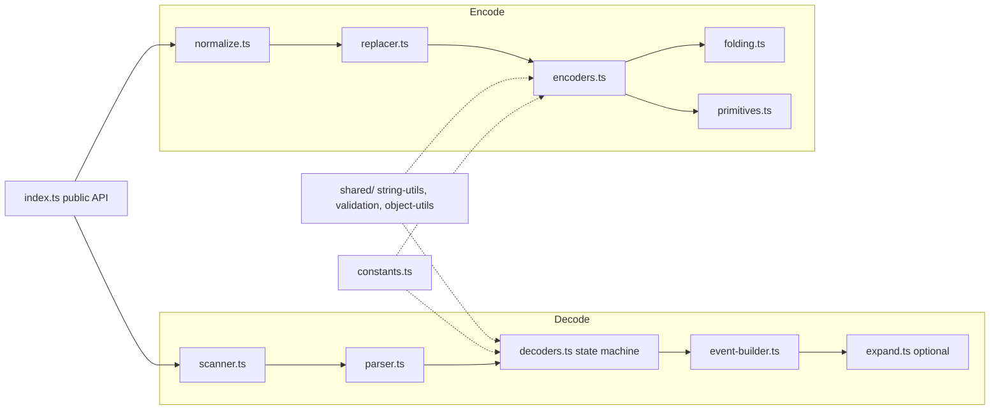
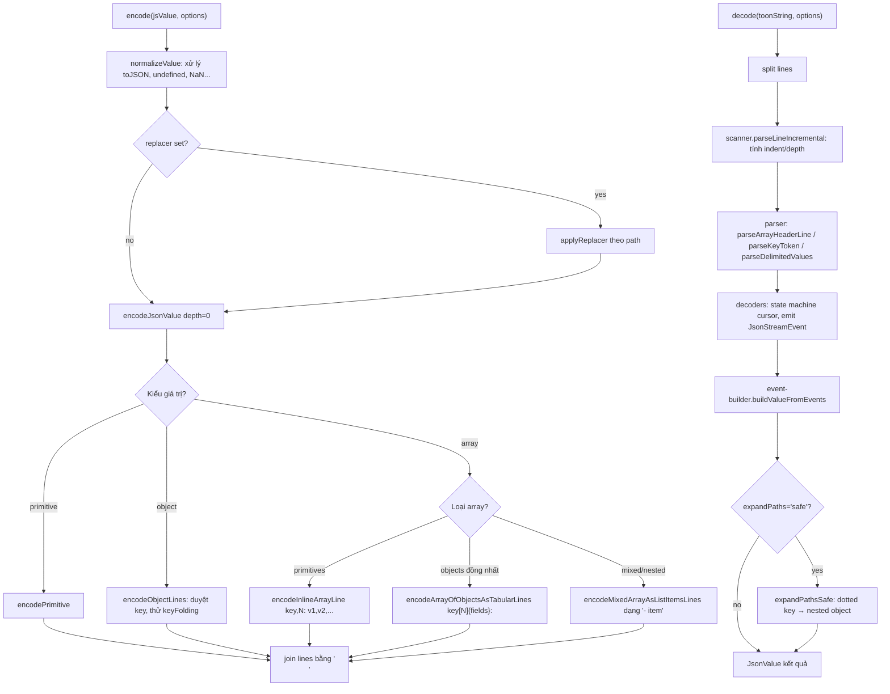

# Báo Cáo Phân Tích — TOON (Token-Oriented Object Notation)

## Tổng Quan
TOON là một encoding thay thế cho JSON, tối ưu cho việc đưa dữ liệu structured vào LLM prompt (input), giảm số token trong khi vẫn giữ tính lossless và dễ parse bởi model. Stack: TypeScript monorepo (pnpm workspaces), core lib `packages/toon` (~3.800 dòng, zero-dependency), CLI `packages/cli` (dùng `citty`), docs (VitePress), benchmark harness riêng đo token count + độ chính xác LLM trên nhiều model. Maturity cao: SPEC v3.3 đã ổn định, version `2.3.1`, có test bảo mật (prototype pollution) và 20+ implementation ở ngôn ngữ khác (Go, Rust, Python, Java...).

## Tính Năng Nổi Bật (Best Features)
1. **Tabular arrays (CSV-style cho array of objects đồng nhất)**: Khi tất cả phần tử của array là object có cùng field set, TOON in ra 1 dòng header `key[N]{f1,f2,...}:` rồi N dòng giá trị phân tách bằng delimiter, thay vì lặp lại tên field ở mỗi object như JSON. Đây là cơ chế tiết kiệm token lớn nhất. Cài đặt tại `packages/toon/src/encode/encoders.ts:203-267` (`encodeArrayOfObjectsAsTabularLines`, `extractTabularHeader`, `isTabularArray`). Kết quả đo (`benchmarks/results/token-efficiency.md:52-77`): giảm 59% token so với JSON pretty, chỉ đắt hơn CSV thuần 6-9% nhưng CSV không encode được nested data.
2. **Explicit length + field guardrails cho LLM reliability**: Mỗi array luôn khai báo độ dài `[N]` và field list `{...}` ngay ở header — không chỉ để tiết kiệm token mà còn cho model một "schema" tường minh để tự validate. Decoder strict-mode enforce đúng N dòng, không thừa không thiếu (`packages/toon/src/decode/validation.ts:11-24, 45-60`, hàm `assertExpectedCount`, `validateNoExtraTabularRows`). Benchmark "Structural validation" cho thấy TOON đạt 70% so với JSON pretty 60% khi phải phát hiện dữ liệu bị cắt/thừa (`benchmarks/results/retrieval-accuracy.md:104-105, 183-203`).
3. **Streaming architecture xuyên suốt encode/decode**: Encoder là generator (`function* encodeJsonValue`, `packages/toon/src/encode/encoders.ts:9-26`) yield từng dòng, không build full string trước. Decoder có `decodeStreamSync`/`decodeStream` (async) phát ra `JsonStreamEvent` (startObject/key/primitive/...) mà không cần buffer toàn bộ document (`packages/toon/src/decode/decoders.ts:116-193, 580-663`). Phù hợp xử lý payload lớn (context files) mà không tốn RAM đột biến.
4. **Key folding an toàn (`keyFolding: 'safe'`)**: Gộp chuỗi object 1-key lồng nhau thành dotted path (`data.metadata.items: value` thay vì 3 tầng indent), với kiểm tra collision và identifier-safety nghiêm ngặt trước khi fold (`packages/toon/src/encode/folding.ts:58-115`, `tryFoldKeyChain`). Có `expandPaths: 'safe'` ở decode để round-trip lossless (`packages/toon/src/decode/expand.ts`).
5. **Prototype-pollution hardening tại tầng object construction**: Toàn bộ decode path dùng `getOwnProperty`/`setOwnProperty` (`packages/toon/src/shared/object-utils.ts:9-33`) thay vì gán trực tiếp `obj[key] = value`, xử lý riêng case `__proto__` bằng `Object.defineProperty` để tránh leak vào `Object.prototype`. Có bộ test riêng `packages/toon/test/decode-security.test.ts` và `encode-security.test.ts` (tổng ~1.650 dòng test cho 1 package nhỏ) chuyên kiểm tra pollution qua mọi đường: literal key, dotted-path expansion, replacer injection, tabular row với inherited property.

## Áp Dụng Cho Auto Code OS (Applied Takeaways — ranked)
1. **Tabular encoding cho context injection vào LLM prompt** — What: cơ chế `encodeArrayOfObjectsAsTabularLines` biến array-of-uniform-objects thành 1 header + N dòng CSV-style, giảm ~40-60% token cho dữ liệu bảng. Apply: Auto Code OS build context (file lists, diff summaries, task lists, tool call history) trong `server/internal/context/` và `server/internal/prompts/` — hiện rất có thể đang serialize sang JSON trước khi nhét vào Go template prompt. Viết một helper Go nhỏ (`server/pkg/toon/` hoặc dùng thẳng lib TS qua CLI nếu build step JS có sẵn) để encode các slice `[]struct` đồng nhất (ví dụ danh sách file đã đổi, danh sách test result, danh sách symbol từ tree-sitter) sang dạng TOON-like trước khi ghép vào prompt template. Impact: H (giảm chi phí LLM Gateway trực tiếp) · Effort: M (viết encoder Go ~500 dòng theo spec) · Risk: L (chỉ ảnh hưởng prompt formatting, không đổi logic) · Est: 3-4 ngày.
2. **Explicit `[N]{fields}` header như structural guardrail chống truncation** — What: header khai báo trước độ dài + field set giúp cả người và model phát hiện dữ liệu bị cắt/thiếu (validation cho thấy TOON detect truncation tốt hơn JSON pretty). Apply: Khi orchestrator (`server/internal/orchestrator/`) tổng hợp output của DAG step (ví dụ log dài, danh sách file thay đổi) để đưa cho step kế tiếp qua LLM, thêm annotation dạng `items[N]:` ở đầu block thay vì JSON array trần, giúp model tự phát hiện khi context bị truncate do token limit. Impact: M · Effort: L · Risk: L · Est: 2 ngày (thêm 1 formatting layer trong prompt builder).
3. **Streaming generator pattern cho encode lớn** — What: `encodeLines`/`decodeStream` không buffer toàn bộ document, chỉ yield từng dòng (`packages/toon/src/index.ts:106-116, 215-220`). Apply: Khi Go backend serialize context lớn (toàn bộ repo tree, full diff) để gửi qua LLM Gateway (`server/pkg/llm/`), dùng `io.Writer`/channel-based streaming thay vì build `string` khổng lồ trong memory trước — giảm peak memory khi xử lý repo lớn trong sandbox. Impact: M · Effort: M · Risk: L · Est: 2-3 ngày.
4. **Prototype/key-safety pattern áp dụng cho Go map decode** — What: `getOwnProperty`/`setOwnProperty` cô lập rủi ro khi key đến từ input không tin cậy (LLM output, file path lạ). Apply: Không map 1:1 sang Go (Go không có prototype pollution), nhưng nguyên lý "never trust decoded keys blindly" nên áp dụng khi orchestrator parse JSON/YAML do LLM tự sinh ra (structured tool-call output) trong `server/internal/tool/` — luôn validate key allowlist trước khi ghi vào struct field bằng reflection. Impact: L · Effort: S · Risk: L · Est: 0.5 ngày (rà soát code review checklist).
5. **Benchmark-driven format decision, không đoán mò** — What: Repo tự benchmark token count VÀ accuracy trên 4 model thật (`benchmarks/scripts/token-efficiency-benchmark.ts`, `accuracy-benchmark.ts`) trước khi công bố con số "-40% token". Apply: Trước khi đổi định dạng prompt trong Auto Code OS, dựng harness tương tự trong `server/internal/prompts/` (test file) đo token thực tế (dùng cùng tokenizer với provider) + so sánh accuracy task completion trước/sau đổi format, tránh optimize token mà giảm chất lượng output của agent. Impact: H · Effort: M · Risk: L · Est: 3 ngày build harness lần đầu, tái dùng về sau.

## Kiến Trúc (Architecture)
- **Layered pipeline, dependency direction rõ ràng, một chiều**: `index.ts` (public API) → `encode/*` hoặc `decode/*` → `shared/*` (string-utils, validation, object-utils dùng chung cả 2 chiều). Không có cyclic dependency giữa encode và decode — chúng chỉ gặp nhau ở `shared/` và `types.ts`. `constants.ts` là node có fan-in cao nhất (import bởi hầu hết mọi file).
- **Encode path**: `normalize.ts` (JSON.stringify-style normalization, xử lý `toJSON()`, `undefined`, functions) → `replacer.ts` (áp dụng user replacer, path-tracked) → `encoders.ts` (dispatch object/array/primitive) → `folding.ts` (tùy chọn) → `primitives.ts` (escaping/quoting cấp thấp nhất).
- **Decode path**: `scanner.ts` (tách raw text → `ParsedLine[]` theo indent/depth) → `parser.ts` (parse token cấp dòng: array header, key, delimited values) → `decoders.ts` (state machine cursor-based, sinh ra `JsonStreamEvent` stream) → `event-builder.ts` (build JS value từ event stream) → `expand.ts` (tùy chọn, path expansion).
- **Lý do kiến trúc**: Tách encode/decode thành package con độc lập theo concern (giống compiler pass: lexer → parser → builder) giúp test từng tầng riêng biệt (`test/decode.test.ts`, `test/encodeLines.test.ts` riêng) và cho phép streaming ở cả 2 chiều mà không phải viết lại logic.

Confidence: High (đọc trực tiếp toàn bộ 19 file trong `packages/toon/src/`).

### ADR Suy Luận (Inferred ADRs)
| Quyết Định | Bằng Chứng | Lợi Ích | Đánh Đổi | Confidence |
|---|---|---|---|---|
| Zero runtime dependency cho core lib | `packages/toon/package.json` không có `dependencies`, chỉ `devDependencies` | Bundle nhỏ, an toàn supply-chain, dễ port sang ngôn ngữ khác theo spec | Phải tự viết escaping/parsing thay vì dùng lib có sẵn (nhiều code cấp thấp ở `shared/string-utils.ts`) | High |
| Generator-based streaming (`function*`) thay vì build string/array | `encodeJsonValue`, `decodeStreamSync` đều là generator | Memory-efficient cho document lớn, composable (`Array.from(encodeLines(...))` cho non-streaming use) | API phức tạp hơn — 4 hàm export tương tự nhau (`encode`, `encodeLines`, `decode`, `decodeFromLines`, `decodeStreamSync`, `decodeStream`) | High |
| Strict mode mặc định `true` khi decode | `resolveDecodeOptions` trong `index.ts:232-238`, default `strict: true` | An toàn — phát hiện dữ liệu hỏng/truncate ngay khi parse | Cần opt-out tường minh (`strict: false`) cho input "bẩn" từ nguồn không kiểm soát (vd LLM tự sinh) | High |
| Tabular chỉ kích hoạt khi 100% object cùng field set | `isTabularArray()` reject nếu bất kỳ row nào thiếu/thừa field (`encoders.ts:230-254`) | Tránh sai lệch dữ liệu khi convert (không "đoán" giá trị thiếu) | Semi-uniform data (50% tabular eligibility) không hưởng lợi nhiều — token saving giảm còn ~15% (đo trong benchmark) | High |

## Luồng Chính (Main Flow)

## Design Patterns & Chất Lượng Code
- **Generator/Iterator pattern nhất quán**: mọi hàm encode/decode cấp thấp đều là `function*`/`async function*`, cho phép compose lazy mà không cần callback hay observable lib (`packages/toon/src/encode/encoders.ts` toàn bộ dùng `yield*` để compose).
- **Discriminated union cho streaming events**: `JsonStreamEvent` (`types.ts:133-140`) là union type rõ ràng (`startObject | endObject | startArray | ...`), giúp `event-builder.ts` build value bằng switch-exhaustive, dễ mở rộng thêm event type sau này.
- **Separation of "resolved options" vs "options"**: `EncodeOptions` (partial, optional) tách biệt khỏi `ResolvedEncodeOptions` (`Readonly<Required<...>>`) — pattern phổ biến trong config-heavy lib, tránh phải check `options?.indent ?? 2` rải rác khắp nơi (chỉ resolve 1 lần ở `resolveOptions()` trong `index.ts:222-230`).
- **Đặt tên rõ theo action + format**: `encodeArrayOfObjectsAsTabularLines`, `decodeInlinePrimitiveArraySync/Async` — tên hàm dài nhưng tự mô tả, giảm nhu cầu đọc comment. Code có JSDoc đầy đủ ở public API (`index.ts`), sparse hơn ở internal nhưng vẫn có `@remarks` giải thích edge case (vd `parseDelimitedValues`, `getOwnProperty`).
- **Sync/Async code trùng lặp ~50%**: `decoders.ts` (1015 dòng) có gần như 2 bản sao của mọi hàm (`decodeXxxSync` và `decodeXxxAsync`) vì generator sync và async generator không thể dùng chung logic trong TS hiện tại — đây là trade-off chấp nhận được cho streaming, nhưng là chi phí bảo trì thật (sửa bug phải sửa 2 chỗ).

## Kỹ Thuật Thú Vị & Thực Hành Kỹ Thuật
- **Testing**: Test theo tầng rõ ràng — `encode.test.ts`, `decode.test.ts`, `encodeLines.test.ts` (round-trip streaming), `decodeStream.test.ts`, cộng thêm 2 file bảo mật riêng (`decode-security.test.ts`, `encode-security.test.ts` — tổng ~1650 dòng test cho lib chỉ ~3800 dòng source, tỷ lệ test/code rất cao).
- **Error handling có context**: `ToonDecodeError` (`decode/errors.ts`) luôn đính kèm `{ line, source }`, và helper `withLine()` wrap mọi lời gọi parser để tự động gắn số dòng vào exception — người dùng lib luôn biết lỗi nằm ở dòng nào trong document TOON, không phải stack trace JS chung chung.
- **Config qua CLI với `citty`**: `packages/cli/src/cli-entry.ts` chỉ 3 dòng gọi `runMain(mainCommand)` — toàn bộ argument parsing/help-text tách biệt ở `index.ts`, giữ entry point tối giản.
- **Benchmark tự động hoá đo lường**: `benchmarks/scripts/token-efficiency-benchmark.ts` và `accuracy-benchmark.ts` dùng tokenizer thật (`gpt-tokenizer`, o200k_base) và gọi API 4 model thật (Claude Haiku, Gemini Flash, GPT-5-nano, Grok) — không phải benchmark giả định, kết quả (`benchmarks/results/*.md`) được commit vào repo làm nguồn sự thật cho README.
- **Multi-language ecosystem qua spec-driven**: Có repo `toon-format/spec` riêng, `docs/ecosystem/implementations.md` liệt kê 20+ port (Go, Rust, Python, Java, Swift...) — chứng tỏ format được thiết kế portable ngay từ đầu (indentation + delimiter đơn giản, không phụ thuộc JS runtime).

## Engineering Gems
1. `packages/toon/src/shared/object-utils.ts:21-33` (`setOwnProperty`) — Vấn đề: gán `obj[key] = value` khi `key` đến từ input không tin cậy (`__proto__`) sẽ chạm vào setter kế thừa của `Object.prototype`, có thể corrupt prototype toàn cục. Cách làm phổ biến (yếu hơn): nhiều JSON-like parser tự chế bỏ qua vấn đề này hoặc dùng `Map` (phá vỡ tương thích JS object API). Vì sao elegant: chỉ special-case đúng 1 key (`__proto__`) bằng `Object.defineProperty`, còn lại dùng plain assignment nhanh — tối ưu performance cho >99.9% trường hợp trong khi vẫn an toàn 100%. Đánh đổi: thêm 1 branch check ở mọi lần set property (chi phí gần như 0 vì JIT dự đoán tốt). Bài học rút ra: xử lý bảo mật nên khoanh vùng chính xác case nguy hiểm thay vì áp defensive-coding tràn lan làm chậm hot path.
2. `packages/toon/src/decode/decoders.ts:14-110` (`StreamingLineCursor`) — Vấn đề: cần lookahead (peek) trên một stream chỉ đọc-tiến (generator/async generator) để quyết định "dòng tiếp theo còn thuộc array này không" mà không được consume nó nếu không đúng. Cách làm phổ biến (yếu hơn): buffer toàn bộ input thành array rồi dùng index — mất lợi ích streaming. Vì sao elegant: cursor tự quản 1-line buffer, expose `peek/next/advance` đối xứng cho cả sync và async (`peekSync/nextSync` song song `peek/next`), cho phép state machine decode dùng chung logic điều khiển luồng dù nguồn sync hay async. Đánh đổi: verbose (phải viết cặp hàm Sync/Async riêng) do giới hạn ngôn ngữ TS không unify được generator sync/async. Bài học: một lookahead buffer nhỏ (size=1) đủ giải quyết hầu hết bài toán parser streaming mà không hy sinh tính lazy.
3. `packages/toon/src/encode/encoders.ts:230-254` (`isTabularArray`) — Vấn đề: quyết định khi nào an toàn "nén" array-of-objects thành bảng CSV-style mà không làm mất/méo dữ liệu (field thiếu, field thừa, giá trị không phải primitive). Cách làm phổ biến (yếu hơn): một số converter JSON→CSV tự động "pad" giá trị thiếu bằng rỗng, gây mất thông tin ngầm (không phân biệt được "field không tồn tại" và "field rỗng"). Vì sao elegant: kiểm tra strict — số lượng key phải khớp *và* mọi key trong header phải tồn tại trong từng row *và* giá trị phải là primitive — nếu fail bất kỳ điều kiện nào, tự động fallback về `encodeMixedArrayAsListItemsLines` (định dạng list an toàn, không nén). Không có trường hợp trung gian "nén sai". Đánh đổi: một object lệch 1 field trong array 1000 phần tử sẽ làm mất toàn bộ lợi ích nén cho cả array. Bài học: nén dữ liệu cho LLM phải "all-or-nothing" theo tính đồng nhất — nén một phần dễ tạo ra định dạng mơ hồ khiến model hiểu sai schema.

## Top 10 Điều Đáng Học
| # | Khái Niệm | File | Vì Sao Hữu Ích | Độ Khó | Thứ Tự |
|---|---|---|---|---|---|
| 1 | Tabular array detection (`isTabularArray`) | `packages/toon/src/encode/encoders.ts:230-254` | Nguyên lý cốt lõi giúp giảm token nhiều nhất, áp dụng được cho bất kỳ prompt-builder nào | ⭐⭐ | 1 |
| 2 | Explicit `[N]{fields}` header như self-describing schema | `packages/toon/src/encode/primitives.ts:56-85` (`formatHeader`) | Ý tưởng đơn giản, tăng độ tin cậy khi LLM đọc dữ liệu | ⭐ | 2 |
| 3 | Streaming generator cho encode | `packages/toon/src/encode/encoders.ts:9-26` | Pattern tái dùng được cho bất kỳ serializer lớn nào | ⭐⭐ | 3 |
| 4 | StreamingLineCursor (peek/next abstraction) | `packages/toon/src/decode/decoders.ts:14-110` | Kỹ thuật viết parser streaming tổng quát | ⭐⭐⭐ | 4 |
| 5 | Prototype-pollution-safe property access | `packages/toon/src/shared/object-utils.ts` | Checklist bảo mật khi decode dữ liệu từ nguồn không tin cậy | ⭐⭐ | 5 |
| 6 | Resolved-options pattern | `packages/toon/src/index.ts:222-238` | Giảm boilerplate `?? default` rải rác | ⭐ | 6 |
| 7 | Key folding an toàn (dotted-path collapse) | `packages/toon/src/encode/folding.ts:58-115` | Kỹ thuật nén cấu trúc lồng sâu, có kiểm soát collision | ⭐⭐⭐ | 7 |
| 8 | Error-with-line-context (`withLine`) | `packages/toon/src/decode/errors.ts` | UX lỗi tốt cho consumer của lib, dễ debug | ⭐ | 8 |
| 9 | Benchmark harness đo token + accuracy thật | `benchmarks/scripts/token-efficiency-benchmark.ts`, `accuracy-benchmark.ts` | Mẫu để tự đánh giá thay đổi định dạng prompt trước khi merge | ⭐⭐⭐ | 9 |
| 10 | `isSafeUnquoted` — quy tắc quyết định khi nào cần quote | `packages/toon/src/shared/validation.ts:45-91` | Danh sách đầy đủ edge-case (literal collision, control char, delimiter) khi tự thiết kế text format | ⭐⭐ | 10 |

## Hướng Dẫn Đọc (Reading Guide)
**L0 Build & Run:** `package.json` (root, scripts `build`/`test`), `packages/toon/package.json`, `pnpm-workspace.yaml`.
**L1 Entry Points:** `packages/toon/src/index.ts` (encode/decode/encodeLines/decodeStream), `packages/cli/src/cli-entry.ts` + `packages/cli/src/index.ts`.
**L2 Core Abstractions:** `packages/toon/src/types.ts` (JsonValue, JsonStreamEvent, Options), `packages/toon/src/constants.ts`.
**L3 Architecture Glue:** `encode/encoders.ts` ↔ `decode/decoders.ts` (đối xứng 2 chiều), `shared/*.ts` (dùng chung).
**L4 Engineering Gems:** `decode/decoders.ts` (StreamingLineCursor), `shared/object-utils.ts`, `encode/folding.ts`.
**L5 Reimplement:** Thử viết lại encoder tabular-array bằng Go (chỉ cần `formatHeader` + `isTabularArray` + join loop, ~150 dòng) rồi so token count với `encoding/json` để tự kiểm chứng con số benchmark.

## Anti-Patterns & Không Nên Copy
1. **Trùng lặp code sync/async gần như 100%** (`decoders.ts` có `decodeKeyValueSync`/`decodeKeyValueAsync`, `decodeTabularArraySync`/`Async`, v.v., mỗi cặp chỉ khác `await`): dễ drift khi sửa bug (sửa 1 bên quên bên kia). Đây là giới hạn của TypeScript generator, không nên copy nguyên xi sang Go — Go có goroutine + channel nên có thể viết 1 hàm chung mà không cần tách sync/async.
2. **6 hàm public API gần giống nhau** (`encode`, `encodeLines`, `decode`, `decodeFromLines`, `decodeStreamSync`, `decodeStream`) — hợp lý cho 1 lib npm cần phục vụ nhiều use-case (browser/node/streaming), nhưng nếu Auto Code OS chỉ cần 1 use-case cụ thể (build prompt string), không nên bê nguyên bộ API rộng này — chỉ implement đúng 1 hàm `EncodeTabular([]T) string` cần thiết.
3. **Semi-uniform/nested data không có lợi nhiều** (tự benchmark thừa nhận: event logs 50% tabular chỉ giảm 15% token, có dataset TOON thua JSON compact về accuracy — `benchmarks/results/retrieval-accuracy.md:156-160`): đừng áp dụng TOON-style encoding mù quáng cho mọi loại context; chỉ dùng cho dữ liệu thực sự đồng nhất (danh sách file, danh sách test, bảng metrics) — với config lồng sâu (vd cấu hình DAG orchestrator) giữ JSON/YAML sẽ tốt hơn.

## Câu Hỏi Đáng Suy Ngẫm
1. Token savings đo trên `gpt-tokenizer` (o200k_base) — với model Anthropic (Claude) dùng tokenizer khác, con số "-40%" có còn đúng tỷ lệ tương tự không? Auto Code OS dùng chủ yếu Claude qua `server/pkg/llm/` nên cần tự đo lại bằng tokenizer thực tế trước khi tin số liệu.
2. Benchmark accuracy cho thấy TOON thua JSON pretty ở 2/6 dataset (semi-uniform logs, truncated-array edge case) — điều này gợi ý gì về việc chọn format theo *loại nội dung* thay vì áp dụng toàn cục? Auto Code OS có nên có logic "chọn định dạng theo shape dữ liệu" (tương tự `isTabularArray` fallback) trong prompt builder, thay vì hardcode 1 format?
3. Format mới (dù tiết kiệm token) luôn có chi phí ẩn: model cần "hiểu" cú pháp mới, có thể cần vài ví dụ few-shot trong system prompt để dùng đúng — chi phí few-shot đó có ăn hết phần token tiết kiệm được không khi áp dụng cho các LLM call ngắn (single-turn) của Auto Code OS?

## Đánh Giá Tổng Thể
| Architecture | Maintainability | Scalability | Clean Code | Learning Value |
|---|---|---|---|---|
| 9/10 | 7/10 | 8/10 | 8/10 | 9/10 |

## Lộ Trình Học Tập
- **Tuần 1 — Đọc & hiểu format**: Đọc `README.md`, `SPEC.md`, `docs/reference/spec.md`, `docs/reference/syntax-cheatsheet.md`. Chạy thử CLI (`packages/cli`) convert vài file JSON thật của Auto Code OS (vd response API) sang `.toon`, so sánh trực quan.
- **Tuần 2 — Đọc core lib**: Đọc theo thứ tự `types.ts` → `constants.ts` → `encode/*.ts` (encoders → primitives → folding) → `decode/*.ts` (scanner → parser → decoders → event-builder). Chạy test suite (`pnpm test` trong `packages/toon`) và đọc `test/*.test.ts` song song để hiểu behavior qua ví dụ.
- **Tuần 3 — Tự đo lường trên dữ liệu thật**: Clone `benchmarks/` structure, viết harness nhỏ đo token count (dùng tokenizer của Anthropic) trên các loại context thực Auto Code OS đang gửi cho LLM (file diff, tool call history, symbol list từ tree-sitter) — xác nhận % tiết kiệm token thực tế trước khi build gì thêm.
- **Tuần 4 — Reimplement core encoder bằng Go**: Viết `EncodeTabular` + `formatHeader` + `isSafeUnquoted` bằng Go (không cần decode, Auto Code OS chỉ cần 1 chiều: Go struct → prompt text) trong 1 package thử nghiệm (vd `server/pkg/toon/`), viết golden test so với output của lib TS gốc để đảm bảo tương thích byte-for-byte với spec.
- **Tuần 5 — Tích hợp thử nghiệm A/B**: Cắm encoder vào 1 điểm cụ thể trong `server/internal/prompts/` (ví dụ danh sách file thay đổi trong PR), chạy song song JSON vs TOON-style trên vài task thật, đo cả token cost lẫn tỷ lệ agent hoàn thành task đúng — quyết định rollout dựa trên dữ liệu, không dựa trên benchmark của repo gốc.
