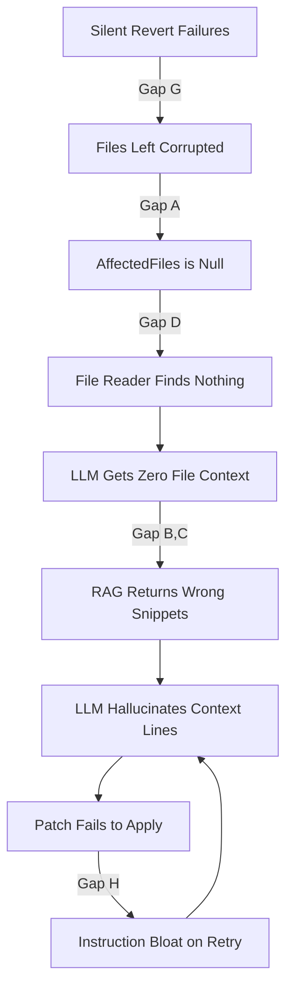

# 🔍 Debug Report: Git Patch Parser Errors & Prompt Flow Suitability Audit

This report investigates the git parse error encountered in workspace `4c19a5f1-2f4f-4012-8f7d-9e8a8569e317` (call-004/005) and audits the suitability of the agent-role prompt building flow.

---

## 🔍 Part 1: Debugging the Git Patch Parser Failures

### 1. Symptom
During execution of step `code_backend_0` on repo `tool_zentao`, the LLM-generated patch fails to apply with `Hunk FAILED` and `malformed patch` errors:
```
Hunk #1 FAILED at 18.
1 out of 1 hunk FAILED -- saving rejects to file internal/model/commit.go.rej
patch: **** malformed patch at line 44: diff --git a/internal/repository/sqlite_test.go b/internal/repository/sqlite_test.go
```

### 2. Information Gathered
- **Log Location:** `server/.data/workspaces/4c19a5f1-2f4f-4012-8f7d-9e8a8569e317/logs/llm/call-004-code_backend_0/`
- **Files Checked:** `output.md`, `request.json`, `parsed.json`, `budget_log.json`
- **Target Files in Worktree:**
  - `internal/model/commit.go` (ends at line 21, missing `}`)
  - `cmd/sync-engine/main.go` (ends at line 25, missing `}`)
  - `internal/repository/sqlite_test.go` (ends at line 106, missing `}`)
- **Main checkout:** Empty (only `.git/` metadata, no source files). All code exists only in `worktrees/backend/`.

### 3. Execution Timeline (calls 002–005)

Understanding the full execution sequence is critical because the failures are cumulative:

| Call | Model | Action | Result |
|------|-------|--------|--------|
| **002** | gemini-2.5-flash | First coding attempt. Used module `zentao.com/gitlab_sync`, driver `modernc.org/sqlite`, entirely different struct fields (`WebURL`, `SyncStatus` enum) | Patch applied, but tests failed (module mismatch). Revert attempted. |
| **003** | gemini-3.5-flash | Second attempt. Rewrote everything with module `zentao-sync`, driver `github.com/mattn/go-sqlite3`, correct struct fields. All files created as `new file mode 100644`. | Patch applied, but tests failed with `unexpected EOF` — files were truncated. |
| **004** | gemini-3.5-flash | Retry to fix EOF errors. LLM received the compiler error but NOT the actual file contents. | Patch generated with hallucinated context lines. `git apply` failed with hunk mismatches. |
| **005** | gemini-3.5-flash | Retry of retry. Same blind context. | Same failures. |

---

### 4. Root Cause Analysis of Patch Failures

The failures are caused by three cascading factors: **incomplete revert leaving corrupted files**, **LLM context hallucination**, and **malformed hunk arithmetic**.

#### A. Truncated Source Code — How It Happened

The files in the worktree were truncated during the call-002 → call-003 transition:

1. **Call-002** applied a patch creating files with a completely different module structure (`zentao.com/gitlab_sync`). Tests failed.
2. The orchestrator attempted to **revert** call-002's patch via `patch -R`. But the revert command's errors are **silently discarded** (`_, _ = r.RunSandboxStepInWorktree(...)` in `applier.go:307`). The revert likely failed partially, leaving files in an inconsistent state.
3. **Call-003** then attempted to create all files as `new file mode 100644`. Since files already existed from the failed revert, `git apply` rejected the patch. The fallback `patch --batch` command then tried to apply it as modifications to existing files, resulting in **partial application** — content was written but closing braces `}` were lost.

**Evidence:** Call-003's patch specifies `commit.go` as 20 lines ending with `}`, but the worktree file has 21 lines (last line blank, `}` missing). Same pattern for `main.go` (24→25 lines) and `sqlite_test.go` (105→106 lines).

#### B. Context Line Mismatches (Hallucination)

In call-004, the LLM was told "fix these EOF errors" but was NOT supplied with the actual file contents (see Part 2 for why). It guessed the existing code, resulting in context line mismatches that broke `git apply`:

1. **Struct Tag Stripping:** In `commit.go`, the actual code has json tags (e.g. `` `json:"project_id"` ``). The LLM's patch context omitted them entirely, so the context lines didn't match.
2. **Variable Name Mismatch:** In `sqlite_test.go`, the baseline code used `retrievedState` (line 100), but the LLM's patch referenced `fetchedState`.
3. **String Literal Mismatches:** In `main.go`, the actual code has `"Failed to ping SQLite database: %v"` and `"Successfully connected to SQLite database!"`, but the LLM wrote `"failed to ping database: %v"` and `"Database connection established"`.

#### C. Malformed Hunk Headers

In `sqlite.go`, the LLM outputted:
```diff
@@ -137,3 +137,19 @@
```
This header claims there are `19` lines in the new-side hunk. However, the actual hunk content contained `20` lines (3 context + 17 added). Since the line count was off by 1, the parser read past the hunk boundary and treated the next `diff --git` line as hunk content, causing the `malformed patch at line 44` error.

---

## 📋 Part 2: Audit of Agent Prompt Flow Suitability

Is the prompt flow for assembling agent prompts by role correct and suitable?
**No, there are critical architectural gaps** in how codebase context is gathered and delivered to roles during coding and retry loops.

### 1. Identified Gaps in the Prompt Flow

#### Gap A: `AffectedFiles` is Empty/Null During Retry Loops
- **The Issue:** The orchestrator only updates `AffectedFiles` in `TaskAnalysis` **after the step finishes** (`code_backend.go:373-393`). During retries within the same step execution (e.g., test failure → retry), the analysis is never updated.
- **Evidence:** `request.json` for call-004 shows `"affected_files": null` in the Execution Manifest.
- **The Impact:** `runner.go:54` checks `len(analysis.AffectedFiles) > 0` before injecting file contents. With `null`, the `readAffectedFileContent` path is completely skipped. The LLM receives zero file contents.

#### Gap B: RAG Engine Returns Incomplete Context for Broken Files
- **The Issue:** The context engine uses **tree-sitter** (not Go's native parser), which is error-tolerant and does NOT fail on syntax errors. However, truncated files produce degraded tag ranges, and the `SearchTags` function scores results by keyword matching — truncated definitions rank poorly.
- **Evidence:** The call-004 prompt DID include 2 semantic snippets, but both were from `sqlite.go` (the only complete file). The 3 truncated files (`commit.go`, `main.go`, `sqlite_test.go`) produced no snippets.
- **The Impact:** The RAG engine technically works, but its keyword-based scoring naturally favors complete, well-structured files over broken ones — exactly the opposite of what's needed during error recovery.

#### Gap C: Aggressive Snippet Cap for Coding Steps
- **The Issue:** `builder.go:703-704` limits coding steps to `maxSnippets = 4` (vs 8 for other steps).
- **The Impact:** Combined with poor scoring of broken files, this cap means the 4 slots are filled by well-structured code, and the broken files the LLM actually needs to fix are excluded.

#### Gap D: File Reader Ignores Active Worktree
- **The Issue:** `readAffectedFileContent` (`sandbox.go:98-143`) resolves file paths against two roots: (1) `GetTaskRepoHostPath` → `Paths.Main`, and (2) the workspace root. Neither includes the active worktree path (`Paths.Worktrees["backend"]`).
- **Evidence:** The `main` checkout contains only `.git/` metadata with zero source files. All code exists exclusively in `worktrees/backend/`.
- **The Impact:** Even if `AffectedFiles` were populated, the file reader would find nothing in `main` and return `false`, providing zero file content to the LLM.

#### Gap E: Stale Context Cache in Coding Steps
- **The Issue:** `ContextLoadStep` runs once at the start to build a static `context_cache` (including `SemanticSnippets` and `RepoMap`). In `builder.go:701`, if `cachedData` is non-nil, the assembler bypasses calling `ctxEngine.RetrieveContext` dynamically.
- **The Impact:** During all subsequent coding attempts and retry loops, the assembler uses stale snippets from before any code was written. It never re-indexes files created or modified during step execution.

#### Gap F: Host Absolute Path Leaks
- **The Issue:** `IndexWorkspace` scans the entire `code/repos` directory (both `main` and all worktrees). When `RetrieveContext` returns a snippet outside the active worktree root, `ToLogical` throws a boundary error. The fallback at `provider.go:434-436` sets `relPath = t.Filepath` — the raw host absolute path.
- **The Impact:** The LLM receives paths like `/home/ubuntu/my_projects/auto_code_os/server/.data/workspaces/...` which leaks the host filesystem structure and violates the relative path rules given in the system prompt.

#### Gap G: Silent Revert Failures
- **The Issue:** When `ApplyPatch` fails, the revert attempt at `applier.go:307` uses `_, _ = r.RunSandboxStepInWorktree(...)` — both return values are silently discarded.
- **The Impact:** Failed reverts go completely unnoticed. Files remain in a partially-patched, corrupted state. The next LLM attempt then operates on broken files it can't see, creating a cascading failure loop.

#### Gap H: Instruction Bloat During Retry Loops
- **The Issue:** Each retry in `code_backend.go:286,320,334` appends the full error feedback to the `instruction` string: `instruction += fmt.Sprintf("\n\nYour previous patch failed...\n%v\n...", errMsg)`.
- **The Impact:** By attempt 3, the instruction contains error messages from all previous attempts, consuming the fixed token budget and leaving less room for actual code context. The `budget_log.json` for call-004 shows only `5827` initial tokens out of `8192` were used — but on later retries this budget gets further squeezed.

---

## 🛠️ Part 3: Recommended Structural Fixes

### Priority Overview



### 1. Fix Silent Revert Failures (Gap G — Critical)
In `applier.go:307`, log the revert error and track it in task metadata. If a revert fails, the step should either:
- Hard-reset the worktree to the last known-good commit (`git checkout -- .`), or
- Pause the task for human review.

### 2. Auto-Inject Compilation Error Files into `AffectedFiles` (Gap A)
Parse compiler output (e.g. `internal/model/commit.go:21:1: syntax error`) to extract file paths. Immediately update `analysis.AffectedFiles` before the retry LLM call, so `runner.go:54` will inject file contents.

### 3. Update File Reader to Respect Active Worktrees (Gap D)
Refactor `readAffectedFileContent` in `sandbox.go` to check `ws.Repos[i].Paths.Worktrees[role]` as a priority root, falling back to `Paths.Main` only if the worktree path doesn't exist.

### 4. Enforce Mandatory Full File Loading for Coding Steps (Gap A+D)
For code editing roles (`backend`, `frontend`), always read and inject the full contents of all `AffectedFiles` — don't rely on semantic RAG alone. This ensures the LLM always sees the exact current state of the files it must edit.

### 5. Bypass Static Cache for Retry Steps (Gap E)
When `builder.go` detects a retry (e.g., the step ID suffix indicates attempt > 1), skip the cached `SemanticSnippets` and call `ctxEngine.RetrieveContext` dynamically to get fresh snippets reflecting the current file state.

### 6. Filter Workspace Indexing Scope (Gap F)
In `IndexWorkspace` and `RetrieveContext`, scope the file scan to the active `AgentPathContext.PhysicalRoot()` instead of the entire `code/repos` directory. Reject snippets that fail `ToLogical` instead of falling back to absolute paths.

### 7. Cap Instruction Growth on Retries (Gap H)
Instead of appending full error messages on each retry, replace the previous error feedback with only the latest one. Or summarize prior failures in a single line (e.g., "Attempts 1-2 failed due to: hunk mismatch, variable name errors").

### 8. Improve RAG Scoring for Error Recovery (Gap B+C)
When the step is a retry triggered by compilation errors, boost the search score for files mentioned in compiler output. Consider raising `maxSnippets` from 4 to 8 for retry attempts.


# Recommended Structural Improvements for Retry & Context Pipeline

## Executive Summary

The current recommendations address most of the root causes behind patch application failures. However, instead of treating them as isolated fixes, they can be organized into a few architectural improvements that make the retry pipeline more robust and maintainable.

---

# 1. Repository Integrity (Highest Priority)

### 1.1 Detect and Handle Revert Failures

**Problem**

When `git apply -R` (revert) fails, the error is silently ignored, leaving the worktree in a corrupted state. All subsequent retries operate on an inconsistent repository.

**Recommendation**

- Log revert failures.
- Track revert status in task metadata.
- If revert fails:
  - Hard reset the worktree (`git reset --hard` + `git clean -fd`).
  - Abort the retry if repository integrity cannot be restored.

**Benefit**

Prevents cascading failures caused by corrupted source files.

---

# 2. Retry Context Reconstruction (Highest Priority)

The following recommendations should be treated as one unified feature.

## 2.1 Populate `AffectedFiles` Automatically

Parse compiler/test output (e.g. `internal/model/commit.go:21:1`) and immediately update `analysis.AffectedFiles` before invoking the retry.

---

## 2.2 Read Files from Active Worktree

Update `readAffectedFileContent()` to prioritize:

```
Active Worktree
    ↓
Main Repository
    ↓
Workspace Root
```

instead of reading only from the main checkout.

---

## 2.3 Inject Full File Contents

For backend/frontend coding retries:

- Always inject the complete contents of every file in `AffectedFiles`.
- Do not rely solely on semantic RAG snippets.

**Benefit**

The LLM always sees the exact current state of the files instead of hallucinating missing context.

---

# 3. Fresh Context Pipeline

## 3.1 Refresh Cached Context on Retry

During retry:

- Invalidate cached semantic snippets.
- Refresh repository context.
- Re-index changed files.

Instead of using stale context generated before the first attempt.

---

## 3.2 Scope Workspace Indexing

Only index the active agent worktree instead of the entire repository.

Benefits:

- Prevents host path leakage.
- Improves retrieval quality.
- Reduces indexing overhead.

---

# 4. Retry Optimization

## 4.1 Prevent Prompt Growth

Instead of appending every previous error:

Current

```
Attempt 1 error
Attempt 2 error
Attempt 3 error
...
```

Recommended

```
Previous failures:
- Hunk mismatch
- Variable mismatch

Latest compiler error:
...
```

This preserves token budget for actual code context.

---

## 4.2 Retry by Failure Type

Different failures require different retry strategies.

Example:

| Failure Type | Retry Strategy |
|--------------|----------------|
| Syntax Error | Inject full files |
| Compile Error | Inject compiler output + affected files |
| Test Failure | Inject failing tests |
| Patch Failure | Regenerate entire file instead of patch |

---

# 5. Context Retrieval Improvements

## 5.1 Improve Retry-Time Retrieval

During retry:

- Prioritize files mentioned in compiler output.
- Increase snippet limit if necessary.
- Treat semantic retrieval as supplementary context only.

Recommended priority:

```
Affected Files
        │
        ▼
Full File Injection
        │
        ▼
Semantic RAG (Optional)
```

---

# 6. Improve Patch Reliability (Recommended)

The current retry process continues generating unified diffs, which are highly sensitive to context mismatches.

Instead of:

```
LLM
    ↓
Unified Diff
    ↓
git apply
```

Prefer:

```
LLM
    ↓
Full File Rewrite
```

or

```
LLM
    ↓
AST-based Edit
```

This eliminates many causes of:

- Hunk FAILED
- Malformed Patch
- Context mismatch

---

# Overall Priority

| Priority | Recommendation |
|----------|----------------|
| P0 | Repository integrity (revert handling) |
| P0 | Retry context reconstruction |
| P0 | Active worktree file loading |
| P0 | Full file injection |
| P1 | Refresh cached context |
| P1 | Scope workspace indexing |
| P2 | Prompt optimization |
| P2 | Retry-specific retrieval tuning |
| P2 | Replace unified diff with full-file or AST editing |

---

# Expected Outcome

Implementing these improvements transforms the retry process from a patch-based recovery mechanism into a context-aware repair pipeline:

```
Compile/Test Failure
        │
        ▼
Identify Affected Files
        │
        ▼
Load Full Files (Active Worktree)
        │
        ▼
Refresh Context
        │
        ▼
LLM Generates Updated Code
        │
        ▼
Repository Health Check
        │
        ▼
Retry or Complete
```

This architecture significantly reduces hallucinated context, patch mismatches, and cascading retry failures while improving the reliability of automated code generation.