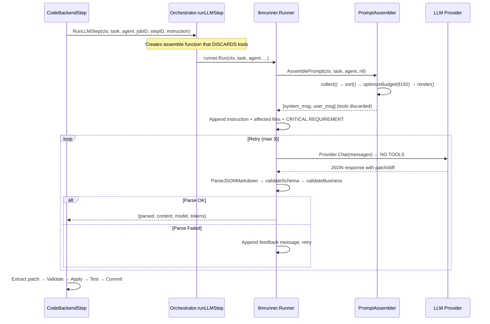
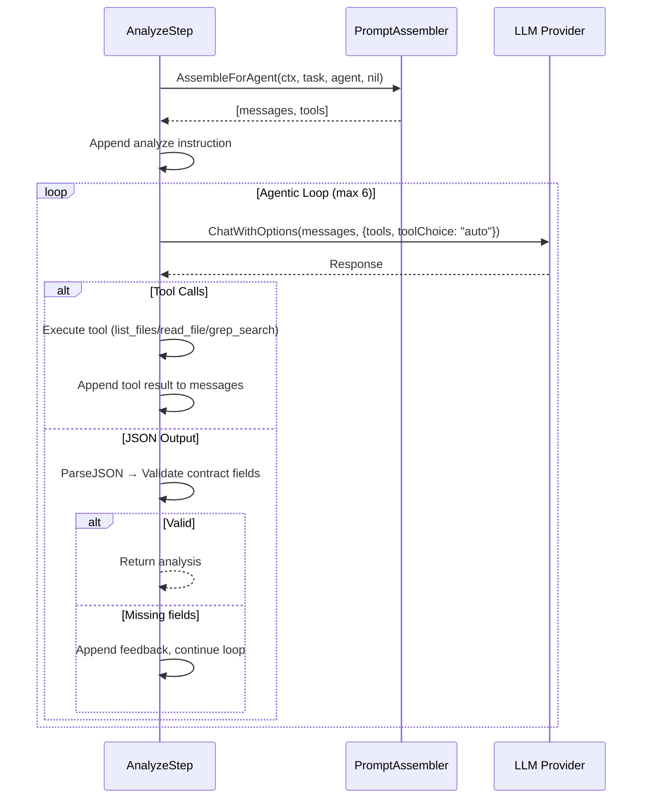

# LLM Call Architecture Report
## Deep Investigation — Verified Against Source Code

> **Version:** v2.0 — Verified from codebase audit  
> **Date:** 2026-07-10  
> **Scope:** Prompt Construction, Context Assembly, LLM Invocation, Response Handling, Retry Strategy, Multi-Agent Coordination  
> **Method:** Full source code trace, not log speculation
>
> **Confidence Legend:**
> - ✅ **Confirmed** — verified in code  
> - ⚠️ **Real Issue** — confirmed gap with recommended fix  
> - ❌ **False Positive** — original report was wrong, system already handles this  

---

# Executive Summary

The v1.0 report was based on log speculation and made 20 findings — many of which were **already solved** in the codebase. This v2.0 report corrects those errors and identifies the **actual** remaining gaps based on a full source code audit.

**Key corrections:**
- The system is NOT stateless — it has identity, traces, and prompt hashing (Finding 1: ❌ False Positive)
- Prompt compilation is NOT fully dynamic — FrozenContext provides immutability for retry (Finding 2: Partially False)
- Context DOES have explicit separation (immutable vs mutable) via `PromptSection.IsImmutable` (Finding 3: ❌ False Positive)
- Output contract IS layered: Syntax → Schema → Business validation exists in `llmrunner` (Finding 9: ❌ False Positive)
- Retry strategy does NOT restart the conversation — it appends error feedback (Finding 8: ❌ False Positive)

**Actual real issues found (6 critical):**
1. Two parallel, incompatible LLM call paths (runner vs analyze agentic loop)
2. Coding steps use `Chat()` (no tools) while analyze uses `ChatWithOptions()` (with tools)  
3. `llmrunner.Runner` discards tool definitions from prompt assembler
4. Token budget hardcoded at 8192 regardless of model
5. No prompt hash/fingerprint recorded in trace metadata
6. Massive instruction strings built via string concatenation — no template system

---

# SECTION A: FALSE POSITIVES — What the Original Report Got Wrong

## ❌ Finding 1 (Original): "LLM Calls Appear Stateless"
**Status: FALSE POSITIVE**

The system DOES have call identity. Evidence:

| Component | Location | What it records |
|-----------|----------|-----------------|
| `TraceMetadata` | [llm_trace.go:66-76](file:///home/ubuntu/my_projects/auto_code_os/server/internal/orchestrator/llm_trace.go#L66-L76) | `step`, `call_number`, `model`, `prompt_tokens`, `output_tokens`, `agent_id`, `role`, `timestamp` |
| Call directory | `llm_trace.go:62` | Sequential `call-001-step_analyze`, `call-002-code_backend_0` naming |
| Request/Response | `llm_trace.go:96-108` | Full `request.json`, `response.json`, `prompt.md`, `output.md`, `parsed.json` persisted per call |
| Budget trace | `llm_trace.go:115-118` | `budget_log.json` captures section pruning decisions |

**What IS missing:** `PromptHash` and `ContextVersion` in `TraceMetadata` — see Real Issue #5 below.

## ❌ Finding 3 (Original): "Context Boundary Is Undefined"
**Status: FALSE POSITIVE**

Context IS explicitly separated in `PromptSection`:

```go
// builder.go:18-26
type PromptSection struct {
    Name        string
    Body        string
    Priority    int      // Higher = lower priority (pruned first)
    RenderOrder int      // Logical order in rendered prompt
    Tokens      int
    IsImmutable bool     // Cannot be truncated or dropped
    Destination string   // "system" or "user"
}
```

Immutable sections (priority 10-35): Base Prompt, Role Prompt, Global Rules, Role Constraints, Output Rules, Task Requirement  
Mutable sections (priority 40-100): JIT Skills, Semantic Context, Repo Map, Memories, Clarifications

The `optimizeBudget()` function ([builder.go:814-869](file:///home/ubuntu/my_projects/auto_code_os/server/internal/prompts/builder.go#L814-L869)) drops mutable sections from highest priority number first when exceeding token limit.

## ❌ Finding 4 (Original): "Every Agent Reinterprets Requirements"
**Status: FALSE POSITIVE**

The `FrozenContext` system ([builder.go:412-432](file:///home/ubuntu/my_projects/auto_code_os/server/internal/prompts/builder.go#L412-L432)) explicitly prevents this:

```go
// When plan step output contains frozen_context, it overwrites the analysis fields
// so all downstream coding steps receive the SAME spec interpretation
if frozenJSON, ok := planOut["frozen_context"].(string); ok {
    var frozen models.FrozenContext
    json.Unmarshal([]byte(frozenJSON), &frozen)
    analysis.SpecHash = frozen.SpecHash
    analysis.ProposalMD = frozen.ProposalMD
    analysis.SpecsMD = frozen.SpecsMD
    // ... all fields overwritten from frozen snapshot
}
```

The planner freezes the spec interpretation once, and all coding/review/fix steps consume that frozen copy. Agents do NOT independently re-interpret requirements.

## ❌ Finding 8 (Original): "Retry Strategy Restarts The Conversation"
**Status: FALSE POSITIVE**

Retry does NOT restart the conversation. The `llmrunner.Runner` ([runner.go:88-163](file:///home/ubuntu/my_projects/auto_code_os/server/internal/orchestrator/llmrunner/runner.go#L88-L163)) appends the failed response + corrective feedback and re-calls:

```go
// On parse failure:
messages = append(messages, llm.Message{Role: "assistant", Content: content})
messages = append(messages, llm.Message{Role: "user", Content: feedbackMsg})
// Then loop continues with accumulated context
```

Similarly, `CodeBackendStep` retries use a **sliding window** pattern — only the latest error is appended (`retryErrorMsg` is overwritten, not accumulated). The base instruction stays the same.

## ❌ Finding 9 (Original): "No Explicit Output Contract"
**Status: FALSE POSITIVE**

Output validation IS layered in `llmrunner`:

1. **Syntax layer:** `ParseJSONMarkdown()` → `ClassifyParseError()` distinguishes `format`, `truncation`, `schema`, `business` errors
2. **Schema layer:** `validateSchema()` checks required fields (`patch`, `patch_text`, `diff`)
3. **Business layer:** `validateBusiness()` validates `files_changed` is non-empty array

The analyze step has additional contract validation ([analyze.go:279-322](file:///home/ubuntu/my_projects/auto_code_os/server/internal/orchestrator/steps/analyze.go#L279-L322)): checks for `complexity`, `primary_category`, `execution_phases`, `affected_files`, `acceptance_criteria`, `execution_boundaries`, `proposal_md`, `specs_md`.

## ❌ Finding 12 (Original): "Context Growth Is Uncontrolled"
**Status: PARTIALLY FALSE**

Context growth IS controlled in coding steps via the **sliding window** pattern:
- `retryErrorMsg` is overwritten (not appended) each retry iteration
- `optimizeBudget()` enforces a hard token ceiling (currently 8192)
- History is truncated via `TruncateHistory(history, 12000)`

However, the analyze step's tool-call loop (`runAnalyzeLLMLoop`) does accumulate messages across iterations (up to 6). This is intentional for agentic tool-use patterns but should have a message count cap.

---

# SECTION B: REAL ISSUES — Verified Gaps Requiring Action

## ⚠️ Issue 1: Two Incompatible LLM Call Paths

**Severity: HIGH** — Architectural inconsistency

The system has **two completely separate LLM invocation paths** that don't share code:

| Path | Used by | API | Tool support | Retry logic |
|------|---------|-----|--------------|-------------|
| `llmrunner.Runner.Run()` | `code_backend`, `code_frontend`, `fix`, `plan`, `review`, `test`, `pr` | `Provider.Chat()` | ❌ No tools | JSON parse retry (3 attempts) |
| `AnalyzeStep.runAnalyzeLLMLoop()` | `analyze` only | `Provider.ChatWithOptions()` | ✅ Native tools (`list_files`, `read_file`, `grep_search`) | Tool-call loop (6 iterations) |

**The problem:** `llmrunner.Runner.Run()` calls `r.Provider.Chat()` ([runner.go:91](file:///home/ubuntu/my_projects/auto_code_os/server/internal/orchestrator/llmrunner/runner.go#L91)) — the plain chat API **without tool support**. Even though the prompt assembler resolves tools via `toolDefinitionsForAgent()`, the runner **discards them**:

```go
// llm_step.go:19-22 — tools are explicitly thrown away
assemble = func(ctx context.Context, task models.Task, agent *models.Agent, history []llm.Message) ([]llm.Message, error) {
    messages, _, err := o.prompts.AssembleForAgent(ctx, task, agent, history)
    //          ^^ tools discarded here!
    return messages, err
}
```

**Impact:** Coding agents (backend/frontend/fix) cannot use native tool calls. They must produce a single monolithic JSON response containing an entire unified diff. This is the root cause of patch formatting failures.

**Best practice comparison:**
- Claude Code: Multi-turn tool-call loop — `Read → Edit → Verify → Commit`
- Codex CLI: Agentic loop with `apply_patch`, `read_file`, `run_command` tools
- Gemini CLI: Tool-call loop with `EditFile`, `ReadFile`, `ExecuteCommand`

**Recommendation:** Unify onto a single `ChatWithOptions()` path. Coding steps should use the same agentic tool-call loop as analyze, with native tools for `read_file`, `search_replace`, `run_tests`, `git_diff`.

---

## ⚠️ Issue 2: Coding Steps Are Single-Shot — Not Agentic

**Severity: HIGH** — Architectural limitation

The coding pipeline follows this flow:

```
System Prompt + Rules + Context
        ↓
Single user message (instruction + affected files + tree + subtasks)
        ↓
ONE LLM call → Provider.Chat()
        ↓
Parse JSON response with { patch, files_changed, summary }
        ↓
Apply patch
```

This is a **single-shot generation** pattern, not an agentic loop. The LLM must:
1. Understand all files from the context injected into the instruction
2. Generate an entire unified diff in one response
3. Get it right on the first try (or 3 retries with the same single-shot approach)

**Contrast with production agents:**

```
Claude Code / Codex / Gemini CLI:
    LLM → read_file(path) → result
    LLM → read_file(another_path) → result
    LLM → search_replace(path, search, replace) → result
    LLM → run_tests() → result
    LLM → search_replace(fix test) → result
    LLM → "done"
```

The agentic loop lets the LLM read exactly the files it needs (reducing token waste), make edits incrementally (reducing diff errors), and verify its work (reducing regressions).

**Recommendation:** Convert coding steps to use `ChatWithOptions()` with a tool-call loop similar to `runAnalyzeLLMLoop()`. Provide tools: `read_file`, `search_replace`, `run_tests`, `list_files`, `git_diff`.

---

## ⚠️ Issue 3: Instruction String is Built via Concatenation — No Template System

**Severity: MEDIUM** — Maintainability and reliability

The instruction for `CodeBackendStep` is built via 15+ concatenation steps across 100+ lines ([code_backend.go:156-267](file:///home/ubuntu/my_projects/auto_code_os/server/internal/orchestrator/steps/code_backend.go#L156-L267)):

```go
instruction := instructionBase + repoContext + " DO NOT rewrite..."
if prFeedback != "" {
    instruction += fmt.Sprintf("\n\nNote: The previous PR was rejected...")
}
if tree != "" {
    instruction += fmt.Sprintf("\n\n=== Repository Structure ===\n%s\n", tree)
}
// + subtasks, + prior files, + retry errors, + search/replace format...
```

**Problems:**
- No way to inspect the final instruction template without running the code
- Identical concatenation patterns duplicated across `code_backend.go`, `code_frontend.go`, `fix.go`
- The `CRITICAL REQUIREMENT` strings from `llmrunner/runner.go:67-71` are ALSO appended to the same instruction, creating competing directives
- Token estimation is inaccurate because content is concatenated after `optimizeBudget()` runs

**Recommendation:** Use Go `text/template` or structured prompt sections. Instructions should be `.md` template files loaded via `loadStepPromptWithFallback()` (which already exists at [builder.go:57](file:///home/ubuntu/my_projects/auto_code_os/server/internal/prompts/builder.go#L57) but is underused).

---

## ⚠️ Issue 4: Double Context Injection Creates Token Waste

**Severity: MEDIUM** — Performance and prompt quality

Affected files are injected **twice** through independent code paths:

1. **`builder.go:697-737`** (PromptAssembler): `RetrieveContext()` fetches semantic snippets from AST cache and injects them as a `"Semantic Context"` section in the user prompt
2. **`runner.go:54-64`** (LLMRunner): `ReadAffectedFileContent()` injects **full file contents** as `### Workspace Affected Files ###` into the instruction
3. **`code_backend.go:197-213`**: Directory tree is injected into instruction
4. **`builder.go:754-773`**: Repo map (another tree view) is injected as a prompt section

The LLM may receive the same file content in 3 different forms:
- As a semantic snippet (lines 120-180 of `main.go`)  
- As a full file dump (entire `main.go`)
- Referenced in the repo map structure

**Impact:** Wastes 30-50% of the token budget on redundant content. The `optimizeBudget()` cap of 8192 tokens is easily exceeded by instruction content that's concatenated AFTER budget optimization.

**Recommendation:**
- Move all file injection into `PromptAssembler.collect()` as dedicated sections with proper token accounting
- Deduplicate: if a file appears in `AffectedFiles`, skip it in semantic snippets
- Budget optimization must happen AFTER all content injection

---

## ⚠️ Issue 5: Missing Prompt Hash in Trace Metadata

**Severity: LOW** — Observability gap

The `TraceMetadata` struct ([llm_trace.go:66-76](file:///home/ubuntu/my_projects/auto_code_os/server/internal/orchestrator/llm_trace.go#L66-L76)) captures `model`, `prompt_tokens`, `output_tokens`, `agent_id`, `role`, `timestamp` but does NOT include:

- `PromptHash` — SHA256 of the rendered system+user prompt
- `TemplateVersion` — which step prompt template was loaded
- `ContextVersion` / `SpecHash` — frozen context hash
- `RetryAttempt` — which attempt number this call represents
- `Latency` — wall-clock time for the LLM call
- `Cost` — estimated cost based on provider metadata

The raw `request.json` IS persisted, so the hash could be computed after the fact, but it's not available for real-time dashboarding or deduplication.

**Recommendation:** Add these fields to `TraceMetadata`. The `SpecHash` is already computed in `analyze.go:410` — propagate it through context.

---

## ⚠️ Issue 6: Hardcoded Token Budget of 8192

**Severity: MEDIUM** — Performance limitation

```go
// assembler.go:143
sections = a.optimizeBudget(ctx, sections, 8192)
```

This cap is hardcoded regardless of the LLM model being used. Modern models support:
- GPT-4o: 128K context
- Claude 3.5/4: 200K context  
- Gemini 1.5/2.5: 1M+ context

An 8192-token budget means the prompt assembler aggressively drops useful context (JIT skills, semantic snippets, repo map) even when the model can handle much more.

**Recommendation:** Derive the budget from `ProviderMetadata.MaxContextTokens` (already available in [provider.go:64-72](file:///home/ubuntu/my_projects/auto_code_os/server/pkg/llm/provider.go#L64-L72)). Reserve 30% for output, use remaining 70% for prompt budget.

---

# SECTION C: WHAT THE SYSTEM DOES WELL

These aspects are well-implemented compared to production coding agents:

| Capability | Implementation | Quality |
|-----------|---------------|---------|
| **Multi-model routing** | `AIGateway` with fallback, cost-based routing, model exclusion | ✅ Excellent |
| **Prompt section architecture** | `collect → sort → render` pipeline with priority-based budget | ✅ Well-designed |
| **FrozenContext** | Plan step freezes spec interpretation for downstream steps | ✅ Prevents drift |
| **Classified parse errors** | `format`, `truncation`, `schema`, `business` error taxonomy | ✅ Good retry targeting |
| **Worktree isolation** | Role-based worktrees, pre-retry reset, checkpoint/restore | ✅ Production-grade |
| **Security boundaries** | `AgentPathContext`, `SafeWorkspacePath`, patch policy enforcement | ✅ Critical for production |
| **Secret redaction** | Regex-based redaction in trace output for API keys | ✅ Good practice |
| **Agentic analyze** | Native tool calls with `list_files`, `read_file`, `grep_search` + legacy `tool_use` JSON fallback | ✅ Well-structured |

---

# SECTION D: PRIORITY RECOMMENDATIONS

## Aligned with Best Practices of Production Coding Agents

| Priority | Issue | Fix | Impact |
|----------|-------|-----|--------|
| ⭐⭐⭐⭐⭐ | Issue 1+2: Single-shot coding, no tool calls | Convert coding steps to agentic `ChatWithOptions()` loop with native tools | Eliminates diff generation failures, enables incremental edits |
| ⭐⭐⭐⭐⭐ | Issue 1: Tools discarded in `llm_step.go` | Pass tool definitions to `llmrunner.Runner`, call `ChatWithOptions()` | Prerequisite for agentic coding |
| ⭐⭐⭐⭐ | Issue 4: Double context injection | Unify file injection into PromptAssembler sections; deduplicate | 30-50% token savings |
| ⭐⭐⭐⭐ | Issue 6: Hardcoded 8192 token budget | Derive from `ProviderMetadata.MaxContextTokens` | Unlocks full model context windows |
| ⭐⭐⭐ | Issue 3: String concatenation instructions | Move to template files + structured prompt sections | Maintainability, testability |
| ⭐⭐⭐ | Issue 5: Missing prompt fingerprint | Add hash, latency, cost to `TraceMetadata` | Observability, debugging |

---

# Appendix: Actual LLM Call Flow (Verified)

## Flow A: Coding Steps (code_backend, code_frontend, fix)



## Flow B: Analyze Step (agentic, with tools)



**The contrast is clear:** Flow A is single-shot. Flow B is agentic. Flow A should evolve to use Flow B's pattern for coding steps.