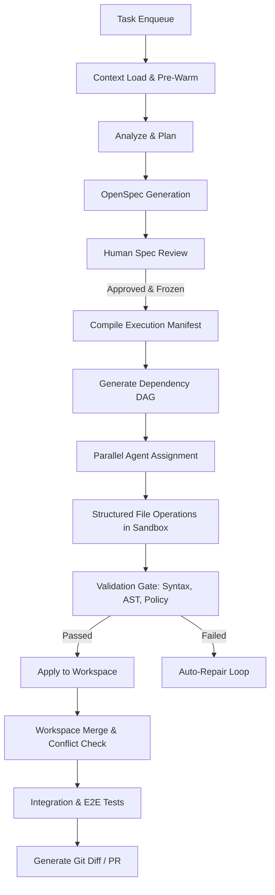
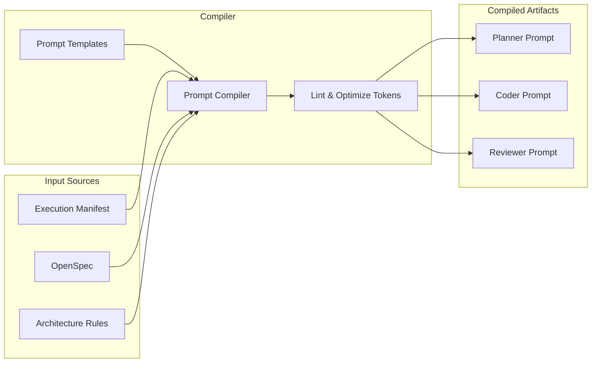

# Prompt Construction & Workflow Architecture Review (Iteration 2)

> **Document Version:** v2.0  
> **Target Scope:** Workflow Engine, Prompt Builder, Context Assembly, Patch Execution, Multi-Agent Coordination  
> **Confidence Levels:** 🟢 Observed | 🟡 Strong Inference | 🔵 Architecture Risk

---

## 1. Executive Summary

A comparison between the current workflow logs and previous iterations reveals that the orchestration layer has significantly improved. The integration of **Human Clarification Gates**, **Human Spec Reviews**, **Explicit Planning Stages**, and basic **Retry Mechanisms** successfully resolves the planning-phase stalls identified in Iteration 1.

However, the primary bottleneck has shifted from **Planning Logic** to **Execution Engine Design & Prompt Consistency**. The system currently relies on dynamic, runtime-driven prompt assembly and fragile Git patch application (`git apply`) as its mutation primitives. To achieve production-grade reliability, the architecture must transition from **Dynamic Prompt Assembly to Deterministic Prompt Compilation**, and from **Patch-First Mutation to Structured File-Edit Operations**.

---

## 2. Component Assessment Matrix

| Orchestrator Component | Current Status | Risk Severity | Core Issue / GAP |
| :--- | :---: | :---: | :--- |
| **Workflow State Machine** | Good | 🟢 Low | Well-defined task states and transitions. |
| **Human Gate System** | Implemented | 🟢 Low | Successfully pauses for spec approval and clarification. |
| **Explicit Planner** | Improved | 🟢 Low | Separates analysis/planning from coding execution. |
| **OpenSpec Integration** | Evolving | 🟠 Med | Lacks spec freeze guarantees before coders run. |
| **Prompt Construction** | Fragile | 🔴 High | Dynamic, runtime-dependent, and non-reproducible. |
| **Execution Engine** | Weak | 🔴 High | Relies on AI-generated patches as the execution primitive. |
| **Validation Pipeline** | Partial | 🔴 High | Validation occurs post-patch instead of pre-patch. |
| **Multi-Agent Merging** | Missing | 🔴 High | Lacks workspace merging and conflict resolution phases. |
| **Observability** | Weak | 🟠 Med | No prompt snapshots or templates recorded for debugging. |

---

## 3. Improvements Since Iteration 1

### 3.1. Human Clarification Gate
The state machine now pauses when instructions are ambiguous, ensuring that human intervention unblocks the pipeline before agents commit to incorrect assumptions.
```
[Context Loading] ──> [Analyze] ──> [Human Clarification] ──> [Continue Task]
```

### 3.2. Human Spec Review
The execution phase is blocked until the generated spec/plan is approved, preventing wasteful API expenditures on flawed execution paths.

### 3.3. Explicit Planning Stage
Planning is no longer inline with coding. The Planner generates a plan that coders implement, establishing a separation of concerns.

### 3.4. Basic Retry Mechanisms
The engine catches `git apply` failures and retries, showing improved resilience over single-attempt failures.

---

## 4. Core Execution Engine Bottlenecks

### 4.1. The Fragility of Patch-First Execution (P0)
* **Problem:** Generating raw Git patches via LLMs is highly fragile due to whitespace, line number drift, and concurrent edits.
* **Risk:** A single character offset causes `git apply` to fail, leading to compilation errors or complete task stalling.
* **Recommendation:** Shift Git patches to be the *output artifact* rather than the *execution primitive*. Agents should output structured file edits (JSON-based edits, search/replace blocks, or AST mutations) which the execution engine applies deterministically. A clean git diff/patch is generated only after compilation and tests pass.

### 4.2. Missing Integration & Merge Phase (P0)
* **Problem:** When multiple coding agents run in parallel, their individual workspaces must be integrated. Currently, there is no explicit conflict detection or merge resolution phase.
* **Risk:** Divergent workspaces overwrite each other during parallel checkouts, causing semantic inconsistencies or silent regressions.
* **Recommendation:** Introduce a formal **Workspace Merge Stage** that handles worktree merges, detects textual/AST conflicts, and prompts a reviewer agent to resolve them.

### 4.3. Lack of Pre-Mutation Semantic Validation (P0)
* **Problem:** Code changes are validated only after they are written to the workspace.
* **Risk:** Malicious or hallucinated code can modify forbidden files (e.g. security configs, infrastructure files) before the orchestrator blocks it.
* **Recommendation:** Implement a sandbox-level **Policy and Directory Boundary Guard** that validates ASTs and file paths *prior* to mutating the target workspace files.

---

## 5. Prompt Assembly & Context Engineering Deficiencies

### 5.1. Dynamic Prompt Assembly vs. Deterministic Prompt Compilation (P0)
* **Problem:** Prompts are dynamically generated from current workspace states at runtime. If a task is paused and resumed, the prompt is reconstructed from scratch.
* **Risk:** Slight runtime variances (e.g. log updates, timestamps, directory ordering) result in different prompts on resume, making replay and debugging impossible.
* **Recommendation:** Treat prompts as static, compiled artifacts. The prompt compiler should generate a frozen prompt build artifact (`coder_prompt.json`) that is persisted and reused across retries.

### 5.2. Undefined Context Precedence (P0)
* **Problem:** Prompts mix task descriptions, repositories, specifications, coding conventions, and human feedback without defining which source takes precedence.
* **Risk:** Conflicting instructions (e.g. task says "Use Redis" but spec says "Use Memory Cache") cause LLM confusion and hallucination.
* **Recommendation:** Enforce a strict hierarchy of authority:
  ```
  [Execution Manifest] ──> [Human Feedback] ──> [OpenSpec] ──> [Architecture Rules] ──> [Task Input]
  ```

### 5.3. Missing Prompt Observability & Provenance (P1)
* **Problem:** Execution logs contain workflow states but lack the exact prompt sent to the LLM and the prompt's source metadata (hashes, template versions, model IDs).
* **Risk:** Inability to debug prompt regressions or perform regression testing on prompt template updates.
* **Recommendation:** Snapshot and save all compiled prompts under `logs/llm/` (e.g., `logs/llm/call-001-analyze/prompt.md`). Link every LLM output to a prompt template version and hash.

---

## 6. Proposed Target Architectures

### 6.1. Recommended Execution Pipeline
The following pipeline decouples LLM generation from filesystem mutations and introduces strict validation gates before committing modifications:



### 6.2. Deterministic Prompt Compiler Flow
Centralized **Prompt Compiler** compiles role-specific prompts based on the frozen Execution Manifest:



---

## 7. Implementation Roadmap

### 7.1. Phase 1: Core Reliability (P0)
* [ ] **Structured Edits Primitives:** Migrate from patch-centric execution to a search-and-replace block parser or AST modifier.
* [ ] **Centralized Prompt Compiler:** Implement a deterministic compiler that outputs immutable prompt snapshots saved to disk.
* [ ] **Pre-check Validation:** Add a syntax and policy linter that rejects malformed agent suggestions before modifying workspace files.
* [ ] **Merge Phase:** Introduce a textual merge resolver that catches overlapping modifications across parallel agents.

### 7.2. Phase 2: Observability & Consistency (P1)
* [ ] **Execution Manifest Persistency:** Store the execution graph and dependency DAG in database tables (`execution_plans`, `execution_steps`).
* [ ] **Prompt Provenance & Versioning:** Hash all prompts and templates, tracking them in the LLM trace engine.
* [ ] **Context Precedence Engine:** Implement an automated prompt assembler lint step to highlight contradictory instructions before they reach the model.

### 7.3. Phase 3: Developer Experience (P2)
* [ ] **Visual DAG Planner:** Add a graph visualization interface in the web dashboard for users to inspect parallel agent execution chains.
* [ ] **Dry-Run & Replay Harness:** Enable developers to replay historical execution steps using identical prompt snapshots to verify agent deterministic behavior.
