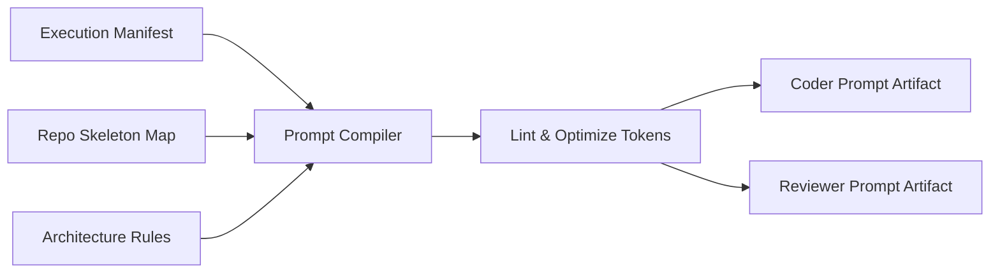

# Báo cáo Tổng hợp: Kiến trúc Prompt, Ngữ cảnh và Thực thi (Unified Prompt & Execution Architecture)

> **Mục tiêu:** Tổng hợp các vấn đề và giải pháp từ các báo cáo trước đó (`prompt_construction_report_v2.md`, `prompt_contruction_report.md`, `context_management_report.md`, `orchestrator_flow_detail.md`, `log_task_report.md`) để đưa ra một kiến trúc hợp nhất cho Workflow Engine, Prompt Builder và Context Assembly.
> **Trạng thái:** Bản tổng hợp đề xuất.

---

## 1. Tóm tắt (Executive Summary)

Dựa trên phân tích toàn diện từ các luồng thực thi (Orchestrator Flow) và log hệ thống, kiến trúc Orchestrator đã có sự tiến bộ (áp dụng Human Gates, Explicit Planner). Tuy nhiên, nút thắt cổ chai đã dịch chuyển sang **Execution Engine (Động cơ thực thi)** và **Prompt Consistency (Tính nhất quán của Prompt)**. 

Hệ thống hiện tại dựa vào việc *lắp ráp prompt động (Dynamic Prompt Assembly)* tại runtime và *thực thi trực tiếp bằng Git Patch (Patch-First Execution)*, dẫn đến các lỗi dễ vỡ, thiếu khả năng truy vết và rủi ro chồng chéo khi có nhiều Agent chạy song song.

Để đạt mức độ ổn định Production-grade, hệ thống cần chuyển dịch sang:
1. **Deterministic Prompt Compilation (Biên dịch Prompt tất định).**
2. **Structured File-Edit Operations (Thao tác chỉnh sửa file có cấu trúc thay vì dùng Git diff/patch trực tiếp).**
3. **Execution Manifest (Sử dụng một bản kê khai thực thi bất biến làm nguồn sự thật duy nhất).**

---

## 2. Tổng hợp Từ Các Báo cáo Liên quan

Để hiểu rõ ngọn nguồn của vấn đề Prompt, chúng ta cần xem xét các hệ thống xung quanh đang cung cấp nguyên liệu cho Prompt:

### 2.1. Quản lý Task & OpenSpec (`log_task_report.md`)
*   **Vấn đề:** OpenSpec hiện tại chỉ đóng vai trò như tài liệu (Documentation) chứ không phải là hợp đồng thực thi (Execution Contract). Các metadata bị lẫn lộn (ví dụ: dùng `change_name` để thực thi `go test`). Scope không được "đóng băng" (freeze) sau khi Planner chạy.
*   **Giải pháp:** Cần có một **Execution Manifest (JSON)** được chốt hạ sau khi con người duyệt OpenSpec. Mọi Agent phía sau chỉ đọc từ Manifest này.

### 2.2. Động cơ Điều phối Orchestrator (`orchestrator_flow_detail.md`)
*   **Vấn đề:** Quá trình giao tiếp với Workspace (qua `patch/applier.go`) hoàn toàn dựa vào thao tác xử lý chuỗi (String/Git Diff). LLM phải sinh ra patch chuẩn đến từng khoảng trắng, dẫn đến rủi ro `git apply` thất bại rất cao.
*   **Giải pháp:** Cần thay thế Patch-based system bằng AST Parser hoặc các bộ Block Search & Replace tĩnh. Tích hợp validation ở mức Sandbox *trước khi* chèn vào file.

### 2.3. Trình Quản lý Ngữ cảnh (`context_management_report.md`)
*   **Vấn đề:** Gửi nguyên toàn bộ codebase hoặc quá nhiều dữ liệu runtime vào LLM gây lãng phí token và nhiễu thông tin (Token Bloat).
*   **Giải pháp:** Sử dụng công cụ (như Tree-sitter) để sinh ra **Repository Map (Skeleton Map)** tập trung vào `def` (Khai báo) và `ref` (Sử dụng). Kết hợp PageRank để chọn ra những hàm/file quan trọng nhất nhét vào Prompt.

---

## 3. Phân tích Vấn đề Kiến trúc Hiện tại (Từ Báo cáo Prompt v1 & v2)

### 3.1. Biên dịch Prompt Động (Dynamic Prompt Assembly)
Hiện tại, prompt được nối (concatenate) tại runtime từ các state của Workspace, Logs, Task. Nếu hệ thống bị tạm dừng và tiếp tục (Resume), prompt có thể bị thay đổi.
*   **Hậu quả:** Không thể tái tạo lại (reproduce) luồng chạy của LLM. Khó debug.
*   **Khắc phục:** Cần coi Prompt như một bản build phần mềm (Compile). Cần sinh ra các file `planner_prompt.md`, `coder_prompt.md` tĩnh và lưu trữ (Snapshot) để có Provenance rõ ràng.

### 3.2. Rủi ro của Patch-First Execution (Đã đề cập ở Orchestrator)
Quá trình LLM sinh Git Patch -> `git apply` là quá nhạy cảm. Patch nên là định dạng đầu ra cuối cùng (Git Diff) thay vì là ngôn ngữ thực thi ban đầu.

### 3.3. Thiếu Độ Ưu tiên Ngữ cảnh (Undefined Context Precedence)
Prompt hiện tại bị nhồi nhét quá nhiều (Task, Spec, Repo Context, Architecture Rules) nhưng không quy định rõ "Cái nào đè cái nào" nếu có mâu thuẫn.
*   **Khuyến nghị:** Thiết lập thứ tự ưu tiên (Hierarchy of Authority):
    `[Execution Manifest] ──> [Human Feedback] ──> [OpenSpec] ──> [Architecture Rules] ──> [Task Input]`

### 3.4. Thiếu Semantic Validation trước khi Sửa File (Pre-Mutation)
Code được apply thẳng vào workspace rồi mới chạy test. LLM có thể tùy ý thay đổi nhầm các file cấu hình hạ tầng.
*   **Khắc phục:** Agent sinh ra Edit Plan -> Validator (check AST, Policy) -> Cập nhật Workspace.

### 3.5. Thiếu Hợp nhất Không gian làm việc (Missing Integration & Merge)
Nhiều Agent (Backend, Frontend) có thể làm việc song song nhưng thiếu cơ chế hợp nhất (Merge Worktrees), phát hiện xung đột và xử lý xung đột (Conflict Resolution).

---

## 4. Kiến trúc Đề xuất (Proposed Target Architecture)

Để giải quyết triệt để, hệ thống cần tiến tới một Workflow mang tính "Tất định" (Deterministic):

### 4.1. Quy trình Thực thi Chuẩn (Deterministic Execution Pipeline)
1.  **Context & Plan:** Load Context (dựa trên Repo Map) -> Planner sinh ra OpenSpec.
2.  **Review & Freeze:** Human Review OpenSpec -> Đóng băng (Freeze) thành **Execution Manifest**.
3.  **Prompt Compile:** Prompt Compiler đọc Manifest để biên dịch ra `coder_prompt.md` tĩnh.
4.  **Edit & Validate:** Agent trả về các File Edits có cấu trúc (không phải Git patch). Hệ thống Validate cú pháp, AST và Scope Boundary.
5.  **Merge & Apply:** Hợp nhất (Merge) kết quả từ nhiều Agent -> Cập nhật Workspace -> Generate PR (Git diff).

### 4.2. Luồng Biên dịch Prompt (Prompt Compiler Flow)
Dữ liệu đầu vào sẽ đi qua một **Prompt Compiler** chuyên dụng:

Mỗi khi gửi tới LLM, Orchestrator chỉ cần đọc file Artifact này thay vì tự lắp ráp lại từ đầu. 

---

## 5. Lộ trình Thực hiện (Implementation Roadmap)

### P0 (Core Reliability)
*   [ ] **Loại bỏ Patch-First:** Chuyển sang sử dụng bộ parser dựa trên cấu trúc (Block Search & Replace hoặc AST Modifier).
*   [ ] **Sử dụng Execution Manifest:** Chuyển đổi OpenSpec thành JSON Manifest bất biến làm nguồn sống cho các Agent Code.
*   [ ] **Xây dựng Prompt Compiler:** Sinh và lưu trữ (snapshot) tĩnh các file Prompt trước khi gọi LLM.
*   [ ] **Pre-check Validation Gate:** Ngăn chặn Agent ghi vào các file ngoài vùng cho phép (Scope boundary) trước khi cập nhật Workspace.

### P1 (Observability & Consistency)
*   [ ] Thiết lập và tích hợp Context Engine (với Tree-sitter + Repo Map) để giảm kích thước token.
*   [ ] Prompt Linting: Xác định và cảnh báo các mâu thuẫn trong Prompt Context.
*   [ ] Gắn Hash và Version cho từng Prompt và Spec để đảm bảo khả năng Replay (Resume an toàn).

### P2 (Scaling & UI)
*   [ ] Hỗ trợ quá trình phân giải xung đột (Merge Conflict) cho các Parallel Agents.
*   [ ] Hiển thị DAG Execution Graph và Prompt Snapshots trực tiếp trên Web Dashboard để con người dễ dàng audit.
